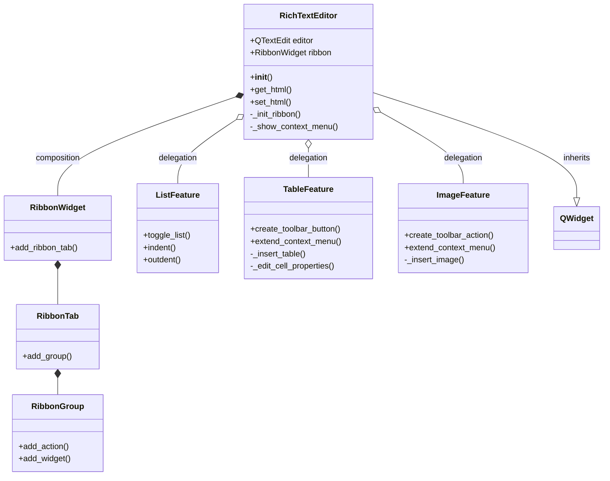
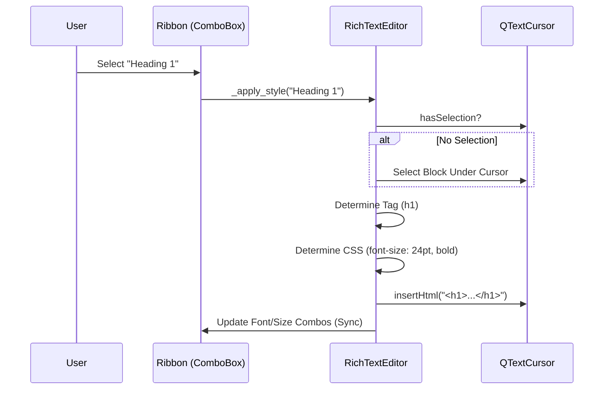
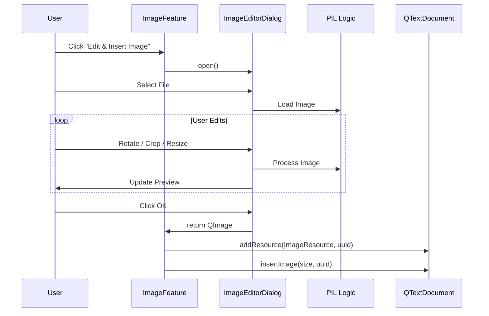

# Architecture: Rich Text Editor System

**Component**: `src/pillars/document_manager/ui/rich_text_editor.py`  
**Status**: Production / Stable  
**Type**: Reusable UI Widget

## 1. System Overview

The **Rich Text Editor (RTE)** is a central component of the IsopGem Document Manager pillar. It abstracts `QTextEdit` into a feature-rich word processor experience with a "Ribbon" interface, similar to Microsoft Word.

### Design Philosophy
1.  **Composition over Inheritance**: Features (Tables, Images, Lists) are separated into helper classes rather than bloating the main `RichTextEditor` class.
2.  **Semantic Styling**: Styles ("Heading 1", "Code") are applied via semantic tags or block formats, keeping content structured.
3.  **Self-Contained**: The editor manages its own UI tools (Ribbon) but exposes simple signals (`text_changed`, `wiki_link_requested`) to the parent application.

---

## 2. Component Architecture

The system is built around the `RichTextEditor` hub, which initializes and coordinates the Ribbon and Feature modules.



### Module Breakdown

| Module | Role | Key Responsibilities |
| :--- | :--- | :--- |
| **RichTextEditor** | Hub | Setup Ribbon, apply fonts/colors, handle signals, coordinate features. |
| **RibbonWidget** | UI Container | Manages Tabs (`Home`, `Insert`) and Groups providing a modern toolbar layout. |
| **ListFeature** | Logic | Manages `QTextListFormat`, toggling bullets/numbers, and indentation logic. |
| **TableFeature** | Logic + UI | Handles table insertion, cell properties, context menu extensions for row/col ops. |
| **ImageFeature** | Logic + UI | Manages Image insertion, pre-insertion editing (Crop/Rotate), and property updates. |

---

## 3. Key Interaction Flows

### A. Applying a Semantic Style
When a user selects "Heading 1" from the Ribbon:



### B. Inserting and Editing an Image
The image insertion flow includes a powerful pre-processing step.



---

## 4. State Management

The editor needs to sync the Ribbon state (e.g., Bold button pressed?) with the cursor position.

-   **Trigger**: `editor.currentCharFormatChanged`
-   **Handler**: `_update_format_widgets(fmt)`
-   **Logic**:
    1.  Check `fmt.fontWeight()` -> Update Bold Button.
    2.  Check `fmt.fontItalic()` -> Update Italic Button.
    3.  Check `editor.alignment()` -> Update Alignment Group (Left/Center/Right).

This ensures the UI always reflects the styling at the current cursor position.

## 5. Extensibility Guide

To add a new feature (e.g., **Formula Editor**):

1.  **Create Feature Class**: Create `FormulaFeature(editor, parent)`.
2.  **Define UI**: Implement `create_toolbar_action()` or `create_toolbar_button()`.
3.  **Implement Logic**: Use `editor.textCursor()` to manipulate the document.
4.  **Register**:
    -   In `RichTextEditor.__init__`:
        ```python
        self.formula_feature = FormulaFeature(self.editor, self)
        grp_insert.add_action(self.formula_feature.create_toolbar_action())
        ```
    -   If it needs context menu support, add a call in `_show_context_menu`.

---

## 6. Dependencies & Complexity

> [!NOTE] Complexity Alert
> - **TableFeature** is the most complex module (LOC ~800). It manages multiple sub-dialogs (`TablePropertiesDialog`, `CellPropertiesDialog`). Care must be taken when modifying table formatting to avoid breaking the delicate Qt Table Format model.
> - **ImageFeature** depends on `Pillow` (PIL) for image processing. This is a hard dependency for the "Edit & Insert" workflow.

