# TQ Lexicon Concordance System - Complete Implementation Guide

## Overview

The TQ Lexicon Concordance is a comprehensive system for analyzing holy texts through the lens of Trigrammaton Qabalah (TQ) gematria. It functions similarly to Strong's Concordance, providing word-level analysis, occurrence tracking, and cross-referencing capabilities across imported documents.

**Core Philosophy:**
- **Stable IDs**: Once a word is added to the Master Key, its ID never changes
- **Opt-out Curation**: All discovered words are candidates by default; users explicitly exclude unwanted words
- **Standard TQ**: Uses `TQGematriaCalculator` with the standard letter values (A=5, B=20, O=10, D=23, E=13, etc.)

---

## 1. System Architecture

### High-Level Architecture


### Component Relationships

| Component | Type | Purpose |
|-----------|------|---------|
| `UnifiedLexiconWindow` | UI | Consolidated 4-tab workflow window |
| `LexiconManagerWindow` | UI | Original lexicon manager (staging, master key, concordance) |
| `HolyBookConcordanceWindow` | UI | Standalone parse & index interface |
| `ExegesisWindow` | UI | Main text analysis window (parent) |
| `ConcordanceIndexerService` | Service | Unified parse + index operations |
| `HolyKeyService` | Service | Word scanning, candidate processing |
| `EnrichmentService` | Service | Multi-source definition fetching |
| `OccultReferenceService` | Service | Local esoteric reference data |
| `KeyDatabase` | Data | SQLite database operations |
| `TQGematriaCalculator` | Calculator | Standard TQ value computation |

---

## 2. Service Layer

### 2.1 ConcordanceIndexerService

**Location:** `src/pillars/tq_lexicon/services/concordance_indexer_service.py`

The central service for parsing documents and indexing words to the concordance.

#### Key Methods

```python
class ConcordanceIndexerService:
    """Unified service for parsing holy books and indexing to the TQ Lexicon."""
    
    def __init__(self, db_path: Optional[str] = None):
        self.db = KeyDatabase(db_path)
        self.calculator = TQGematriaCalculator()  # Standard TQ
    
    # PRIMARY ENTRY POINT
    def parse_and_index(
        self,
        document_id: int,
        allow_inline: bool = True,
        apply_rules: bool = True,
        auto_save: bool = True,
        reindex: bool = False,
        progress_callback: Optional[Callable] = None
    ) -> ParseAndIndexResult:
        """Parse document into verses AND index all words in one operation."""
    
    # PARSING ONLY
    def parse_document(
        self,
        document_id: int,
        allow_inline: bool = True,
        apply_rules: bool = True,
        force_reparse: bool = False
    ) -> Dict[str, Any]:
        """Parse document into verses without indexing."""
    
    # INDEXING
    def index_document(
        self,
        document_id: int,
        document_title: str,
        verses: List[Dict],
        progress_callback: Optional[Callable] = None,
        reindex: bool = False
    ) -> IndexingResult:
        """Index all words from verses into the concordance."""
    
    # STATUS
    def get_document_status(self, document_id: int) -> Dict[str, Any]:
        """Check parse/index status of a document."""
```

#### Data Classes

```python
@dataclass
class ParseAndIndexResult:
    """Combined result of parsing and indexing."""
    document_id: int
    document_title: str
    # Parsing results
    verses: List[Dict[str, Any]]
    source: str  # 'parser', 'curated', 'fresh'
    anomalies: Dict[str, Any]
    rules_applied: List[Dict[str, Any]]
    # Indexing results
    total_words: int
    new_keys_added: int
    occurrences_added: int
    errors: List[str]
    # Status
    verses_saved: bool
    indexed: bool

@dataclass
class IndexingResult:
    document_id: int
    document_title: str
    total_verses: int
    total_words: int
    new_keys_added: int
    occurrences_added: int
    errors: List[str]
```

#### Stop Words & Tokenization

The service filters common words with low semantic value:

```python
STOP_WORDS = {
    'a', 'an', 'the', 'and', 'or', 'but', 'if', 'of', 'to', 'in', 'on',
    'at', 'by', 'for', 'is', 'it', 'be', 'as', 'so', 'we', 'he', 'she',
    # ... (full list in source)
}
MIN_WORD_LENGTH = 2
```

---

### 2.2 HolyKeyService

**Location:** `src/pillars/tq_lexicon/services/holy_key_service.py`

Handles word scanning, candidate processing, and batch operations.

#### Key Methods

```python
class HolyKeyService:
    def __init__(self, db_path: Optional[str] = None):
        self.db = KeyDatabase(db_path)
        self.calculator = TQGematriaCalculator()  # Standard TQ
    
    def scan_text(self, text: str) -> List[str]:
        """Extract unique word candidates from text."""
    
    def process_batch(
        self, 
        words: List[str], 
        source: str = "Magus"
    ) -> Tuple[int, int]:
        """Add words to master key. Returns (added_count, already_existed)."""
    
    def bulk_ignore(self, words: List[str]):
        """Add words to ignore list."""
    
    def get_undefined_keys(self) -> List[KeyEntry]:
        """Get words with no definitions for enrichment."""
    
    def add_definition(
        self, 
        key_id: int, 
        def_type: str, 
        content: str, 
        source: str
    ):
        """Add a definition to a word."""
```

---

### 2.3 KeyDatabase

**Location:** `src/pillars/tq_lexicon/services/key_database.py`

SQLite database layer for all lexicon data.

#### Key Methods

```python
class KeyDatabase:
    def __init__(self, db_path: Optional[str] = None):
        # Default: ~/.isopgem/holy_key.db
    
    # MASTER KEY
    def add_word(self, word: str, tq_value: int) -> int
    def get_word_by_id(self, key_id: int) -> Optional[KeyEntry]
    def get_id_by_word(self, word: str) -> Optional[int]
    def update_tq_value(self, key_id: int, tq_value: int) -> bool
    def search_keys(self, query, page, page_size, sort_by, descending) -> Tuple[List[KeyEntry], int]
    
    # DEFINITIONS
    def add_definition(self, key_id, def_type, content, source) -> int
    def get_definitions(self, key_id: int) -> List[Definition]
    
    # WORD OCCURRENCES
    def add_word_occurrence(self, key_id, document_id, ...) -> Optional[int]
    def get_word_occurrences(self, key_id: int) -> List[WordOccurrence]
    def get_occurrences_by_document(self, document_id: int) -> List[WordOccurrence]
    def clear_document_occurrences(self, document_id: int) -> int
    def is_document_indexed(self, document_id: int) -> bool
    
    # CONCORDANCE
    def get_concordance_words(self, document_id, sort_by, descending, limit) -> List[Tuple]
    def get_concordance_stats() -> Dict[str, Any]
    
    # IGNORED WORDS
    def ignore_word(self, word: str)
    def is_ignored(self, word: str) -> bool
    def get_all_ignored() -> List[str]
    
    # ADMIN
    def reset_database()
```

---

### 2.4 EnrichmentService

**Location:** `src/pillars/tq_lexicon/services/enrichment_service.py`

Multi-source definition fetching service.

#### Source Priority

1. **OpenOccult** (Local) - Crystals, herbs, runes, tarot
2. **ety library** (Local) - Etymology with recursive origins
3. **FreeDict API** (Online) - Standard English definitions

#### Key Methods

```python
class EnrichmentService:
    CATEGORY_TYPE_MAP = {
        'crystal': 'Alchemical',
        'botanical': 'Botanical',
        'rune': 'Occult',
        'tarot': 'Divinatory',
    }
    
    def get_suggestions(self, word: str) -> List[Suggestion]:
        """Fetch all suggestions from all sources."""
    
    def get_etymology(self, word: str) -> List[str]:
        """Get etymology using ety library."""
    
    def get_etymology_tree(self, word: str) -> Optional[str]:
        """Get formatted etymology tree."""
    
    def enrich_batch(self, progress_callback):
        """Enrich all undefined keys."""
```

#### Suggestion Data Class

```python
@dataclass
class Suggestion:
    type: str       # 'Standard', 'Etymology', 'Occult', 'Botanical', etc.
    content: str    # The definition text
    source: str     # 'FreeDict API', 'ety-python', 'OpenOccult'
    part_of_speech: Optional[str] = None
    category: Optional[str] = None
```

---

### 2.5 OccultReferenceService

**Location:** `src/pillars/tq_lexicon/services/occult_reference_service.py`

Queries local OpenOccult JSON data for esoteric meanings.

#### Data Sources

Located in `data/openoccult/`:
- `crystals.json` - Crystal properties and meanings
- `botanicals.json` - Magical herb correspondences
- `runes.json` - Elder Futhark rune meanings
- `tarot.json` - Tarot card interpretations

#### Key Methods

```python
class OccultReferenceService:
    def lookup(self, query: str) -> List[OccultReference]:
        """Search all categories for a term."""
    
    def lookup_crystal(self, name: str) -> Optional[OccultReference]
    def lookup_botanical(self, name: str) -> Optional[OccultReference]
    def lookup_rune(self, name: str) -> Optional[OccultReference]
    def lookup_tarot(self, name: str) -> Optional[OccultReference]
```

---

## 3. UI Components

### 3.1 UnifiedLexiconWindow

**Location:** `src/pillars/tq_lexicon/ui/unified_lexicon_window.py`

The primary consolidated interface with 4 tabs.


#### Tab Structure

| Tab | Icon | Purpose | Key Widgets |
|-----|------|---------|-------------|
| Import & Parse | 📥 | Select documents, configure options, run parse+index | Document table, options checkboxes, Parse & Index button |
| Candidates | 📝 | Scan active document for word candidates | Candidate list with checkboxes, Process button |
| Concordance | 📖 | View indexed words with occurrences | Word tree, occurrence list, filters |
| Master Key | 🔑 | Full word database with pagination | Searchable table, enrichment button |

#### State Management

```python
class UnifiedLexiconWindow(QMainWindow):
    def __init__(self):
        self._active_document: Optional[Dict] = None  # Shared across tabs
        self._documents: List[Dict] = []
        self._worker: Optional[ParseAndIndexWorker] = None
        
        self.service = HolyKeyService()
        self.indexer = ConcordanceIndexerService()
```

---

### 3.2 LexiconManagerWindow

**Location:** `src/pillars/tq_lexicon/ui/lexicon_manager_window.py`

Original 3-tab lexicon manager (can be used standalone).

#### Tabs

1. **Staging & Curation** - Text input, scan, candidate list
2. **Master Key** - Paginated word table with search
3. **Concordance** - Word-occurrence view with filters

---

### 3.3 HolyBookConcordanceWindow

**Location:** `src/pillars/tq_lexicon/ui/holy_book_concordance_window.py`

Standalone parse & index interface (now superseded by UnifiedLexiconWindow).

---

## 4. Data Flow

### 4.1 Complete Workflow


### 4.2 Candidate Processing Flow


### 4.3 Concordance Lookup Flow


---

## 5. Database Schema

**Database Location:** `~/.isopgem/holy_key.db`


### Table Descriptions

#### master_key
The central word registry with stable IDs.

| Column | Type | Description |
|--------|------|-------------|
| id | INTEGER | Primary key, never changes |
| word | TEXT | Lowercase word, unique |
| tq_value | INTEGER | Standard TQ calculation |
| is_active | BOOLEAN | Soft delete flag |
| frequency | INTEGER | Total occurrence count |
| created_at | TIMESTAMP | When added |

#### definitions
Word definitions from multiple sources.

| Column | Type | Description |
|--------|------|-------------|
| id | INTEGER | Primary key |
| key_id | INTEGER | FK to master_key |
| type | TEXT | Etymology, Standard, Occult, Alchemical, Botanical, Divinatory |
| content | TEXT | Definition text |
| source | TEXT | FreeDict API, ety-python, OpenOccult, Magus |

#### word_occurrences
Verse-linked word occurrences for concordance.

| Column | Type | Description |
|--------|------|-------------|
| id | INTEGER | Primary key |
| key_id | INTEGER | FK to master_key |
| document_id | INTEGER | References documents table in isopgem.db |
| document_title | TEXT | Cached for display |
| verse_id | INTEGER | Nullable FK to document_verses |
| verse_number | INTEGER | Cached verse number |
| word_position | INTEGER | Position within verse |
| original_form | TEXT | Original case-preserved form |
| context_snippet | TEXT | KWIC (Key Word In Context) |

#### ignored_words
Opt-out list of words to never include.

| Column | Type | Description |
|--------|------|-------------|
| word | TEXT | Primary key, lowercase |

---

## 6. Integration Points

### 6.1 ExegesisWindow Integration

**Location:** `src/pillars/gematria/ui/text_analysis/main_window.py`

```python
# Toolbar button
self.concordance_btn = QPushButton("📚 Concordance")
self.concordance_btn.clicked.connect(self._open_concordance)

def _open_concordance(self):
    """Open the unified TQ Lexicon Workflow window."""
    from pillars.tq_lexicon.ui.unified_lexicon_window import UnifiedLexiconWindow
    self.concordance_window = UnifiedLexiconWindow(parent=None)
    self.concordance_window.show()
```

### 6.2 Document Repository Integration

The concordance reads documents from the main IsopGem database:

```python
from shared.database import get_db_session
from shared.repositories.document_manager.document_repository import DocumentRepository

with get_db_session() as db:
    doc_repo = DocumentRepository(db)
    documents = doc_repo.get_all()  # Standard interface
```

### 6.3 VerseTeacherService Integration

Parsing leverages the existing verse parsing system:

```python
from shared.services.document_manager.verse_teacher_service import VerseTeacherService

with get_db_session() as db:
    verse_service = VerseTeacherService(db)
    result = verse_service.get_or_parse_verses(document_id)
    # Returns: {verses: [], source: 'curated'|'parser', anomalies: {}}
```

### 6.4 TQ Calculator Integration

All TQ calculations use the standard calculator:

```python
from shared.services.gematria.tq_calculator import TQGematriaCalculator

calc = TQGematriaCalculator()
tq_value = calc.calculate("abode")  # Returns 71
```

**TQ Standard Letter Values:**
```
I=0, L=1, C=2, H=3, P=4, A=5, X=6, J=7, W=8, T=9
O=10, G=11, F=12, E=13, R=14, S=15, Q=16, K=17, Y=18, Z=19
B=20, M=21, V=22, D=23, N=24, U=25
```

---

## 7. UI Workflows

### 7.1 Complete User Workflow

```mermaid
graph TD
    A[Open Exegesis Window] --> B[Click 📚 Concordance]
    B --> C[UnifiedLexiconWindow Opens]
    
    subgraph Tab1["📥 Import & Parse Tab"]
        D1[Select Document] --> D2[Configure Options]
        D2 --> D3[Click Parse & Index]
        D3 --> D4[View Results]
    end
    
    subgraph Tab2["📝 Candidates Tab"]
        E1[Click Scan Document] --> E2[Review Candidates]
        E2 --> E3[Uncheck Unwanted]
        E3 --> E4[Click Process]
    end
    
    subgraph Tab3["📖 Concordance Tab"]
        F1[Filter by Document] --> F2[Search Words]
        F2 --> F3[Click Word]
        F3 --> F4[View Occurrences]
    end
    
    subgraph Tab4["🔑 Master Key Tab"]
        G1[Search Words] --> G2[Double-click for Details]
        G2 --> G3[Auto-Enrich Definitions]
    end
    
    C --> D1
    D4 --> E1
    E4 --> F1
    F4 --> G1
```



### 7.2 Tab Navigation States

| Tab | Precondition | State Shared |
|-----|--------------|--------------|
| Import & Parse | None | Sets `_active_document` |
| Candidates | Document selected in Tab 1 | Uses `_active_document` |
| Concordance | Documents indexed | Independent data |
| Master Key | Any | Independent data |

### 7.3 Error Handling

All operations use try/except with user feedback:

```python
try:
    result = self.indexer.parse_and_index(doc_id, options)
except Exception as e:
    logger.exception("Operation failed")
    QMessageBox.critical(self, "Error", f"Failed:\n{e}")
```

---

## 8. File Reference

### Services
| File | Class | Purpose |
|------|-------|---------|
| `services/concordance_indexer_service.py` | `ConcordanceIndexerService` | Parse + Index operations |
| `services/holy_key_service.py` | `HolyKeyService` | Word scanning, batch processing |
| `services/key_database.py` | `KeyDatabase` | SQLite database layer |
| `services/enrichment_service.py` | `EnrichmentService` | Multi-source definitions |
| `services/occult_reference_service.py` | `OccultReferenceService` | Local esoteric data |

### UI Components
| File | Class | Purpose |
|------|-------|---------|
| `ui/unified_lexicon_window.py` | `UnifiedLexiconWindow` | Main consolidated interface |
| `ui/lexicon_manager_window.py` | `LexiconManagerWindow` | Original 3-tab interface |
| `ui/holy_book_concordance_window.py` | `HolyBookConcordanceWindow` | Standalone parse/index |

### Shared Dependencies
| File | Class | Purpose |
|------|-------|---------|
| `shared/services/gematria/tq_calculator.py` | `TQGematriaCalculator` | Standard TQ calculation |
| `shared/services/document_manager/verse_teacher_service.py` | `VerseTeacherService` | Verse parsing |
| `shared/repositories/document_manager/document_repository.py` | `DocumentRepository` | Document CRUD |

---

## 9. Configuration

### Database Location
```
~/.isopgem/holy_key.db
```

### OpenOccult Data
```
data/openoccult/
├── crystals.json
├── botanicals.json
├── runes.json
└── tarot.json
```

### Stop Words
Defined in `ConcordanceIndexerService.STOP_WORDS` - common words excluded from indexing.

---

## 10. Testing

### Manual Testing Workflow

1. **Reset Database** (Master Key tab → Reset Database button)
2. **Import Document** (Import tab → Select document → Parse & Index)
3. **Verify TQ Values** (e.g., "abode" = 71)
4. **Check Concordance** (Concordance tab → Verify word counts)
5. **Process Candidates** (Candidates tab → Scan → Process)
6. **Enrich Definitions** (Master Key tab → Auto-Enrich)

### Expected TQ Values

| Word | TQ Value | Calculation |
|------|----------|-------------|
| abode | 71 | A(5)+B(20)+O(10)+D(23)+E(13) |
| love | 46 | L(1)+O(10)+V(22)+E(13) |
| light | 24 | L(1)+I(0)+G(11)+H(3)+T(9) |
| truth | 60 | T(9)+R(14)+U(25)+T(9)+H(3) |
