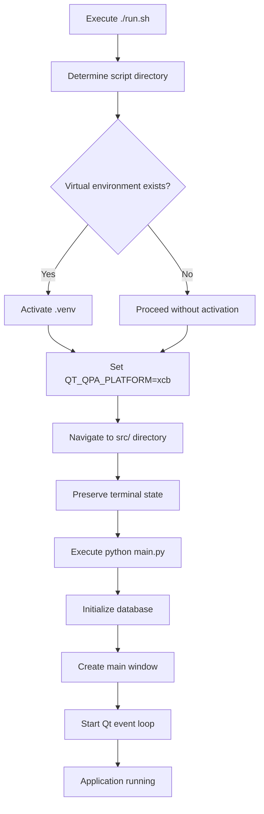
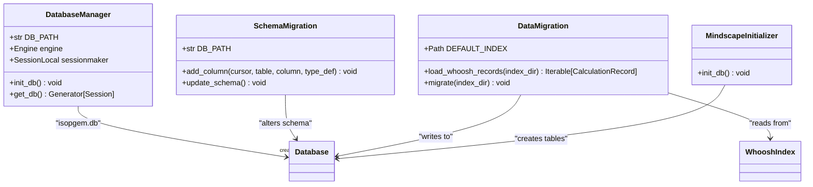

# Deployment

<cite>
**Referenced Files in This Document**   
- [run.sh](file://run.sh)
- [README.md](file://README.md)
- [requirements.txt](file://requirements.txt)
- [MIGRATION.md](file://MIGRATION.md)
- [src/main.py](file://src/main.py)
- [src/shared/database.py](file://src/shared/database.py)
- [config/app_config.py](file://config/app_config.py)
- [scripts/init_mindscape_db.py](file://scripts/init_mindscape_db.py)
- [scripts/update_db_schema.py](file://scripts/update_db_schema.py)
- [scripts/reset_database.py](file://scripts/reset_database.py)
- [scripts/migrate_gematria_whoosh_to_sqlite.py](file://scripts/migrate_gematria_whoosh_to_sqlite.py)
</cite>

## Table of Contents
1. [System Requirements and Platform Compatibility](#system-requirements-and-platform-compatibility)
2. [Running the Application](#running-the-application)
3. [Database Initialization and Migration](#database-initialization-and-migration)
4. [Update and Version Management](#update-and-version-management)
5. [Performance Considerations](#performance-considerations)
6. [Troubleshooting Common Deployment Issues](#troubleshooting-common-deployment-issues)
7. [Security Considerations](#security-considerations)
8. [Backup and Recovery Procedures](#backup-and-recovery-procedures)
9. [Monitoring and Logging Recommendations](#monitoring-and-logging-recommendations)
10. [Scalability Limitations and Workarounds](#scalability-limitations-and-workarounds)

## System Requirements and Platform Compatibility

The isopgem application is designed as a desktop application with specific system requirements to ensure optimal performance for its esoteric analysis functions. The application requires Python 3.11 or higher, PyQt6 (version 6.6.0 or higher), SQLAlchemy (version 2.0.0 or higher), and Whoosh (version 2.7.4 or higher) as core dependencies. Additional requirements include document processing libraries (mammoth, odfpy, pdf2docx, python-docx, pypdf, PyMuPDF, striprtf), data tooling (numpy, pandas, openpyxl, opencv-python-headless, Pillow), and an astrology stack (openastro2, pyswisseph, pytz, jsonpickle, requests, requests-cache, pydantic, terminaltables, skyfield, pydeck, certifi, svgwrite, ephem, geographiclib).

The application is primarily developed and tested on Linux systems, with explicit configuration for X11 windowing system compatibility through the QT_QPA_PLATFORM=xcb environment variable setting. This configuration ensures stable operation on Linux desktop environments. While the application may run on other platforms that support Python and PyQt6, Linux is the recommended and best-supported platform for production deployment. The application creates its primary SQLite database file (isopgem.db) in a data/ directory within the project root, and stores user-specific data in the ~/.isopgem directory in the user's home directory.

**Section sources**
- [requirements.txt](file://requirements.txt#L1-L40)
- [README.md](file://README.md#L5-L6)
- [run.sh](file://run.sh#L13)
- [src/main.py](file://src/main.py#L8)

## Running the Application

The isopgem application is launched using the run.sh script, which provides a reliable method for starting the application in production environments. The script automatically detects its own location and changes to the appropriate directory, activates the virtual environment if it exists in the .venv subdirectory, sets the necessary Qt platform environment variable (QT_QPA_PLATFORM=xcb) for Linux stability, and executes the main application from the src directory. The script also includes terminal state preservation through stty sane commands before and after execution, and a terminal reset at the end to ensure the user's terminal environment remains stable.

The recommended method for running the application is to execute ./run.sh from the project root directory. This approach handles all necessary environment setup automatically. For manual execution, users should activate the virtual environment with source .venv/bin/activate, navigate to the src directory with cd src, and run python main.py. The main.py file serves as the entry point and initializes the database connection, creates the main application window with tabbed interface for all pillars, and starts the Qt event loop. The application launches in a maximized window with a minimum size of 1100x750 pixels, providing an immersive workspace for esoteric analysis.

**Diagram sources**
- [run.sh](file://run.sh#L1-L24)
- [src/main.py](file://src/main.py#L113-L156)

**Section sources**
- [run.sh](file://run.sh#L1-L24)
- [README.md](file://README.md#L80-L92)
- [src/main.py](file://src/main.py#L113-L156)

## Database Initialization and Migration

The isopgem application uses SQLite as its primary database backend, with the database file (isopgem.db) created automatically in the data/ directory when the application is first run. The database initialization is handled by the init_db() function in src/shared/database.py, which creates all necessary tables based on the SQLAlchemy models defined across the application's pillars. The database path is determined relative to the project structure, ensuring consistent location regardless of the current working directory.

For database schema updates, the application provides the scripts/update_db_schema.py script, which uses raw SQL commands to add new columns to existing tables. This script specifically adds tags, author, and collection columns to the documents table, with error handling to continue if columns already exist. The migration process is designed to be non-destructive and idempotent, allowing it to be run multiple times without adverse effects. For legacy data migration, the scripts/migrate_gematria_whoosh_to_sqlite.py script transfers calculation records from the previous Whoosh search index to the new SQLite database, preserving all metadata and relationships.

Database initialization for specialized components like the Mindscape feature is handled by scripts/init_mindscape_db.py, which creates the specific tables needed for the mind mapping functionality. This modular approach to database management allows different components to initialize their required schema independently while maintaining a unified database backend.

**Diagram sources**
- [src/shared/database.py](file://src/shared/database.py#L1-L53)
- [scripts/update_db_schema.py](file://scripts/update_db_schema.py#L1-L33)
- [scripts/migrate_gematria_whoosh_to_sqlite.py](file://scripts/migrate_gematria_whoosh_to_sqlite.py#L1-L75)
- [scripts/init_mindscape_db.py](file://scripts/init_mindscape_db.py#L1-L16)

**Section sources**
- [src/shared/database.py](file://src/shared/database.py#L1-L53)
- [scripts/update_db_schema.py](file://scripts/update_db_schema.py#L1-L33)
- [scripts/migrate_gematria_whoosh_to_sqlite.py](file://scripts/migrate_gematria_whoosh_to_sqlite.py#L1-L75)
- [scripts/init_mindscape_db.py](file://scripts/init_mindscape_db.py#L1-L16)

## Update and Version Management

The isopgem application follows a structured approach to version management and updates, with version information defined in config/app_config.py. The current version is specified as "0.1.0", indicating an early development stage. The application architecture is designed with modularity in mind, following a five-pillar structure (Gematria, Geometry, Document Manager, Astrology, TQ) where each pillar can be developed and updated independently. This domain-pillar architecture allows for incremental updates to specific functionality without requiring a complete application overhaul.

The application's dependencies are managed through the requirements.txt file, which specifies exact or minimum versions for all required packages. This ensures consistent behavior across different deployment environments and allows for controlled updates to third-party libraries. When updating the application, users should pull the latest code from the repository, update their virtual environment with pip install -r requirements.txt, and run any necessary database migration scripts if schema changes have been introduced.

The MIGRATION.md document provides a record of architectural changes and can be consulted when upgrading between major versions to understand any breaking changes or required manual steps. For minor updates, the process is typically seamless, as the application handles database schema evolution through automated scripts that add new columns without modifying existing data.

**Section sources**
- [config/app_config.py](file://config/app_config.py#L5)
- [MIGRATION.md](file://MIGRATION.md#L1-L174)
- [requirements.txt](file://requirements.txt#L1-L40)

## Performance Considerations

The isopgem application has different performance characteristics depending on the deployment scenario and the specific pillars being utilized. The Gematria pillar, which is currently active, has relatively modest resource requirements focused on text processing and numerical calculations. However, other pillars like Geometry (with 3D visualization), Document Manager (with full-text indexing), and Astrology (with astronomical calculations) will have significantly higher computational demands when fully implemented.

On Linux systems, the application's performance is optimized by using the X11 backend (xcb) rather than Wayland, which provides more stable and predictable behavior with PyQt6 applications. The application launches in full-screen mode to maximize workspace utilization, which can improve user productivity but may impact system resources on lower-end hardware. The use of SQLite as the database backend provides adequate performance for single-user scenarios but may become a bottleneck in multi-user or high-concurrency situations.

For optimal performance, the application should be run on systems with sufficient RAM to handle the Python interpreter, PyQt6 framework, and any large datasets being analyzed. The document processing capabilities (supporting DOCX, PDF, RTF, and other formats) can be memory-intensive when processing large files, so adequate system resources should be provisioned in environments where extensive document analysis is expected.

**Section sources**
- [README.md](file://README.md#L39-L42)
- [run.sh](file://run.sh#L13)
- [src/main.py](file://src/main.py#L148)

## Troubleshooting Common Deployment Issues

Common deployment issues for the isopgem application typically fall into several categories: environment setup, database problems, and display/graphics issues. For environment setup issues, the most common problem is missing dependencies, which can be resolved by ensuring the virtual environment is properly activated and all requirements are installed with pip install -r requirements.txt. Python version incompatibility (requiring Python 3.11+) is another frequent issue that can be addressed by verifying the Python version with python --version.

Database-related issues may include permission errors when creating the data/ directory or ~/.isopgem directory, which can be resolved by ensuring the user has appropriate file system permissions. If the database becomes corrupted, the scripts/reset_database.py script can be used to completely remove the database and start fresh, though this will result in data loss. For issues with the Qt interface, particularly on Linux systems, ensuring the QT_QPA_PLATFORM=xcb environment variable is set can resolve display problems, as Wayland support with PyQt6 can be unstable.

Application startup failures may occur if the PYTHONPATH is not correctly configured, particularly when importing modules from different directories. This is addressed in the application code by explicitly adding the src directory to the Python path when needed. Users experiencing crashes should check that all native dependencies (particularly for PyQt6 and any C extensions) are properly installed for their platform.

**Section sources**
- [run.sh](file://run.sh#L7-L10)
- [scripts/reset_database.py](file://scripts/reset_database.py#L1-L31)
- [src/main.py](file://src/main.py#L2-L4)
- [README.md](file://README.md#L68-L77)

## Security Considerations

Security considerations for deployed instances of isopgem primarily revolve around data protection and system integrity. The application stores user data in SQLite databases and configuration files in the user's home directory (~/.isopgem), so standard file system permissions should be applied to protect this data from unauthorized access. Since the application processes various document formats (DOCX, PDF, RTF, etc.), there is a potential risk of malicious content in these files, though the application's document processing is currently limited to text extraction rather than executing any embedded code.

The application does not currently include network-facing components or cloud synchronization, which reduces the attack surface compared to web applications. However, when features like data export or sharing are implemented, appropriate security measures will need to be considered. The use of a virtual environment isolates the application's dependencies from the system Python installation, providing a degree of containment for any potential vulnerabilities in third-party packages.

For multi-user systems, each user should have their own isolated installation or at minimum their own data directory to prevent cross-user data access. The application does not currently implement user authentication or access controls, as it is designed as a single-user desktop application. Sensitive esoteric research data should be protected through standard operating system security mechanisms and regular backups.

**Section sources**
- [src/shared/database.py](file://src/shared/database.py#L15-L17)
- [scripts/reset_database.py](file://scripts/reset_database.py#L12)
- [requirements.txt](file://requirements.txt#L1-L40)

## Backup and Recovery Procedures

Backup and recovery procedures for isopgem user data should focus on the primary data storage locations: the SQLite database file and any user-created documents or projects. The main database file (isopgem.db) is located in the data/ directory within the project root, while additional user data is stored in the ~/.isopgem directory in the user's home directory. Regular backups of these directories will preserve all application data, including gematria calculations, document metadata, and user preferences.

A complete backup strategy should include copying both the data/ directory from the project root and the ~/.isopgem directory from the user's home directory. Since the application uses SQLite, which maintains data in a single file, backups can be performed while the application is not running by simply copying the isopgem.db file. For automated backups, system-level tools like cron jobs on Linux can be configured to periodically archive these directories.

In the event of data loss or corruption, recovery involves replacing the database files with a recent backup. The scripts/reset_database.py script provides a mechanism for completely removing the database, which can be useful if corruption is suspected, but users should ensure they have a backup before using this script as it permanently deletes data. After restoring from backup, the application should be restarted to ensure it picks up the recovered data.

**Section sources**
- [src/shared/database.py](file://src/shared/database.py#L15-L17)
- [scripts/reset_database.py](file://scripts/reset_database.py#L12-L13)
- [scripts/migrate_gematria_whoosh_to_sqlite.py](file://scripts/migrate_gematria_whoosh_to_sqlite.py#L18)

## Monitoring and Logging Recommendations

Monitoring and logging for the isopgem application are primarily handled through Python's built-in logging module, which is configured in the main.py file to output debug-level messages with timestamps, log levels, and source identifiers. The logging configuration includes a format that displays the timestamp, log level, logger name, and message, providing detailed information for troubleshooting. Logs are output to the console by default, which is appropriate for a desktop application where users can monitor the output during execution.

For production deployments, users may want to redirect logging output to a file for persistent storage and analysis. This can be achieved by modifying the logging.basicConfig call in main.py to include a filename parameter, or by using a logging configuration file. The application's logging covers key events such as startup, database initialization, and shutdown, providing visibility into the application's lifecycle.

Since isopgem is a desktop application without server components, traditional application performance monitoring tools are less relevant. However, system monitoring tools can be used to track the application's resource usage (CPU, memory, disk I/O) which is particularly important given the computational demands of some planned features like 3D geometry visualization and astronomical calculations. Users experiencing performance issues should monitor these metrics to identify potential bottlenecks.

**Section sources**
- [src/main.py](file://src/main.py#L115-L119)

## Scalability Limitations and Workarounds

The isopgem application, as a desktop application with its current architecture, has inherent scalability limitations that stem from its single-user, client-side design. The primary limitation is that it does not support concurrent multi-user access to shared data, as each user has their own isolated data storage in their home directory. This design is appropriate for personal research but limits collaboration capabilities. Additionally, the use of SQLite as the database backend, while suitable for single-user scenarios, may not perform well under high-concurrency situations or with very large datasets.

The desktop architecture also limits deployment flexibility, as the application must be installed and run on individual machines rather than being accessible through a web interface. This creates challenges for maintaining consistent versions across multiple users and for accessing data from different devices. The computational demands of planned features like 3D geometry visualization and complex astrological calculations are constrained by the capabilities of the local machine rather than scalable cloud resources.

Potential workarounds for these limitations include implementing file synchronization through cloud storage services (like Dropbox or Nextcloud) to enable basic collaboration, or developing companion tools that can export data in standard formats for sharing. For users with specialized needs, the modular pillar architecture could potentially be adapted to expose certain functionality through APIs, though this would require significant architectural changes. The most effective long-term solution for scalability would be a re-architecture as a client-server application, but this would represent a major development effort beyond the current desktop-focused design.

**Section sources**
- [README.md](file://README.md#L30-L33)
- [config/ARCHITECTURE.md](file://config/ARCHITECTURE.md#L32-L43)
- [src/main.py](file://src/main.py#L51)