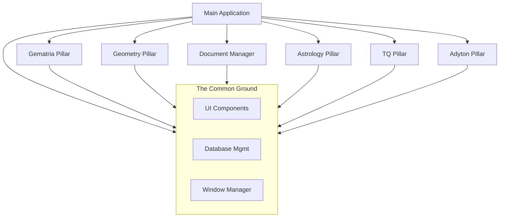

# The Architecture of the Temple

<!-- Last Verified: 2026-01-01 -->

> *"The structure must hold the weight of the vision."*

This scroll defines the high-level architecture of IsopGem. We follow a **Domain-Driven, Pillar-Based Architecture** designed for esoteric analysis across multiple disciplines.

---

## The Philosophy of Pillars

The system is organized into **Sovereign Pillars**. Each pillar represents a distinct domain of knowledge (Gematria, Astrology, Geometry, etc.) and operates as an independent module.

**The Law of Sovereignty**: A pillar owns its own data, UI, and logic. Pillars communicate only via the **Navigation Bus** (Signals), never through direct imports of internal components.

### The Six Pillars of Wisdom

| Pillar | Domain | Purpose |
|--------|--------|---------|
| **Gematria** | Number | Alphanumeric analysis (Hebrew, Greek, English) |
| **Geometry** | Form | Sacred geometry visualization (2D/3D) |
| **Astrology** | Time | Celestial mechanics and natal charts |
| **TQ** | Pattern | Trigrammaton QBLH and ternary logic |
| **Adyton** | Space | 3D sanctuary and spatial visualization |
| **Document Manager** | Memory | Research organization and text analysis |

---

## Architectural Topology

The application is a constellation of star-systems (Pillars) orbiting a central sun (Main Application).



## Internal Pillar Structure

Each pillar follows the **Standard Temple Layout**. This ensures that profound complexity is housed in predictable structures.

```
pillar/
├── ui/              # The Face: PyQt6 interfaces (Views)
├── services/        # The Will: Business logic & orchestration
├── models/          # The Shape: Data structures & entities
├── repositories/    # The Memory: Database access
└── utils/           # The Tools: Helper functions
```

For a detailed breakdown of these layers, see [The Component Layers](COMPONENT_LAYERS.md).

---

## System Context & Window Management

IsopGem uses a **Hub-and-Spoke** UI pattern.
- **The Main Window** is the Hub. It holds the tabs for each pillar.
- **Floating Palettes** are the Spokes. Users can detach tools into separate windows.

The **Window Manager** (`src/shared/ui/window_manager.py`) is the invisible spirit that coordinates these windows, ensuring they remain "pinned" to the application lifecycle.

## Cross-Cutting Concerns

### 1. Configuration
Managed via environment variables and `config/` files. See [Configuration](00_foundations/CONFIGURATION.md).

### 2. The Database (Memory)
We use **SQLAlchemy** for structured data (SQLite) and **Whoosh** for full-text indexing. The `init_db()` ritual prepares the vessels before use.

### 3. The Visual Liturgy (UI)
All components draw from `src/shared/ui/theme.py`. We use a unified aesthetic:
- **Dark Mode** foundation
- **Amber/Gold** accents
- **Glassmorphism** for depth

---

## Extending the Temple

To raise a new Pillar:
1. Create `src/pillars/<name>/`
2. Establish the Standard Layout (ui, services, models, repositories, utils)
3. Implement a `Hub` class inheriting from the base pattern
4. Register the Pillar in `src/main.py`

> *"As the stars wheel in their courses, so shall the Temple endure."*
