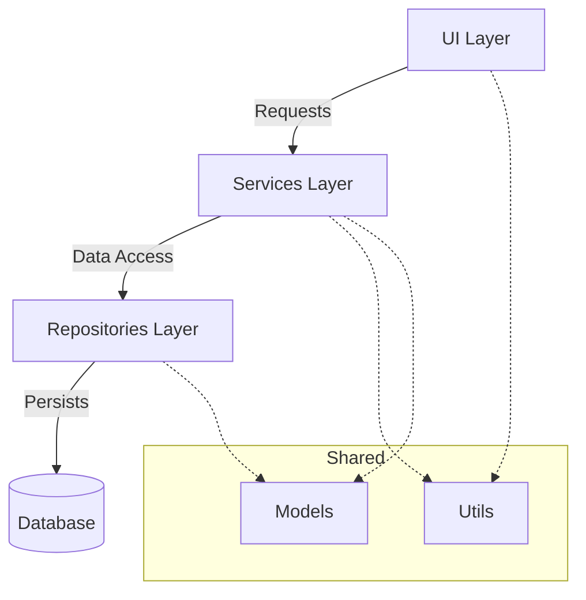

# The Component Layers

<!-- Last Verified: 2026-01-01 -->

> *"The View shall not Calculate. The Service shall not Paint."*
> — The Law of Separation

This scroll details the **Five-Layer Architecture** used within every Pillar of IsopGem.

---

## The Hierarchy of Flow

Data flows like water: down from the UI to the Depths (Database), and bubbling up from the Depths to the Surface.

---

## Layer 1: The UI (Presentation)
**Location**: `src/pillars/<pillar>/ui/`

The **Face** of the system.
- **Responsibility**: Render views, capture input, display results.
- **Constraint**: MUST NOT contain business logic.
- **Dependencies**: Uses Services to perform actions.

*Example*: `GematriaCalculatorWindow` captures text, asks `CalculationService` to compute, and displays the result.

## Layer 2: The Services (Business Logic)
**Location**: `src/pillars/<pillar>/services/`

The **Will** of the system.
- **Responsibility**: Orchestration, calculation, data transformation.
- **Constraint**: Agnostic of the UI. Should not know *how* data is displayed.
- **Dependencies**: Uses Repositories for storage, Models for structure.

*Example*: `CalculationService` takes text, sanitizes it, runs the math, and sends a `CalculationRecord` to the repository.

## Layer 3: The Models (Data Definition)
**Location**: `src/pillars/<pillar>/models/`

The **Shape** of the system.
- **Responsibility**: Define data structures (Pydantic, dataclasses) and Database Entities (SQLAlchemy).
- **Constraint**: Pure data. No logic (except validation).

*Example*: `CalculationRecord` defines what a "Gematria Result" looks like (text, value, method).

## Layer 4: The Repositories (Persistence)
**Location**: `src/pillars/<pillar>/repositories/`

The **Memory** of the system.
- **Responsibility**: CRUD operations (Create, Read, Update, Delete). Abstract the database.
- **Constraint**: Speak only in Models/Entities.
- **Dependencies**: `src/shared/database.py`

*Example*: `SqliteCalculationRepository` knows how to write a `CalculationEntity` to the SQLite file.

## Layer 5: The Utils (Utilities)
**Location**: `src/pillars/<pillar>/utils/`

The **Tools** of the system.
- **Responsibility**: Pure functions, helpers, formatters.
- **Constraint**: No state. No side effects.

*Example*: `numeric_utils.py` contains the Mispar Gadol mapping dictionary.

---

## The Flow of a Request

When a Magus saves a Gematria calculation:

1. **UI Layer**: `GematriaWindow` collects the string "Metatron".
2. **Service Layer**: `CalculationService` receives "Metatron". It normalizes it. It calculates the value (314). It creates a `CalculationRecord`.
3. **Repository Layer**: `CalculationRepository` takes the Record, converts it to a SQL `Entity`, and commits it to the Database.
4. **Return**: The ID is returned up the chain. The UI creates a "Success" toast.

## Troubleshooting

- **UI Frozen?** Computation is happening on the main thread. Move heavy logic to a Service worker.
- **Circular Import?** You likely have a Model importing a Service. Models should be leaf nodes.
- **Data Not Saving?** Check the `session.commit()` in the Repository.

> *"Order in the Code creates Peace in the Mind."*
