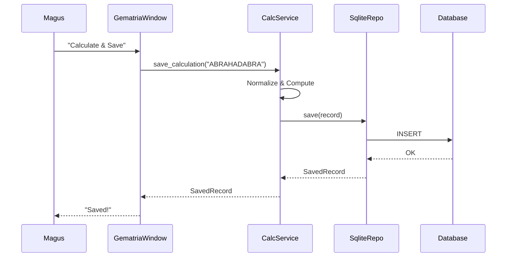
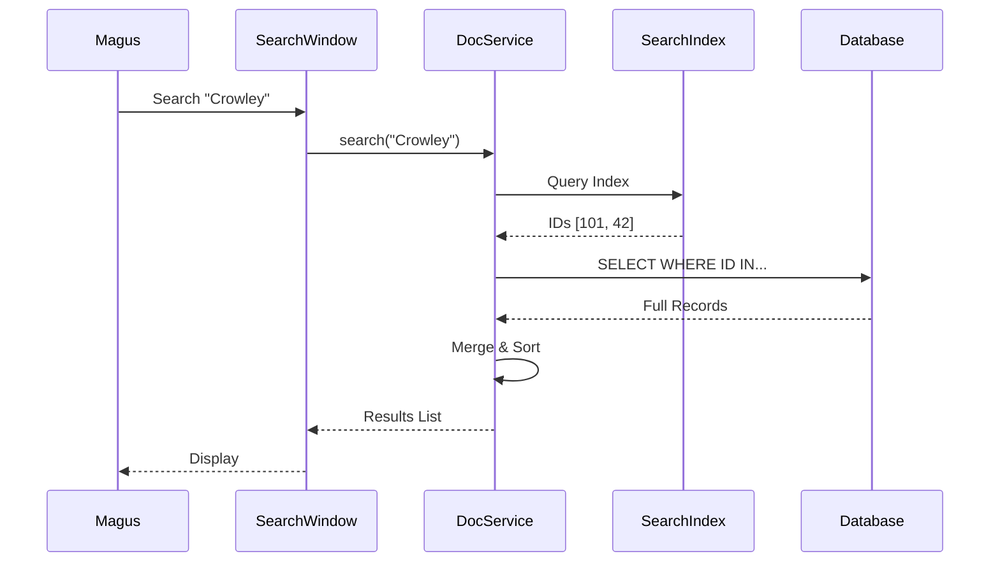

# Data Flow & Integration Patterns

<!-- Last Verified: 2026-01-01 -->

> *"The blood must flow, or the body dies. The signal must propagate, or the thought perishes."*

This scroll details the **Nervous System** of IsopGem — how data moves between the Organs (Components) and how the Organs coordinate their actions.

---

## The Integration Patterns

We use three primary patterns to bind the Temple together:

### 1. Centralized Window Management
**The invisible conductor.**
Instead of each component managing its own children, we use a shared `WindowManager`.
- **Pattern**: Service Registry / Mediator
- **Mechanism**: The `WindowManager` is injected into every Pillar Hub.
- **Benefit**: Consistent behavior (z-ordering, cleanup) across all 50+ tool windows.

### 2. Dependency Injection
**The giving of gifts.**
Components do not create their dependencies; they receive them.
- **Mechanism**: `__init__` arguments.
- **Example**: `GematriaHub(window_manager, database_session)`

### 3. Event-Driven Coordination
**The harmonic resonance.**
Components signal state changes; they do not command others directly.
- **Mechanism**: PyQt Signals & Slots.
- **Example**: Changing the Main Tab fires `currentChanged`. The Window Manager catches this and fires `raise_all_windows()`.

---

## Case Study I: The Gematria Flow (Write)

*How a word becomes a number in the database.*

1.  **Input**: Magus types "ABRAHADABRA" in `GematriaCalculatorWindow`.
2.  **Normalization**: `GematriaCalculator` converts to "abrahadabra".
3.  **Computation**: `HebrewCalculator` sums values -> 418.
4.  **Service**: `CalculationService` receives `(text="ABRAHADABRA", value=418)`.
5.  **Model**: Service creates `CalculationRecord`.
6.  **Repository**: `SQLiteRepository` converts Record to `CalculationEntity`.
7.  **Persistence**: SQLAlchemy executes `INSERT INTO calculations...`.
8.  **Feedback**: Service returns the saved object. UI shows "Saved" notification.

---

## Case Study II: The Document Search Flow (Read)

*How a query finds truth across two realms.*

This flow is unique because it bridges **Structured Data** (SQLite) and **Unstructured Index** (Whoosh).

1.  **Query**: Magus searches for "Crowley".
2.  **Index Search**: `DocumentService` asks `WhooshRepository` for matches.
    - Returns: `[id: 101, score: 0.95], [id: 42, score: 0.88]`
3.  **Data Fetch**: `DocumentService` asks `SqliteRepository` for full records.
    - Query: `SELECT * FROM documents WHERE id IN (101, 42)`
4.  **Synthesis**: Service merges the *Metadata* (from SQLite) with the *Highlights/Snippets* (from Whoosh).
5.  **Presentation**: UI renders the list, sorted by relevance.

---

## Debugging the Flow

When the river invalidates expectations:

1.  **Trace layer-by-layer**: Did it leave the UI? Did it reach the Service?
2.  **Check the boundaries**: Data often corrupts at the `Model <-> Entity` conversion.
3.  **Watch the Bus**: Is the Signal actually firing? Connect a debug printer to the signal.

> *"The map is not the territory, but a good map saves the traveler."*
