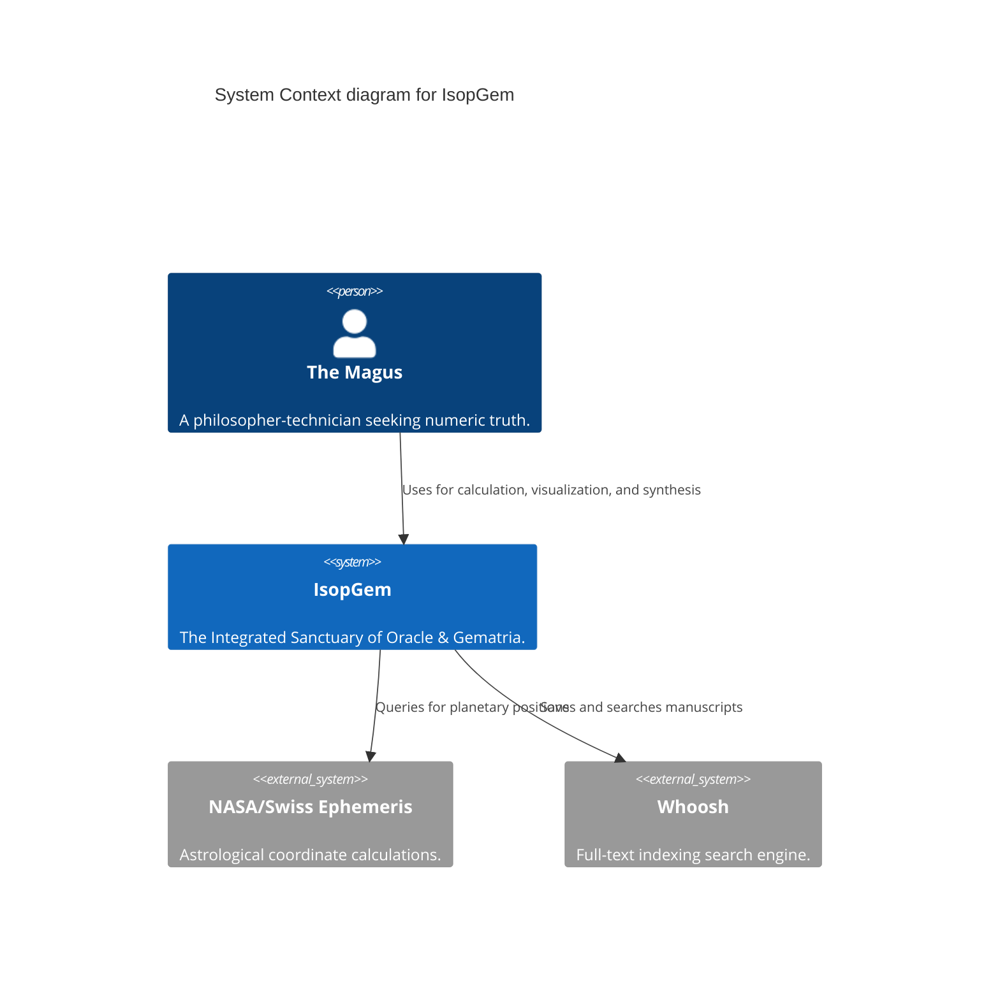

# The Atlas of IsopGem

**"As Above, So Below. The Code is the Body; the Documentation is the Soul."**

## The Sovereign Architecture
The Temple of IsopGem is constructed upon the **Doctrine of the Spheres**. Each Pillar is a Sovereign Nation of Logic, governing a specific domain of the esoteric arts. They interact through the **Signal Bus**, never touching directly.

### The Higher Context (C4 Model)


### The Pantheon of Pillars
The following Grimoires detail the inner workings of each Sphere:

*   **[Adyton](file:///home/burkettdaniel927/projects/isopgem/wiki/02_pillars/adyton/)**: The Inner Sanctum (3D/4D Visualization).
*   **[Emerald Tablet](file:///home/burkettdaniel927/projects/isopgem/wiki/02_pillars/emerald_tablet/)**: The Grid of Equivalences (Spreadsheets).
*   **[Astrology](file:///home/burkettdaniel927/projects/isopgem/wiki/02_pillars/astrology/)**: The Keeper of Time.
*   **[Document Manager](file:///home/burkettdaniel927/projects/isopgem/wiki/02_pillars/document_manager/)**: The Scribe & Mindscape.
*   **[Gematria](file:///home/burkettdaniel927/projects/isopgem/wiki/02_pillars/gematria/)**: The Tongue of God (Ciphers).
*   **[Geometry](file:///home/burkettdaniel927/projects/isopgem/wiki/02_pillars/geometry/)**: The Weaver of Form (Sacred Shapes).
*   **[TQ Engine](file:///home/burkettdaniel927/projects/isopgem/wiki/02_pillars/tq/)**: The Three-Fold Kabbalah.
*   **[Time Mechanics](file:///home/burkettdaniel927/projects/isopgem/wiki/02_pillars/time_mechanics/)**: The Master of Cycles (Tzolkin).

## The Nervous System (Signal Bus)
The Pillars communicate via a central **Signal Bus**. This decouples the organs, ensuring that if one fails, the body survives.

### Topology
```mermaid
graph TD
    User((The Magus)) -->|Input| View[Presentation Layer (UI)]
    View -->|Signal: Request| Bus{Signal Bus}
    Bus -->|Signal: Dispatch| Service[Sovereign Service]
    Service -->|Signal: Result| Bus
    Bus -->|Signal: Update| View
```

## The Entry Point
*   **Main Entry**: `src/main.py`
    *   **Role**: The "Big Bang". Initializes the `QApplication`, summons the `WindowManager`, and launches the Sovereigns.

## The Nervous System (Signal Bus)
The Pillars communicate via a central **Signal Bus**. This decouples the organs, ensuring that if one fails, the body survives.

### Topology
```mermaid
graph TD
    User((The Magus)) -->|Input| View[Presentation Layer (UI)]
    View -->|Signal: Request| Bus{Signal Bus}
    Bus -->|Signal: Dispatch| Service[Sovereign Service]
    Service -->|Signal: Result| Bus
    Bus -->|Signal: Update| View
```

## The Entry Point
*   **Main Entry**: `src/main.py`
    *   **Role**: The "Big Bang". Initializes the `QApplication`, summons the `WindowManager`, and launches the Sovereigns.
