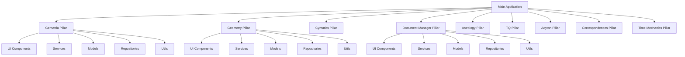
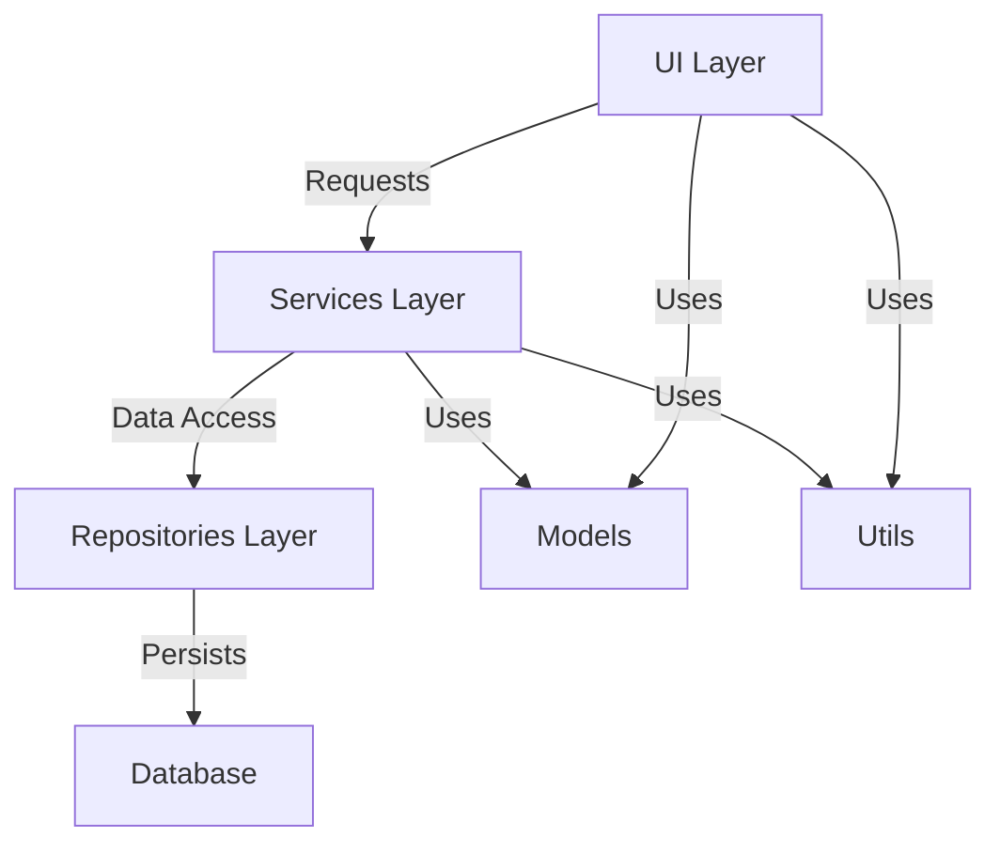
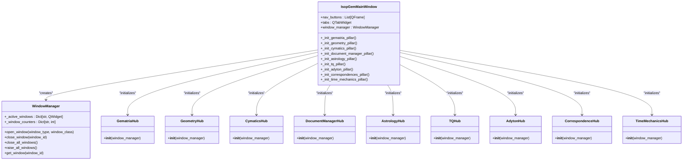
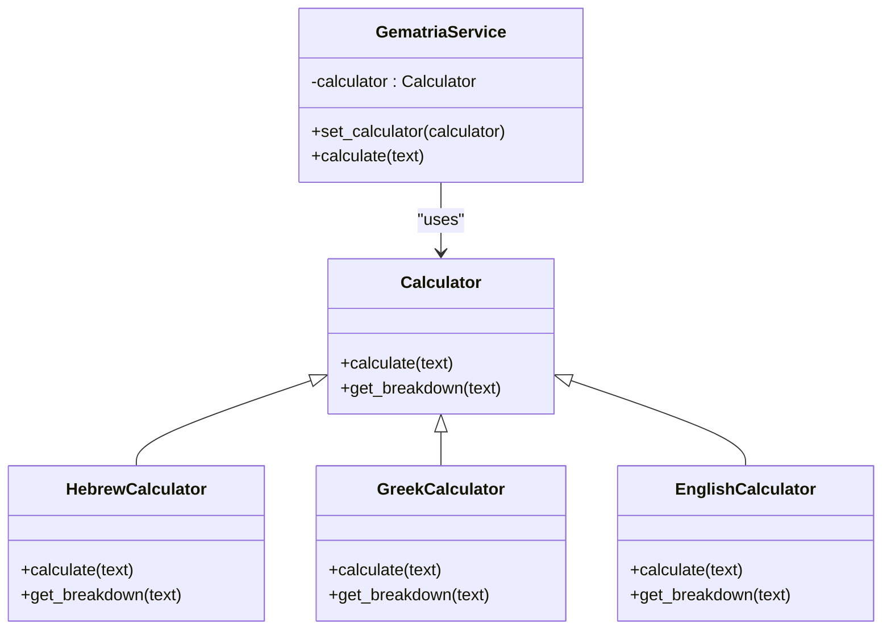
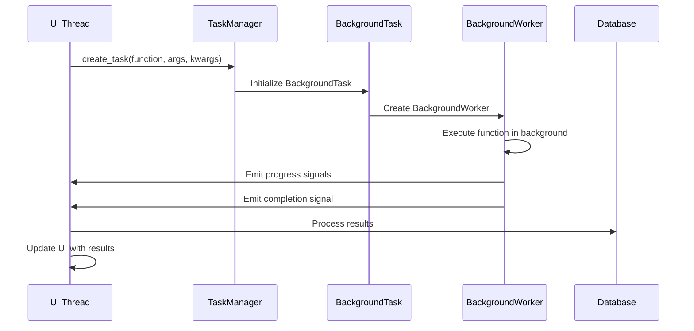
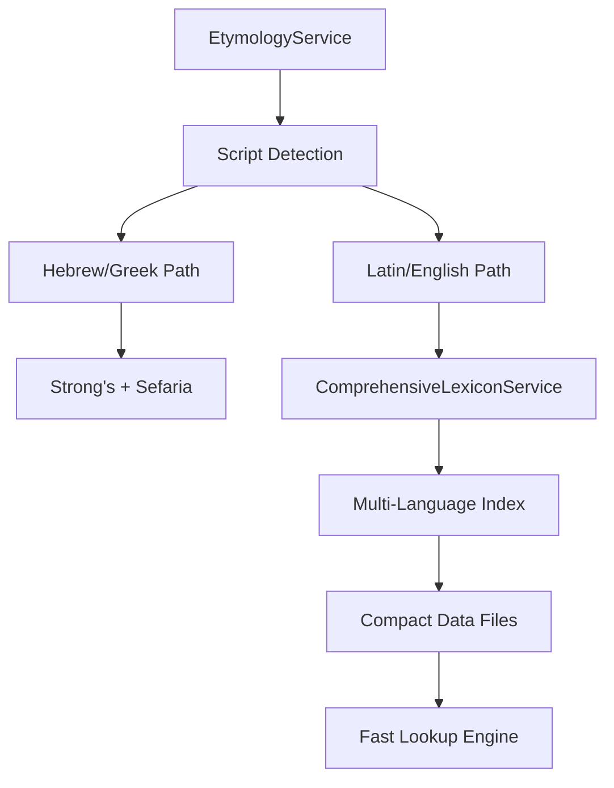

# Architecture Overview

<cite>
**Referenced Files in This Document**
- [main.py](file://src/main.py)
- [ARCHITECTURE.md](file://config/ARCHITECTURE.md)
- [window_manager.py](file://src/shared/ui/window_manager.py)
- [database.py](file://src/shared/database.py)
- [theme.py](file://src/shared/ui/theme.py)
- [GematriaHub](file://src/pillars/gematria/ui/gematria_hub.py)
- [GeometryHub](file://src/pillars/geometry/ui/geometry_hub.py)
- [DocumentManagerHub](file://src/pillars/document_manager/ui/document_manager_hub.py)
- [AstrologyHub](file://src/pillars/astrology/ui/astrology_hub.py)
- [TQHub](file://src/pillars/tq/ui/tq_hub.py)
- [AdytonHub](file://src/pillars/adyton/ui/adyton_hub.py)
- [manager.py](file://src/shared/async_tasks/manager.py)
- [decorators.py](file://src/shared/async_tasks/decorators.py)
- [worker.py](file://src/shared/async_tasks/worker.py)
- [COMPREHENSIVE_ETYMOLOGY_SETUP.md](file://docs/guides/COMPREHENSIVE_ETYMOLOGY_SETUP.md)
- [ETYMOLOGY_QUICK_REFERENCE.md](file://docs/guides/ETYMOLOGY_QUICK_REFERENCE.md)
- [Spreadsheet_Feature_Roadmap.md](file://docs/features/Spreadsheet_Feature_Roadmap.md)
- [GEOMETRY_3D_PLAN.md](file://docs/features/GEOMETRY_3D_PLAN.md)
- [CYMATICS_GENERATOR_HELP.md](file://docs/features/CYMATICS_GENERATOR_HELP.md)
- [gematria_pillar.md](file://docs/reference/architecture/gematria_pillar.md)
- [adyton_concept.md](file://docs/reference/architecture/adyton_concept.md)
</cite>

## Update Summary
**Changes Made**
- Added comprehensive async tasks architecture documentation
- Integrated detailed etymology system setup and usage guides
- Documented feature specifications and roadmaps for spreadsheet functionality
- Enhanced geometry 3D engine blueprint and cymatics simulator documentation
- Updated architectural patterns with strategy pattern implementation
- Expanded cross-cutting concerns with async task management
- Added unified architecture navigation and feature specification documentation

## Table of Contents
1. [Introduction](#introduction)
2. [Pillar-Based Architecture](#pillar-based-architecture)
3. [Pillar Internal Structure](#pillar-internal-structure)
4. [System Context and Window Management](#system-context-and-window-management)
5. [Cross-Cutting Concerns](#cross-cutting-concerns)
6. [Architectural Patterns](#architectural-patterns)
7. [Async Task Management](#async-task-management)
8. [Etymology System Architecture](#etymology-system-architecture)
9. [Feature Specifications and Roadmaps](#feature-specifications-and-roadmaps)
10. [Technical Decisions and Trade-offs](#technical-decisions-and-trade-offs)
11. [Extensibility and New Pillar Integration](#extensibility-and-new-pillar-integration)
12. [Conclusion](#conclusion)

## Introduction

The isopgem application implements a domain-driven, pillar-based architecture designed for esoteric analysis across multiple disciplines. The system is structured around eight main pillars: Gematria, Geometry, Cymatics, Document Manager, Astrology, TQ (Trigrammaton QBLH), Adyton, Correspondences, and Time Mechanics. Each pillar represents a distinct domain of knowledge and analysis, while sharing a consistent internal structure and integration pattern with the core application framework. This documentation provides a comprehensive overview of the architectural principles, component interactions, and design patterns that govern the system, including the newly integrated async task management, comprehensive etymology system, and detailed feature specifications.

**Section sources**
- [ARCHITECTURE.md](file://config/ARCHITECTURE.md#L1-L51)
- [main.py](file://src/main.py#L458-L505)

## Pillar-Based Architecture

The isopgem application follows a modular pillar-based architecture where each major domain of functionality is encapsulated within its own pillar. This approach provides clear separation of concerns while enabling consistent patterns across domains. The eight main pillars are:

- **Gematria**: Hebrew, Greek, and English numerical analysis tools with strategy pattern implementation
- **Geometry**: Sacred geometry visualization and calculation tools with 3D engine blueprint
- **Cymatics**: Vibrational patterns and standing wave simulations
- **Document Manager**: Analysis and organization of texts and documents with comprehensive etymology support
- **Astrology**: Cosmic calendar and zodiacal mappings
- **TQ (Trigrammaton QBLH)**: Integration and pattern analysis
- **Adyton**: 3D sacred geometry and spatial analysis with architectural concept foundation
- **Correspondences**: Emerald Tablet correspondences and mappings
- **Time Mechanics**: Temporal analysis and cyclical patterns

Each pillar operates as an independent module with its own UI, services, models, repositories, and utilities, while integrating with the central application through standardized interfaces. This architecture enables focused development within each domain while maintaining system-wide consistency.



**Diagram sources**
- [main.py](file://src/main.py#L398-L449)
- [ARCHITECTURE.md](file://config/ARCHITECTURE.md#L32-L51)

**Section sources**
- [ARCHITECTURE.md](file://config/ARCHITECTURE.md#L5-L31)
- [main.py](file://src/main.py#L203-L214)

## Pillar Internal Structure

Each pillar follows a consistent internal structure that enforces separation of concerns and promotes maintainability. The standard structure includes five main directories:

```
pillar/
├── ui/              # PyQt6-based interface components
├── services/        # Business logic and core functionality
├── models/          # Data structures and type definitions
├── repositories/    # Data access and persistence
└── utils/           # Helper functions and utilities
```

This structure implements a layered architecture within each pillar:

- **Presentation Layer (UI)**: Handles user interface rendering and input events
- **Business Logic Layer (Services)**: Contains the core domain logic and processing
- **Persistence Layer (Repositories)**: Manages data storage and retrieval
- **Data Layer (Models)**: Defines the data structures and entities
- **Utility Layer (Utils)**: Provides shared helper functions

The architecture strictly enforces the principle that UI components should not contain business logic ("The View shall not Calculate"), ensuring that all complex processing occurs in the services layer.



**Diagram sources**
- [ARCHITECTURE.md](file://config/ARCHITECTURE.md#L36-L43)

**Section sources**
- [ARCHITECTURE.md](file://config/ARCHITECTURE.md#L32-L43)

## System Context and Window Management

The isopgem application is built on a centralized window management system that coordinates the lifecycle of all UI components. The main application window serves as the central hub, containing tabs for each pillar that provide access to their respective functionality.

The `WindowManager` class in the shared UI components manages all tool windows across the application, handling their creation, positioning, and lifecycle. This ensures consistent behavior across all pillars and prevents window management code from being duplicated. The window manager supports both single-instance and multiple-instance window types, with appropriate tracking and cleanup mechanisms.

The main window initializes all pillar hubs during startup and coordinates their integration through the sidebar navigation. When a user navigates between pillars, the window manager raises all associated tool windows to maintain context.



**Diagram sources**
- [main.py](file://src/main.py#L62-L139)
- [window_manager.py](file://src/shared/ui/window_manager.py#L35-L376)

**Section sources**
- [main.py](file://src/main.py#L62-L139)
- [window_manager.py](file://src/shared/ui/window_manager.py#L35-L376)

## Cross-Cutting Concerns

The isopgem architecture addresses several cross-cutting concerns through shared components and standardized patterns.

### Configuration Management
Configuration is managed through a combination of environment variables, configuration files, and runtime settings. The architecture doctrine establishes clear guidelines for where configuration should be stored and accessed, ensuring consistency across pillars.

### Database Initialization
The application uses SQLAlchemy for database persistence, with a centralized initialization process in the shared database module. The `init_db()` function creates all necessary tables and ensures the database schema is properly initialized before any pillar attempts to access it.

### Shared UI Components
The `shared/ui` directory contains common UI widgets and utilities used across multiple pillars, including:
- Theme and styling system
- Virtual keyboard for esoteric character input
- Window management framework
- Standardized UI components

These shared components ensure visual and behavioral consistency throughout the application while reducing code duplication.

```mermaid
graph TD
A[Configuration] --> B[Environment Variables]
A --> C[Configuration Files]
A --> D[Runtime Settings]
E[Database] --> F[SQLAlchemy]
E --> G[init_db()]
E --> H[Session Management]
I[Shared UI] --> J[Theme System]
I --> K[Virtual Keyboard]
I --> L[Window Manager]
I --> M[Common Widgets]
N[Main Application] --> A
N --> E
N --> I
```

**Diagram sources**
- [database.py](file://src/shared/database.py#L1-L53)
- [theme.py](file://src/shared/ui/theme.py#L1-L372)

**Section sources**
- [database.py](file://src/shared/database.py#L1-L53)
- [theme.py](file://src/shared/ui/theme.py#L1-L372)

## Architectural Patterns

The isopgem application implements several key architectural patterns to support its complex functionality.

### Strategy Pattern in Gematria
The Gematria pillar uses the Strategy pattern to support multiple calculation systems (Hebrew, Greek, English). Different calculator implementations can be selected at runtime, allowing users to switch between systems without changing the core UI or service logic.

### Scene Graph in Adyton
The Adyton pillar implements a scene graph architecture for 3D sacred geometry visualization. This hierarchical structure allows complex geometric compositions to be built from simpler components, with transformations and properties inherited through the hierarchy.

### Hub-and-Spoke Pattern
Each pillar follows a hub-and-spoke pattern, with a central hub component that provides access to all functionality within that domain. The hub serves as the entry point for the pillar and coordinates communication between its various components.

### Dependency Injection
The architecture uses dependency injection to provide services and utilities to UI components, particularly through the window manager which is passed to each pillar hub during initialization. This promotes loose coupling and makes components easier to test.



**Diagram sources**
- [gematria_pillar.md](file://docs/reference/architecture/gematria_pillar.md#L72-L107)

**Section sources**
- [gematria_pillar.md](file://docs/reference/architecture/gematria_pillar.md#L6-L20)

## Async Task Management

The isopgem application implements a comprehensive asynchronous task management system to handle background operations without blocking the UI thread. This system provides centralized control over background tasks with support for progress reporting, error handling, and cancellation.

### Task Manager Architecture

The TaskManager serves as the central coordinator for all background operations, providing:

- **Thread Pool Management**: Configurable maximum thread count for optimal resource utilization
- **Task Tracking**: Real-time monitoring of active tasks with unique naming
- **Signal Communication**: PyQt signals for task lifecycle events (started, completed, failed, cancelled)
- **Cancellation Support**: Graceful task cancellation with cleanup

### Background Task Execution

The system provides multiple approaches for executing background tasks:

1. **Direct Task Creation**: Using `TaskManager.create_task()` for programmatic control
2. **Decorator Pattern**: Using `@run_in_background` and `@async_method` decorators for method-level async execution
3. **BackgroundWorker Direct**: Using `BackgroundWorker` for fine-grained control over execution

### Progress Reporting and Error Handling

The async system includes comprehensive progress reporting and error handling:

- **Progress Callbacks**: Built-in support for reporting completion percentages and status messages
- **Error Propagation**: Automatic conversion of exceptions to `AppError` instances
- **User Notification**: Integrated error notification system for user-friendly error reporting
- **Cancellation Detection**: Proper handling of cancelled tasks to prevent resource leaks



**Diagram sources**
- [manager.py](file://src/shared/async_tasks/manager.py#L71-L127)
- [worker.py](file://src/shared/async_tasks/worker.py#L82-L132)

**Section sources**
- [manager.py](file://src/shared/async_tasks/manager.py#L26-L243)
- [decorators.py](file://src/shared/async_tasks/decorators.py#L22-L181)
- [worker.py](file://src/shared/async_tasks/worker.py#L46-L260)

## Etymology System Architecture

The isopgem application features a comprehensive multi-language etymology system supporting 50+ languages organized into six categories. This system provides automatic word origin detection and cross-linguistic etymological analysis.

### System Architecture

The etymology system is built around three core components:

1. **EtymologyService**: Main service that auto-detects script type (Hebrew, Greek, Latin/English) and routes queries to appropriate lexicons
2. **ComprehensiveLexiconService**: Manages offline dictionary access with memory-efficient indexed lookup
3. **EtymologyDbService**: Provides structured etymology relationships from the etymology graph database

### Data Flow Architecture

```
User Query
    ↓
EtymologyService (script auto-detection)
    ↓
ComprehensiveLexiconService (multi-language lookup)
    ↓
[Individual Language Processing]
    ↓
Compact Index Lookup (word → byte offset)
    ↓
Return etymology with definitions
```

### Language Categories and Coverage

The system organizes languages into six tiers:

1. **Core Ancient** (7 languages): English, Latin, Ancient Greek, Hebrew, Sanskrit, Proto-Indo-European, Aramaic
2. **Medieval Bridge** (8 languages): Old English, Middle English, Old French, Gothic, Old Norse, etc.
3. **Ancient Semitic** (6 languages): Akkadian, Syriac, Phoenician, Ugaritic, Ancient Hebrew, Coptic
4. **Ancient Indo-European** (6 languages): Avestan, Old Persian, Pali, Prakrit, Tocharian, Hittite
5. **Modern Major** (10 languages): French, German, Spanish, Italian, Portuguese, Russian, Greek, Arabic, Chinese, Japanese
6. **Other Ancient** (5 languages): Sumerian, Egyptian, Classical Syriac, Middle Persian, Elamite

### Performance Optimization

The system employs several optimization strategies:

- **Memory Efficiency**: Compact indexes reduce dictionary sizes by 80-90%
- **Instant Lookup**: Byte-offset seeking provides sub-millisecond response times
- **Lazy Loading**: Only loaded languages consume memory
- **Caching**: Built-in LRU caching reduces repeated lookups



**Diagram sources**
- [COMPREHENSIVE_ETYMOLOGY_SETUP.md](file://docs/guides/COMPREHENSIVE_ETYMOLOGY_SETUP.md#L120-L136)

**Section sources**
- [COMPREHENSIVE_ETYMOLOGY_SETUP.md](file://docs/guides/COMPREHENSIVE_ETYMOLOGY_SETUP.md#L1-L286)
- [ETYMOLOGY_QUICK_REFERENCE.md](file://docs/guides/ETYMOLOGY_QUICK_REFERENCE.md#L1-L238)

## Feature Specifications and Roadmaps

The isopgem application includes comprehensive feature specifications and roadmaps for various modules, providing detailed implementation plans and complexity analysis.

### Spreadsheet Module Roadmap

The spreadsheet module follows a structured roadmap with difficulty ratings (1-10) based on architectural complexity:

#### Core UX & Navigation
- **Delete/Clear Key**: Easiest (Difficulty 1) - MVP functionality completed
- **Resize Rows/Cols**: Low difficulty (2) - MVP functionality completed  
- **Search (Ctrl+F)**: Low difficulty (2) - MVP functionality completed
- **Multi-Level Undo**: Medium difficulty (6) - Partial implementation with planned batching

#### Formatting & Visuals
- **Text Alignment**: Low difficulty (2) - MVP functionality completed
- **Range Borders**: Medium difficulty (4) - MVP functionality completed
- **Conditional Formatting**: Medium difficulty (6) - Partial implementation

#### Formulas & Calculation
- **Range Support**: Medium difficulty (4) - MVP functionality completed
- **New Functions**: Low difficulty (2) - MVP functionality completed
- **Dependency Graph**: High difficulty (9) - Future enhancement

#### Esoteric & App-Specific
- **Gematria Heatmap**: Medium difficulty (4) - Future enhancement
- **Planetary Data**: High difficulty (6) - Future enhancement
- **Kamea Generator**: Medium difficulty (5) - Future enhancement

### Geometry 3D Engine Blueprint

The geometry 3D engine provides a modular architecture for sacred geometry visualization:

#### Core Modules
1. **Geometry3DView**: PyQt widget with orthographic projection and wireframe rendering
2. **SolidPayload**: Dataclass defining geometric properties and metrics
3. **Solid Math Services**: Pure Python calculations for geometric properties
4. **Geometry3DWindow**: UI orchestration with toolbar and metrics panel

#### Rendering Strategy
- Orthographic projection with configurable camera controls
- Wireframe-first approach with optional face filling
- Modular design supporting hardware acceleration migration

### Cymatics Simulator Features

The cymatics simulator provides real-time standing wave pattern generation:

#### Plate Shapes
- **Rectangular**: Classic sine wave modes with grid-like nodal patterns
- **Circular**: True Chladni patterns using Bessel functions
- **Hexagonal**: Three-fold symmetric patterns with snowflake aesthetics

#### Advanced Features
- **3D Surface View**: Height map visualization with orbital camera controls
- **Particle Simulation**: Sand-like accumulation at nodal lines
- **Export Capabilities**: Image and GIF export with customizable color gradients

**Section sources**
- [Spreadsheet_Feature_Roadmap.md](file://docs/features/Spreadsheet_Feature_Roadmap.md#L1-L53)
- [GEOMETRY_3D_PLAN.md](file://docs/features/GEOMETRY_3D_PLAN.md#L1-L65)
- [CYMATICS_GENERATOR_HELP.md](file://docs/features/CYMATICS_GENERATOR_HELP.md#L1-L167)

## Technical Decisions and Trade-offs

The isopgem architecture reflects several important technical decisions and trade-offs:

### PyQt6 vs Web Frameworks
The decision to use PyQt6 for the UI rather than a web framework enables rich desktop functionality and better performance for complex visualizations, at the cost of platform specificity and deployment complexity.

### SQLite vs Client-Server Databases
SQLite was chosen for its simplicity and zero-configuration deployment, making the application easy to distribute and use. This trades off some scalability and concurrent access capabilities for ease of use.

### Monolithic vs Microservices
The pillar-based architecture represents a middle ground between monolithic and microservices approaches. While all pillars run in the same process, they are loosely coupled and can be developed independently, balancing development agility with deployment simplicity.

### Python vs Compiled Languages
Python was selected for its rich ecosystem of scientific and mathematical libraries, rapid development cycle, and accessibility to domain experts. This trades off some performance and type safety for development speed and domain alignment.

### Asynchronous Processing
The decision to implement comprehensive async task management was made to maintain UI responsiveness during intensive operations like etymology lookups, 3D rendering, and large dataset processing.

## Extensibility and New Pillar Integration

The architecture is designed to support the addition of new pillars following established patterns. To add a new pillar:

1. Create a new directory under `src/pillars/` with the pillar name
2. Implement the standard structure with ui, services, models, repositories, and utils directories
3. Create a hub component that inherits from the base hub pattern
4. Register the pillar in the main application window
5. Add documentation following the architectural doctrine
6. Implement async task integration if needed
7. Add etymology service integration for language support

The consistent structure and clear separation of concerns make it straightforward to add new domains of analysis while maintaining system integrity.

**Section sources**
- [ARCHITECTURE.md](file://config/ARCHITECTURE.md#L32-L51)
- [main.py](file://src/main.py#L402-L449)

## Conclusion

The isopgem application's architecture successfully balances domain specialization with system-wide consistency. The expanded eight-pillar architecture allows each domain of esoteric analysis to develop its own specialized tools and interfaces, while the shared infrastructure ensures a cohesive user experience and maintainable codebase. The integration of comprehensive async task management, multi-language etymology support, and detailed feature specifications provides a solid foundation for continued development and expansion. The strict separation of concerns, standardized patterns, and comprehensive documentation make the system both powerful and extensible, supporting the complex requirements of esoteric analysis applications.