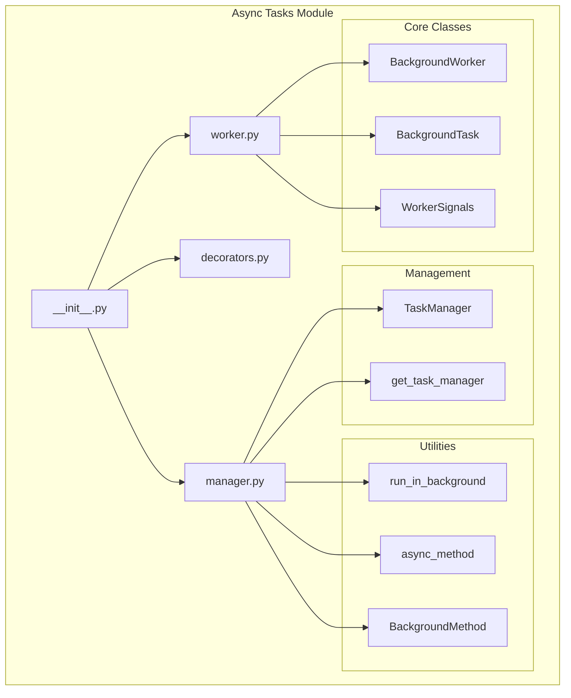
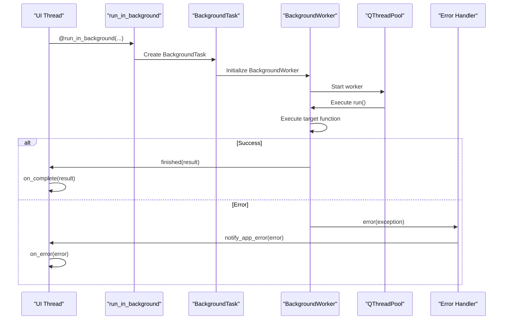
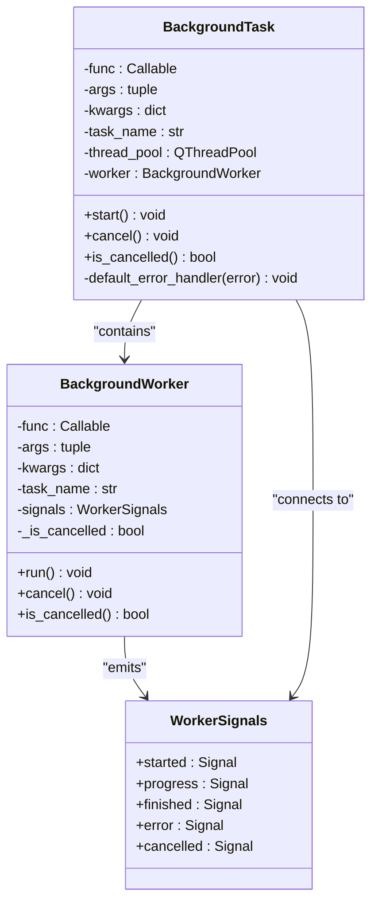
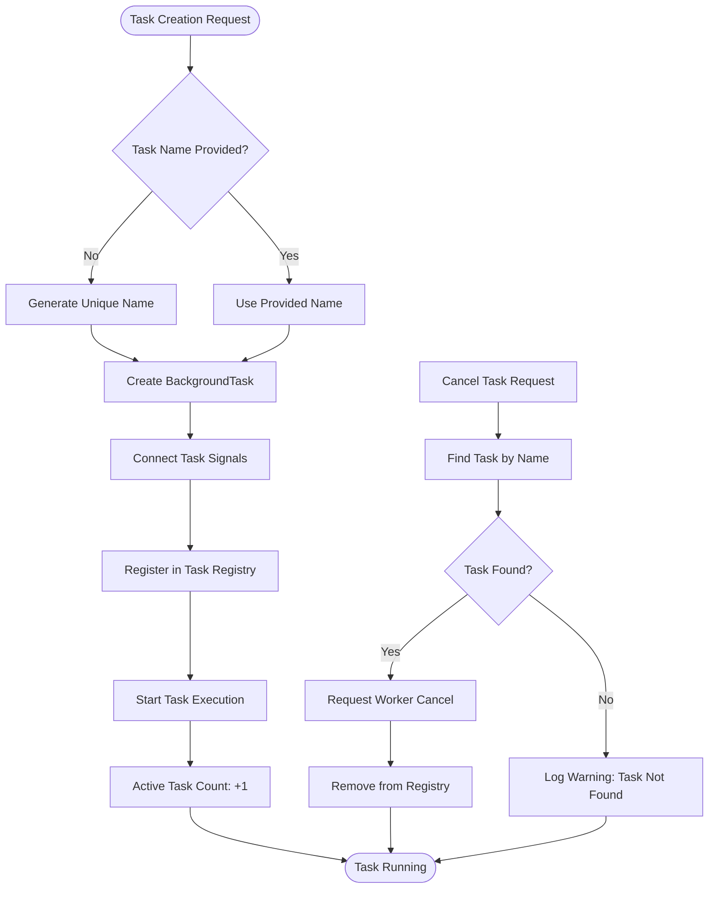
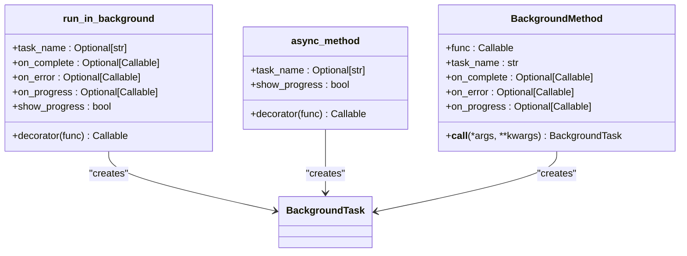
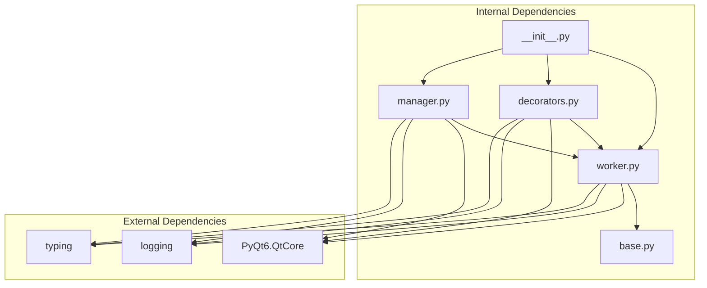

# Async Task Management System

<cite>
**Referenced Files in This Document**
- [__init__.py](file://src/shared/async_tasks/__init__.py)
- [manager.py](file://src/shared/async_tasks/manager.py)
- [decorators.py](file://src/shared/async_tasks/decorators.py)
- [worker.py](file://src/shared/async_tasks/worker.py)
- [base.py](file://src/shared/errors/base.py)
- [main_window.py](file://src/ui/main_window.py)
</cite>

## Table of Contents
1. [Introduction](#introduction)
2. [Project Structure](#project-structure)
3. [Core Components](#core-components)
4. [Architecture Overview](#architecture-overview)
5. [Detailed Component Analysis](#detailed-component-analysis)
6. [Dependency Analysis](#dependency-analysis)
7. [Performance Considerations](#performance-considerations)
8. [Troubleshooting Guide](#troubleshooting-guide)
9. [Conclusion](#conclusion)

## Introduction

The Async Task Management System is a comprehensive background task execution framework built specifically for the Isopgem application. This system provides thread-safe, cancellable, and observable background processing capabilities using PyQt6's QThreadPool infrastructure. The system is designed to prevent UI blocking during intensive operations while maintaining clean separation between background computation and user interface updates.

The framework supports multiple usage patterns including decorator-based task execution, manual task management, and centralized task orchestration through a global task manager. It integrates seamlessly with the application's error handling system and provides comprehensive progress tracking capabilities.

## Project Structure

The async task system is organized into four core modules located in the `src/shared/async_tasks/` directory:

**Diagram sources**
- [__init__.py](file://src/shared/async_tasks/__init__.py#L1-L46)
- [worker.py](file://src/shared/async_tasks/worker.py#L1-L260)
- [decorators.py](file://src/shared/async_tasks/decorators.py#L1-L181)
- [manager.py](file://src/shared/async_tasks/manager.py#L1-L243)

**Section sources**
- [__init__.py](file://src/shared/async_tasks/__init__.py#L1-L46)

## Core Components

The async task system consists of three primary layers that work together to provide comprehensive background task management:

### Background Execution Layer
The foundation of the system is built around `BackgroundWorker` and `BackgroundTask` classes that handle the actual threading and execution logic. These components utilize PyQt6's QThreadPool for efficient thread management and provide automatic cleanup mechanisms.

### Management Layer  
The `TaskManager` class serves as the central coordinator for all background tasks, providing methods for task creation, monitoring, cancellation, and cleanup. It maintains a registry of active tasks and exposes signals for external observers.

### API Layer
The system offers multiple convenient APIs through decorators and descriptors that allow developers to easily convert synchronous methods into asynchronous operations without complex threading code.

**Section sources**
- [worker.py](file://src/shared/async_tasks/worker.py#L1-L260)
- [manager.py](file://src/shared/async_tasks/manager.py#L1-L243)
- [decorators.py](file://src/shared/async_tasks/decorators.py#L1-L181)

## Architecture Overview

The async task system follows a layered architecture pattern that separates concerns between execution, management, and user interface integration:

**Diagram sources**
- [decorators.py](file://src/shared/async_tasks/decorators.py#L22-L81)
- [worker.py](file://src/shared/async_tasks/worker.py#L83-L124)
- [manager.py](file://src/shared/async_tasks/manager.py#L71-L127)

The architecture ensures thread safety through PyQt6's signal/slot mechanism, which automatically marshals calls between threads. All UI updates occur on the main thread through signal emissions, preventing cross-thread UI access issues.

**Section sources**
- [worker.py](file://src/shared/async_tasks/worker.py#L24-L133)
- [manager.py](file://src/shared/async_tasks/manager.py#L26-L70)

## Detailed Component Analysis

### BackgroundWorker Implementation

The `BackgroundWorker` class extends `QRunnable` to provide thread-based execution capabilities. It encapsulates the target function and manages the execution lifecycle with proper error handling and cancellation support.

**Diagram sources**
- [worker.py](file://src/shared/async_tasks/worker.py#L46-L133)
- [worker.py](file://src/shared/async_tasks/worker.py#L135-L234)

The worker implementation includes sophisticated error handling that converts unhandled exceptions into structured `AppError` objects, ensuring consistent error reporting across the application.

**Section sources**
- [worker.py](file://src/shared/async_tasks/worker.py#L46-L133)
- [worker.py](file://src/shared/async_tasks/worker.py#L135-L234)

### TaskManager Central Coordination

The `TaskManager` class provides centralized control over all background tasks in the application. It maintains a registry of active tasks and offers methods for monitoring and control.

**Diagram sources**
- [manager.py](file://src/shared/async_tasks/manager.py#L71-L127)
- [manager.py](file://src/shared/async_tasks/manager.py#L129-L147)

The manager supports concurrent task execution with configurable thread limits and provides cleanup mechanisms to ensure proper resource management.

**Section sources**
- [manager.py](file://src/shared/async_tasks/manager.py#L26-L70)
- [manager.py](file://src/shared/async_tasks/manager.py#L148-L213)

### Decorator-Based API

The system provides two primary decorator-based approaches for converting synchronous methods into asynchronous operations:

**Diagram sources**
- [decorators.py](file://src/shared/async_tasks/decorators.py#L22-L81)
- [decorators.py](file://src/shared/async_tasks/decorators.py#L84-L125)
- [decorators.py](file://src/shared/async_tasks/decorators.py#L128-L181)

The `run_in_background` decorator provides the most flexibility with full callback support, while `async_method` offers a simplified approach for basic async operations.

**Section sources**
- [decorators.py](file://src/shared/async_tasks/decorators.py#L22-L125)
- [decorators.py](file://src/shared/async_tasks/decorators.py#L128-L181)

## Dependency Analysis

The async task system has minimal external dependencies and integrates cleanly with the broader application architecture:

**Diagram sources**
- [worker.py](file://src/shared/async_tasks/worker.py#L13-L21)
- [base.py](file://src/shared/errors/base.py#L1-L184)
- [__init__.py](file://src/shared/async_tasks/__init__.py#L29-L31)

The system's error handling integrates with the application's centralized error management through the `AppError` class, ensuring consistent error reporting and user notification.

**Section sources**
- [worker.py](file://src/shared/async_tasks/worker.py#L13-L21)
- [base.py](file://src/shared/errors/base.py#L64-L101)

## Performance Considerations

The async task system is designed with several performance optimizations:

### Thread Pool Management
- Configurable maximum thread count (default: 4)
- Automatic thread reuse and cleanup
- Efficient task queuing through QThreadPool
- Minimal overhead per task creation

### Memory Management
- Automatic worker deletion after completion
- Proper resource cleanup in destructor
- Weak reference patterns to prevent circular dependencies
- Efficient signal-slot connections

### Error Handling Performance
- Minimal overhead for successful operations
- Lazy error conversion to AppError format
- Cached signal connections for frequently used patterns
- Optimized progress reporting through batching

## Troubleshooting Guide

### Common Issues and Solutions

**Task Not Starting**
- Verify thread pool has available threads
- Check for proper signal-slot connections
- Ensure task name uniqueness when manually creating tasks

**Progress Updates Not Received**
- Confirm progress callback is properly connected
- Verify worker is not cancelled before progress emission
- Check that progress reporting occurs on the worker thread

**Memory Leaks**
- Ensure tasks are properly cancelled or complete
- Verify no circular references in callback closures
- Check that UI connections are properly disconnected

**Error Handling Issues**
- Verify AppError conversion is working correctly
- Check that error handlers are properly registered
- Ensure proper exception propagation through signals

**Section sources**
- [worker.py](file://src/shared/async_tasks/worker.py#L107-L124)
- [manager.py](file://src/shared/async_tasks/manager.py#L175-L208)

## Conclusion

The Async Task Management System provides a robust, scalable solution for background task execution in the Isopgem application. Its layered architecture ensures clean separation of concerns while maintaining simplicity for developers. The system's integration with PyQt6's threading model provides reliable cross-thread communication without manual thread management complexity.

Key strengths include comprehensive error handling integration, flexible API design supporting multiple usage patterns, and efficient resource management through centralized task coordination. The system successfully prevents UI blocking during intensive operations while providing clear observability and control mechanisms.

The framework's design supports future scalability through configurable thread pools and extensible callback patterns, making it suitable for both simple async operations and complex multi-task workflows.