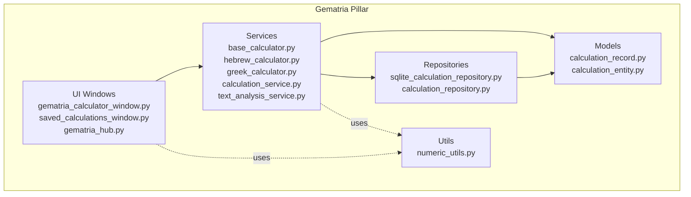
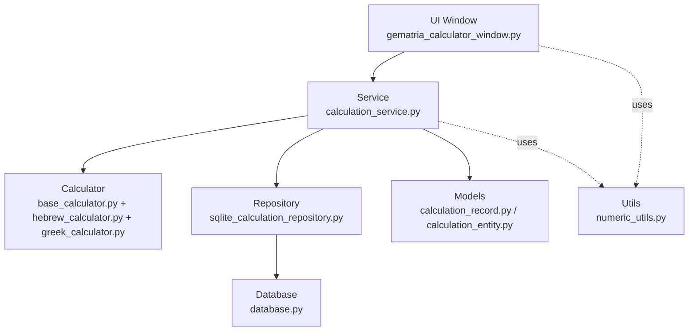
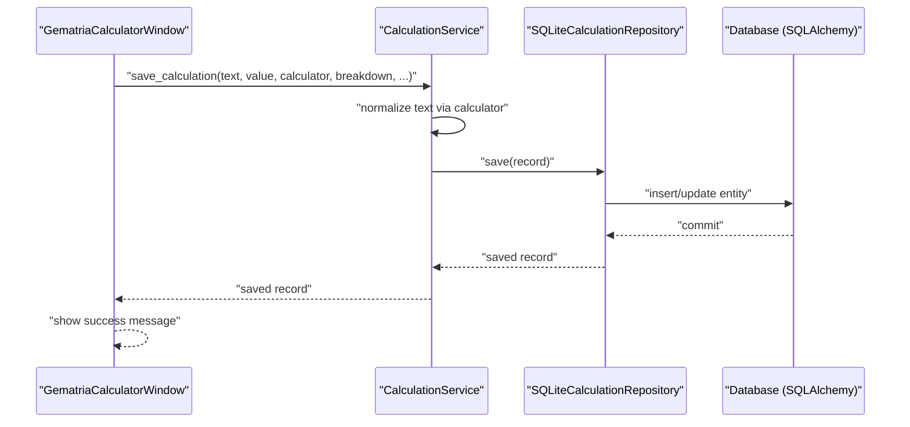
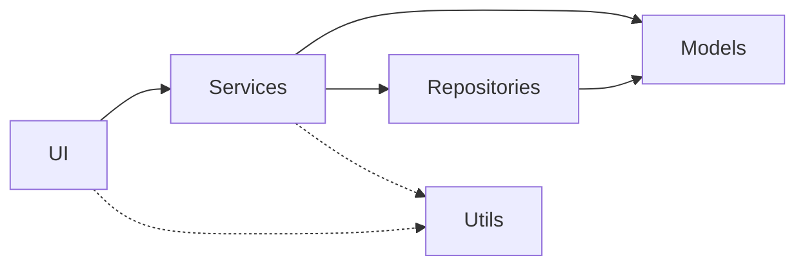

# Component Layer Architecture

<cite>
**Referenced Files in This Document**
- [ARCHITECTURE.md](file://config/ARCHITECTURE.md)
- [ARCHITECTURE_DIAGRAM.txt](file://config/ARCHITECTURE_DIAGRAM.txt)
- [gematria_hub.py](file://src/pillars/gematria/ui/gematria_hub.py)
- [gematria_calculator_window.py](file://src/pillars/gematria/ui/gematria_calculator_window.py)
- [saved_calculations_window.py](file://src/pillars/gematria/ui/saved_calculations_window.py)
- [base_calculator.py](file://src/pillars/gematria/services/base_calculator.py)
- [hebrew_calculator.py](file://src/pillars/gematria/services/hebrew_calculator.py)
- [greek_calculator.py](file://src/pillars/gematria/services/greek_calculator.py)
- [text_analysis_service.py](file://src/pillars/gematria/services/text_analysis_service.py)
- [calculation_service.py](file://src/pillars/gematria/services/calculation_service.py)
- [sqlite_calculation_repository.py](file://src/pillars/gematria/repositories/sqlite_calculation_repository.py)
- [calculation_repository.py](file://src/pillars/gematria/repositories/calculation_repository.py)
- [calculation_record.py](file://src/pillars/gematria/models/calculation_record.py)
- [calculation_entity.py](file://src/pillars/gematria/models/calculation_entity.py)
- [database.py](file://src/shared/database.py)
- [numeric_utils.py](file://src/pillars/gematria/utils/numeric_utils.py)
</cite>

## Table of Contents
1. [Introduction](#introduction)
2. [Project Structure](#project-structure)
3. [Core Components](#core-components)
4. [Architecture Overview](#architecture-overview)
5. [Detailed Component Analysis](#detailed-component-analysis)
6. [Dependency Analysis](#dependency-analysis)
7. [Performance Considerations](#performance-considerations)
8. [Troubleshooting Guide](#troubleshooting-guide)
9. [Conclusion](#conclusion)
10. [Appendices](#appendices)

## Introduction
This document explains the consistent five-layer component architecture used across all pillars in the isopgem application. The layers are:
- UI (presentation layer with PyQt6 components)
- Services (business logic and core functionality)
- Models (data structures and domain entities)
- Repositories (data persistence and storage access)
- Utils (helper functions and shared utilities)

We use the Gematria pillar as the primary example to demonstrate how requests flow from the UI through the service layer to the repository and back, and how models are shared across layers. We also discuss the benefits of this layered approach for maintainability, testability, and separation of concerns, and provide guidance on organizing new code within this pattern.

## Project Structure
The repository follows a consistent structure per pillar:
- ui/: PyQt6-based interface components
- services/: business logic and core functionality
- models/: data structures and type definitions
- repositories/: data access and persistence
- utils/: helper functions and utilities

The Gematria pillar demonstrates this pattern with calculators, services, models, repositories, and UI windows.

**Diagram sources**
- [gematria_hub.py](file://src/pillars/gematria/ui/gematria_hub.py#L1-L120)
- [gematria_calculator_window.py](file://src/pillars/gematria/ui/gematria_calculator_window.py#L1-L120)
- [saved_calculations_window.py](file://src/pillars/gematria/ui/saved_calculations_window.py#L1-L120)
- [base_calculator.py](file://src/pillars/gematria/services/base_calculator.py#L1-L107)
- [hebrew_calculator.py](file://src/pillars/gematria/services/hebrew_calculator.py#L1-L120)
- [greek_calculator.py](file://src/pillars/gematria/services/greek_calculator.py#L1-L120)
- [calculation_service.py](file://src/pillars/gematria/services/calculation_service.py#L1-L120)
- [sqlite_calculation_repository.py](file://src/pillars/gematria/repositories/sqlite_calculation_repository.py#L1-L80)
- [calculation_repository.py](file://src/pillars/gematria/repositories/calculation_repository.py#L1-L80)
- [calculation_record.py](file://src/pillars/gematria/models/calculation_record.py#L1-L89)
- [calculation_entity.py](file://src/pillars/gematria/models/calculation_entity.py#L1-L65)
- [numeric_utils.py](file://src/pillars/gematria/utils/numeric_utils.py#L1-L22)

**Section sources**
- [ARCHITECTURE.md](file://config/ARCHITECTURE.md#L32-L51)
- [ARCHITECTURE_DIAGRAM.txt](file://config/ARCHITECTURE_DIAGRAM.txt#L42-L84)

## Core Components
- UI: PyQt6-based windows and hubs that orchestrate user interactions and delegate work to services.
- Services: Business logic and calculators that encapsulate domain operations and coordinate repositories.
- Models: Data structures and entities that define the shape of persisted and in-memory data.
- Repositories: Storage access implementations that abstract persistence mechanisms.
- Utils: Shared helper functions used across services and UI.

Responsibilities and boundaries:
- UI: Presentation, user input capture, and orchestrating service calls. It does not directly touch persistence.
- Services: Encapsulate business rules, coordinate calculators, and manage data transformations between models and repositories.
- Models: Define data contracts and conversion helpers between records and entities.
- Repositories: Implement CRUD and queries against storage, abstracting the underlying technology.
- Utils: Provide reusable utilities without side effects.

**Section sources**
- [ARCHITECTURE.md](file://config/ARCHITECTURE.md#L32-L51)
- [gematria_calculator_window.py](file://src/pillars/gematria/ui/gematria_calculator_window.py#L1-L120)
- [calculation_service.py](file://src/pillars/gematria/services/calculation_service.py#L1-L120)
- [calculation_record.py](file://src/pillars/gematria/models/calculation_record.py#L1-L89)
- [sqlite_calculation_repository.py](file://src/pillars/gematria/repositories/sqlite_calculation_repository.py#L1-L80)
- [numeric_utils.py](file://src/pillars/gematria/utils/numeric_utils.py#L1-L22)

## Architecture Overview
The dependency flow is strictly layered: UI → Services → Repositories. Models are shared across layers to ensure consistent data contracts.

**Diagram sources**
- [gematria_calculator_window.py](file://src/pillars/gematria/ui/gematria_calculator_window.py#L1-L120)
- [calculation_service.py](file://src/pillars/gematria/services/calculation_service.py#L1-L120)
- [base_calculator.py](file://src/pillars/gematria/services/base_calculator.py#L1-L107)
- [hebrew_calculator.py](file://src/pillars/gematria/services/hebrew_calculator.py#L1-L120)
- [greek_calculator.py](file://src/pillars/gematria/services/greek_calculator.py#L1-L120)
- [sqlite_calculation_repository.py](file://src/pillars/gematria/repositories/sqlite_calculation_repository.py#L1-L80)
- [database.py](file://src/shared/database.py#L1-L53)
- [calculation_record.py](file://src/pillars/gematria/models/calculation_record.py#L1-L89)
- [calculation_entity.py](file://src/pillars/gematria/models/calculation_entity.py#L1-L65)
- [numeric_utils.py](file://src/pillars/gematria/utils/numeric_utils.py#L1-L22)

## Detailed Component Analysis

### UI Layer: Gematria Calculator Window
The calculator window captures user input, selects a calculator, computes values, and saves results via the service layer. It does not directly access repositories.

Key responsibilities:
- Build and manage the GUI
- Capture text input and trigger calculations
- Present results and enable saving
- Manage virtual keyboard integration

Example flow:
- User enters text and clicks Calculate
- The window calls the selected calculator’s compute methods
- The window invokes the service to save the calculation
- The service persists via the repository

**Section sources**
- [gematria_calculator_window.py](file://src/pillars/gematria/ui/gematria_calculator_window.py#L1-L120)
- [gematria_calculator_window.py](file://src/pillars/gematria/ui/gematria_calculator_window.py#L341-L500)

### Services Layer: CalculationService and Calculators
CalculationService coordinates saving, updating, searching, and retrieving calculations. It depends on a repository abstraction and uses calculators to normalize text and compute values.

Key responsibilities:
- Persist and retrieve calculation records
- Update metadata and toggle favorites
- Search and filter calculations
- Convert between records and entities

Calculator hierarchy:
- Base calculator defines normalization and core methods
- Concrete calculators implement letter mappings for Hebrew and Greek systems

**Section sources**
- [calculation_service.py](file://src/pillars/gematria/services/calculation_service.py#L1-L120)
- [calculation_service.py](file://src/pillars/gematria/services/calculation_service.py#L120-L273)
- [base_calculator.py](file://src/pillars/gematria/services/base_calculator.py#L1-L107)
- [hebrew_calculator.py](file://src/pillars/gematria/services/hebrew_calculator.py#L1-L120)
- [greek_calculator.py](file://src/pillars/gematria/services/greek_calculator.py#L1-L120)

### Models Layer: Records and Entities
Two model representations are used:
- CalculationRecord: in-memory data structure with convenience methods
- CalculationEntity: SQLAlchemy ORM entity for persistence

Responsibilities:
- Define fields and relationships
- Provide conversion helpers between record and entity
- Support JSON serialization for breakdowns

**Section sources**
- [calculation_record.py](file://src/pillars/gematria/models/calculation_record.py#L1-L89)
- [calculation_entity.py](file://src/pillars/gematria/models/calculation_entity.py#L1-L65)

### Repositories Layer: SQLite and Whoosh
Two repository implementations illustrate different storage strategies:
- SQLiteCalculationRepository: SQLAlchemy ORM-backed persistence
- CalculationRepository: Whoosh-based indexing and search

Responsibilities:
- CRUD operations
- Search and filtering
- Efficient pagination and sorting

**Section sources**
- [sqlite_calculation_repository.py](file://src/pillars/gematria/repositories/sqlite_calculation_repository.py#L1-L143)
- [calculation_repository.py](file://src/pillars/gematria/repositories/calculation_repository.py#L1-L120)

### Utils Layer: Numeric Utilities
Reusable helpers for numeric parsing and aggregation.

**Section sources**
- [numeric_utils.py](file://src/pillars/gematria/utils/numeric_utils.py#L1-L22)

### Example Flow: Save a Calculation (UI → Service → Repository)
This sequence shows how a calculation request flows through the layers:

**Diagram sources**
- [gematria_calculator_window.py](file://src/pillars/gematria/ui/gematria_calculator_window.py#L443-L500)
- [calculation_service.py](file://src/pillars/gematria/services/calculation_service.py#L23-L79)
- [sqlite_calculation_repository.py](file://src/pillars/gematria/repositories/sqlite_calculation_repository.py#L37-L55)
- [database.py](file://src/shared/database.py#L1-L53)

## Dependency Analysis
Layered dependencies:
- UI depends on Services
- Services depend on Models and Repositories
- Repositories depend on Models and storage
- Utils are consumed by UI and Services

**Diagram sources**
- [gematria_calculator_window.py](file://src/pillars/gematria/ui/gematria_calculator_window.py#L1-L120)
- [calculation_service.py](file://src/pillars/gematria/services/calculation_service.py#L1-L120)
- [sqlite_calculation_repository.py](file://src/pillars/gematria/repositories/sqlite_calculation_repository.py#L1-L80)
- [calculation_record.py](file://src/pillars/gematria/models/calculation_record.py#L1-L89)
- [calculation_entity.py](file://src/pillars/gematria/models/calculation_entity.py#L1-L65)
- [numeric_utils.py](file://src/pillars/gematria/utils/numeric_utils.py#L1-L22)

**Section sources**
- [gematria_hub.py](file://src/pillars/gematria/ui/gematria_hub.py#L1-L120)
- [gematria_calculator_window.py](file://src/pillars/gematria/ui/gematria_calculator_window.py#L1-L120)
- [calculation_service.py](file://src/pillars/gematria/services/calculation_service.py#L1-L120)
- [sqlite_calculation_repository.py](file://src/pillars/gematria/repositories/sqlite_calculation_repository.py#L1-L80)
- [calculation_record.py](file://src/pillars/gematria/models/calculation_record.py#L1-L89)
- [calculation_entity.py](file://src/pillars/gematria/models/calculation_entity.py#L1-L65)
- [numeric_utils.py](file://src/pillars/gematria/utils/numeric_utils.py#L1-L22)

## Performance Considerations
- Prefer lightweight summaries during pagination to reduce payload size.
- Normalize text once per calculation to avoid repeated work.
- Use efficient search strategies (e.g., pre-tokenization) in services for large texts.
- Minimize ORM overhead by batching writes and using appropriate indexes.

[No sources needed since this section provides general guidance]

## Troubleshooting Guide
Common issues and resolutions:
- Saving fails due to database errors: Ensure the database is initialized and sessions are committed/rolled back appropriately.
- Search returns empty results: Verify filters and query construction in the repository.
- UI not reflecting updates: Confirm that the service updates timestamps and that the UI refreshes views after repository operations.

**Section sources**
- [sqlite_calculation_repository.py](file://src/pillars/gematria/repositories/sqlite_calculation_repository.py#L22-L40)
- [calculation_repository.py](file://src/pillars/gematria/repositories/calculation_repository.py#L118-L155)
- [gematria_calculator_window.py](file://src/pillars/gematria/ui/gematria_calculator_window.py#L443-L500)

## Conclusion
The five-layer architecture enforces clear separation of concerns, improves testability, and simplifies maintenance. By keeping UI, Services, Models, Repositories, and Utils cohesive and loosely coupled, the system remains extensible and robust. The Gematria pillar exemplifies this pattern, demonstrating how UI triggers services, services coordinate calculators and repositories, and models unify data contracts across layers.

[No sources needed since this section summarizes without analyzing specific files]

## Appendices

### How to Organize New Code Within This Pattern
- UI: Create a new window under ui/; instantiate services and delegate work; avoid direct persistence.
- Services: Implement business logic and orchestration; accept repositories via constructor or DI; convert between records and entities.
- Models: Define data contracts; provide conversion helpers; keep fields explicit and typed.
- Repositories: Implement CRUD and queries; abstract storage technology; handle transactions and errors.
- Utils: Place reusable helpers here; avoid side effects; keep pure functions when possible.

**Section sources**
- [ARCHITECTURE.md](file://config/ARCHITECTURE.md#L32-L51)
- [gematria_hub.py](file://src/pillars/gematria/ui/gematria_hub.py#L1-L120)
- [calculation_service.py](file://src/pillars/gematria/services/calculation_service.py#L1-L120)
- [sqlite_calculation_repository.py](file://src/pillars/gematria/repositories/sqlite_calculation_repository.py#L1-L80)
- [calculation_record.py](file://src/pillars/gematria/models/calculation_record.py#L1-L89)
- [calculation_entity.py](file://src/pillars/gematria/models/calculation_entity.py#L1-L65)
- [numeric_utils.py](file://src/pillars/gematria/utils/numeric_utils.py#L1-L22)