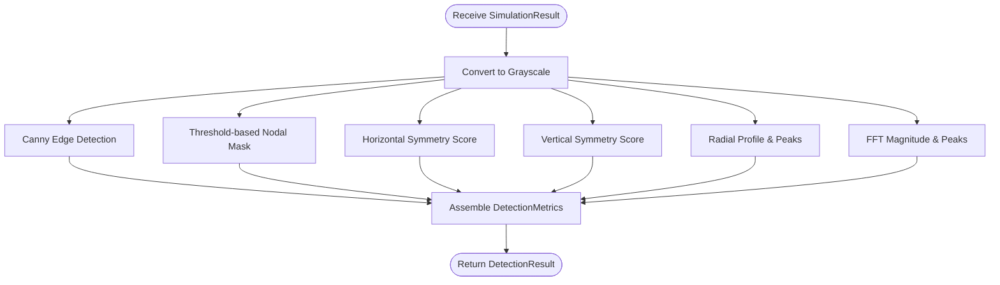

# Cymatics Pillar

<cite>
**Referenced Files in This Document**
- [__init__.py](file://src/pillars/cymatics/__init__.py)
- [cymatics_models.py](file://src/pillars/cymatics/models/cymatics_models.py)
- [cymatics_simulation_service.py](file://src/pillars/cymatics/services/cymatics_simulation_service.py)
- [cymatics_detection_service.py](file://src/pillars/cymatics/services/cymatics_detection_service.py)
- [cymatics_gradient_service.py](file://src/pillars/cymatics/services/cymatics_gradient_service.py)
- [cymatics_export_service.py](file://src/pillars/cymatics/services/cymatics_export_service.py)
- [cymatics_preset_service.py](file://src/pillars/cymatics/services/cymatics_preset_service.py)
- [cymatics_particle_service.py](file://src/pillars/cymatics/services/cymatics_particle_service.py)
- [cymatics_hub.py](file://src/pillars/cymatics/ui/cymatics_hub.py)
- [cymatics_simulator_window.py](file://src/pillars/cymatics/ui/cymatics_simulator_window.py)
- [cymatics_detector_window.py](file://src/pillars/cymatics/ui/cymatics_detector_window.py)
- [cymatics_3d_view.py](file://src/pillars/cymatics/ui/cymatics_3d_view.py)
- [cymatics_particle_view.py](file://src/pillars/cymatics/ui/cymatics_particle_view.py)
- [CYMATICS_GENERATOR_HELP.md](file://docs/features/CYMATICS_GENERATOR_HELP.md)
</cite>

## Table of Contents
1. [Introduction](#introduction)
2. [Project Structure](#project-structure)
3. [Core Components](#core-components)
4. [Architecture Overview](#architecture-overview)
5. [Detailed Component Analysis](#detailed-component-analysis)
6. [Dependency Analysis](#dependency-analysis)
7. [Performance Considerations](#performance-considerations)
8. [Troubleshooting Guide](#troubleshooting-guide)
9. [Conclusion](#conclusion)

## Introduction
The Cymatics Pillar provides a comprehensive platform for simulating and analyzing vibrational standing-wave patterns on various plate geometries. It enables researchers and practitioners to explore Chladni patterns, study nodal structures, and visualize dynamic phenomena through interactive tools. The system integrates numerical simulation, real-time particle physics, advanced visualization, and robust export capabilities.

## Project Structure
The Cymatics Pillar is organized into distinct layers:
- Models: Define core data structures and enumerations for shapes, materials, gradients, and simulation parameters.
- Services: Implement simulation, detection, gradient mapping, particle dynamics, preset management, and export functionality.
- UI: Provide interactive windows for simulation, detection, 3D visualization, and particle overlays.

**Diagram sources**
- [cymatics_hub.py](file://src/pillars/cymatics/ui/cymatics_hub.py#L28-L246)
- [cymatics_simulator_window.py](file://src/pillars/cymatics/ui/cymatics_simulator_window.py#L67-L800)
- [cymatics_detector_window.py](file://src/pillars/cymatics/ui/cymatics_detector_window.py#L28-L263)
- [cymatics_3d_view.py](file://src/pillars/cymatics/ui/cymatics_3d_view.py#L51-L337)
- [cymatics_particle_view.py](file://src/pillars/cymatics/ui/cymatics_particle_view.py#L18-L161)
- [cymatics_simulation_service.py](file://src/pillars/cymatics/services/cymatics_simulation_service.py#L39-L504)
- [cymatics_gradient_service.py](file://src/pillars/cymatics/services/cymatics_gradient_service.py#L18-L180)
- [cymatics_particle_service.py](file://src/pillars/cymatics/services/cymatics_particle_service.py#L15-L198)
- [cymatics_preset_service.py](file://src/pillars/cymatics/services/cymatics_preset_service.py#L24-L267)
- [cymatics_export_service.py](file://src/pillars/cymatics/services/cymatics_export_service.py#L20-L234)
- [cymatics_detection_service.py](file://src/pillars/cymatics/services/cymatics_detection_service.py#L13-L95)
- [cymatics_models.py](file://src/pillars/cymatics/models/cymatics_models.py#L11-L391)

**Section sources**
- [__init__.py](file://src/pillars/cymatics/__init__.py#L1-L2)
- [cymatics_models.py](file://src/pillars/cymatics/models/cymatics_models.py#L11-L391)
- [cymatics_simulation_service.py](file://src/pillars/cymatics/services/cymatics_simulation_service.py#L39-L504)
- [cymatics_detection_service.py](file://src/pillars/cymatics/services/cymatics_detection_service.py#L13-L95)
- [cymatics_gradient_service.py](file://src/pillars/cymatics/services/cymatics_gradient_service.py#L18-L180)
- [cymatics_export_service.py](file://src/pillars/cymatics/services/cymatics_export_service.py#L20-L234)
- [cymatics_preset_service.py](file://src/pillars/cymatics/services/cymatics_preset_service.py#L24-L267)
- [cymatics_particle_service.py](file://src/pillars/cymatics/services/cymatics_particle_service.py#L15-L198)
- [cymatics_hub.py](file://src/pillars/cymatics/ui/cymatics_hub.py#L28-L246)
- [cymatics_simulator_window.py](file://src/pillars/cymatics/ui/cymatics_simulator_window.py#L67-L800)
- [cymatics_detector_window.py](file://src/pillars/cymatics/ui/cymatics_detector_window.py#L28-L263)
- [cymatics_3d_view.py](file://src/pillars/cymatics/ui/cymatics_3d_view.py#L51-L337)
- [cymatics_particle_view.py](file://src/pillars/cymatics/ui/cymatics_particle_view.py#L18-L161)

## Core Components
- Simulation Engine: Generates standing-wave fields for rectangular, circular (Chladni), hexagonal, heptagonal, and custom polygon plates. Supports manual mode selection and frequency-based driving with material-aware corrections.
- Detection Engine: Extracts metrics (symmetry, edge density, radial peaks, dominant frequencies) and produces nodal masks and edge maps from simulation outputs.
- Visualization Services: Provides color gradient mapping, 3D surface rendering, and particle overlay rendering with motion trails and statistics.
- Export Pipeline: Saves single-frame images (PNG/JPEG/BMP), captures widget snapshots, exports frame sequences, and creates animated GIFs.
- Preset Management: Stores and retrieves user-defined parameter sets with versioning and metadata.
- UI Hub: Orchestrates tool access, simulator, detector, and help resources.

**Section sources**
- [cymatics_models.py](file://src/pillars/cymatics/models/cymatics_models.py#L11-L391)
- [cymatics_simulation_service.py](file://src/pillars/cymatics/services/cymatics_simulation_service.py#L39-L504)
- [cymatics_detection_service.py](file://src/pillars/cymatics/services/cymatics_detection_service.py#L13-L95)
- [cymatics_gradient_service.py](file://src/pillars/cymatics/services/cymatics_gradient_service.py#L18-L180)
- [cymatics_export_service.py](file://src/pillars/cymatics/services/cymatics_export_service.py#L20-L234)
- [cymatics_preset_service.py](file://src/pillars/cymatics/services/cymatics_preset_service.py#L24-L267)
- [cymatics_particle_service.py](file://src/pillars/cymatics/services/cymatics_particle_service.py#L15-L198)
- [cymatics_hub.py](file://src/pillars/cymatics/ui/cymatics_hub.py#L28-L246)

## Architecture Overview
The system follows a layered architecture with clear separation of concerns:
- UI Layer: Presents interactive tools and visualizations.
- Services Layer: Encapsulates domain logic for simulation, detection, visualization, and persistence.
- Models Layer: Defines shared data structures and enumerations.

**Diagram sources**
- [cymatics_hub.py](file://src/pillars/cymatics/ui/cymatics_hub.py#L197-L211)
- [cymatics_simulator_window.py](file://src/pillars/cymatics/ui/cymatics_simulator_window.py#L86-L114)
- [cymatics_simulation_service.py](file://src/pillars/cymatics/services/cymatics_simulation_service.py#L80-L121)
- [cymatics_gradient_service.py](file://src/pillars/cymatics/services/cymatics_gradient_service.py#L62-L86)
- [cymatics_particle_service.py](file://src/pillars/cymatics/services/cymatics_particle_service.py#L35-L88)
- [cymatics_3d_view.py](file://src/pillars/cymatics/ui/cymatics_3d_view.py#L91-L95)
- [cymatics_particle_view.py](file://src/pillars/cymatics/ui/cymatics_particle_view.py#L48-L58)

## Detailed Component Analysis

### Simulation Engine
The simulation engine computes standing-wave fields across multiple plate geometries:
- Rectangular: Sine-based modes in two directions with optional secondary mode interference.
- Circular (Chladni): Bessel function modes in polar coordinates with radial and angular components.
- Hexagonal: Three-fold symmetric superposition of rotated sine waves.
- Heptagonal: Polygonal modes with radial and angular components adapted for seven-fold symmetry.
- Custom Polygon: Rectangular modes masked to arbitrary polygon boundaries.

Key features:
- Frequency-to-mode mapping with material-aware corrections using wave speed factors.
- Damping envelopes for radial and grid-based attenuation.
- Boundary masks for collision detection and particle confinement.
- Height map generation for 3D visualization.

**Diagram sources**
- [cymatics_simulation_service.py](file://src/pillars/cymatics/services/cymatics_simulation_service.py#L51-L121)
- [cymatics_simulation_service.py](file://src/pillars/cymatics/services/cymatics_simulation_service.py#L221-L435)
- [cymatics_models.py](file://src/pillars/cymatics/models/cymatics_models.py#L281-L358)

**Section sources**
- [cymatics_simulation_service.py](file://src/pillars/cymatics/services/cymatics_simulation_service.py#L39-L504)
- [cymatics_models.py](file://src/pillars/cymatics/models/cymatics_models.py#L11-L391)

### Detection Engine
The detection engine analyzes simulation outputs to extract meaningful metrics:
- Edge detection using Canny edge detection on grayscale intensities.
- Nodal mask generation below a configurable threshold.
- Symmetry assessment along horizontal and vertical axes.
- Radial profile extraction and peak detection for angular symmetry.
- Dominant spatial frequency analysis via FFT magnitude.

**Diagram sources**
- [cymatics_detection_service.py](file://src/pillars/cymatics/services/cymatics_detection_service.py#L16-L36)
- [cymatics_detection_service.py](file://src/pillars/cymatics/services/cymatics_detection_service.py#L38-L95)

**Section sources**
- [cymatics_detection_service.py](file://src/pillars/cymatics/services/cymatics_detection_service.py#L13-L95)

### Visualization Services
Visualization encompasses color mapping, 3D rendering, and particle overlays:
- Color Gradient Service: Applies predefined palettes (grayscale, heat map, ocean, plasma, viridis) or custom gradients to normalized amplitude arrays.
- 3D View: Software-rendered height-mapped surfaces with orbital camera, lighting, and wireframe options.
- Particle View: Transparent overlay rendering settled (gold) and moving (gray) particles with optional motion trails and statistics.

**Diagram sources**
- [cymatics_gradient_service.py](file://src/pillars/cymatics/services/cymatics_gradient_service.py#L18-L180)
- [cymatics_3d_view.py](file://src/pillars/cymatics/ui/cymatics_3d_view.py#L51-L337)
- [cymatics_particle_view.py](file://src/pillars/cymatics/ui/cymatics_particle_view.py#L18-L161)

**Section sources**
- [cymatics_gradient_service.py](file://src/pillars/cymatics/services/cymatics_gradient_service.py#L18-L180)
- [cymatics_3d_view.py](file://src/pillars/cymatics/ui/cymatics_3d_view.py#L51-L337)
- [cymatics_particle_view.py](file://src/pillars/cymatics/ui/cymatics_particle_view.py#L18-L161)

### Export Pipeline
The export pipeline supports multiple formats and workflows:
- Single-frame export: Saves current pattern as PNG/JPEG/BMP with applied gradient.
- Widget snapshot: Captures the current UI state for documentation or sharing.
- Frame sequence: Generates a series of PNG frames for external animation tools.
- Animated GIF: Produces looping animations with configurable frame rate and duration.

**Diagram sources**
- [cymatics_export_service.py](file://src/pillars/cymatics/services/cymatics_export_service.py#L32-L81)
- [cymatics_export_service.py](file://src/pillars/cymatics/services/cymatics_export_service.py#L150-L214)
- [cymatics_gradient_service.py](file://src/pillars/cymatics/services/cymatics_gradient_service.py#L62-L86)

**Section sources**
- [cymatics_export_service.py](file://src/pillars/cymatics/services/cymatics_export_service.py#L20-L234)

### Preset Management
Preset management enables reproducible configurations:
- Save: Serializes SimulationParams into JSON with enum conversion and metadata.
- Load: Deserializes JSON into CymaticsPreset with robust error handling.
- List/Delete: Manages preset catalog and lifecycle.
- Built-in Presets: Includes classic Chladni, hexagonal harmony, high-frequency, and ocean waves configurations.

**Diagram sources**
- [cymatics_preset_service.py](file://src/pillars/cymatics/services/cymatics_preset_service.py#L48-L73)
- [cymatics_preset_service.py](file://src/pillars/cymatics/services/cymatics_preset_service.py#L74-L94)
- [cymatics_preset_service.py](file://src/pillars/cymatics/services/cymatics_preset_service.py#L150-L198)

**Section sources**
- [cymatics_preset_service.py](file://src/pillars/cymatics/services/cymatics_preset_service.py#L24-L267)

### UI Components
The UI layer provides an integrated experience:
- Cymatics Hub: Central launcher for simulator, detector, and help.
- Simulator Window: Three-pane layout with parameter controls, visualization viewport, and action panel. Supports animation, audio playback, particle simulation, and export.
- Detector Window: Real-time analysis of the last simulation output with adjustable nodal threshold and view selection.
- 3D View and Particle View: Specialized widgets for immersive visualization and particle dynamics.

**Diagram sources**
- [cymatics_hub.py](file://src/pillars/cymatics/ui/cymatics_hub.py#L28-L246)
- [cymatics_simulator_window.py](file://src/pillars/cymatics/ui/cymatics_simulator_window.py#L67-L800)
- [cymatics_detector_window.py](file://src/pillars/cymatics/ui/cymatics_detector_window.py#L28-L263)
- [cymatics_3d_view.py](file://src/pillars/cymatics/ui/cymatics_3d_view.py#L51-L337)
- [cymatics_particle_view.py](file://src/pillars/cymatics/ui/cymatics_particle_view.py#L18-L161)

**Section sources**
- [cymatics_hub.py](file://src/pillars/cymatics/ui/cymatics_hub.py#L28-L246)
- [cymatics_simulator_window.py](file://src/pillars/cymatics/ui/cymatics_simulator_window.py#L67-L800)
- [cymatics_detector_window.py](file://src/pillars/cymatics/ui/cymatics_detector_window.py#L28-L263)

## Dependency Analysis
The components exhibit low coupling and high cohesion:
- Services depend on models for shared data structures.
- UI components depend on services for functionality and on models for state representation.
- Visualization services are reusable across UI components.

**Diagram sources**
- [cymatics_models.py](file://src/pillars/cymatics/models/cymatics_models.py#L11-L391)
- [cymatics_simulation_service.py](file://src/pillars/cymatics/services/cymatics_simulation_service.py#L14-L14)
- [cymatics_gradient_service.py](file://src/pillars/cymatics/services/cymatics_gradient_service.py#L12-L12)
- [cymatics_particle_service.py](file://src/pillars/cymatics/services/cymatics_particle_service.py#L12-L12)
- [cymatics_preset_service.py](file://src/pillars/cymatics/services/cymatics_preset_service.py#L16-L21)
- [cymatics_export_service.py](file://src/pillars/cymatics/services/cymatics_export_service.py#L16-L17)
- [cymatics_detection_service.py](file://src/pillars/cymatics/services/cymatics_detection_service.py#L10-L10)
- [cymatics_simulator_window.py](file://src/pillars/cymatics/ui/cymatics_simulator_window.py#L45-L64)
- [cymatics_detector_window.py](file://src/pillars/cymatics/ui/cymatics_detector_window.py#L23-L25)

**Section sources**
- [cymatics_models.py](file://src/pillars/cymatics/models/cymatics_models.py#L11-L391)
- [cymatics_simulation_service.py](file://src/pillars/cymatics/services/cymatics_simulation_service.py#L14-L14)
- [cymatics_gradient_service.py](file://src/pillars/cymatics/services/cymatics_gradient_service.py#L12-L12)
- [cymatics_particle_service.py](file://src/pillars/cymatics/services/cymatics_particle_service.py#L12-L12)
- [cymatics_preset_service.py](file://src/pillars/cymatics/services/cymatics_preset_service.py#L16-L21)
- [cymatics_export_service.py](file://src/pillars/cymatics/services/cymatics_export_service.py#L16-L17)
- [cymatics_detection_service.py](file://src/pillars/cymatics/services/cymatics_detection_service.py#L10-L10)
- [cymatics_simulator_window.py](file://src/pillars/cymatics/ui/cymatics_simulator_window.py#L45-L64)
- [cymatics_detector_window.py](file://src/pillars/cymatics/ui/cymatics_detector_window.py#L23-L25)

## Performance Considerations
- Simulation Resolution: Grid size directly impacts computation time and memory usage. Larger grids improve detail but increase cost.
- Particle Dynamics: Particle count and update frequency affect CPU utilization. Consider reducing count or increasing update intervals for smoother performance.
- 3D Rendering: Subsampling and face visibility toggles can significantly reduce draw time for large meshes.
- Gradient Application: Vectorized operations minimize overhead; custom gradients should avoid excessive interpolation steps.
- Export Workflows: GIF export requires external libraries and can be I/O bound; frame sequences offer more control for post-processing.

[No sources needed since this section provides general guidance]

## Troubleshooting Guide
Common issues and resolutions:
- Flat Pattern: Increase grid size and reduce damping to enhance amplitude contrast.
- Chaotic/Noisy Patterns: Lower mixing ratio and use lower modes to stabilize structure.
- Detector Edge Sensitivity: Use a still frame and adjust nodal threshold; lower modes yield cleaner edges.
- Particle Settlement: Allow more simulation steps or reduce particle count; verify boundary masks.
- 3D View Performance: Increase subsampling to reduce face count; disable wireframe if unnecessary.
- GIF Export Failure: Install the required library as indicated by the runtime error message.

**Section sources**
- [CYMATICS_GENERATOR_HELP.md](file://docs/features/CYMATICS_GENERATOR_HELP.md#L157-L167)

## Conclusion
The Cymatics Pillar delivers a powerful, extensible toolkit for simulating and analyzing vibrational patterns. Its modular design enables seamless integration of numerical computation, advanced visualization, and user-friendly interfaces. By leveraging material-aware simulations, robust detection metrics, and flexible export pipelines, it supports both educational exploration and research-grade analysis.