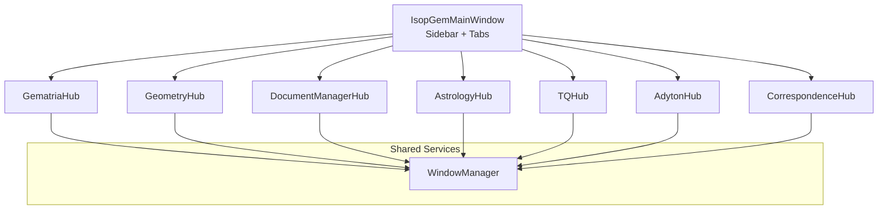
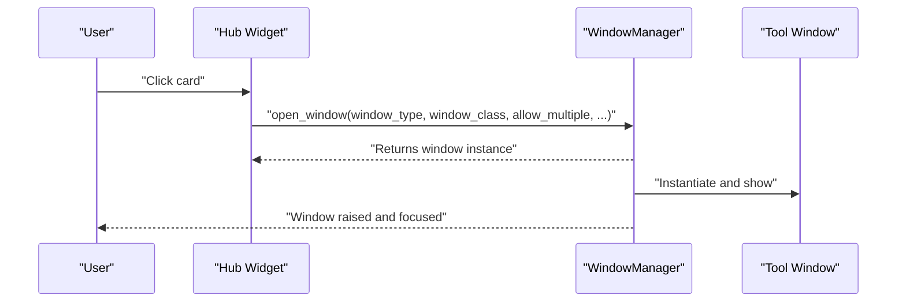
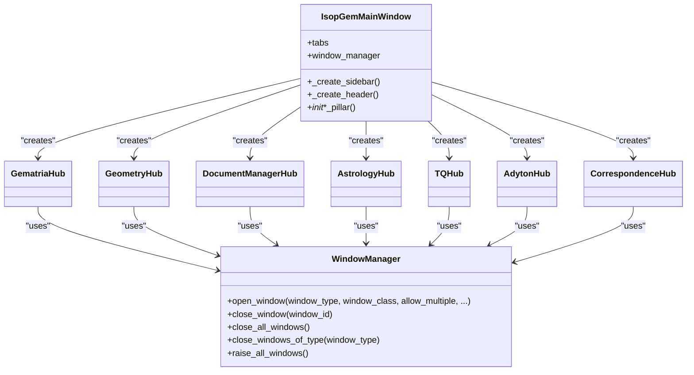

# Pillar Hub Card-Based Interface

<cite>
**Referenced Files in This Document**
- [main.py](file://src/main.py)
- [window_manager.py](file://src/shared/ui/window_manager.py)
- [geometry_hub.py](file://src/pillars/geometry/ui/geometry_hub.py)
- [gematria_hub.py](file://src/pillars/gematria/ui/gematria_hub.py)
- [document_manager_hub.py](file://src/pillars/document_manager/ui/document_manager_hub.py)
- [astrology_hub.py](file://src/pillars/astrology/ui/astrology_hub.py)
- [tq_hub.py](file://src/pillars/tq/ui/tq_hub.py)
- [correspondence_hub.py](file://src/pillars/correspondences/ui/correspondence_hub.py)
- [adyton_hub.py](file://src/pillars/adyton/ui/adyton_hub.py)
</cite>

## Table of Contents
1. [Introduction](#introduction)
2. [Project Structure](#project-structure)
3. [Core Components](#core-components)
4. [Architecture Overview](#architecture-overview)
5. [Detailed Component Analysis](#detailed-component-analysis)
6. [Dependency Analysis](#dependency-analysis)
7. [Performance Considerations](#performance-considerations)
8. [Troubleshooting Guide](#troubleshooting-guide)
9. [Conclusion](#conclusion)

## Introduction
This document describes the Pillar Hub Card-Based Interface used across the IsopGem application. Each “pillar” (domain area such as Geometry, Gematria, Documents, Astrology, Ternary Quadsets, Correspondences, and Adyton) exposes a hub page with a card-based launcher UI. These hubs share a consistent visual and interaction model: a scrollable header area, a grid of interactive cards, and a unified window management system that opens tool windows on demand.

The goal is to explain how the card-based interface is structured, how it integrates with the application’s window management, and how developers can extend or customize it for new pillars or tools.

## Project Structure
The application is organized around a main window with a sidebar and a tabbed content area. Each tab corresponds to a pillar hub. The hubs themselves are PyQt6 widgets that render a header and a grid of cards. A centralized window manager handles opening, tracking, and raising tool windows.

**Diagram sources**
- [main.py](file://src/main.py#L276-L331)
- [gematria_hub.py](file://src/pillars/gematria/ui/gematria_hub.py#L52-L144)
- [geometry_hub.py](file://src/pillars/geometry/ui/geometry_hub.py#L1-L120)
- [document_manager_hub.py](file://src/pillars/document_manager/ui/document_manager_hub.py#L16-L93)
- [astrology_hub.py](file://src/pillars/astrology/ui/astrology_hub.py#L16-L88)
- [tq_hub.py](file://src/pillars/tq/ui/tq_hub.py#L20-L133)
- [window_manager.py](file://src/shared/ui/window_manager.py#L15-L112)

**Section sources**
- [main.py](file://src/main.py#L276-L331)

## Core Components
- IsopGemMainWindow: Creates the sidebar, header, and tabbed content area. Initializes each pillar hub and wires navigation and header updates.
- WindowManager: Centralized window manager that opens tool windows, tracks them, and raises them when switching tabs.
- Hub Widgets: Each pillar hub is a QWidget subclass that builds a header and a grid of cards. Cards are clickable frames with icons, titles, and descriptions. On click, they delegate to the window manager to open a tool window.

Key responsibilities:
- Consistent card layout and styling across hubs.
- Unified click-to-open behavior via WindowManager.
- Optional quick tools section in the Geometry hub.

**Section sources**
- [main.py](file://src/main.py#L276-L331)
- [window_manager.py](file://src/shared/ui/window_manager.py#L15-L112)
- [gematria_hub.py](file://src/pillars/gematria/ui/gematria_hub.py#L145-L220)
- [geometry_hub.py](file://src/pillars/geometry/ui/geometry_hub.py#L1190-L1276)
- [document_manager_hub.py](file://src/pillars/document_manager/ui/document_manager_hub.py#L94-L163)
- [astrology_hub.py](file://src/pillars/astrology/ui/astrology_hub.py#L89-L158)
- [tq_hub.py](file://src/pillars/tq/ui/tq_hub.py#L134-L203)

## Architecture Overview
The card-based interface follows a layered pattern:
- Presentation layer: Hub widgets build headers and cards.
- Interaction layer: Cards trigger actions via callbacks.
- Application layer: WindowManager opens tool windows and manages their lifecycle.
- Navigation layer: MainWindow coordinates sidebar navigation and header updates.

**Diagram sources**
- [gematria_hub.py](file://src/pillars/gematria/ui/gematria_hub.py#L221-L271)
- [window_manager.py](file://src/shared/ui/window_manager.py#L29-L112)

## Detailed Component Analysis

### IsopGemMainWindow
- Creates the sidebar with navigation buttons and a header bar.
- Initializes each hub as a tab and sets up tab change handlers to update the header and raise windows.
- Uses a centralized WindowManager passed into each hub.

Implementation highlights:
- Sidebar navigation updates selection visuals and switches tabs.
- Header title reflects the active pillar.
- Tab change triggers WindowManager.raise_all_windows to keep tool windows visible.

**Section sources**
- [main.py](file://src/main.py#L102-L171)
- [main.py](file://src/main.py#L173-L237)
- [main.py](file://src/main.py#L244-L275)
- [main.py](file://src/main.py#L276-L331)

### WindowManager
- Manages tool windows with support for single-instance or multiple-instance modes.
- Generates unique IDs per window type when multiple windows are allowed.
- Tracks active windows and provides methods to close, query, and raise windows.
- Ensures windows are shown, raised, and activated when opened.

Behavioral notes:
- allow_multiple controls whether to reuse an existing window or create a new one.
- Titles can be auto-numbered for multiple instances.
- destroy events clean up internal tracking.

**Section sources**
- [window_manager.py](file://src/shared/ui/window_manager.py#L15-L112)
- [window_manager.py](file://src/shared/ui/window_manager.py#L113-L221)

### GematriaHub
- Header with title and description.
- Grid of tool cards for Calculator, Saved, Batch, Text Analysis, Database, and Reference.
- Each card is a styled QFrame with icon, title, description, and hover effects.
- Clicking a card delegates to WindowManager.open_window with appropriate parameters.

Card creation pattern:
- Frame with rounded borders and subtle shadows.
- Accent-colored icon container.
- Title and description labels with consistent typography.
- mousePressEvent wired to the card’s callback.

Opening patterns:
- Some windows allow multiple instances (e.g., calculator).
- Others enforce single instance (e.g., saved calculations, batch, database tools, text analysis, methods reference).

**Section sources**
- [gematria_hub.py](file://src/pillars/gematria/ui/gematria_hub.py#L52-L144)
- [gematria_hub.py](file://src/pillars/gematria/ui/gematria_hub.py#L145-L220)
- [gematria_hub.py](file://src/pillars/gematria/ui/gematria_hub.py#L221-L441)

### GeometryHub
- Header with title and description.
- Quick tools row below the header for frequently used tools.
- Category navigation panel with a list of shape categories.
- Content area that renders cards for shapes within the selected category.
- Menu panel lists items in the selected category.

Card creation pattern mirrors GematriaHub but with smaller quick cards and larger category cards.

Quick tools:
- Scientific Calculator
- Polygonal Numbers
- Experimental Stars
- 3D Figurate Numbers

Category navigation:
- Categories include Circles, Triangles, Quadrilaterals, Polygons, Pyramids, Prisms, Antiprisms, Platonic Solids, Archimedean Solids, and more.
- Each category defines a list of shapes or solids, some with factories, others with solid identifiers.

Content rendering:
- Renders shape cards dynamically based on the selected category.
- Provides a menu panel with items from the category definition.

**Section sources**
- [geometry_hub.py](file://src/pillars/geometry/ui/geometry_hub.py#L1-L120)
- [geometry_hub.py](file://src/pillars/geometry/ui/geometry_hub.py#L1190-L1276)
- [geometry_hub.py](file://src/pillars/geometry/ui/geometry_hub.py#L1278-L1389)

### DocumentManagerHub
- Header with title and description.
- Grid of tool cards for New Document, Library, Search, and Mindscape.
- Clicking a card opens the corresponding window via WindowManager.

Integration notes:
- Connects signals from the library/search windows to open documents in the editor.
- Uses document_service_context to load documents with images when requested.

**Section sources**
- [document_manager_hub.py](file://src/pillars/document_manager/ui/document_manager_hub.py#L16-L93)
- [document_manager_hub.py](file://src/pillars/document_manager/ui/document_manager_hub.py#L94-L163)
- [document_manager_hub.py](file://src/pillars/document_manager/ui/document_manager_hub.py#L165-L257)

### AstrologyHub
- Header with title and description.
- Grid of tool cards for Natal Chart, Transits, Positions, Eclipse Clock, and Venus Rose.
- Each card opens a dedicated window through WindowManager.

**Section sources**
- [astrology_hub.py](file://src/pillars/astrology/ui/astrology_hub.py#L16-L88)
- [astrology_hub.py](file://src/pillars/astrology/ui/astrology_hub.py#L89-L158)
- [astrology_hub.py](file://src/pillars/astrology/ui/astrology_hub.py#L160-L200)

### TQHub
- Header with title and description.
- Primary tools grid for Ternary Converter, Quadset Analysis, Transitions, Geometric Transitions (2D/3D), Conrune Finder, and Amun Sound.
- Kamea Grids section with Maut and Baphomet variants.
- Cards open specialized windows through WindowManager.

**Section sources**
- [tq_hub.py](file://src/pillars/tq/ui/tq_hub.py#L20-L133)
- [tq_hub.py](file://src/pillars/tq/ui/tq_hub.py#L134-L203)
- [tq_hub.py](file://src/pillars/tq/ui/tq_hub.py#L205-L280)

### CorrespondenceHub and AdytonHub
- Both follow the same card-based pattern as other hubs: header, grid of cards, and click-to-open behavior.
- AdytonHub also demonstrates compact wall viewer cards and a specialized engine integration.

**Section sources**
- [correspondence_hub.py](file://src/pillars/correspondences/ui/correspondence_hub.py#L260-L303)
- [adyton_hub.py](file://src/pillars/adyton/ui/adyton_hub.py#L16-L33)
- [adyton_hub.py](file://src/pillars/adyton/ui/adyton_hub.py#L188-L223)

## Dependency Analysis
- Hub widgets depend on WindowManager to open tool windows.
- MainWindow composes all hubs and passes a shared WindowManager instance.
- Each hub defines its own set of tools and callbacks, but the interaction model is consistent.

**Diagram sources**
- [main.py](file://src/main.py#L276-L331)
- [window_manager.py](file://src/shared/ui/window_manager.py#L15-L112)
- [gematria_hub.py](file://src/pillars/gematria/ui/gematria_hub.py#L52-L144)
- [geometry_hub.py](file://src/pillars/geometry/ui/geometry_hub.py#L1-L120)
- [document_manager_hub.py](file://src/pillars/document_manager/ui/document_manager_hub.py#L16-L93)
- [astrology_hub.py](file://src/pillars/astrology/ui/astrology_hub.py#L16-L88)
- [tq_hub.py](file://src/pillars/tq/ui/tq_hub.py#L20-L133)
- [adyton_hub.py](file://src/pillars/adyton/ui/adyton_hub.py#L16-L33)
- [correspondence_hub.py](file://src/pillars/correspondences/ui/correspondence_hub.py#L260-L303)

**Section sources**
- [main.py](file://src/main.py#L276-L331)
- [window_manager.py](file://src/shared/ui/window_manager.py#L15-L112)

## Performance Considerations
- Card rendering is lightweight and relies on Qt layouts; performance is primarily driven by the number of cards and their content.
- Using QScrollArea ensures smooth scrolling for long lists of cards.
- WindowManager avoids blocking the UI by showing and raising windows asynchronously.
- For hubs with dynamic content (e.g., Geometry category rendering), consider lazy-loading heavy content until a category is selected.

## Troubleshooting Guide
Common issues and resolutions:
- Multiple instances not opening: Verify allow_multiple flag in the hub’s open method.
- Window not focusing: Ensure WindowManager.show(), raise_(), and activateWindow() are executed after creation.
- Reused window not updating: For single-instance windows, ensure the window is brought to front and reactivated.
- Signal connection errors: When connecting signals from library/search windows, disconnect previous connections before reconnecting to prevent duplicates.

**Section sources**
- [window_manager.py](file://src/shared/ui/window_manager.py#L69-L112)
- [document_manager_hub.py](file://src/pillars/document_manager/ui/document_manager_hub.py#L165-L202)

## Conclusion
The Pillar Hub Card-Based Interface provides a consistent, scalable foundation for launching tools across domains. By standardizing card layout, styling, and interaction, the application maintains a cohesive user experience while enabling easy extension. The centralized WindowManager simplifies window lifecycle management, and the main window coordinates navigation and header state. Extending the interface involves adding new cards to an existing hub or creating a new hub with the same patterns.