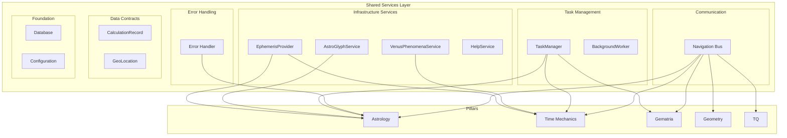
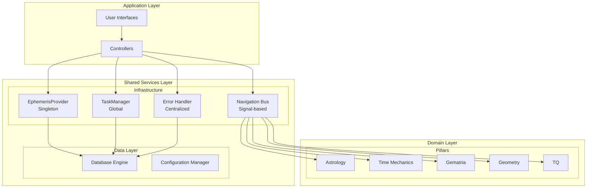
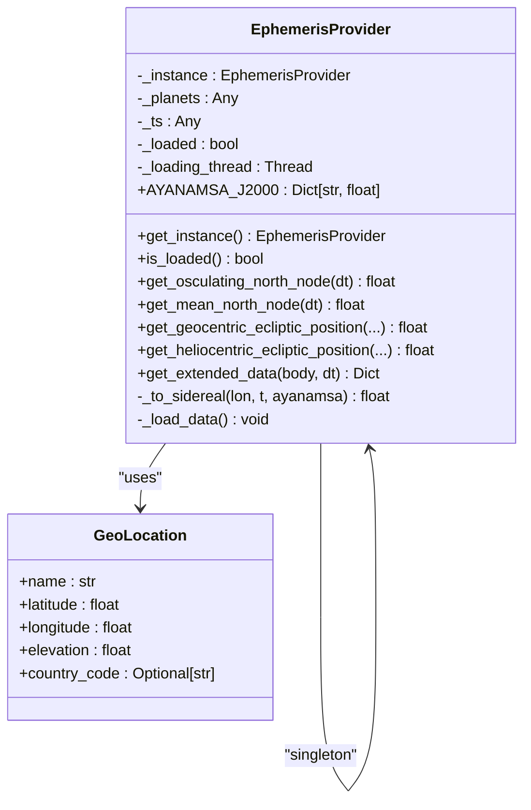
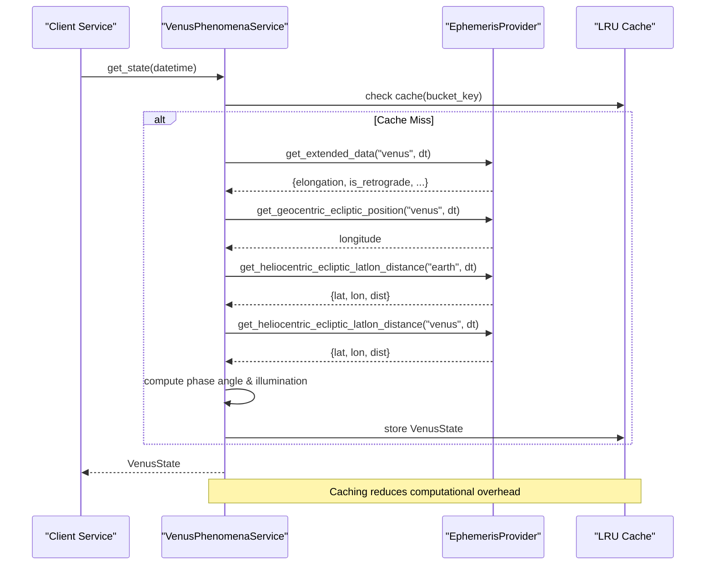
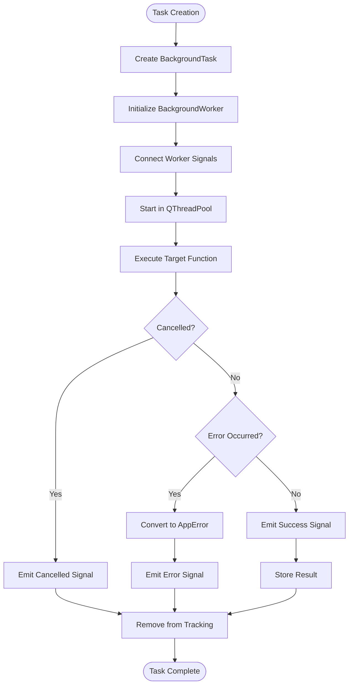
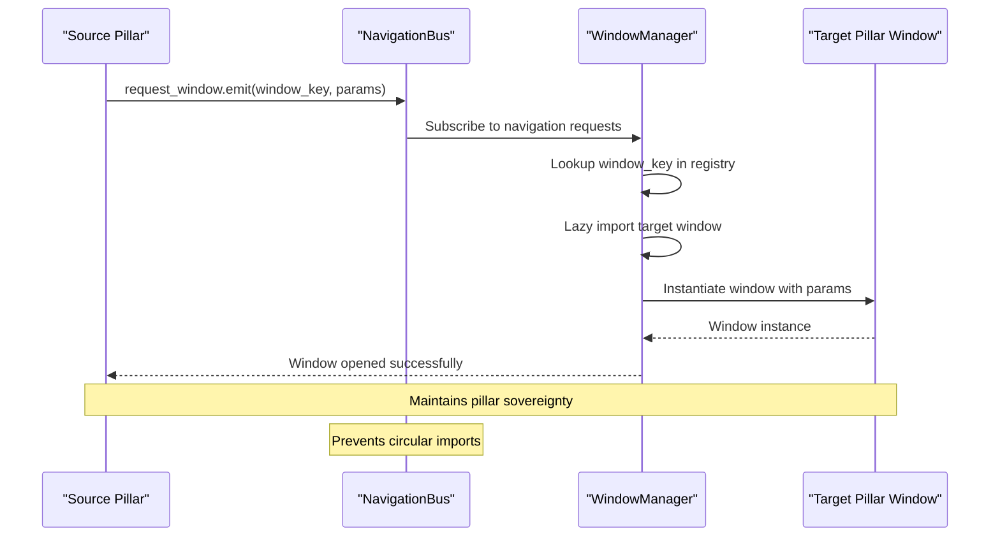
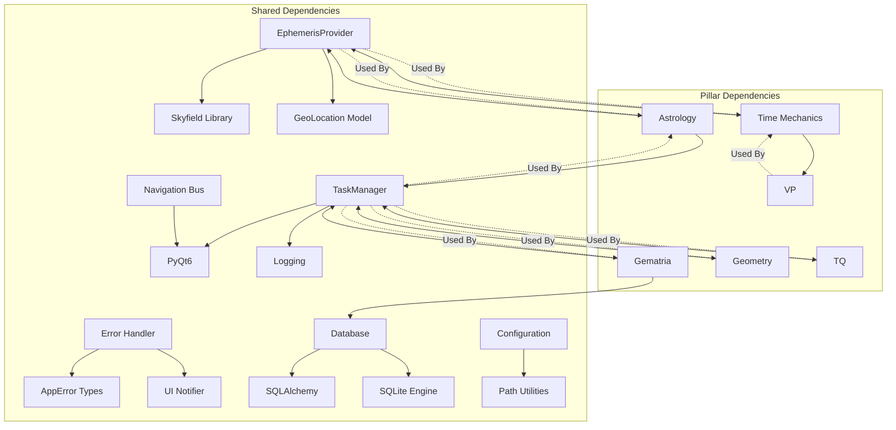

# Shared Services Layer Expansion

<cite>
**Referenced Files in This Document**
- [src/shared/services/ephemeris_provider.py](file://src/shared/services/ephemeris_provider.py)
- [src/shared/services/venus_phenomena_service.py](file://src/shared/services/venus_phenomena_service.py)
- [src/shared/services/astro_glyph_service.py](file://src/shared/services/astro_glyph_service.py)
- [src/shared/services/help_service.py](file://src/shared/services/help_service.py)
- [src/shared/async_tasks/manager.py](file://src/shared/async_tasks/manager.py)
- [src/shared/async_tasks/worker.py](file://src/shared/async_tasks/worker.py)
- [src/shared/errors/handler.py](file://src/shared/errors/handler.py)
- [src/shared/signals/navigation_bus.py](file://src/shared/signals/navigation_bus.py)
- [src/shared/models/gematria.py](file://src/shared/models/gematria.py)
- [src/shared/models/geo_location.py](file://src/shared/models/geo_location.py)
- [src/shared/database.py](file://src/shared/database.py)
- [src/shared/config.py](file://src/shared/config.py)
- [config/ARCHITECTURE.md](file://config/ARCHITECTURE.md)
- [wiki/00_foundations/covenant/09_law_of_substrate.md](file://wiki/00_foundations/covenant/09_law_of_substrate.md)
- [wiki/04_prophecies/shared_folder_audit_2026-01-13.md](file://wiki/04_prophecies/shared_folder_audit_2026-01-13.md)
</cite>

## Table of Contents
1. [Introduction](#introduction)
2. [Project Structure](#project-structure)
3. [Core Components](#core-components)
4. [Architecture Overview](#architecture-overview)
5. [Detailed Component Analysis](#detailed-component-analysis)
6. [Dependency Analysis](#dependency-analysis)
7. [Performance Considerations](#performance-considerations)
8. [Troubleshooting Guide](#troubleshooting-guide)
9. [Conclusion](#conclusion)

## Introduction
This document analyzes the Shared Services Layer Expansion within the IsopGem codebase. The shared services layer provides cross-pillar infrastructure that enables modular, sovereign pillars while maintaining a unified application foundation. The expansion focuses on three key areas: celestial mechanics services (EphemerisProvider and VenusPhenomenaService), asynchronous task management, and error handling infrastructure. These components form the backbone of IsopGem's distributed architecture, supporting multiple pillars (Astrology, Time Mechanics, Gematria, Geometry, TQ, and others) with standardized services, contracts, and infrastructure.

## Project Structure
The shared services layer is organized into distinct functional domains that serve multiple pillars while maintaining clear separation of concerns:



**Diagram sources**
- [src/shared/services/ephemeris_provider.py](file://src/shared/services/ephemeris_provider.py#L1-L379)
- [src/shared/services/venus_phenomena_service.py](file://src/shared/services/venus_phenomena_service.py#L1-L418)
- [src/shared/async_tasks/manager.py](file://src/shared/async_tasks/manager.py#L1-L243)
- [src/shared/signals/navigation_bus.py](file://src/shared/signals/navigation_bus.py#L1-L259)

**Section sources**
- [config/ARCHITECTURE.md](file://config/ARCHITECTURE.md#L45-L51)

## Core Components
The shared services layer consists of several critical components that provide essential infrastructure for the entire application ecosystem:

### Celestial Mechanics Services
The EphemerisProvider serves as the central astronomical computation engine, providing precise planetary position calculations and celestial mechanics data. The VenusPhenomenaService builds upon this foundation to deliver specialized Venus-related astronomical events and states.

### Asynchronous Task Management
The TaskManager and BackgroundWorker components provide a robust framework for managing background operations across all pillars, ensuring proper resource management and user feedback during long-running operations.

### Communication Infrastructure
The NavigationBus enables loose coupling between pillars through a signal-based window management system, preventing circular dependencies while maintaining application cohesion.

### Data Contracts and Models
Shared data models like CalculationRecord and GeoLocation provide standardized interfaces for data exchange between pillars, reducing coupling and improving maintainability.

**Section sources**
- [src/shared/services/ephemeris_provider.py](file://src/shared/services/ephemeris_provider.py#L1-L379)
- [src/shared/services/venus_phenomena_service.py](file://src/shared/services/venus_phenomena_service.py#L1-L418)
- [src/shared/async_tasks/manager.py](file://src/shared/async_tasks/manager.py#L1-L243)
- [src/shared/signals/navigation_bus.py](file://src/shared/signals/navigation_bus.py#L1-L259)

## Architecture Overview
The shared services layer follows a clean architecture pattern that separates cross-cutting concerns from domain-specific functionality:



**Diagram sources**
- [src/shared/services/ephemeris_provider.py](file://src/shared/services/ephemeris_provider.py#L32-L66)
- [src/shared/async_tasks/manager.py](file://src/shared/async_tasks/manager.py#L26-L70)
- [src/shared/errors/handler.py](file://src/shared/errors/handler.py#L55-L122)

The architecture enforces the Law of the Shared Substrate, ensuring that only truly cross-cutting concerns reside in the shared layer while domain-specific logic remains within individual pillars.

## Detailed Component Analysis

### EphemerisProvider - Celestial Computation Engine
The EphemerisProvider serves as the central astronomical computation hub, implementing a singleton pattern to manage Skyfield-based ephemeris calculations:



**Diagram sources**
- [src/shared/services/ephemeris_provider.py](file://src/shared/services/ephemeris_provider.py#L32-L379)
- [src/shared/models/geo_location.py](file://src/shared/models/geo_location.py#L17-L39)

The provider implements sophisticated astronomical calculations including:
- Planetary position computations using JPL ephemeris data
- Lunar node calculations (osculating and mean)
- Sidereal coordinate transformations with configurable ayanamsa systems
- Heliocentric and geocentric coordinate conversions

**Section sources**
- [src/shared/services/ephemeris_provider.py](file://src/shared/services/ephemeris_provider.py#L1-L379)

### VenusPhenomenaService - Specialized Astronomical Events
The VenusPhenomenaService provides domain-specific astronomical event computation built upon the EphemerisProvider foundation:



**Diagram sources**
- [src/shared/services/venus_phenomena_service.py](file://src/shared/services/venus_phenomena_service.py#L96-L150)
- [src/shared/services/ephemeris_provider.py](file://src/shared/services/ephemeris_provider.py#L314-L379)

The service implements advanced algorithms for:
- Computing Venus visibility windows based on elongation thresholds
- Finding greatest elongations (east/west) using golden-section search
- Identifying conjunction events (inferior/superior) with illumination classification
- Real-time caching with configurable time buckets for performance optimization

**Section sources**
- [src/shared/services/venus_phenomena_service.py](file://src/shared/services/venus_phenomena_service.py#L1-L418)

### Task Management Infrastructure
The asynchronous task management system provides comprehensive background operation handling across all pillars:



**Diagram sources**
- [src/shared/async_tasks/manager.py](file://src/shared/async_tasks/manager.py#L71-L127)
- [src/shared/async_tasks/worker.py](file://src/shared/async_tasks/worker.py#L82-L133)

The system provides:
- Centralized task tracking and monitoring
- Graceful cancellation mechanisms
- Progress reporting capabilities
- Automatic resource cleanup
- Error handling integration with the centralized error system

**Section sources**
- [src/shared/async_tasks/manager.py](file://src/shared/async_tasks/manager.py#L1-L243)
- [src/shared/async_tasks/worker.py](file://src/shared/async_tasks/worker.py#L1-L260)

### Error Handling and Recovery
The centralized error handling system ensures consistent error management across all application components:

```mermaid
stateDiagram-v2
[*] --> ErrorOccurred
ErrorOccurred --> ConvertToAppError : Not AppError
ErrorOccurred --> UseExistingError : Is AppError
ConvertToAppError --> AddContext
UseExistingError --> AddContext
AddContext --> LogError
LogError --> NotifyUser
NotifyUser --> CheckRecoverable{"Recoverable?"}
CheckRecoverable --> |Yes| AttemptRecovery
CheckRecoverable --> |No| RaiseError
AttemptRecovery --> RecoverySuccess{"Recovery Successful?"}
RecoverySuccess --> |Yes| ContinueOperation
RecoverySuccess --> |No| RaiseError
ContinueOperation --> [*]
RaiseError --> [*]
```

**Diagram sources**
- [src/shared/errors/handler.py](file://src/shared/errors/handler.py#L55-L122)

The error handling system implements:
- Structured error context tracking
- Automatic recovery strategy selection
- User notification integration
- Fallback value provision
- Comprehensive logging with metadata

**Section sources**
- [src/shared/errors/handler.py](file://src/shared/errors/handler.py#L1-L383)

### Communication Infrastructure
The NavigationBus enables loose coupling between application components through a signal-based communication system:



**Diagram sources**
- [src/shared/signals/navigation_bus.py](file://src/shared/signals/navigation_bus.py#L58-L66)

The navigation system provides:
- Cross-pillar window launching without direct imports
- Lazy loading of window classes
- Parameter passing between components
- Window lifecycle management
- Registry-based window discovery

**Section sources**
- [src/shared/signals/navigation_bus.py](file://src/shared/signals/navigation_bus.py#L1-L259)

## Dependency Analysis
The shared services layer maintains carefully managed dependencies that support the Law of the Shared Substrate:



**Diagram sources**
- [src/shared/services/ephemeris_provider.py](file://src/shared/services/ephemeris_provider.py#L12-L24)
- [src/shared/async_tasks/manager.py](file://src/shared/async_tasks/manager.py#L17-L21)
- [src/shared/errors/handler.py](file://src/shared/errors/handler.py#L17-L26)

The dependency analysis reveals:
- **Cross-pillar dependencies**: Only essential infrastructure services are shared
- **External library integration**: Carefully managed third-party dependencies
- **Internal coupling reduction**: Loose coupling through interfaces and contracts
- **Circular dependency prevention**: Clear separation between shared and domain-specific code

**Section sources**
- [wiki/00_foundations/covenant/09_law_of_substrate.md](file://wiki/00_foundations/covenant/09_law_of_substrate.md#L1-L163)

## Performance Considerations
The shared services layer implements several performance optimization strategies:

### Caching Strategies
- **VenusPhenomenaService**: LRU caching with configurable time buckets (default 30 minutes)
- **TaskManager**: Thread pool optimization with adjustable concurrency limits
- **Database Operations**: Efficient session management and connection pooling

### Resource Management
- **Memory Constraints**: Configurable cache limits and automatic cleanup
- **CPU Utilization**: Background processing with progress reporting
- **I/O Optimization**: Batch operations and lazy loading strategies

### Scalability Features
- **Modular Design**: Independent scaling of individual services
- **Asynchronous Processing**: Non-blocking operations for improved responsiveness
- **Resource Pooling**: Efficient reuse of expensive resources (database connections, ephemeris data)

## Troubleshooting Guide

### Common Issues and Solutions

#### Ephemeris Data Loading Problems
- **Symptom**: EphemerisNotLoadedError exceptions
- **Cause**: Missing or inaccessible ephemeris files
- **Solution**: Verify de441.bsp file availability in data directory

#### Task Management Issues
- **Symptom**: Tasks not completing or hanging
- **Cause**: Improper cancellation or resource leaks
- **Solution**: Use TaskManager.cancel_all() and check thread pool status

#### Error Handling Failures
- **Symptom**: Unhandled exceptions in background tasks
- **Cause**: Missing error boundary wrappers
- **Solution**: Wrap risky operations with error_boundary context managers

#### Navigation Bus Problems
- **Symptom**: Windows not opening between pillars
- **Cause**: Missing window registry entries
- **Solution**: Verify window_key exists in WINDOW_REGISTRY

**Section sources**
- [src/shared/services/ephemeris_provider.py](file://src/shared/services/ephemeris_provider.py#L26-L31)
- [src/shared/async_tasks/manager.py](file://src/shared/async_tasks/manager.py#L148-L157)
- [src/shared/errors/handler.py](file://src/shared/errors/handler.py#L124-L174)

## Conclusion
The Shared Services Layer Expansion in IsopGem represents a mature architectural approach to building scalable, maintainable multi-pillar applications. The expansion successfully implements:

1. **Robust Infrastructure Services**: EphemerisProvider and VenusPhenomenaService provide precise astronomical computations with proper caching and error handling
2. **Comprehensive Task Management**: Centralized background processing with proper resource management and user feedback
3. **Structured Error Handling**: Consistent error management across all application components
4. **Loose Coupling**: NavigationBus enables cross-pillar communication without violating sovereignty principles

The implementation adheres to the Law of the Shared Substrate, ensuring that only truly cross-cutting concerns reside in the shared layer while maintaining clear separation between infrastructure and domain-specific functionality. This architecture supports future expansion while maintaining system stability and performance.

The shared services layer establishes a solid foundation for continued development, enabling seamless integration of new pillars and services while preserving the application's modular design principles.