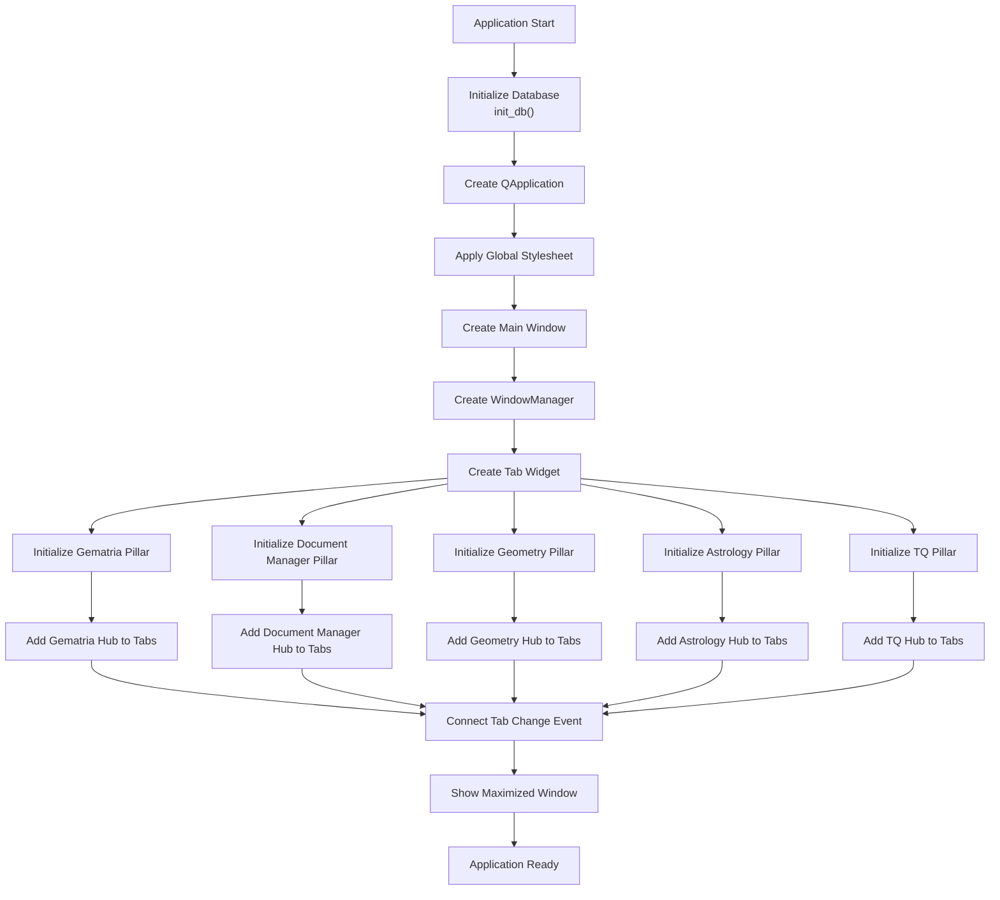
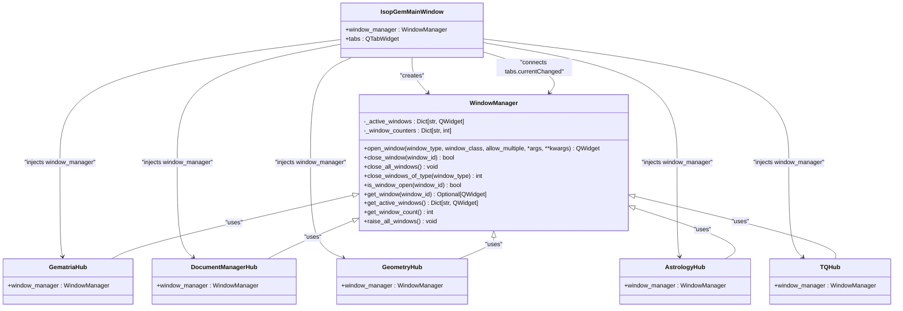
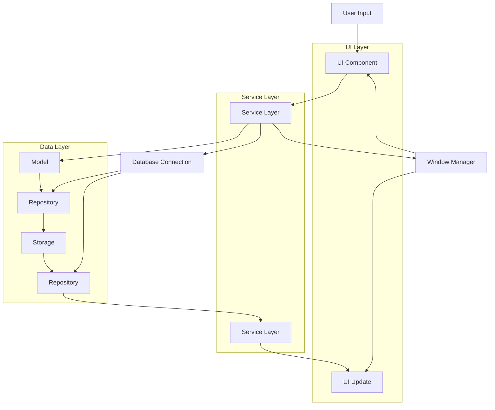
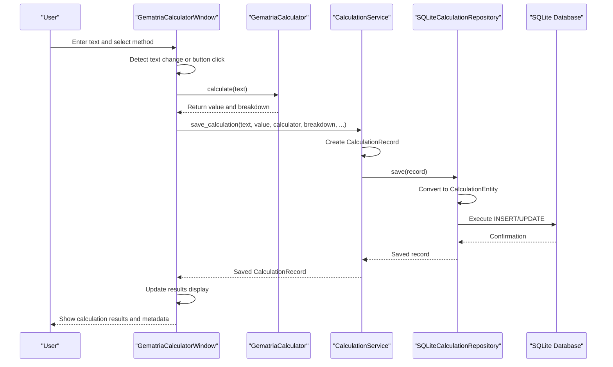
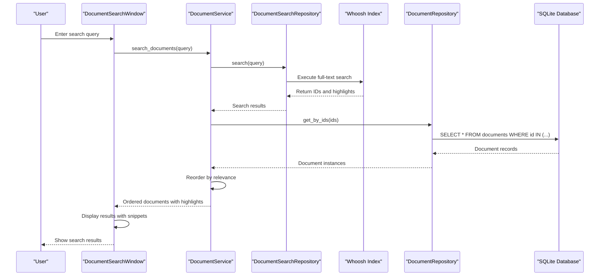
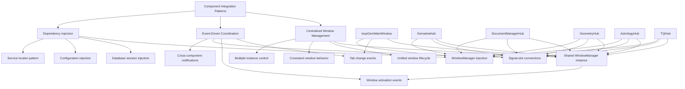

# Data Flow and Integration Patterns

<cite>
**Referenced Files in This Document**   
- [main.py](file://src/main.py)
- [database.py](file://src/shared/database.py)
- [window_manager.py](file://src/shared/ui/window_manager.py)
- [gematria_hub.py](file://src/pillars/gematria/ui/gematria_hub.py)
- [document_manager_hub.py](file://src/pillars/document_manager/ui/document_manager_hub.py)
- [calculation_service.py](file://src/pillars/gematria/services/calculation_service.py)
- [document_service.py](file://src/pillars/document_manager/services/document_service.py)
- [sqlite_calculation_repository.py](file://src/pillars/gematria/repositories/sqlite_calculation_repository.py)
- [document_repository.py](file://src/pillars/document_manager/repositories/document_repository.py)
- [calculation_record.py](file://src/pillars/gematria/models/calculation_record.py)
- [document.py](file://src/pillars/document_manager/models/document.py)
- [gematria_calculator_window.py](file://src/pillars/gematria/ui/gematria_calculator_window.py)
- [document_editor_window.py](file://src/pillars/document_manager/ui/document_editor_window.py)
- [ARCHITECTURE.md](file://config/ARCHITECTURE.md)
</cite>

## Table of Contents
1. [Introduction](#introduction)
2. [Application Initialization Sequence](#application-initialization-sequence)
3. [Centralized Window Management](#centralized-window-management)
4. [Data Flow Architecture](#data-flow-architecture)
5. [Gematria Calculation Data Flow](#gematria-calculation-data-flow)
6. [Document Search Data Flow](#document-search-data-flow)
7. [Component Integration Patterns](#component-integration-patterns)
8. [Cross-Cutting Concerns](#cross-cutting-concerns)
9. [Debugging and Tracing Guidance](#debugging-and-tracing-guidance)
10. [Conclusion](#conclusion)

## Introduction

The isopgem application implements a domain-pillar architecture with five main functional areas: Gematria, Geometry, Document Manager, Astrology, and TQ (Trigrammaton QBLH). Each pillar follows a consistent component structure with UI, services, models, repositories, and utilities. The application orchestrates complex data flows across these domains while maintaining separation of concerns through well-defined integration patterns. This document details the end-to-end data pathways, focusing on how user input propagates through UI components, service layers, models, repositories, and storage, ultimately resulting in UI updates. The analysis covers key integration mechanisms including the centralized window manager, shared dependency injection, and event-driven coordination between components.

**Section sources**
- [ARCHITECTURE.md](file://config/ARCHITECTURE.md#L1-L51)

## Application Initialization Sequence

The application initialization sequence begins with the main entry point in `main.py`, which orchestrates the setup of core infrastructure before presenting the user interface. The process follows a specific order to ensure proper dependency resolution and system readiness.

The initialization starts with database setup through the `init_db()` function, which creates the SQLite database file in the data directory and initializes all database tables using SQLAlchemy's metadata system. This function imports all model modules to ensure SQLAlchemy registers their mappings before creating the schema. Following database initialization, the application creates a QApplication instance and applies the global stylesheet and theme configuration.

The final stage of initialization creates the main window (`IsopGemMainWindow`) which serves as the central container for all pillars. During its construction, the main window creates a centralized `WindowManager` instance and a `QTabWidget` to host the pillar interfaces. Each pillar is then initialized through dedicated methods (e.g., `_init_gematria_pillar()`, `_init_document_manager_pillar()`), which instantiate the respective hub components and add them as tabs. The window manager is injected into each pillar during this process, establishing the shared coordination mechanism that will manage tool windows throughout the application's lifecycle.

**Diagram sources**
- [main.py](file://src/main.py#L113-L156)
- [database.py](file://src/shared/database.py#L25-L29)

**Section sources**
- [main.py](file://src/main.py#L113-L156)
- [database.py](file://src/shared/database.py#L25-L29)

## Centralized Window Management

The isopgem application employs a centralized `WindowManager` class to coordinate all tool windows across the different pillars. This design pattern ensures consistent window lifecycle management, proper z-ordering, and coordinated behavior across the application. The window manager is instantiated in the main window and injected into each pillar hub, creating a shared reference that all components can use to open, close, and manage tool windows.

The `WindowManager` maintains an internal registry of active windows using a dictionary that maps window IDs to widget instances. When a component requests to open a window, the manager creates the window instance, assigns it a unique ID based on the window type, and stores it in the registry. The manager configures each window with appropriate attributes, including the `WA_DeleteOnClose` flag to ensure proper cleanup and the `WA_QuitOnClose` flag set to false to prevent individual window closures from terminating the entire application. Windows are configured with standard window flags that provide minimize, maximize, and close buttons while maintaining proper window manager integration.

A key integration feature is the connection between tab changes in the main window and the `raise_all_windows()` method of the window manager. When the user switches between pillars, the main window's `currentChanged` signal triggers the window manager to bring all active tool windows to the front. This ensures that tool windows remain visible and accessible regardless of which pillar tab is currently active. The window manager also handles the application shutdown sequence by providing a `close_all_windows()` method that systematically closes all managed windows when the main window is closed.

**Diagram sources**
- [window_manager.py](file://src/shared/ui/window_manager.py#L15-L221)
- [main.py](file://src/main.py#L26-L111)

**Section sources**
- [window_manager.py](file://src/shared/ui/window_manager.py#L15-L221)
- [main.py](file://src/main.py#L50-L67)

## Data Flow Architecture

The isopgem application implements a layered architecture that separates concerns across UI, service, and data access components. This structure enables clean data flow from user input through processing layers to persistent storage and back to UI updates. The architecture follows a consistent pattern across all pillars, with each domain having its own set of UI components, service classes, models, and repositories.

The data flow follows the pattern: User Input → UI Component → Service Layer → Model → Repository → Storage → Service Layer → UI Update. UI components capture user input and delegate processing to service classes, which contain the business logic and coordinate operations across multiple components. Services interact with models that represent the application's data structures, and repositories that handle data persistence. The repositories abstract the underlying storage mechanism, currently SQLite via SQLAlchemy, allowing the service layer to remain storage-agnostic.

Dependency injection is used extensively to share core components like the window manager and database connection across the application. The window manager is passed to each pillar hub during initialization, while database sessions are managed through context managers and dependency functions. This approach promotes loose coupling between components while ensuring consistent access to shared resources. The architecture also supports cross-pillar integration, allowing components from different domains to interact through well-defined interfaces and shared services.

**Diagram sources**
- [main.py](file://src/main.py#L50-L51)
- [database.py](file://src/shared/database.py#L23-L24)
- [window_manager.py](file://src/shared/ui/window_manager.py#L15-L221)

**Section sources**
- [main.py](file://src/main.py#L50-L51)
- [database.py](file://src/shared/database.py#L23-L24)

## Gematria Calculation Data Flow

The gematria calculation feature demonstrates the complete data flow pattern from user input to persistent storage and UI update. When a user enters text in the gematria calculator and initiates a calculation, the input flows through multiple layers of processing before being stored and displayed.

The process begins in the `GematriaCalculatorWindow` UI component, which captures the user's input text and selected calculation method. When the calculate button is clicked or text is entered, the window delegates to the appropriate `GematriaCalculator` instance based on the selected method. The calculator performs the numerical analysis, returning both the total value and a breakdown of individual character values. This raw calculation data is then passed to the `CalculationService`, which prepares it for storage by creating a `CalculationRecord` model instance with metadata such as timestamp, method, and user annotations.

The service layer then invokes the `CalculationRepository` to persist the record. The repository, implemented as `SQLiteCalculationRepository`, uses SQLAlchemy to manage the database session and execute CRUD operations. It converts the `CalculationRecord` to a `CalculationEntity` for storage, handling the conversion between the application's data model and the database schema. The repository ensures data integrity through transaction management, committing changes only when operations succeed and rolling back on errors.

After successful storage, the service returns the saved record to the UI component, which updates the display to show the calculation results along with metadata from the persistent record. The UI also provides options to save the calculation to the user's collection, add notes, or tag it for future reference. This complete cycle ensures that all calculations are automatically persisted while providing immediate feedback to the user.

**Diagram sources**
- [gematria_calculator_window.py](file://src/pillars/gematria/ui/gematria_calculator_window.py#L15-L200)
- [calculation_service.py](file://src/pillars/gematria/services/calculation_service.py#L11-L273)
- [sqlite_calculation_repository.py](file://src/pillars/gematria/repositories/sqlite_calculation_repository.py#L16-L143)

**Section sources**
- [gematria_calculator_window.py](file://src/pillars/gematria/ui/gematria_calculator_window.py#L15-L200)
- [calculation_service.py](file://src/pillars/gematria/services/calculation_service.py#L11-L273)

## Document Search Data Flow

The document search functionality illustrates another complete data flow pathway, demonstrating how the application handles complex queries across multiple storage systems. When a user searches for text within documents, the request traverses several components before returning results with contextual highlights.

The search process begins in the `DocumentSearchWindow` UI component, which captures the user's query string. The UI delegates to the `DocumentService`, which coordinates the search operation across both the relational database and the Whoosh search index. The service first queries the `DocumentSearchRepository` to perform full-text search against the indexed documents, leveraging Whoosh's capabilities for efficient text matching and relevance scoring.

The search repository returns a list of document IDs and highlight information, which the service uses to fetch the corresponding `Document` model instances from the `DocumentRepository`. This two-step process separates the full-text search capability from the relational data storage, optimizing performance while maintaining data consistency. The service then reorders the results to match the relevance ranking from the search index and returns the ordered list of documents to the UI.

The UI component displays the search results with highlighted text fragments, allowing the user to click on a result to open the corresponding document in the editor. When opening a document, the UI can pass the search term to enable in-document highlighting, creating a seamless experience from search to content exploration. This integration between the search index and relational database ensures both fast query performance and rich metadata access.

**Diagram sources**
- [document_service.py](file://src/pillars/document_manager/services/document_service.py#L18-L257)
- [document_repository.py](file://src/pillars/document_manager/repositories/document_repository.py)
- [document_search_window.py](file://src/pillars/document_manager/ui/document_search_window.py)

**Section sources**
- [document_service.py](file://src/pillars/document_manager/services/document_service.py#L18-L257)
- [document_repository.py](file://src/pillars/document_manager/repositories/document_repository.py)

## Component Integration Patterns

The isopgem application employs several integration patterns to coordinate behavior between components across different pillars. These patterns ensure consistent user experience while maintaining separation of concerns between functional domains.

The primary integration mechanism is the centralized window manager, which provides a shared service for window lifecycle management. This allows any component to open tool windows without knowing about other components, while ensuring consistent behavior across the application. The window manager supports both single-instance and multiple-instance window types, allowing components to specify whether a window should be reused or a new instance created.

Event-driven integration is used to coordinate UI state changes, particularly through the connection between the main window's tab widget and the window manager. When the user switches between pillar tabs, the `currentChanged` signal triggers the `raise_all_windows()` method, bringing all active tool windows to the front. This pattern ensures that tool windows remain accessible regardless of the current context, supporting the application's multi-tool workflow.

Dependency injection is used to share core services and configuration between components. The window manager is injected into each pillar hub during initialization, establishing a shared reference that can be propagated to child components. Database connections are managed through context managers and factory functions, allowing components to obtain database sessions without direct knowledge of the connection details. This approach promotes loose coupling while ensuring consistent access to shared resources.

**Diagram sources**
- [main.py](file://src/main.py#L50-L67)
- [window_manager.py](file://src/shared/ui/window_manager.py#L15-L221)
- [gematria_hub.py](file://src/pillars/gematria/ui/gematria_hub.py#L52-L61)

**Section sources**
- [main.py](file://src/main.py#L50-L67)
- [window_manager.py](file://src/shared/ui/window_manager.py#L15-L221)

## Cross-Cutting Concerns

The isopgem application addresses several cross-cutting concerns through centralized implementations that span multiple pillars and components. These concerns include configuration management, error handling, logging, and data consistency, ensuring a cohesive user experience and robust application behavior.

Configuration management is handled through a combination of file-based configuration and runtime settings. The application structure defines a consistent pattern for configuration files, with domain-specific settings stored in the config directory. Runtime configuration, such as user preferences and window state, is managed through the shared components and service layers, allowing settings to persist across sessions and be accessible to all pillars.

Error handling follows a layered approach, with validation and exception handling at multiple levels of the architecture. UI components perform input validation and display user-friendly error messages, while service layers handle business logic errors and data integrity issues. The repository layer manages database-specific exceptions, translating them into application-level errors that higher layers can handle appropriately. Logging is implemented consistently across components using Python's logging module, with structured log messages that include timestamps, severity levels, and component identifiers to facilitate debugging and monitoring.

Data consistency is maintained through transaction management in the repository layer and validation in the service layer. The SQLite repositories use SQLAlchemy's session management to ensure atomic operations, while the service layer enforces business rules and data integrity constraints. For features that involve multiple data stores, such as the document search functionality, the service layer coordinates updates across systems to maintain synchronization between the relational database and search index.

**Section sources**
- [database.py](file://src/shared/database.py#L20-L24)
- [document_service.py](file://src/pillars/document_manager/services/document_service.py#L16-L257)
- [calculation_service.py](file://src/pillars/gematria/services/calculation_service.py#L11-L273)

## Debugging and Tracing Guidance

Effective debugging and tracing in the isopgem application requires understanding the data flow pathways and leveraging the available logging and diagnostic tools. The layered architecture provides multiple entry points for tracing data as it moves through the system, from UI components through service layers to persistent storage.

The most effective approach for tracing data flow is to follow the sequence of method calls through the architecture layers. For example, when debugging a gematria calculation issue, start with the `GematriaCalculatorWindow` UI component, trace through the `CalculationService`, and examine the `SQLiteCalculationRepository` operations. The service layer methods provide clear entry points for debugging, with well-defined inputs and outputs that can be inspected using breakpoints or logging.

Logging is a primary tool for tracing application behavior, with structured log messages that include component names, operation details, and timing information. The `DocumentService` and `CalculationService` classes include detailed debug logging for key operations, showing the duration of database queries and the number of records processed. These logs can be used to identify performance bottlenecks and verify that data is being processed correctly.

For issues involving window management or UI coordination, focus on the `WindowManager` class and its interactions with the main window and pillar hubs. The window manager's methods include debug logging for window creation, closure, and activation events, providing visibility into the lifecycle of tool windows. The connection between the main window's tab changes and the `raise_all_windows()` method is particularly important for diagnosing issues with window visibility and z-ordering.

When debugging data persistence issues, examine the repository implementations and their use of database sessions. The `get_db_session()` context manager in the shared database module provides a consistent way to manage database connections, and its proper usage is critical for avoiding connection leaks and transaction issues. For features that involve multiple data stores, such as document search, verify that updates are properly synchronized between the relational database and search index.

**Section sources**
- [document_service.py](file://src/pillars/document_manager/services/document_service.py#L16-L257)
- [calculation_service.py](file://src/pillars/gematria/services/calculation_service.py#L11-L273)
- [window_manager.py](file://src/shared/ui/window_manager.py#L15-L221)
- [database.py](file://src/shared/database.py#L40-L53)

## Conclusion

The isopgem application demonstrates a well-structured architectural approach to managing complex data flows and component integration in a multi-domain application. The domain-pillar architecture provides clear separation of concerns while enabling cross-functional integration through shared services and consistent patterns. The centralized window manager, dependency injection, and event-driven coordination create a cohesive user experience across the different pillars.

The data flow architecture follows a clean pattern from user input through processing layers to persistent storage and back to UI updates, with well-defined responsibilities at each layer. Service classes encapsulate business logic and coordinate operations, repositories abstract data access, and models represent the application's data structures. This separation enables maintainability and testability while supporting the application's complex requirements.

The integration patterns, including centralized window management and event-driven coordination, ensure consistent behavior across components while maintaining loose coupling. Cross-cutting concerns like configuration management, error handling, and data consistency are addressed through centralized implementations that span multiple pillars. The application's design provides a solid foundation for future expansion while supporting effective debugging and maintenance through comprehensive logging and tracing capabilities.