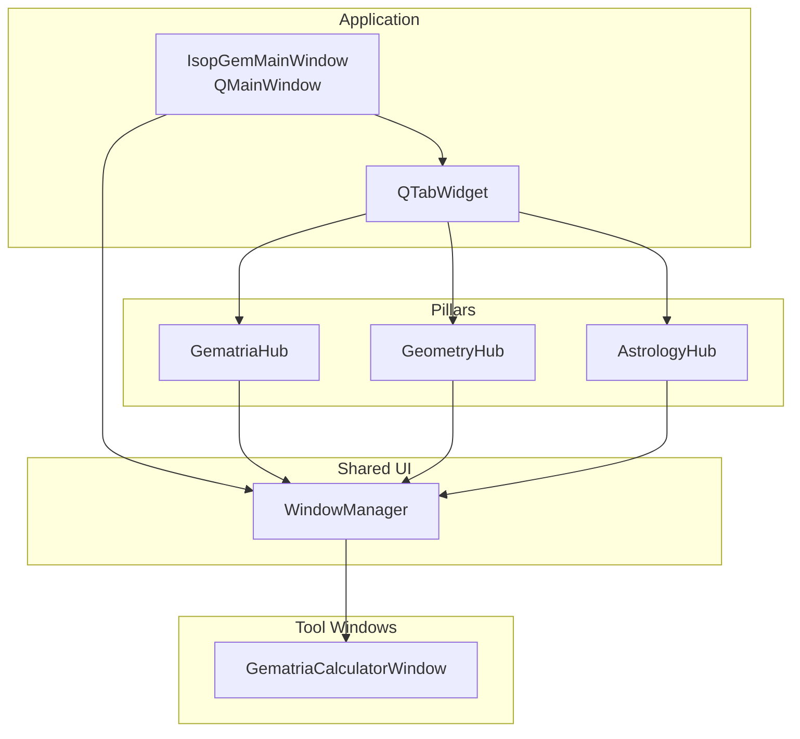
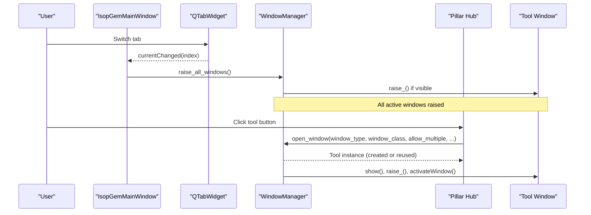
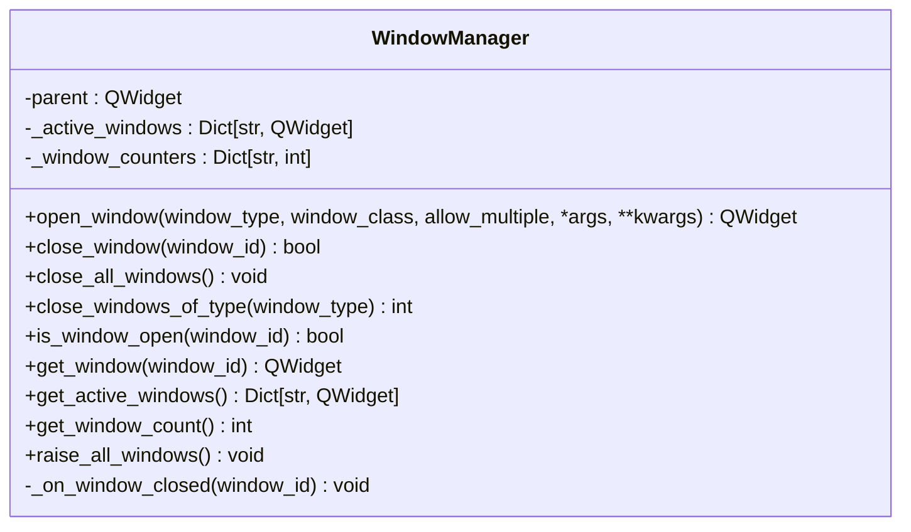
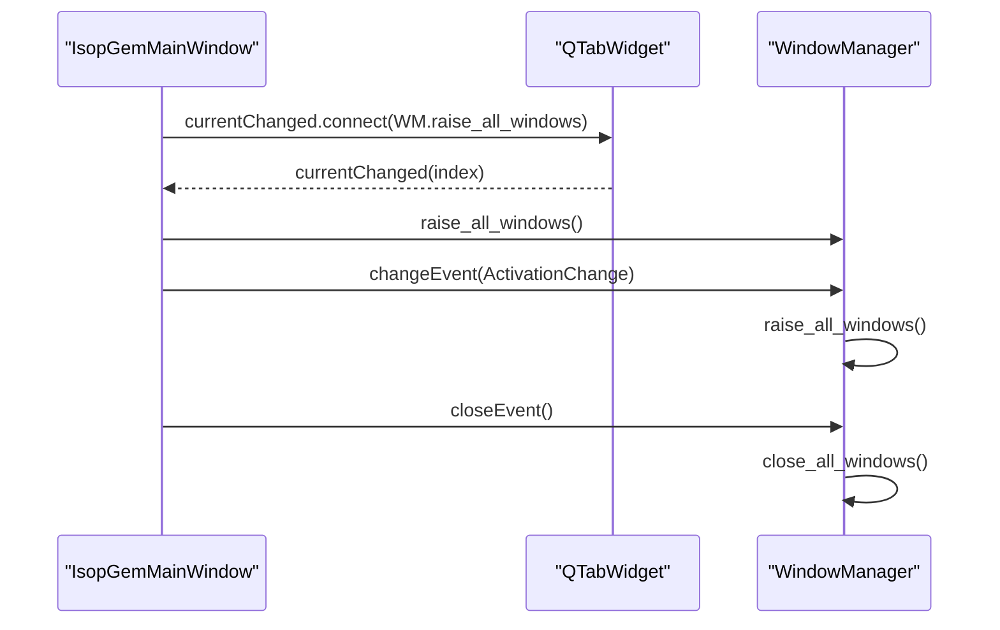
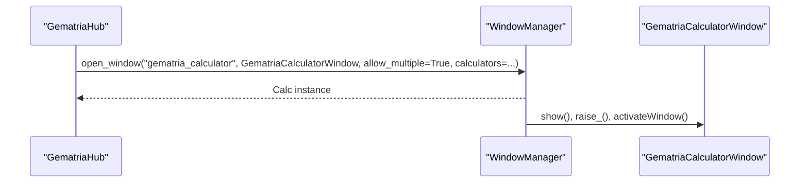
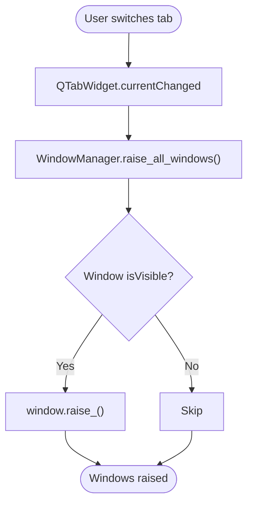
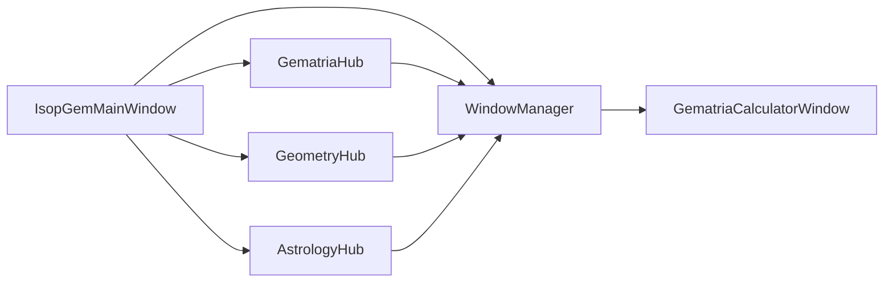

# Window Manager and UI Coordination

<cite>
**Referenced Files in This Document**
- [window_manager.py](file://src/shared/ui/window_manager.py)
- [main.py](file://src/main.py)
- [gematria_hub.py](file://src/pillars/gematria/ui/gematria_hub.py)
- [geometry_hub.py](file://src/pillars/geometry/ui/geometry_hub.py)
- [astrology_hub.py](file://src/pillars/astrology/ui/astrology_hub.py)
- [gematria_calculator_window.py](file://src/pillars/gematria/ui/gematria_calculator_window.py)
- [test_window_manager.py](file://test/test_window_manager.py)
</cite>

## Table of Contents
1. [Introduction](#introduction)
2. [Project Structure](#project-structure)
3. [Core Components](#core-components)
4. [Architecture Overview](#architecture-overview)
5. [Detailed Component Analysis](#detailed-component-analysis)
6. [Dependency Analysis](#dependency-analysis)
7. [Performance Considerations](#performance-considerations)
8. [Troubleshooting Guide](#troubleshooting-guide)
9. [Conclusion](#conclusion)

## Introduction
This document explains the Window Manager and UI coordination system in the isopgem application. It focuses on how the WindowManager class centralizes control over all floating tool windows across different pillars, how tab switches trigger window coordination, how each pillar’s hub registers its tool windows, and how the main window’s close event ensures all managed windows are properly closed. It also demonstrates how this coordination improves user experience by maintaining context across the application.

## Project Structure
The window management system spans several modules:
- Centralized window manager: shared UI module
- Main application window: creates the tabbed interface and connects signals
- Pillar hubs: each hub exposes tool windows and delegates creation to the window manager
- Tool windows: standalone windows configured to cooperate with the window manager

**Diagram sources**
- [main.py](file://src/main.py#L26-L111)
- [window_manager.py](file://src/shared/ui/window_manager.py#L15-L221)
- [gematria_hub.py](file://src/pillars/gematria/ui/gematria_hub.py#L49-L117)
- [geometry_hub.py](file://src/pillars/geometry/ui/geometry_hub.py#L1111-L1150)
- [astrology_hub.py](file://src/pillars/astrology/ui/astrology_hub.py#L13-L86)
- [gematria_calculator_window.py](file://src/pillars/gematria/ui/gematria_calculator_window.py#L15-L44)

**Section sources**
- [main.py](file://src/main.py#L26-L111)
- [window_manager.py](file://src/shared/ui/window_manager.py#L15-L221)

## Core Components
- WindowManager: centralizes lifecycle and visibility of tool windows; supports single-instance and multi-instance modes; tracks active windows; raises all windows; closes windows by id/type/all.
- IsopGemMainWindow: creates the tabbed UI, initializes the window manager, connects tab changes to raise all windows, and handles main window close to close all managed windows.
- Hub widgets (e.g., GematriaHub, GeometryHub, AstrologyHub): expose tool windows; receive a shared WindowManager instance; delegate window creation to the manager.
- Tool windows (e.g., GematriaCalculatorWindow): configured to cooperate with the window manager and avoid closing the main application.

Key responsibilities:
- Centralized control: all tool windows are opened via the window manager, ensuring consistent behavior.
- Visibility: raising windows on tab changes keeps relevant tools visible.
- Lifecycle: deterministic close on main window exit prevents orphaned windows.

**Section sources**
- [window_manager.py](file://src/shared/ui/window_manager.py#L15-L221)
- [main.py](file://src/main.py#L26-L111)
- [gematria_hub.py](file://src/pillars/gematria/ui/gematria_hub.py#L49-L117)
- [geometry_hub.py](file://src/pillars/geometry/ui/geometry_hub.py#L1111-L1150)
- [astrology_hub.py](file://src/pillars/astrology/ui/astrology_hub.py#L13-L86)
- [gematria_calculator_window.py](file://src/pillars/gematria/ui/gematria_calculator_window.py#L15-L52)

## Architecture Overview
The system uses a signal-driven coordination model:
- The main window connects QTabWidget.currentChanged to WindowManager.raise_all_windows.
- Each hub registers its tool windows with the window manager during initialization.
- Tool windows are configured to avoid closing the main application when closed individually.

**Diagram sources**
- [main.py](file://src/main.py#L62-L73)
- [window_manager.py](file://src/shared/ui/window_manager.py#L29-L111)
- [gematria_hub.py](file://src/pillars/gematria/ui/gematria_hub.py#L137-L187)

## Detailed Component Analysis

### WindowManager
Responsibilities:
- Open windows with either single-instance or multi-instance semantics.
- Assign unique identifiers per window type and track instance counts.
- Configure window flags and attributes to integrate with the desktop environment.
- Track window lifecycle via destroyed signal and maintain an internal registry.
- Provide APIs to query, close, and raise windows.

Behavior highlights:
- Multi-instance windows append a counter to the window id; single-instance windows reuse the base id.
- Visibility-aware raise operation avoids raising hidden windows.
- Close operations remove references proactively to reflect immediate state.

**Diagram sources**
- [window_manager.py](file://src/shared/ui/window_manager.py#L15-L221)

**Section sources**
- [window_manager.py](file://src/shared/ui/window_manager.py#L29-L111)
- [window_manager.py](file://src/shared/ui/window_manager.py#L136-L161)
- [window_manager.py](file://src/shared/ui/window_manager.py#L213-L221)

### IsopGemMainWindow and Event Handling
- Creates a shared WindowManager bound to the main window as parent.
- Initializes tabs for each pillar and passes the window manager to each hub.
- Connects QTabWidget.currentChanged to WindowManager.raise_all_windows.
- Handles activation changes to raise windows when the main window becomes active.
- Implements closeEvent to close all managed windows before exiting.

**Diagram sources**
- [main.py](file://src/main.py#L62-L73)
- [main.py](file://src/main.py#L105-L111)
- [window_manager.py](file://src/shared/ui/window_manager.py#L213-L221)

**Section sources**
- [main.py](file://src/main.py#L26-L111)

### Hub Widgets and Tool Registration
Each hub receives a shared WindowManager and opens tool windows through it. This ensures:
- Consistent window creation and lifecycle management.
- Uniform behavior across pillars (e.g., single vs multi-instance windows).
- Centralized visibility control via raise_all_windows.

Examples:
- GematriaHub opens calculator, saved calculations, batch calculator, text analysis, database tools, and methods reference windows. Some are single-instance; others allow multiple instances.
- GeometryHub and AstrologyHub similarly expose tools and delegate to the window manager.

**Diagram sources**
- [gematria_hub.py](file://src/pillars/gematria/ui/gematria_hub.py#L137-L187)
- [window_manager.py](file://src/shared/ui/window_manager.py#L29-L111)

**Section sources**
- [gematria_hub.py](file://src/pillars/gematria/ui/gematria_hub.py#L49-L117)
- [gematria_hub.py](file://src/pillars/gematria/ui/gematria_hub.py#L137-L187)
- [geometry_hub.py](file://src/pillars/geometry/ui/geometry_hub.py#L1111-L1150)
- [astrology_hub.py](file://src/pillars/astrology/ui/astrology_hub.py#L13-L86)

### Tool Windows and Close Behavior
Tool windows are configured to cooperate with the window manager:
- They disable the main-window-closing behavior to prevent accidental app termination.
- They rely on the window manager for consistent lifecycle and visibility.

Example: GematriaCalculatorWindow explicitly disables closing the application on its own close.

**Section sources**
- [gematria_calculator_window.py](file://src/pillars/gematria/ui/gematria_calculator_window.py#L43-L52)

### Event Handling Flow: Tab Switch and Activation
The main window coordinates window visibility across tab switches and activation changes:
- QTabWidget.currentChanged triggers WindowManager.raise_all_windows.
- ActivationChange events also trigger raise_all_windows to keep windows visible when the app regains focus.

**Diagram sources**
- [main.py](file://src/main.py#L62-L73)
- [window_manager.py](file://src/shared/ui/window_manager.py#L213-L221)

**Section sources**
- [main.py](file://src/main.py#L62-L73)
- [window_manager.py](file://src/shared/ui/window_manager.py#L213-L221)

## Dependency Analysis
- IsopGemMainWindow depends on WindowManager and all pillar hubs.
- WindowManager depends on PyQt6 widgets and QtCore for window flags and signals.
- Hub widgets depend on WindowManager for window creation.
- Tool windows depend on WindowManager for lifecycle and visibility, and on the main window for parent context.

**Diagram sources**
- [main.py](file://src/main.py#L26-L111)
- [window_manager.py](file://src/shared/ui/window_manager.py#L15-L221)
- [gematria_hub.py](file://src/pillars/gematria/ui/gematria_hub.py#L49-L117)
- [geometry_hub.py](file://src/pillars/geometry/ui/geometry_hub.py#L1111-L1150)
- [astrology_hub.py](file://src/pillars/astrology/ui/astrology_hub.py#L13-L86)
- [gematria_calculator_window.py](file://src/pillars/gematria/ui/gematria_calculator_window.py#L15-L52)

**Section sources**
- [main.py](file://src/main.py#L26-L111)
- [window_manager.py](file://src/shared/ui/window_manager.py#L15-L221)

## Performance Considerations
- Visibility filtering: WindowManager.raise_all_windows only raises visible windows, reducing unnecessary operations.
- Single-instance reuse: Reusing windows avoids creating redundant instances and reduces memory overhead.
- Proactive cleanup: Closing windows removes references immediately, preventing stale entries in the active registry.

[No sources needed since this section provides general guidance]

## Troubleshooting Guide
Common issues and resolutions:
- Windows not raising on tab switch:
  - Verify QTabWidget.currentChanged is connected to WindowManager.raise_all_windows.
  - Confirm that raise_all_windows is invoked on activation changes.
- Tool windows closing the main app:
  - Ensure tool windows disable the main-window-closing behavior.
- Windows not closing on main exit:
  - Confirm closeEvent calls WindowManager.close_all_windows.

Validation via tests:
- Single-instance reuse and multi-instance creation are covered by tests.
- Closing windows by id and by type is validated.

**Section sources**
- [main.py](file://src/main.py#L62-L73)
- [main.py](file://src/main.py#L105-L111)
- [gematria_calculator_window.py](file://src/pillars/gematria/ui/gematria_calculator_window.py#L43-L52)
- [test_window_manager.py](file://test/test_window_manager.py#L27-L60)

## Conclusion
The WindowManager centralizes control over all floating tool windows across pillars, ensuring consistent lifecycle, visibility, and user experience. The main window coordinates tab switches and activation changes to raise relevant windows, while each hub registers its tools through the window manager. The closeEvent guarantees orderly shutdown by closing all managed windows. Together, these mechanisms provide a robust, predictable UI coordination system that maintains context across the application.