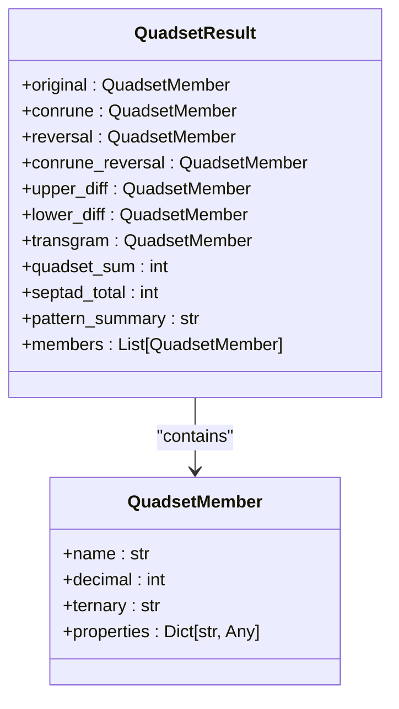
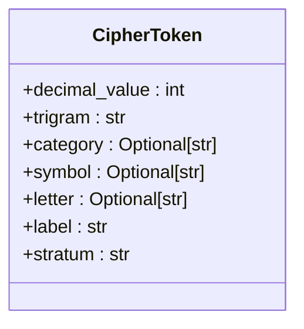
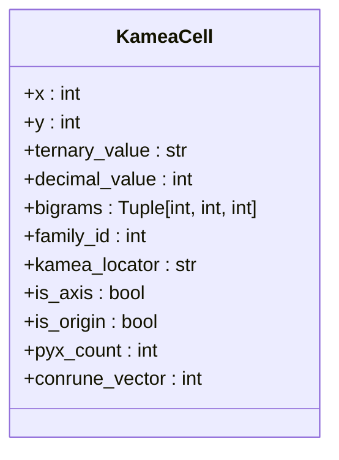
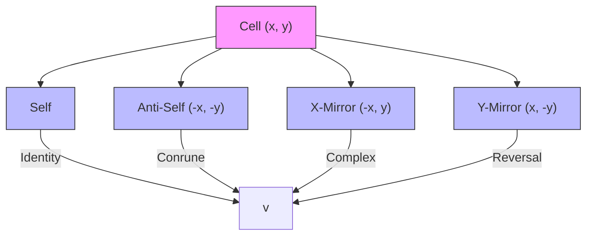
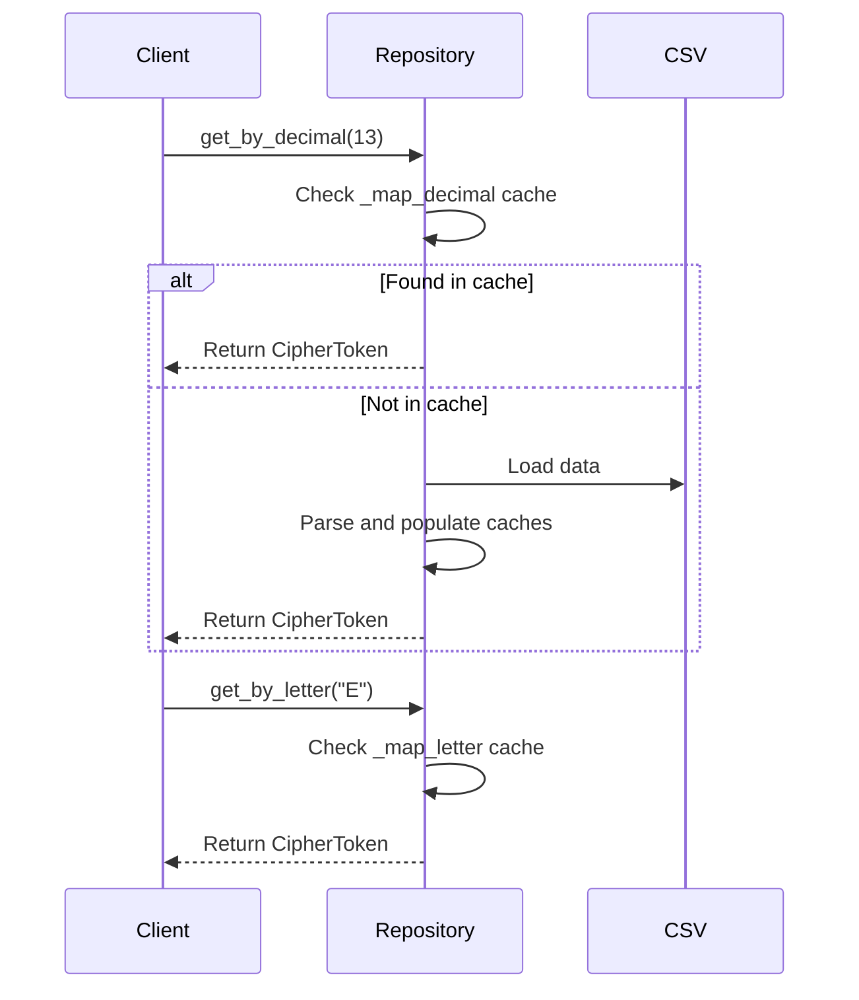
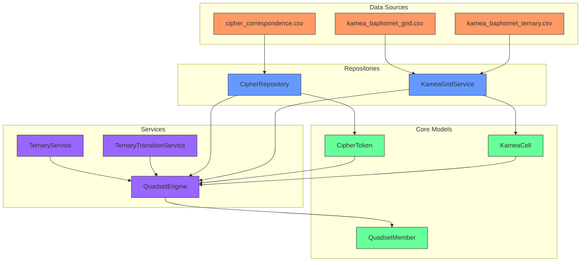

# TQ System Database Schema

<cite>
**Referenced Files in This Document**   
- [quadset_models.py](file://src/pillars/tq/models/quadset_models.py)
- [cipher_token.py](file://src/pillars/tq/models/cipher_token.py)
- [kamea_cell.py](file://src/pillars/tq/models/kamea_cell.py)
- [cipher_repository.py](file://src/pillars/tq/repositories/cipher_repository.py)
- [kamea_grid_service.py](file://src/pillars/tq/services/kamea_grid_service.py)
- [ternary_service.py](file://src/pillars/tq/services/ternary_service.py)
- [quadset_engine.py](file://src/pillars/tq/services/quadset_engine.py)
- [cipher_correspondence.csv](file://src/pillars/tq/data/cipher_correspondence.csv)
- [kamea_baphomet_grid.csv](file://src/pillars/tq/data/kamea_baphomet_grid.csv)
- [kamea_baphomet_ternary.csv](file://src/pillars/tq/data/kamea_baphomet_ternary.csv)
- [The_Kamea_Doctrine.md](file://Docs/kamea/The_Kamea_Doctrine.md)
- [ternary_transition_system.md](file://Docs/kamea/ternary_transition_system.md)
</cite>

## Table of Contents
1. [Introduction](#introduction)
2. [Core Data Models](#core-data-models)
3. [Quadset Models](#quadset-models)
4. [CipherToken Model](#ciphertoken-model)
5. [KameaCell Model](#kameacell-model)
6. [Spatial Relationships in Kamea Grids](#spatial-relationships-in-kamea-grids)
7. [Data Access Patterns](#data-access-patterns)
8. [Indexing Strategies](#indexing-strategies)
9. [Data Lifecycle Management](#data-lifecycle-management)
10. [Security Considerations](#security-considerations)
11. [Sample Data and Workflows](#sample-data-and-workflows)
12. [Migration Strategies](#migration-strategies)
13. [Schema Diagram](#schema-diagram)

## Introduction

The TQ (Trigrammaton QBLH) pillar's database schema represents a sophisticated system for cryptographic analysis, geometric transitions, and esoteric data processing. This documentation provides a comprehensive overview of the core data models, their relationships, and the underlying principles that govern the TQ system. The architecture is built around three primary entities: QuadsetModels for numerical analysis, CipherToken for cryptographic mappings, and KameaCell for spatial representation in a 27×27 grid. These components work in concert to enable complex pattern matching, ternary logic operations, and geometric transition analysis.

The system is grounded in ternary mathematics and philosophical principles derived from Taoist thought, moving beyond binary dualism to incorporate an "included middle" represented by the digit 0. This approach enables a more nuanced representation of reality through the interaction of three fundamental forces: 0 (Tao/Pyx - equilibrium), 1 (Yang/Vertex - expansion), and 2 (Yin/Nexus - contraction). The database schema reflects this philosophical foundation through its data structures and operational patterns.

**Section sources**
- [The_Kamea_Doctrine.md](file://Docs/kamea/The_Kamea_Doctrine.md#L1-L203)
- [ternary_transition_system.md](file://Docs/kamea/ternary_transition_system.md#L1-L158)

## Core Data Models

The TQ system is built upon three interconnected data models that form the foundation of its cryptographic and geometric analysis capabilities. These models—QuadsetModels, CipherToken, and KameaCell—represent different aspects of the same underlying ternary reality, each providing a unique perspective on the data.

The models are implemented as Python dataclasses rather than traditional database tables, indicating that the persistence layer is managed through CSV files and in-memory data structures rather than a conventional relational database. This design choice reflects the specialized nature of the data and the need for rapid access to pre-computed values for cryptographic operations.

The relationships between these models are primarily logical rather than enforced through database constraints. The CipherToken provides the fundamental mapping between decimal values and their ternary representations, which serves as the basis for both Quadset analysis and Kamea grid positioning. The KameaCell model extends this by adding spatial coordinates to the ternary representation, enabling geometric analysis of the data.

**Section sources**
- [quadset_models.py](file://src/pillars/tq/models/quadset_models.py#L1-L41)
- [cipher_token.py](file://src/pillars/tq/models/cipher_token.py#L1-L35)
- [kamea_cell.py](file://src/pillars/tq/models/kamea_cell.py#L1-L59)

## Quadset Models

The QuadsetModels represent the core analytical framework for numerical transformations within the TQ system. Implemented as dataclasses, these models capture the results of complex cryptographic operations that analyze numbers through multiple transformations.

The primary class, `QuadsetResult`, encapsulates a complete analysis of a number through four main members: the original value, its conrune transformation, its reversal, and the conrune of its reversal. These transformations are based on ternary representations of decimal numbers, with the conrune operation swapping 1s and 2s while preserving 0s, and the reversal operation reversing the digit sequence.

**Diagram sources**
- [quadset_models.py](file://src/pillars/tq/models/quadset_models.py#L8-L41)

**Section sources**
- [quadset_models.py](file://src/pillars/tq/models/quadset_models.py#L8-L41)
- [quadset_engine.py](file://src/pillars/tq/services/quadset_engine.py#L1-L87)

## CipherToken Model

The CipherToken model represents the fundamental mapping between decimal values and their cryptographic correspondences in the TQ system. Each token maps a decimal value (0-26) to its trigram representation and associated symbolic, categorical, and alphabetic correspondences.

The model is designed to support the TQ Base-27 Cipher, where each decimal value corresponds to a specific trigram (three-digit ternary number) and various esoteric correspondences. The token includes properties that enable rich display and classification, including a computed `stratum` property that determines the ontological level of the token based on the count of zeros (Pyx) in its trigram.

**Diagram sources**
- [cipher_token.py](file://src/pillars/tq/models/cipher_token.py#L4-L35)

**Section sources**
- [cipher_token.py](file://src/pillars/tq/models/cipher_token.py#L4-L35)
- [cipher_correspondence.csv](file://src/pillars/tq/data/cipher_correspondence.csv#L1-L29)

## KameaCell Model

The KameaCell model represents a single cell in the 27×27 Kamea grid, which serves as the spatial framework for the TQ system. Each cell is positioned in a Cartesian coordinate system ranging from -13 to +13 on both axes, with the origin (0,0) representing the singularity point.

The model captures both the spatial and numerical properties of each cell, including its ternary value (a 6-digit string), decimal equivalent, and hierarchical bigram structure. The bigrams represent a concentric organization of the cell's identity, with the core bigram determining its region (Family ID), the middle bigram defining its role (Area), and the outer bigram representing its state (Cell).

**Diagram sources**
- [kamea_cell.py](file://src/pillars/tq/models/kamea_cell.py#L4-L59)

**Section sources**
- [kamea_cell.py](file://src/pillars/tq/models/kamea_cell.py#L4-L59)
- [kamea_grid_service.py](file://src/pillars/tq/services/kamea_grid_service.py#L1-L220)

## Spatial Relationships in Kamea Grids

The Kamea grid implements a sophisticated system of spatial relationships based on geometric reflections and symmetries. The 27×27 grid is centered at the origin (0,0), with each cell participating in various relational structures that define its "physics" within the system.

The primary relationship is the Quadset, which connects four cells through reflections across the X and Y axes. For any cell at coordinates (x,y), its quadset includes the cells at (x,y), (-x,-y), (-x,y), and (x,-y). This creates a four-fold particle structure where each cell is gravitationally bound to its reflections.

The grid is also divided into nine immutable sectors (regions) based on the center bigram of each cell's ditrune. These regions form a mandala of territory with distinct archetypes, from the Void at the center to the Projector, Splicer, Recoil, Abyss, Monolith, Pulse, Weaver, and Receiver in the surrounding positions.

**Diagram sources**
- [The_Kamea_Doctrine.md](file://Docs/kamea/The_Kamea_Doctrine.md#L26-L42)
- [kamea_grid_service.py](file://src/pillars/tq/services/kamea_grid_service.py#L77-L101)

**Section sources**
- [The_Kamea_Doctrine.md](file://Docs/kamea/The_Kamea_Doctrine.md#L15-L203)
- [kamea_grid_service.py](file://src/pillars/tq/services/kamea_grid_service.py#L1-L220)

## Data Access Patterns

Data access in the TQ system is mediated through specialized repositories and services that provide optimized access patterns for the various data models. The primary access point is the `CipherRepository`, which loads data from CSV files into memory for rapid access.

The `CipherRepository` implements a dual indexing strategy, maintaining dictionaries for both decimal and letter-based lookups. This allows for O(1) access to cipher tokens regardless of whether the query is based on numerical value or alphabetic correspondence.

For the Kamea grid, the `KameaGridService` provides access to cells through multiple methods: by Cartesian coordinates, by kamea locator (Region-Area-Cell), and by decimal value. The service maintains reverse lookup maps to enable efficient navigation between different coordinate systems.

**Diagram sources**
- [cipher_repository.py](file://src/pillars/tq/repositories/cipher_repository.py#L6-L65)
- [kamea_grid_service.py](file://src/pillars/tq/services/kamea_grid_service.py#L11-L220)

**Section sources**
- [cipher_repository.py](file://src/pillars/tq/repositories/cipher_repository.py#L6-L65)
- [kamea_grid_service.py](file://src/pillars/tq/services/kamea_grid_service.py#L11-L220)

## Indexing Strategies

The TQ system employs several indexing strategies to optimize pattern matching and data retrieval operations. These strategies are implemented at the application level rather than through database indices, reflecting the in-memory nature of the data storage.

For cryptographic signatures, the system uses hash maps (dictionaries) to provide constant-time lookups. The `CipherRepository` maintains two primary indices: `_map_decimal` for O(1) access by decimal value and `_map_letter` for O(1) access by alphabetic correspondence. These indices are populated during the initial data loading phase.

For transition patterns, the system relies on pre-computed data stored in CSV files. The `kamea_baphomet_grid.csv` and `kamea_baphomet_ternary.csv` files contain the complete 27×27 grid with pre-calculated decimal and ternary values, eliminating the need for runtime computation of these values.

The `KameaGridService` implements a reverse lookup index (`_decimal_map`) that maps decimal values to their Cartesian coordinates, enabling efficient spatial queries based on numerical values. This index supports the `get_chord_values` method, which quickly retrieves the quadset of values related to a given number.

**Section sources**
- [cipher_repository.py](file://src/pillars/tq/repositories/cipher_repository.py#L13-L16)
- [kamea_grid_service.py](file://src/pillars/tq/services/kamea_grid_service.py#L19-L20)
- [kamea_grid_service.py](file://src/pillars/tq/services/kamea_grid_service.py#L177-L178)

## Data Lifecycle Management

The TQ system manages cryptographic sequences through a combination of pre-computed data files and runtime generation of derived values. The core data is stored in CSV files that serve as the "Source of Truth" for the system, ensuring consistency across sessions.

Cryptographic sequences are loaded into memory at initialization time and remain resident for the duration of the application's lifecycle. The system does not implement traditional CRUD operations on these data, as the core mappings are considered immutable. Instead, the focus is on generating derived analyses from the base data.

Retention policies are implicit in the design: the CSV files are persistent and version-controlled, while in-memory representations are ephemeral and recreated on each application startup. This approach ensures data integrity while allowing for efficient runtime performance.

The system does not appear to implement explicit data retention or archival policies, as the dataset is fixed and relatively small (729 cells in the Kamea grid, 27 cipher tokens). The focus is on analytical processing rather than long-term data accumulation.

**Section sources**
- [cipher_repository.py](file://src/pillars/tq/repositories/cipher_repository.py#L18-L27)
- [kamea_grid_service.py](file://src/pillars/tq/services/kamea_grid_service.py#L41-L49)

## Security Considerations

The TQ system addresses security considerations for esoteric data storage and access through several design principles. The primary approach is data encapsulation, with sensitive operations and data structures contained within well-defined classes and modules.

Access controls are implemented at the application level rather than through database permissions, as the data is stored in accessible CSV files. The system relies on the principle of least privilege in its API design, exposing only the necessary methods for data access while keeping internal data structures private.

The system handles sensitive esoteric data by treating it as immutable reference data rather than mutable user data. This reduces the attack surface by eliminating the need for complex validation and sanitization of user inputs that could modify the core cryptographic mappings.

Cryptographic operations are performed in memory, minimizing the risk of data leakage through persistent storage. The system does not appear to implement encryption for data at rest, as the security model is based on obscurity and the specialized nature of the data rather than traditional cryptographic protection.

**Section sources**
- [cipher_repository.py](file://src/pillars/tq/repositories/cipher_repository.py#L12-L17)
- [kamea_grid_service.py](file://src/pillars/tq/services/kamea_grid_service.py#L17-L23)

## Sample Data and Workflows

A typical quadset analysis workflow begins with a decimal input value, which is then transformed through a series of operations to generate a comprehensive analysis. For example, analyzing the number 13 (which corresponds to the Sun in the cipher correspondence) would proceed as follows:

1. Convert 13 to ternary: 111
2. Generate conrune transformation: 111 → 111 (unchanged, as it contains no 1s or 2s to swap)
3. Generate reversal: 111 → 111 (unchanged, as it is palindromic)
4. Calculate differentials and transgram
5. Generate pattern analysis

The system also supports geometric transition workflows, where the spatial relationships between cells are analyzed. For example, finding the quadset for a cell at coordinates (3,4) would return the four cells at (3,4), (-3,-4), (-3,4), and (3,-4), along with their associated properties.

These workflows are orchestrated by the `QuadsetEngine` and `KameaGridService`, which coordinate the various transformation and lookup operations to produce the final results.

**Section sources**
- [quadset_engine.py](file://src/pillars/tq/services/quadset_engine.py#L19-L87)
- [kamea_grid_service.py](file://src/pillars/tq/services/kamea_grid_service.py#L77-L101)

## Migration Strategies

The TQ system supports migration of cryptographic models through its modular design and separation of data from logic. The system can accommodate different variants of the Kamea grid (such as "Baphomet" and "Maut") by loading different CSV files at initialization time.

Migration between different cryptographic models would involve:
1. Creating new CSV data files with the updated mappings
2. Ensuring the new data conforms to the expected format and structure
3. Updating the initialization parameters to point to the new data files
4. Validating the new models through comprehensive testing

The system's reliance on dataclasses for its models makes it relatively easy to extend or modify the data structures, though any changes would require corresponding updates to the services and repositories that use them.

The CSV-based data storage facilitates version control and rollback capabilities, as previous versions of the data files can be preserved and restored if needed.

**Section sources**
- [kamea_grid_service.py](file://src/pillars/tq/services/kamea_grid_service.py#L17-L32)
- [cipher_repository.py](file://src/pillars/tq/repositories/cipher_repository.py#L21-L23)

## Schema Diagram

The following diagram illustrates the interconnected nature of the TQ components, showing how the core models and services relate to each other and to the underlying data sources.

**Diagram sources**
- [cipher_correspondence.csv](file://src/pillars/tq/data/cipher_correspondence.csv#L1-L29)
- [kamea_baphomet_grid.csv](file://src/pillars/tq/data/kamea_baphomet_grid.csv#L1-L29)
- [kamea_baphomet_ternary.csv](file://src/pillars/tq/data/kamea_baphomet_ternary.csv#L1-L29)
- [cipher_token.py](file://src/pillars/tq/models/cipher_token.py#L4-L35)
- [quadset_models.py](file://src/pillars/tq/models/quadset_models.py#L8-L41)
- [kamea_cell.py](file://src/pillars/tq/models/kamea_cell.py#L4-L59)
- [cipher_repository.py](file://src/pillars/tq/repositories/cipher_repository.py#L6-L65)
- [kamea_grid_service.py](file://src/pillars/tq/services/kamea_grid_service.py#L11-L220)
- [quadset_engine.py](file://src/pillars/tq/services/quadset_engine.py#L11-L87)
- [ternary_service.py](file://src/pillars/tq/services/ternary_service.py#L3-L114)
- [ternary_transition_service.py](file://src/pillars/tq/services/ternary_transition_service.py#L1-L100)