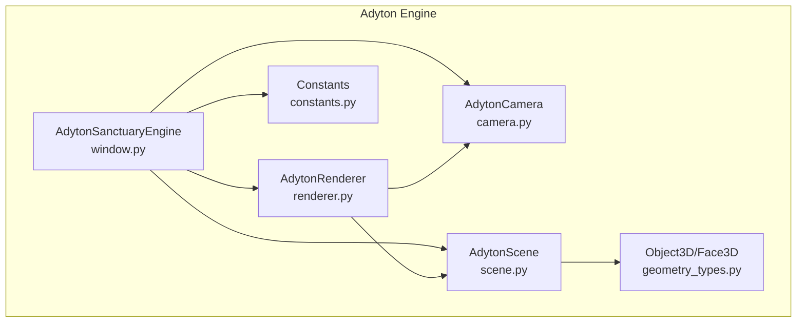
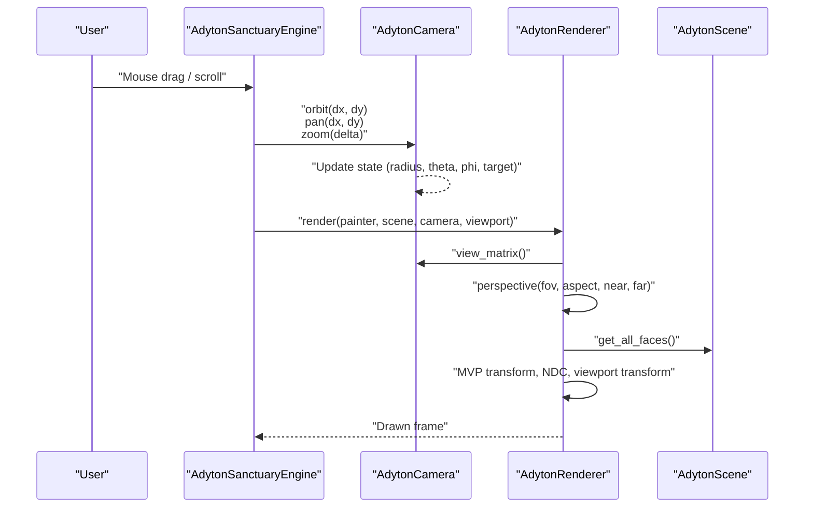
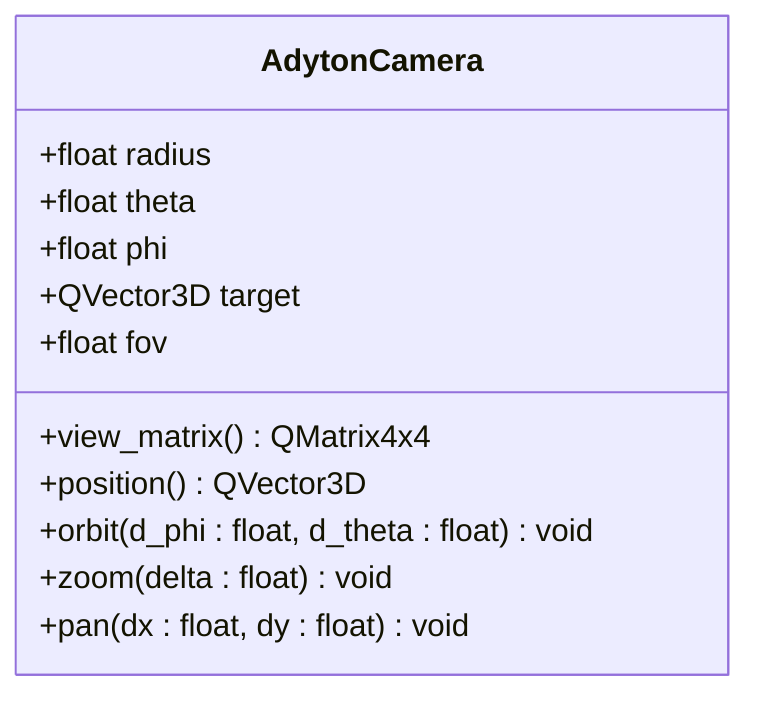
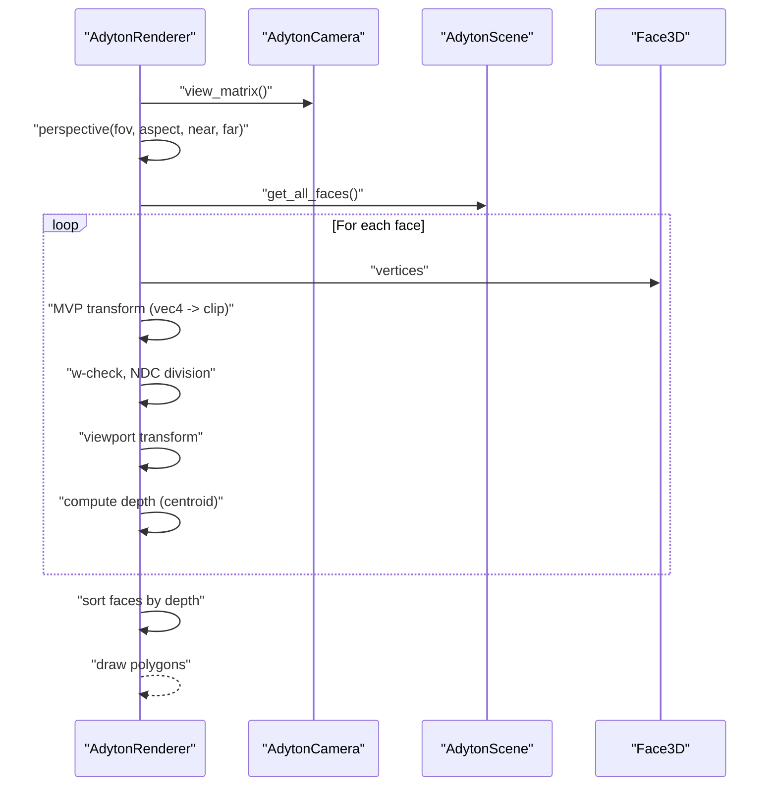
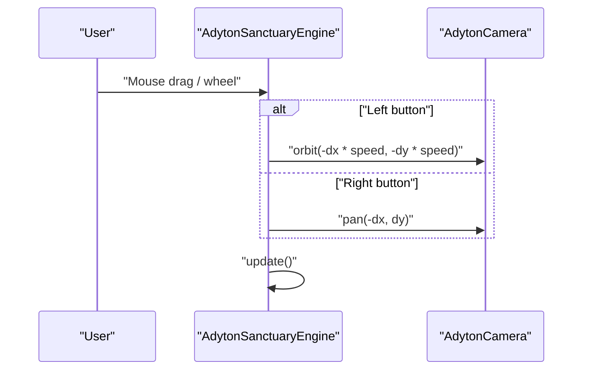
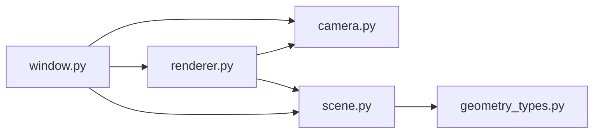

# Camera System

<cite>
**Referenced Files in This Document**
- [camera.py](file://src/pillars/adyton/ui/engine/camera.py)
- [window.py](file://src/pillars/adyton/ui/engine/window.py)
- [renderer.py](file://src/pillars/adyton/ui/engine/renderer.py)
- [scene.py](file://src/pillars/adyton/ui/engine/scene.py)
- [geometry_types.py](file://src/pillars/adyton/models/geometry_types.py)
- [constants.py](file://src/pillars/adyton/constants.py)
- [verification_seal.py](file://scripts/verification_seal.py)
</cite>

## Table of Contents
1. [Introduction](#introduction)
2. [Project Structure](#project-structure)
3. [Core Components](#core-components)
4. [Architecture Overview](#architecture-overview)
5. [Detailed Component Analysis](#detailed-component-analysis)
6. [Dependency Analysis](#dependency-analysis)
7. [Performance Considerations](#performance-considerations)
8. [Troubleshooting Guide](#troubleshooting-guide)
9. [Conclusion](#conclusion)
10. [Appendices](#appendices)

## Introduction
This document explains the Adyton Camera System implemented in camera.py and its role in controlling viewpoint navigation within the 3D sanctuary. It covers orbiting, panning, and zooming mechanics, internal state management, coordinate system alignment with sacred geometry principles, integration with user input via AdytonSanctuaryEngine’s mouse event handlers, public API methods, usage examples from verification_seal.py, camera matrix generation for the rendering pipeline, and the impact of field-of-view settings on visualization. It also addresses common navigation issues, their solutions, and performance implications.

## Project Structure
The camera system resides in the Adyton pillar under the engine package. It integrates with the scene graph, renderer, and the interactive window widget.

**Diagram sources**
- [camera.py](file://src/pillars/adyton/ui/engine/camera.py#L1-L75)
- [scene.py](file://src/pillars/adyton/ui/engine/scene.py#L1-L38)
- [renderer.py](file://src/pillars/adyton/ui/engine/renderer.py#L1-L102)
- [window.py](file://src/pillars/adyton/ui/engine/window.py#L1-L98)
- [geometry_types.py](file://src/pillars/adyton/models/geometry_types.py#L1-L57)
- [constants.py](file://src/pillars/adyton/constants.py#L1-L40)

**Section sources**
- [camera.py](file://src/pillars/adyton/ui/engine/camera.py#L1-L75)
- [window.py](file://src/pillars/adyton/ui/engine/window.py#L1-L98)
- [renderer.py](file://src/pillars/adyton/ui/engine/renderer.py#L1-L102)
- [scene.py](file://src/pillars/adyton/ui/engine/scene.py#L1-L38)
- [geometry_types.py](file://src/pillars/adyton/models/geometry_types.py#L1-L57)
- [constants.py](file://src/pillars/adyton/constants.py#L1-L40)

## Core Components
- AdytonCamera: Maintains spherical coordinates (radius, theta, phi), target, and field of view. Provides view matrix generation and navigation methods (orbit, pan, zoom).
- AdytonRenderer: Builds view and projection matrices, transforms 3D faces to screen space, sorts by depth, and draws.
- AdytonSanctuaryEngine: Widget hosting the engine, handling mouse events and delegating camera updates.
- AdytonScene: Scene container aggregating Object3D instances and exposing world-space faces for rendering.
- Object3D/Face3D: 3D primitives with TRS transformations and centroid computation for depth sorting.
- Constants: Sacred geometry constants used to construct the sanctuary (e.g., wall heights and proportions).

Key responsibilities:
- Navigation: orbit, pan, zoom update camera state.
- Coordinate system: spherical-to-Cartesian conversion with Y-up convention.
- Rendering pipeline: view/projection matrices and painter’s algorithm.
- User input: mouse drag and scroll mapped to camera controls.

**Section sources**
- [camera.py](file://src/pillars/adyton/ui/engine/camera.py#L1-L75)
- [renderer.py](file://src/pillars/adyton/ui/engine/renderer.py#L1-L102)
- [window.py](file://src/pillars/adyton/ui/engine/window.py#L1-L98)
- [scene.py](file://src/pillars/adyton/ui/engine/scene.py#L1-L38)
- [geometry_types.py](file://src/pillars/adyton/models/geometry_types.py#L1-L57)
- [constants.py](file://src/pillars/adyton/constants.py#L1-L40)

## Architecture Overview
The camera system participates in a classic software rasterization pipeline:
- Input: Mouse events captured by the window widget.
- Update: Camera state modified (orbit, pan, zoom).
- Render: Renderer composes view and projection matrices, transforms faces, sorts, and paints.

**Diagram sources**
- [window.py](file://src/pillars/adyton/ui/engine/window.py#L73-L97)
- [camera.py](file://src/pillars/adyton/ui/engine/camera.py#L31-L75)
- [renderer.py](file://src/pillars/adyton/ui/engine/renderer.py#L28-L102)
- [scene.py](file://src/pillars/adyton/ui/engine/scene.py#L29-L38)

## Detailed Component Analysis

### AdytonCamera
The camera maintains:
- Spherical coordinates: radius (distance), theta (pitch from vertical), phi (yaw around vertical).
- Target: the point the camera looks at.
- Field of view: degrees for perspective projection.
- Methods:
  - view_matrix(): builds a view matrix using a look-at function with a fixed up-vector aligned to the Y-up coordinate system.
  - position(): converts spherical coordinates to Cartesian using standard formulas with Y-up convention.
  - orbit(d_phi, d_theta): rotates around the target; clamps pitch to avoid gimbal lock near poles.
  - zoom(delta): moves closer/further; enforces a minimum radius.
  - pan(dx, dy): shifts the target in camera-local X/Y directions computed from forward/up vectors.

Coordinate system alignment:
- Y-up convention is used consistently across position(), view_matrix(), and pan().
- The up-vector is fixed to (0, 1, 0), which implies no roll during orbit/pan; this simplifies navigation and aligns with typical 3D viewers.

Field-of-view impact:
- The renderer constructs a perspective projection using camera.fov, aspect ratio, and near/far planes. Higher FOV increases perceived motion and magnifies distortion at edges; lower FOV reduces distortion and emphasizes center detail.

Usage example from verification_seal.py:
- Demonstrates initializing AdytonCamera, calling orbit(), and performing a smoke-test render pass.

**Section sources**
- [camera.py](file://src/pillars/adyton/ui/engine/camera.py#L1-L75)
- [verification_seal.py](file://scripts/verification_seal.py#L125-L165)

#### Class Diagram

**Diagram sources**
- [camera.py](file://src/pillars/adyton/ui/engine/camera.py#L14-L75)

### AdytonRenderer
Responsibilities:
- Build view matrix from camera.
- Construct perspective projection matrix using camera.fov, viewport aspect ratio, and near/far planes.
- Combine matrices (VP) and transform each vertex to clip space, then to NDC and screen coordinates.
- Compute face centroids for depth sorting (painter’s algorithm).
- Draw polygons with brush and pen.

Projection and viewport transforms:
- Perspective projection uses camera.fov and aspect ratio derived from the viewport.
- Near-plane clipping checks w-component to discard invalid projections.
- Viewport transform maps NDC to screen coordinates, accounting for Qt’s Y-down convention.

Depth sorting:
- Uses distance from camera to face centroid for painter’s algorithm ordering.

**Section sources**
- [renderer.py](file://src/pillars/adyton/ui/engine/renderer.py#L1-L102)

#### Sequence Diagram: Rendering Pipeline

**Diagram sources**
- [renderer.py](file://src/pillars/adyton/ui/engine/renderer.py#L28-L102)
- [geometry_types.py](file://src/pillars/adyton/models/geometry_types.py#L10-L31)

### AdytonSanctuaryEngine (Window)
Responsibilities:
- Hosts scene, camera, and renderer.
- Initializes test geometry and adjusts camera to frame the structure.
- Handles mouse press/move/release and wheel events:
  - Left drag: orbit (scaled sensitivity).
  - Right drag: pan.
  - Wheel: zoom.

Integration with camera:
- Delegates orbit/pan/zoom calls to the camera and triggers repaint.

**Section sources**
- [window.py](file://src/pillars/adyton/ui/engine/window.py#L1-L98)

#### Sequence Diagram: Mouse Interaction to Camera Update

**Diagram sources**
- [window.py](file://src/pillars/adyton/ui/engine/window.py#L73-L97)
- [camera.py](file://src/pillars/adyton/ui/engine/camera.py#L54-L75)

### Scene and Geometry Types
- AdytonScene aggregates Object3D instances and exposes world-space faces for rendering. It ensures world transforms are updated before projection.
- Object3D applies TRS transforms to cached world faces; Face3D computes centroid for depth sorting.

These components enable the renderer to operate on transformed geometry without recomputing transforms per pixel.

**Section sources**
- [scene.py](file://src/pillars/adyton/ui/engine/scene.py#L1-L38)
- [geometry_types.py](file://src/pillars/adyton/models/geometry_types.py#L1-L57)

### Coordinate System and Sacred Geometry Alignment
- Y-up coordinate system is used consistently across camera and renderer.
- The initial camera target is aligned to the central height of the sanctuary walls, reflecting the intended vertical axis of the structure.
- Constants define proportional dimensions (e.g., wall height) that inform camera placement and framing.

**Section sources**
- [camera.py](file://src/pillars/adyton/ui/engine/camera.py#L31-L36)
- [window.py](file://src/pillars/adyton/ui/engine/window.py#L47-L53)
- [constants.py](file://src/pillars/adyton/constants.py#L13-L19)

## Dependency Analysis
The camera system exhibits clean layering:
- Window depends on Camera, Scene, and Renderer.
- Renderer depends on Camera and Scene.
- Scene depends on Geometry types.
- No circular dependencies were observed among these modules.

**Diagram sources**
- [window.py](file://src/pillars/adyton/ui/engine/window.py#L1-L98)
- [camera.py](file://src/pillars/adyton/ui/engine/camera.py#L1-L75)
- [renderer.py](file://src/pillars/adyton/ui/engine/renderer.py#L1-L102)
- [scene.py](file://src/pillars/adyton/ui/engine/scene.py#L1-L38)
- [geometry_types.py](file://src/pillars/adyton/models/geometry_types.py#L1-L57)

**Section sources**
- [window.py](file://src/pillars/adyton/ui/engine/window.py#L1-L98)
- [camera.py](file://src/pillars/adyton/ui/engine/camera.py#L1-L75)
- [renderer.py](file://src/pillars/adyton/ui/engine/renderer.py#L1-L102)
- [scene.py](file://src/pillars/adyton/ui/engine/scene.py#L1-L38)
- [geometry_types.py](file://src/pillars/adyton/models/geometry_types.py#L1-L57)

## Performance Considerations
- Matrix composition cost: Building view and projection matrices per frame is O(1); negligible compared to per-vertex operations.
- Per-face transform cost: For each face, the renderer transforms all vertices and projects them. Complexity is O(F*V) where F is number of faces and V is average vertices per face.
- Sorting cost: Painter’s algorithm sorts projected faces by depth; complexity is O(F log F). For large scenes, consider spatial partitioning or coarse depth bins.
- Near-plane clipping: Early rejection of invalid projections avoids unnecessary work.
- Zoom limits: Enforcing a minimum radius prevents extreme near-plane clipping artifacts and improves numerical stability.
- FOV impact: Higher FOV increases distortion and edge magnification, potentially increasing the number of pixels affected by interpolation and antialiasing.

[No sources needed since this section provides general guidance]

## Troubleshooting Guide
Common issues and solutions:
- Camera flips or spins uncontrollably near poles:
  - Cause: Excessive theta values leading to gimbal lock.
  - Fix: Clamp theta within safe bounds (already enforced).
- Camera jumps when crossing axes:
  - Cause: Phi wrapping at boundaries.
  - Fix: Treat phi as continuous; clamp or normalize in higher-level logic if needed.
- Panning feels inverted:
  - Cause: Axis orientation mismatch between screen and camera space.
  - Fix: Verify sign conventions in pan() and adjust sensitivity.
- Objects disappear at extreme zoom:
  - Cause: Near-plane clipping threshold.
  - Fix: Increase near plane or enforce a minimum radius.
- Distorted edges at wide FOV:
  - Cause: Perspective distortion.
  - Fix: Reduce FOV or adjust viewport scaling.

**Section sources**
- [camera.py](file://src/pillars/adyton/ui/engine/camera.py#L54-L75)
- [renderer.py](file://src/pillars/adyton/ui/engine/renderer.py#L35-L40)

## Conclusion
The Adyton Camera System provides robust 6-DOF navigation within the 3D sanctuary using a spherical coordinate model, Y-up coordinate system, and a clear separation between camera state and rendering. Its integration with AdytonSanctuaryEngine enables intuitive mouse-driven orbit, pan, and zoom. The renderer’s software rasterization pipeline efficiently projects geometry to screen space, while FOV and near/far settings influence visualization quality and performance. Following the troubleshooting tips and best practices outlined here will help maintain smooth, predictable navigation and rendering.

## Appendices

### Public API Reference

- AdytonCamera
  - orbit(d_phi: float, d_theta: float) -> None
    - Rotates the camera around the target. d_phi is yaw change; d_theta is pitch change. Pitch is clamped to avoid poles.
  - pan(dx: float, dy: float) -> None
    - Pans the target in camera-local X/Y directions computed from forward and up vectors.
  - zoom(delta: float) -> None
    - Moves the camera closer or further; radius is clamped to a minimum value.
  - view_matrix() -> QMatrix4x4
    - Returns the view matrix using a look-at with a fixed up-vector aligned to Y-up.
  - position() -> QVector3D
    - Converts spherical coordinates to Cartesian using Y-up convention.

- AdytonRenderer
  - render(painter: QPainter, scene: AdytonScene, camera: AdytonCamera, viewport: QRect) -> None
    - Builds view and projection matrices, transforms faces, sorts by depth, and draws.

- AdytonSanctuaryEngine
  - Mouse drag (left/right) -> orbit()/pan()
  - Wheel -> zoom()

- Usage example path
  - [verification_seal.py](file://scripts/verification_seal.py#L125-L165)

**Section sources**
- [camera.py](file://src/pillars/adyton/ui/engine/camera.py#L31-L75)
- [renderer.py](file://src/pillars/adyton/ui/engine/renderer.py#L28-L102)
- [window.py](file://src/pillars/adyton/ui/engine/window.py#L73-L97)
- [verification_seal.py](file://scripts/verification_seal.py#L125-L165)