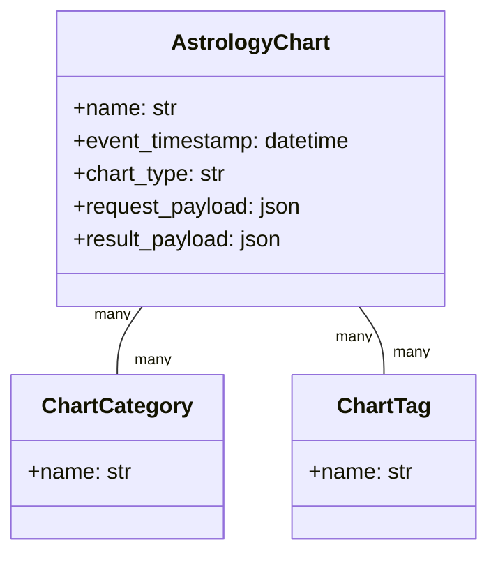

# The Grimoire of Astrology

<!-- Last Verified: 2026-01-01 -->

> *"The stars incline; they do not compel."*

The **Astrology Pillar** is the Keeper of Time and Celestial Mechanics. It calculates the precise positions of the Wanderers (Planets) and the Houses, allowing the Magus to map the heavens at any moment.

---

## I. The Engine of Heaven (Theory)

We rely on **OpenAstro2** and **Swiss Ephemeris (pyswisseph)** for high-precision astronomical calculations.
- **Accuracy**: Swiss Ephemeris is the gold standard for astrometric precision.
- **Topocentric**: Calculations account for the observer's specific latitude, longitude, and elevation.

### Supported Systems
- **Zodiacs**: Tropical (Standard), Sidereal (Configurable).
- **House Systems**: Placidus (Default), Koch, Equal, Whole Sign, Porphyry, Regiomontanus, Campanus, Alcabitius, Morinus.

---

## II. The Anatomy of a Chart (Data Model)

A Chart is a snapshot of the cosmos. It is stored as an `AstrologyChart` entity.

### The Schema (`AstrologyChart`)

| Field | Type | Description |
|-------|------|-------------|
| `id` | Integer | Primary Key |
| `name` | String | "Crowley Nativity" |
| `event_timestamp` | DateTime | UTC Moment of the event |
| `location_label` | String | "Leamington Spa, UK" |
| `latitude/longitude` | Float | Decimal degrees |
| `chart_type` | String | "Radix" (Natal), "Transit", "Synastry" |
| `request_payload` | JSON | The exact parameters used to generate it |
| `result_payload` | JSON | The cached planetary positions |
| `categories` | Many-to-Many | "Natal", "Event", "Election" |

---

## III. The Rites (API Reference)

### 1. The Chart Storage Service
**Location**: `src/pillars/astrology/services/chart_storage_service.py`

The Librarian of Charts.
- `save_chart(name, request, result, ...)`: Persists a calculation.
- `load_chart(id)`: Rehydrates the specific OpenAstro parameters.
- `search(text)`: Finds charts by name or location.

### 2. The OpenAstro Service
**Location**: `src/pillars/astrology/services/openastro_service.py`

The Calculator.
- `generate_chart(request)`: Calls the external `openastro` library.
    - Logic: Converts our `AstrologyEvent` domain model into `openastro`'s strict kwargs.
    - Output: Returns a `ChartResult` with SVG paths and planetary data.

### 3. The Location Lookup
**Location**: `src/pillars/astrology/services/location_lookup.py`

The Geographer.
- `search(query)`: Queries **Open-Meteo API** to find lat/long/elevation for a city name.

---

## IV. Specialized Artifacts

### The Eclipse Clock
See [Eclipse Patterns](ECLIPSE_PATTERNS.md) for details on the Neo-Aubrey Eclipse Clock mechanism.

### The Ephemeris Generator
The `PlanetaryPositionsWindow` can generate CSV/Matrix exports of planetary motion over time, useful for finding transits or elections.

> *"As Above, So Below."*
