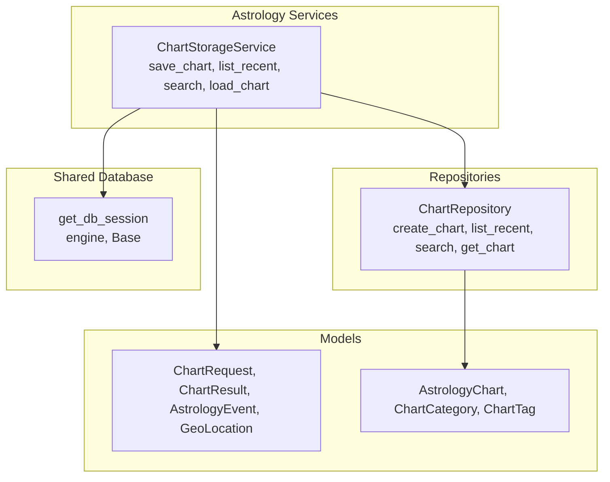

# Chart Storage Service

<cite>
**Referenced Files in This Document**
- [chart_storage_service.py](file://src/pillars/astrology/services/chart_storage_service.py)
- [chart_models.py](file://src/pillars/astrology/models/chart_models.py)
- [chart_record.py](file://src/pillars/astrology/models/chart_record.py)
- [chart_repository.py](file://src/pillars/astrology/repositories/chart_repository.py)
- [database.py](file://src/shared/database.py)
- [test_chart_storage_service.py](file://test/test_chart_storage_service.py)
</cite>

## Table of Contents
1. [Introduction](#introduction)
2. [Project Structure](#project-structure)
3. [Core Components](#core-components)
4. [Architecture Overview](#architecture-overview)
5. [Detailed Component Analysis](#detailed-component-analysis)
6. [Dependency Analysis](#dependency-analysis)
7. [Performance Considerations](#performance-considerations)
8. [Troubleshooting Guide](#troubleshooting-guide)
9. [Conclusion](#conclusion)
10. [Appendices](#appendices)

## Introduction
This document provides API documentation for the ChartStorageService class in the Astrology pillar. It focuses on:
- Persisting natal chart definitions via save_chart, including request parameters, serialization, and database transaction handling
- Retrieving chart summaries via list_recent and search with filtering by categories and tags
- Serialization between ChartRequest objects and database payloads using _serialize_request and _deserialize_request helpers
- Data models LoadedChart and SavedChartSummary used by the service interface
- Examples of saving a natal chart, retrieving recent charts, and searching by text query
- Error handling for database operations
- Relationship between ChartStorageService and ChartRepository
- Guidance on session management and thread safety considerations

## Project Structure
The Astrology pillar organizes persistence and service logic as follows:
- Services: orchestrate operations and handle serialization
- Repositories: encapsulate SQL operations and transactions
- Models: define domain and persistence data structures
- Shared database: provides session factories and engine configuration

**Diagram sources**
- [chart_storage_service.py](file://src/pillars/astrology/services/chart_storage_service.py#L1-L205)
- [chart_repository.py](file://src/pillars/astrology/repositories/chart_repository.py#L1-L139)
- [chart_models.py](file://src/pillars.astrology/models/chart_models.py#L1-L133)
- [chart_record.py](file://src/pillars/astrology/models/chart_record.py#L1-L99)
- [database.py](file://src/shared/database.py#L1-L53)

**Section sources**
- [chart_storage_service.py](file://src/pillars/astrology/services/chart_storage_service.py#L1-L205)
- [chart_repository.py](file://src/pillars/astrology/repositories/chart_repository.py#L1-L139)
- [chart_models.py](file://src/pillars.astrology/models/chart_models.py#L1-L133)
- [chart_record.py](file://src/pillars/astrology/models/chart_record.py#L1-L99)
- [database.py](file://src/shared/database.py#L1-L53)

## Core Components
- ChartStorageService: High-level persistence facade for natal charts. Provides save_chart, list_recent, search, load_chart, and internal serialization helpers.
- ChartRepository: Encapsulates SQL operations for creating, loading, listing, and searching charts.
- Domain models: ChartRequest, ChartResult, AstrologyEvent, GeoLocation define the request/result contract.
- Persistence models: AstrologyChart, ChartCategory, ChartTag define the persisted entities.

Key responsibilities:
- save_chart: serializes ChartRequest and ChartResult, persists chart metadata and payloads, manages categories/tags, and returns the new record id
- list_recent: retrieves recent charts ordered by event timestamp
- search: filters by text, categories, and tags with ordering and limits
- load_chart: reconstructs ChartRequest from stored payload and returns LoadedChart
- Serialization helpers: convert between domain objects and JSON payloads

**Section sources**
- [chart_storage_service.py](file://src/pillars/astrology/services/chart_storage_service.py#L1-L205)
- [chart_repository.py](file://src/pillars/astrology/repositories/chart_repository.py#L1-L139)
- [chart_models.py](file://src/pillars.astrology/models/chart_models.py#L1-L133)
- [chart_record.py](file://src/pillars/astrology/models/chart_record.py#L1-L99)

## Architecture Overview
The service layer delegates to a repository for database operations. The service handles serialization/deserialization and constructs domain objects for the caller.

**Diagram sources**
- [chart_storage_service.py](file://src/pillars/astrology/services/chart_storage_service.py#L48-L82)
- [chart_repository.py](file://src/pillars/astrology/repositories/chart_repository.py#L21-L60)

**Section sources**
- [chart_storage_service.py](file://src/pillars/astrology/services/chart_storage_service.py#L48-L82)
- [chart_repository.py](file://src/pillars/astrology/repositories/chart_repository.py#L21-L60)

## Detailed Component Analysis

### ChartStorageService API
Public methods:
- save_chart: Persists a natal chart definition
- list_recent: Retrieves recent chart summaries
- search: Searches chart summaries by text, categories, and tags
- load_chart: Loads a chart and reconstructs the original request

Serialization helpers:
- _serialize_request: Converts ChartRequest to a dictionary payload
- _deserialize_request: Reconstructs ChartRequest from stored payload
- _serialize_event/_deserialize_event: Convert events to/from dictionaries
- _extract_house_system: Extracts house system from request settings

Data models:
- SavedChartSummary: Lightweight summary for listing/searching
- LoadedChart: Full loaded chart with reconstructed request and metadata

**Section sources**
- [chart_storage_service.py](file://src/pillars/astrology/services/chart_storage_service.py#L19-L205)

#### save_chart
Purpose:
- Serialize ChartRequest and ChartResult
- Persist chart metadata and payloads
- Resolve categories/tags
- Return the new record id

Parameters:
- name: str
- request: ChartRequest
- result: ChartResult
- categories: Sequence[str] (optional)
- tags: Sequence[str] (optional)
- description: Optional[str] (optional)

Processing logic:
- Serialize request and result payloads
- Extract house system from settings
- Open a session via session_factory
- Create record via ChartRepository.create_chart
- Commit and refresh the record
- Return record.id

Transaction handling:
- Uses a context manager to ensure session lifecycle
- ChartRepository.create_chart commits the transaction

Error handling:
- No explicit try/catch blocks in save_chart
- Database errors propagate to the caller

Examples:
- See test usage for round-trip save/load and search

**Section sources**
- [chart_storage_service.py](file://src/pillars/astrology/services/chart_storage_service.py#L48-L82)
- [chart_repository.py](file://src/pillars/astrology/repositories/chart_repository.py#L21-L60)
- [test_chart_storage_service.py](file://test/test_chart_storage_service.py#L48-L71)

#### list_recent
Purpose:
- Retrieve recent chart summaries ordered by event timestamp descending

Parameters:
- limit: int (default 20)

Processing logic:
- Open a session via session_factory
- Call ChartRepository.list_recent(limit)
- Convert each record to SavedChartSummary

Filtering:
- No filtering; returns up to limit most recent charts

**Section sources**
- [chart_storage_service.py](file://src/pillars/astrology/services/chart_storage_service.py#L83-L87)
- [chart_repository.py](file://src/pillars/astrology/repositories/chart_repository.py#L69-L75)

#### search
Purpose:
- Search chart summaries by text, categories, and tags

Parameters:
- text: Optional[str] (case-insensitive substring match on name or location_label)
- categories: Optional[Sequence[str]] (match all provided categories)
- tags: Optional[Sequence[str]] (match all provided tags)
- limit: int (default 50)

Processing logic:
- Open a session via session_factory
- Call ChartRepository.search with filters
- Order by event_timestamp desc and apply limit
- Convert each record to SavedChartSummary

Filtering behavior:
- text: OR between name and location_label
- categories/tags: AND across provided values (each category/tag must match)

**Section sources**
- [chart_storage_service.py](file://src/pillars/astrology/services/chart_storage_service.py#L89-L100)
- [chart_repository.py](file://src/pillars/astrology/repositories/chart_repository.py#L77-L106)

#### load_chart
Purpose:
- Load a chart by id and reconstruct the original ChartRequest

Parameters:
- chart_id: int

Processing logic:
- Open a session via session_factory
- Fetch record via ChartRepository.get_chart
- Deserialize request payload to ChartRequest
- Build LoadedChart with categories/tags and description

Return:
- LoadedChart or None if not found

**Section sources**
- [chart_storage_service.py](file://src/pillars/astrology/services/chart_storage_service.py#L102-L115)
- [chart_repository.py](file://src/pillars/astrology/repositories/chart_repository.py#L62-L67)

#### Serialization Helpers
- _serialize_request: Serializes ChartRequest to a dictionary including chart_type, include_svg, settings, primary_event, and optional reference_event
- _deserialize_request: Reconstructs ChartRequest from stored payload
- _serialize_event/_deserialize_event: Convert between AstrologyEvent and dictionary form
- _extract_house_system: Reads house system from settings

Complexity:
- O(n) for serialization/deserialization where n is the number of positions and events

**Section sources**
- [chart_storage_service.py](file://src/pillars/astrology/services/chart_storage_service.py#L120-L179)

### Data Models

**Diagram sources**
- [chart_models.py](file://src/pillars.astrology/models/chart_models.py#L1-L133)
- [chart_storage_service.py](file://src/pillars/astrology/services/chart_storage_service.py#L19-L37)

**Section sources**
- [chart_models.py](file://src/pillars.astrology/models/chart_models.py#L1-L133)
- [chart_storage_service.py](file://src/pillars/astrology/services/chart_storage_service.py#L19-L37)

### Persistence Models

**Diagram sources**
- [chart_record.py](file://src/pillars/astrology/models/chart_record.py#L1-L99)

**Section sources**
- [chart_record.py](file://src/pillars/astrology/models/chart_record.py#L1-L99)

### API Definitions

- save_chart
  - Method: POST (conceptual)
  - Path: Not exposed as HTTP endpoint; part of service API
  - Parameters:
    - name: string
    - request: ChartRequest
    - result: ChartResult
    - categories: array of strings (optional)
    - tags: array of strings (optional)
    - description: string (optional)
  - Returns: integer chart id
  - Errors: Propagates database exceptions

- list_recent
  - Method: GET (conceptual)
  - Path: Not exposed as HTTP endpoint; part of service API
  - Parameters:
    - limit: integer (default 20)
  - Returns: array of SavedChartSummary

- search
  - Method: GET (conceptual)
  - Path: Not exposed as HTTP endpoint; part of service API
  - Parameters:
    - text: string (optional)
    - categories: array of strings (optional)
    - tags: array of strings (optional)
    - limit: integer (default 50)
  - Returns: array of SavedChartSummary

- load_chart
  - Method: GET (conceptual)
  - Path: Not exposed as HTTP endpoint; part of service API
  - Parameters:
    - chart_id: integer
  - Returns: LoadedChart or null

**Section sources**
- [chart_storage_service.py](file://src/pillars/astrology/services/chart_storage_service.py#L48-L115)
- [chart_repository.py](file://src/pillars/astrology/repositories/chart_repository.py#L62-L106)

### Example Workflows

- Save a natal chart
  - Construct ChartRequest with primary_event and optional reference_event
  - Construct ChartResult with chart_type and positions
  - Call service.save_chart with name, request, result, categories, tags, description
  - Receive chart_id for later retrieval

- Retrieve recent charts
  - Call service.list_recent(limit)
  - Iterate SavedChartSummary entries

- Search by text query
  - Call service.search(text="substring", categories=[], tags=[], limit=50)
  - Filter results by categories/tags as needed

**Section sources**
- [test_chart_storage_service.py](file://test/test_chart_storage_service.py#L48-L71)
- [chart_storage_service.py](file://src/pillars/astrology/services/chart_storage_service.py#L83-L100)

### Serialization Flow

**Diagram sources**
- [chart_storage_service.py](file://src/pillars/astrology/services/chart_storage_service.py#L48-L82)
- [chart_repository.py](file://src/pillars/astrology/repositories/chart_repository.py#L21-L60)

**Section sources**
- [chart_storage_service.py](file://src/pillars/astrology/services/chart_storage_service.py#L48-L82)
- [chart_repository.py](file://src/pillars/astrology/repositories/chart_repository.py#L21-L60)

## Dependency Analysis

**Diagram sources**
- [chart_storage_service.py](file://src/pillars/astrology/services/chart_storage_service.py#L1-L205)
- [chart_repository.py](file://src/pillars/astrology/repositories/chart_repository.py#L1-L139)
- [chart_models.py](file://src/pillars.astrology/models/chart_models.py#L1-L133)
- [chart_record.py](file://src/pillars/astrology/models/chart_record.py#L1-L99)
- [database.py](file://src/shared/database.py#L1-L53)

**Section sources**
- [chart_storage_service.py](file://src/pillars/astrology/services/chart_storage_service.py#L1-L205)
- [chart_repository.py](file://src/pillars/astrology/repositories/chart_repository.py#L1-L139)
- [chart_models.py](file://src/pillars.astrology/models/chart_models.py#L1-L133)
- [chart_record.py](file://src/pillars/astrology/models/chart_record.py#L1-L99)
- [database.py](file://src/shared/database.py#L1-L53)

## Performance Considerations
- Transaction boundaries: save_chart performs a single commit per save operation; batching multiple saves within one transaction is recommended for bulk operations
- Indexing: AstrologyChart has indexes on name and location_label; consider adding indexes on frequently filtered fields if needed
- Payload sizes: request_payload and result_payload are JSON; keep ChartResult minimal to reduce storage overhead
- Pagination: list_recent and search support limit; use appropriate limits to control memory usage
- Categories/tags resolution: _resolve_categories and _resolve_tags perform lookups; caching repeated names can improve performance

[No sources needed since this section provides general guidance]

## Troubleshooting Guide
Common issues and resolutions:
- Database errors during save_chart: Exceptions propagate to the caller; wrap calls with try/catch and log details
- Empty search results: Verify text casing normalization and ensure categories/tags exist
- load_chart returns None: Indicates the chart_id does not exist
- Session lifecycle: Ensure session_factory yields a valid SQLAlchemy session; default get_db_session uses SQLite engine

**Section sources**
- [chart_storage_service.py](file://src/pillars/astrology/services/chart_storage_service.py#L48-L115)
- [chart_repository.py](file://src/pillars/astrology/repositories/chart_repository.py#L62-L106)
- [database.py](file://src/shared/database.py#L1-L53)

## Conclusion
ChartStorageService provides a clean facade for persisting and retrieving natal charts. It serializes domain objects into JSON payloads, manages categories/tags, and exposes simple APIs for saving, listing, searching, and loading charts. The service delegates persistence to ChartRepository and relies on shared database session management. Proper error handling and transaction boundaries should be considered at the caller level.

[No sources needed since this section summarizes without analyzing specific files]

## Appendices

### Relationship Between ChartStorageService and ChartRepository
- ChartStorageService orchestrates operations and handles serialization
- ChartRepository encapsulates SQL operations and transactions
- Both operate within the same session context provided by session_factory

**Section sources**
- [chart_storage_service.py](file://src/pillars/astrology/services/chart_storage_service.py#L48-L115)
- [chart_repository.py](file://src/pillars/astrology/repositories/chart_repository.py#L1-L139)

### Session Management and Thread Safety
- Session management: ChartStorageService accepts a session_factory callable; default uses get_db_session which yields a SQLAlchemy session and ensures closure
- Thread safety: Each method opens a session via the factory; avoid sharing sessions across threads. For multi-threaded environments, supply a thread-safe session_factory or use separate factories per thread

**Section sources**
- [chart_storage_service.py](file://src/pillars/astrology/services/chart_storage_service.py#L42-L43)
- [database.py](file://src/shared/database.py#L31-L53)