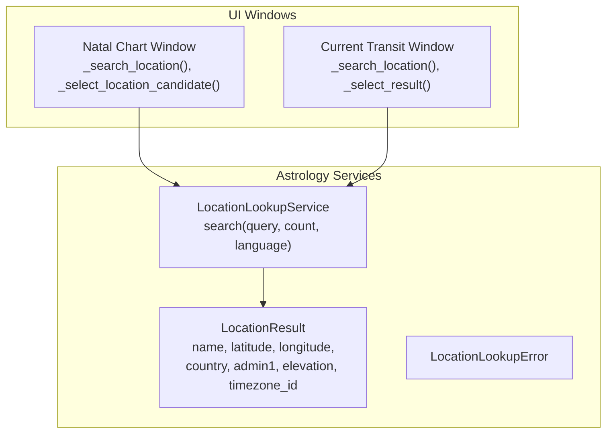
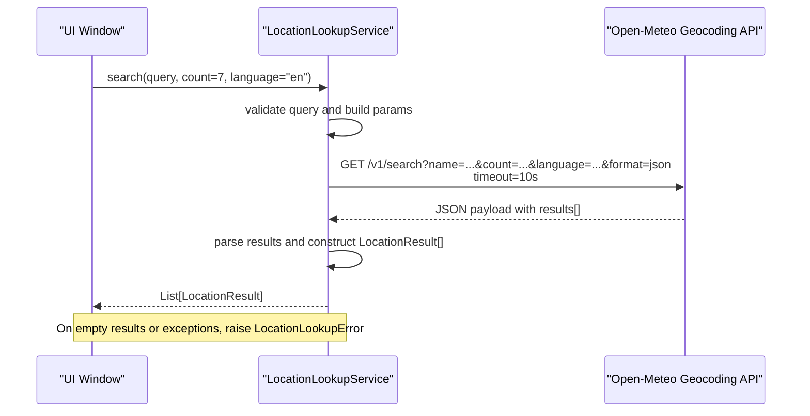
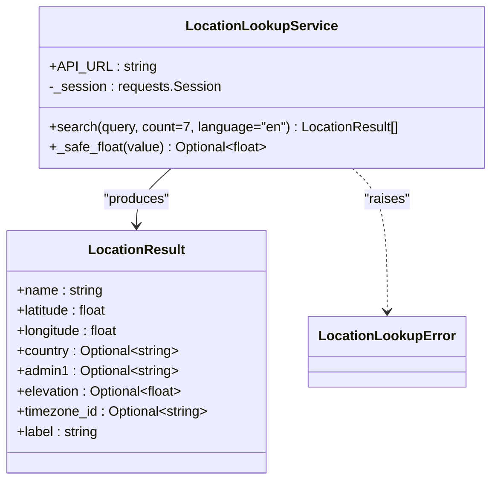
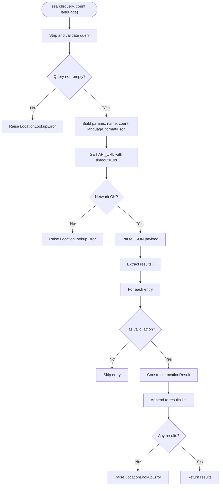
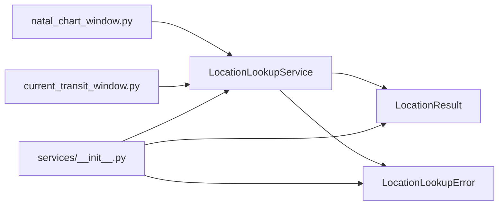

# Location Lookup Service

<cite>
**Referenced Files in This Document**
- [location_lookup.py](file://src/pillars/astrology/services/location_lookup.py)
- [natal_chart_window.py](file://src/pillars/astrology/ui/natal_chart_window.py)
- [current_transit_window.py](file://src/pillars/astrology/ui/current_transit_window.py)
- [__init__.py](file://src/pillars/astrology/services/__init__.py)
</cite>

## Table of Contents
1. [Introduction](#introduction)
2. [Project Structure](#project-structure)
3. [Core Components](#core-components)
4. [Architecture Overview](#architecture-overview)
5. [Detailed Component Analysis](#detailed-component-analysis)
6. [Dependency Analysis](#dependency-analysis)
7. [Performance Considerations](#performance-considerations)
8. [Troubleshooting Guide](#troubleshooting-guide)
9. [Conclusion](#conclusion)

## Introduction
This document describes the LocationLookupService that integrates with the Open-Meteo geocoding API to resolve human-readable location queries into geographic coordinates and associated metadata. It covers the search method’s parameter validation, HTTP request construction, response parsing, and the LocationResult data model. It also documents error handling using LocationLookupError, the use of requests.Session for connection pooling and timeouts, and practical usage patterns in the UI layers. Guidance is included for rate limiting, timeout tuning, and fallback strategies when the geocoding service is unavailable. Finally, it explains the _safe_float helper for robust numeric conversion of elevation data.

## Project Structure
The LocationLookupService resides in the astrology pillar’s services module and is consumed by UI windows for interactive location search and selection.

**Diagram sources**
- [location_lookup.py](file://src/pillars/astrology/services/location_lookup.py#L14-L89)
- [natal_chart_window.py](file://src/pillars/astrology/ui/natal_chart_window.py#L529-L578)
- [current_transit_window.py](file://src/pillars/astrology/ui/current_transit_window.py#L340-L394)

**Section sources**
- [location_lookup.py](file://src/pillars/astrology/services/location_lookup.py#L14-L89)
- [__init__.py](file://src/pillars/astrology/services/__init__.py#L1-L25)

## Core Components
- LocationLookupService: Encapsulates the Open-Meteo geocoding API integration, including parameter validation, HTTP request construction, response parsing, and error handling.
- LocationResult: Immutable data model representing a city/place result with name, coordinates, country/admin division, elevation, and timezone identifier.
- LocationLookupError: Domain-specific exception raised on invalid inputs, network failures, or empty results.

Key responsibilities:
- Parameter validation and normalization
- HTTP GET request to the Open-Meteo search endpoint with timeout
- JSON payload parsing and robust field extraction
- Elevation conversion via _safe_float
- Error propagation to UI layers

**Section sources**
- [location_lookup.py](file://src/pillars/astrology/services/location_lookup.py#L14-L89)

## Architecture Overview
The service is a thin client around the Open-Meteo geocoding API. It uses a shared requests.Session to enable connection reuse and configurable timeouts. The UI triggers searches, presents multiple candidates, and applies the selected result to form fields.

**Diagram sources**
- [location_lookup.py](file://src/pillars/astrology/services/location_lookup.py#L42-L82)
- [natal_chart_window.py](file://src/pillars/astrology/ui/natal_chart_window.py#L529-L578)
- [current_transit_window.py](file://src/pillars/astrology/ui/current_transit_window.py#L340-L394)

## Detailed Component Analysis

### LocationLookupService
- Purpose: Resolve a location query to a list of LocationResult entries using the Open-Meteo geocoding API.
- Endpoint: https://geocoding-api.open-meteo.com/v1/search
- Parameters:
  - name: trimmed query string
  - count: number of candidates to return (default 7)
  - language: response language (default "en")
  - format: JSON
- Timeout: 10 seconds per request
- Session: Uses a shared requests.Session for connection pooling and reuse.

Processing logic:
- Validates that the query is non-empty after trimming.
- Constructs query parameters and performs a GET request with timeout.
- Raises LocationLookupError on network/request errors.
- Parses the JSON payload, extracts results, and builds LocationResult objects.
- Skips entries with missing or invalid latitude/longitude.
- Converts elevation to float safely; if conversion fails, stores None.
- If no valid results are produced, raises LocationLookupError indicating no matches.

Error handling:
- Network failures: wraps requests exceptions in LocationLookupError with a user-facing message.
- Empty results: raises LocationLookupError when no candidates are returned.

Robustness:
- Uses _safe_float to tolerate malformed elevation values.
- Gracefully skips entries with missing coordinate fields.

**Section sources**
- [location_lookup.py](file://src/pillars/astrology/services/location_lookup.py#L34-L89)

#### Class Diagram

**Diagram sources**
- [location_lookup.py](file://src/pillars/astrology/services/location_lookup.py#L14-L89)

### LocationResult Data Model
Fields:
- name: Place/city name
- latitude: Decimal degrees
- longitude: Decimal degrees
- country: Country name or code (optional)
- admin1: First-level administrative division (optional)
- elevation: Elevation in meters (optional)
- timezone_id: IANA timezone identifier (optional)
- label: Computed property joining name, admin1, and country for display

Usage in UI:
- The UI constructs a human-friendly label for each candidate and allows users to select the intended location.
- Selected result is applied to latitude/longitude/elevation/timezone fields.

**Section sources**
- [location_lookup.py](file://src/pillars/astrology/services/location_lookup.py#L14-L32)
- [natal_chart_window.py](file://src/pillars/astrology/ui/natal_chart_window.py#L552-L578)
- [current_transit_window.py](file://src/pillars/astrology/ui/current_transit_window.py#L371-L394)

### Error Handling: LocationLookupError
- Raised when:
  - The query is empty or whitespace-only
  - The HTTP request fails (network, timeout, non-2xx)
  - The API returns no results
- UI behavior:
  - Displays an informational dialog for LocationLookupError
  - Displays a critical dialog for unexpected exceptions
  - Restores the cursor after the request completes

**Section sources**
- [location_lookup.py](file://src/pillars/astrology/services/location_lookup.py#L42-L82)
- [natal_chart_window.py](file://src/pillars/astrology/ui/natal_chart_window.py#L529-L578)
- [current_transit_window.py](file://src/pillars/astrology/ui/current_transit_window.py#L340-L394)

### HTTP Request Construction and Parsing Flow

**Diagram sources**
- [location_lookup.py](file://src/pillars/astrology/services/location_lookup.py#L42-L82)

### _safe_float Helper
Purpose: Safely convert elevation values to float, tolerating missing or invalid data.
Behavior:
- If value is None, returns None
- Attempts float conversion; on TypeError or ValueError, returns None
- Used to populate LocationResult.elevation

**Section sources**
- [location_lookup.py](file://src/pillars/astrology/services/location_lookup.py#L84-L89)

### UI Integration Patterns
- Both UI windows present a modal input for the query, set a wait cursor during the request, and handle LocationLookupError gracefully.
- When multiple results are returned, the UI presents a selection dialog and applies the chosen LocationResult to the form fields.
- The UI uses LocationResult.label for display and applies latitude/longitude/elevation/timezone accordingly.

Examples:
- Searching for major cities: The UI prompts for a city name, calls search(), and selects the top match if only one candidate is returned.
- Handling partial matches: When multiple candidates are returned, the UI lets the user pick the correct one.

**Section sources**
- [natal_chart_window.py](file://src/pillars/astrology/ui/natal_chart_window.py#L529-L578)
- [current_transit_window.py](file://src/pillars/astrology/ui/current_transit_window.py#L340-L394)

## Dependency Analysis
- Internal dependencies:
  - UI windows depend on LocationLookupService and LocationResult
  - LocationLookupService depends on requests.Session and the Open-Meteo API
- Exported interface:
  - The services package exports LocationLookupService, LocationResult, and LocationLookupError for consumption by UI and other layers

**Diagram sources**
- [natal_chart_window.py](file://src/pillars/astrology/ui/natal_chart_window.py#L529-L578)
- [current_transit_window.py](file://src/pillars/astrology/ui/current_transit_window.py#L340-L394)
- [location_lookup.py](file://src/pillars/astrology/services/location_lookup.py#L14-L89)
- [__init__.py](file://src/pillars/astrology/services/__init__.py#L1-L25)

**Section sources**
- [__init__.py](file://src/pillars/astrology/services/__init__.py#L1-L25)

## Performance Considerations
- Connection pooling: Using requests.Session enables HTTP keep-alive and reuse of TCP connections, reducing latency for repeated lookups.
- Timeout: The service enforces a 10-second timeout per request to prevent UI stalls under network congestion or API delays.
- Candidate count: The default count of 7 balances responsiveness with result diversity; adjust upward for ambiguous queries or downward for speed-sensitive scenarios.
- Rate limiting: The Open-Meteo geocoding API may enforce rate limits. Consider:
  - Backoff strategies on repeated failures
  - Caching frequent queries locally
  - Presenting fewer candidates to reduce request volume
- Fallback strategies:
  - Cache previous successful results keyed by query
  - Offer a “use approximate” mode with the first candidate when multiple results are ambiguous
  - Provide a manual coordinate entry fallback when network errors occur

[No sources needed since this section provides general guidance]

## Troubleshooting Guide
Common issues and resolutions:
- Empty query: The service raises LocationLookupError immediately. Ensure the query is non-empty before calling search().
- Network failures: Requests exceptions are wrapped as LocationLookupError. Verify connectivity and retry later.
- No results: If the API returns no candidates, the service raises LocationLookupError. Try refining the query (e.g., add country).
- Partial matches: The UI presents a selection dialog; choose the intended location from the list.
- Elevation parsing: If elevation is missing or invalid, it is treated as None. This does not block result processing.

UI-level handling:
- Information dialogs inform users of no results
- Critical dialogs surface unexpected errors
- Wait cursor indicates ongoing network activity

**Section sources**
- [location_lookup.py](file://src/pillars/astrology/services/location_lookup.py#L42-L82)
- [natal_chart_window.py](file://src/pillars/astrology/ui/natal_chart_window.py#L529-L578)
- [current_transit_window.py](file://src/pillars/astrology/ui/current_transit_window.py#L340-L394)

## Conclusion
The LocationLookupService provides a focused, robust integration with the Open-Meteo geocoding API. It validates inputs, manages HTTP requests with timeouts, parses structured results, and exposes a clean LocationResult model. The UI layers consume the service to deliver an intuitive search-and-select experience, with clear error handling and graceful fallbacks. For production deployments, consider caching, rate-limiting awareness, and user-configurable timeouts to balance responsiveness and reliability.