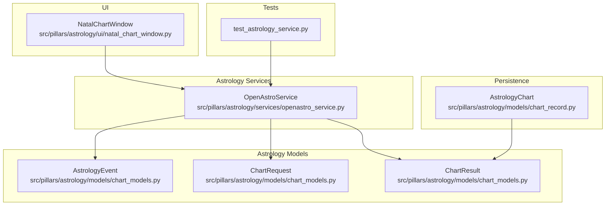
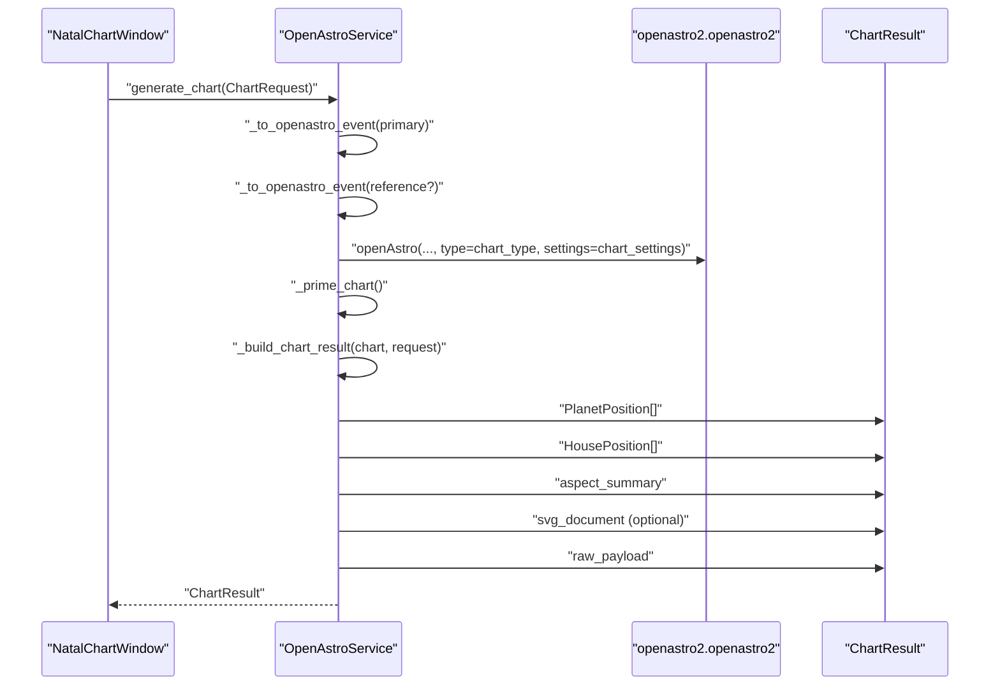
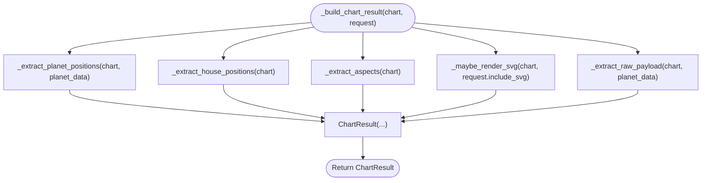
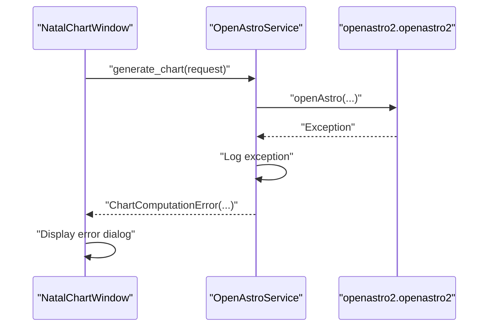
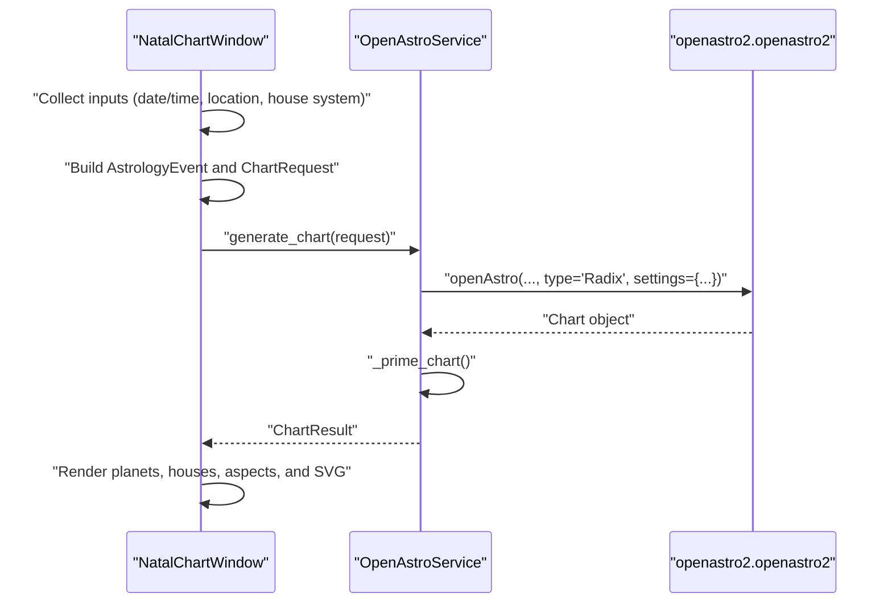
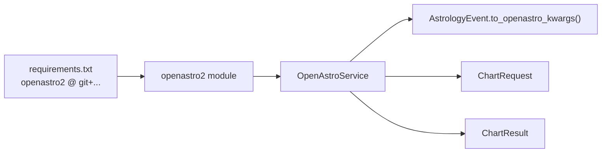

# OpenAstro Service

<cite>
**Referenced Files in This Document**
- [openastro_service.py](file://src/pillars/astrology/services/openastro_service.py)
- [chart_models.py](file://src/pillars/astrology/models/chart_models.py)
- [chart_record.py](file://src/pillars/astrology/models/chart_record.py)
- [natal_chart_window.py](file://src/pillars/astrology/ui/natal_chart_window.py)
- [test_astrology_service.py](file://test/test_astrology_service.py)
- [requirements.txt](file://requirements.txt)
</cite>

## Table of Contents
1. [Introduction](#introduction)
2. [Project Structure](#project-structure)
3. [Core Components](#core-components)
4. [Architecture Overview](#architecture-overview)
5. [Detailed Component Analysis](#detailed-component-analysis)
6. [Dependency Analysis](#dependency-analysis)
7. [Performance Considerations](#performance-considerations)
8. [Troubleshooting Guide](#troubleshooting-guide)
9. [Conclusion](#conclusion)
10. [Appendices](#appendices)

## Introduction
This document describes the OpenAstroService class that integrates the OpenAstro2 engine with IsopGem. It focuses on the generate_chart method that orchestrates chart creation by converting AstrologyEvent objects into OpenAstro2 parameters, computing planetary positions, house positions, aspects, and optionally rendering an SVG chart. It also documents default_settings and list_house_systems for configuration, the error handling strategy using OpenAstroNotAvailableError and ChartComputationError, and the internal helper methods that extract structured data from OpenAstro2’s raw output.

## Project Structure
The OpenAstroService resides in the astrology pillar under services and interacts with domain models and UI components.

**Diagram sources**
- [openastro_service.py](file://src/pillars/astrology/services/openastro_service.py#L1-L254)
- [chart_models.py](file://src/pillars/astrology/models/chart_models.py#L1-L133)
- [chart_record.py](file://src/pillars/astrology/models/chart_record.py#L1-L99)
- [natal_chart_window.py](file://src/pillars/astrology/ui/natal_chart_window.py#L1-L787)
- [test_astrology_service.py](file://test/test_astrology_service.py#L1-L46)

**Section sources**
- [openastro_service.py](file://src/pillars/astrology/services/openastro_service.py#L1-L254)
- [chart_models.py](file://src/pillars/astrology/models/chart_models.py#L1-L133)
- [chart_record.py](file://src/pillars/astrology/models/chart_record.py#L1-L99)
- [natal_chart_window.py](file://src/pillars/astrology/ui/natal_chart_window.py#L1-L787)
- [test_astrology_service.py](file://test/test_astrology_service.py#L1-L46)

## Core Components
- OpenAstroService: High-level orchestration for OpenAstro2, exposing generate_chart, default_settings, list_house_systems, and internal helpers.
- AstrologyEvent: Normalized event descriptor with conversion to OpenAstro2 kwargs.
- ChartRequest: Request model for chart generation with chart type, optional reference event, settings, and SVG inclusion flag.
- ChartResult: Structured output containing planets, houses, aspects, optional SVG, and raw payload.
- UI integration: NatalChartWindow wires OpenAstroService into the GUI and demonstrates usage patterns.

**Section sources**
- [openastro_service.py](file://src/pillars/astrology/services/openastro_service.py#L1-L254)
- [chart_models.py](file://src/pillars/astrology/models/chart_models.py#L1-L133)
- [natal_chart_window.py](file://src/pillars/astrology/ui/natal_chart_window.py#L1-L787)

## Architecture Overview
The service acts as a thin adapter around OpenAstro2, converting domain events to engine parameters, invoking computation, priming results, and extracting structured data. It returns a ChartResult enriched with raw payload for persistence or transport.

**Diagram sources**
- [openastro_service.py](file://src/pillars/astrology/services/openastro_service.py#L64-L139)
- [chart_models.py](file://src/pillars/astrology/models/chart_models.py#L74-L133)
- [natal_chart_window.py](file://src/pillars/astrology/ui/natal_chart_window.py#L316-L383)

## Detailed Component Analysis

### OpenAstroService API
- generate_chart(request: ChartRequest) -> ChartResult
  - Converts primary and optional reference AstrologyEvent to OpenAstro2 event parameters.
  - Builds chart settings from request.settings or default_settings().
  - Calls openAstro(...) with chart type and settings, then primes the chart.
  - Extracts planets, houses, aspects, SVG, and raw payload into ChartResult.
- default_settings() -> Dict[str, Any]
  - Returns a deep copy of the default OpenAstro settings template.
- list_house_systems() -> Dict[str, str]
  - Returns a dictionary of supported house systems and labels.

**Section sources**
- [openastro_service.py](file://src/pillars/astrology/services/openastro_service.py#L64-L101)
- [openastro_service.py](file://src/pillars/astrology/services/openastro_service.py#L95-L98)

### Data Models
- AstrologyEvent
  - Provides to_openastro_kwargs() to serialize into OpenAstro2-compatible parameters.
- ChartRequest
  - Holds primary_event, optional reference_event, chart_type, include_svg, and settings.
- ChartResult
  - Encapsulates chart_type, planet_positions, house_positions, aspect_summary, svg_document, and raw_payload.

**Section sources**
- [chart_models.py](file://src/pillars/astrology/models/chart_models.py#L33-L73)
- [chart_models.py](file://src/pillars/astrology/models/chart_models.py#L74-L83)
- [chart_models.py](file://src/pillars/astrology/models/chart_models.py#L85-L133)

### Internal Helper Methods
- _to_openastro_event(event: AstrologyEvent) -> Dict[str, Any]
  - Uses event.to_openastro_kwargs() and wraps it with openAstro.event(**payload).
- _prime_chart(chart: Any) -> None
  - Ensures chart.calcAstro() is invoked to populate computed attributes; raises ChartComputationError on failure.
- _build_chart_result(chart: Any, request: ChartRequest) -> ChartResult
  - Orchestrates extraction of planets, houses, aspects, SVG, and raw payload.
- _extract_planet_positions(chart: Any, planet_data: Dict[str, Dict[str, Any]]) -> List[PlanetPosition]
  - Builds PlanetPosition entries from either makePlanetDict() or chart attributes.
- _extract_house_positions(chart: Any) -> List[HousePosition]
  - Builds HousePosition entries from houses_degree_ut.
- _extract_aspects(chart: Any) -> Dict[str, Any]
  - Returns aspects from available attributes, preferring structured lists or falling back to text.
- _maybe_render_svg(chart: Any, include_svg: bool) -> Optional[str]
  - Renders SVG via chart.makeSVG2() when requested; logs and suppresses errors.
- _extract_raw_payload(chart: Any, planet_data: Dict[str, Dict[str, Any]]) -> Dict[str, Any]
  - Gathers raw chart attributes and planet details for downstream use.

**Diagram sources**
- [openastro_service.py](file://src/pillars/astrology/services/openastro_service.py#L124-L139)
- [openastro_service.py](file://src/pillars/astrology/services/openastro_service.py#L164-L201)
- [openastro_service.py](file://src/pillars/astrology/services/openastro_service.py#L203-L213)
- [openastro_service.py](file://src/pillars/astrology/services/openastro_service.py#L214-L225)
- [openastro_service.py](file://src/pillars/astrology/services/openastro_service.py#L226-L235)
- [openastro_service.py](file://src/pillars/astrology/services/openastro_service.py#L237-L253)

**Section sources**
- [openastro_service.py](file://src/pillars/astrology/services/openastro_service.py#L119-L139)
- [openastro_service.py](file://src/pillars/astrology/services/openastro_service.py#L141-L152)
- [openastro_service.py](file://src/pillars/astrology/services/openastro_service.py#L153-L201)
- [openastro_service.py](file://src/pillars/astrology/services/openastro_service.py#L203-L253)

### Error Handling Strategy
- OpenAstroNotAvailableError
  - Raised during OpenAstroService.__init__ when openastro2 is not installed.
- ChartComputationError
  - Raised when OpenAstro2 fails to compute or finalize the chart; wraps upstream exceptions.
- Internal logging
  - The service logs exceptions during chart computation and SVG rendering to aid diagnostics.

**Diagram sources**
- [openastro_service.py](file://src/pillars/astrology/services/openastro_service.py#L83-L93)
- [openastro_service.py](file://src/pillars/astrology/services/openastro_service.py#L141-L152)
- [openastro_service.py](file://src/pillars/astrology/services/openastro_service.py#L226-L235)
- [natal_chart_window.py](file://src/pillars/astrology/ui/natal_chart_window.py#L336-L345)

**Section sources**
- [openastro_service.py](file://src/pillars/astrology/services/openastro_service.py#L23-L29)
- [openastro_service.py](file://src/pillars/astrology/services/openastro_service.py#L52-L60)
- [openastro_service.py](file://src/pillars/astrology/services/openastro_service.py#L83-L93)
- [openastro_service.py](file://src/pillars/astrology/services/openastro_service.py#L141-L152)
- [openastro_service.py](file://src/pillars/astrology/services/openastro_service.py#L226-L235)
- [natal_chart_window.py](file://src/pillars/astrology/ui/natal_chart_window.py#L336-L345)

### Examples

#### Example 1: Generate a natal chart with Placidus houses
- Build an AstrologyEvent with a timestamp, GeoLocation, and optional timezone_offset.
- Create a ChartRequest with chart_type set to Radix, include_svg as desired, and settings specifying houses_system "P".
- Call OpenAstroService.generate_chart(request) to receive a ChartResult with planets, houses, aspects, and optional SVG.

**Diagram sources**
- [natal_chart_window.py](file://src/pillars/astrology/ui/natal_chart_window.py#L355-L383)
- [openastro_service.py](file://src/pillars/astrology/services/openastro_service.py#L64-L94)
- [openastro_service.py](file://src/pillars/astrology/services/openastro_service.py#L124-L139)

**Section sources**
- [natal_chart_window.py](file://src/pillars/astrology/ui/natal_chart_window.py#L355-L383)
- [openastro_service.py](file://src/pillars/astrology/services/openastro_service.py#L64-L94)
- [openastro_service.py](file://src/pillars/astrology/services/openastro_service.py#L124-L139)

#### Example 2: Retrieve default configuration settings
- Instantiate OpenAstroService and call default_settings() to obtain a deep copy of the default OpenAstro settings template.
- Modify the returned dictionary safely without affecting the service’s internal defaults.

**Section sources**
- [openastro_service.py](file://src/pillars/astrology/services/openastro_service.py#L99-L101)
- [test_astrology_service.py](file://test/test_astrology_service.py#L34-L46)

## Dependency Analysis
- External dependency: openastro2
  - Installed via requirements.txt as a Git requirement.
  - The service guards import and raises OpenAstroNotAvailableError if missing.
- Internal dependencies:
  - AstrologyEvent.to_openastro_kwargs() produces parameters consumed by openAstro.event().
  - ChartResult encapsulates the structured output for UI and persistence.

**Diagram sources**
- [requirements.txt](file://requirements.txt#L21-L23)
- [openastro_service.py](file://src/pillars/astrology/services/openastro_service.py#L17-L21)
- [chart_models.py](file://src/pillars/astrology/models/chart_models.py#L52-L71)
- [openastro_service.py](file://src/pillars/astrology/services/openastro_service.py#L119-L123)

**Section sources**
- [requirements.txt](file://requirements.txt#L21-L23)
- [openastro_service.py](file://src/pillars/astrology/services/openastro_service.py#L17-L21)
- [chart_models.py](file://src/pillars/astrology/models/chart_models.py#L52-L71)

## Performance Considerations
- Repeated chart calculations
  - The service caches default settings internally; subsequent calls to default_settings() return a deep copy of the cached template.
  - Consider reusing a single OpenAstroService instance across multiple requests to minimize initialization overhead.
- SVG rendering
  - SVG generation is optional and performed only when requested. Disabling SVG can reduce computation time and memory usage.
- Logging
  - Excessive logging can impact performance; adjust log levels appropriately in production environments.

[No sources needed since this section provides general guidance]

## Troubleshooting Guide
- Missing openastro2
  - Symptom: OpenAstroService.__init__ raises OpenAstroNotAvailableError.
  - Resolution: Install openastro2 per requirements.txt.
- Chart computation failures
  - Symptom: ChartComputationError raised during generate_chart or _prime_chart.
  - Resolution: Verify input parameters (AstrologyEvent), house system code, and timezone offsets. Check logs for upstream exceptions.
- SVG rendering failures
  - Symptom: SVG is None despite include_svg=True.
  - Resolution: The service logs and suppresses errors during SVG rendering; retry with a different house system or disable SVG to isolate the issue.

**Section sources**
- [openastro_service.py](file://src/pillars/astrology/services/openastro_service.py#L52-L60)
- [openastro_service.py](file://src/pillars/astrology/services/openastro_service.py#L83-L93)
- [openastro_service.py](file://src/pillars/astrology/services/openastro_service.py#L141-L152)
- [openastro_service.py](file://src/pillars/astrology/services/openastro_service.py#L226-L235)

## Conclusion
OpenAstroService provides a robust, testable interface to OpenAstro2, encapsulating event conversion, chart computation, and structured output extraction. It exposes sensible defaults, supports configurable house systems, and handles errors gracefully. Integrating with the UI demonstrates practical usage patterns for generating natal charts with Placidus houses and retrieving default configuration settings.

[No sources needed since this section summarizes without analyzing specific files]

## Appendices

### API Reference

- OpenAstroService.generate_chart(request: ChartRequest) -> ChartResult
  - Description: Generates a chart using OpenAstro2 based on the provided request.
  - Parameters:
    - request: ChartRequest containing primary_event, optional reference_event, chart_type, include_svg, and settings.
  - Returns: ChartResult with normalized data and optional SVG.
  - Exceptions: ChartComputationError on computation failures; OpenAstroNotAvailableError if dependency is missing.

- OpenAstroService.default_settings() -> Dict[str, Any]
  - Description: Returns a deep copy of the default OpenAstro settings template.
  - Notes: Safe to modify without affecting internal defaults.

- OpenAstroService.list_house_systems() -> Dict[str, str]
  - Description: Returns supported house systems and their labels.

- Internal helpers:
  - _to_openastro_event(event): Convert AstrologyEvent to OpenAstro2 event kwargs.
  - _prime_chart(chart): Invoke chart.calcAstro() to finalize computed attributes.
  - _build_chart_result(chart, request): Build ChartResult from extracted data.
  - _extract_planet_positions(chart, planet_data): Extract PlanetPosition list.
  - _extract_house_positions(chart): Extract HousePosition list.
  - _extract_aspects(chart): Extract aspects summary.
  - _maybe_render_svg(chart, include_svg): Render SVG when requested.
  - _extract_raw_payload(chart, planet_data): Gather raw chart attributes.

**Section sources**
- [openastro_service.py](file://src/pillars/astrology/services/openastro_service.py#L64-L101)
- [openastro_service.py](file://src/pillars/astrology/services/openastro_service.py#L119-L139)
- [openastro_service.py](file://src/pillars/astrology/services/openastro_service.py#L141-L253)
- [chart_models.py](file://src/pillars/astrology/models/chart_models.py#L74-L133)