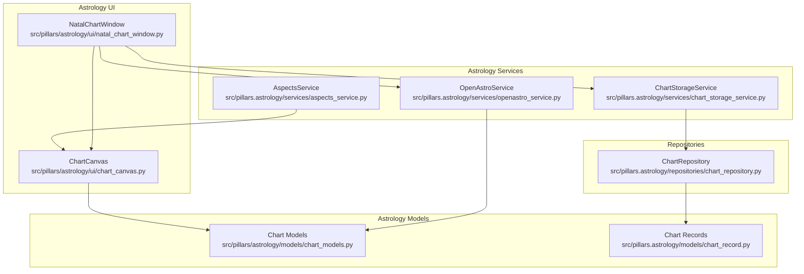
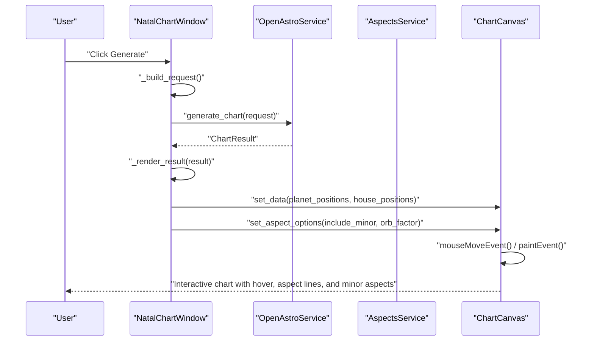
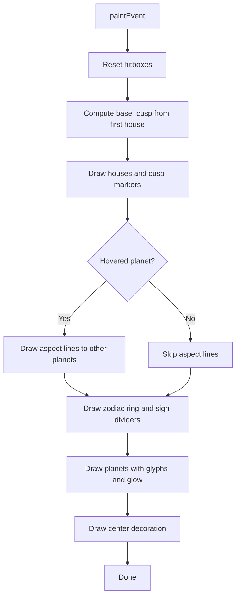
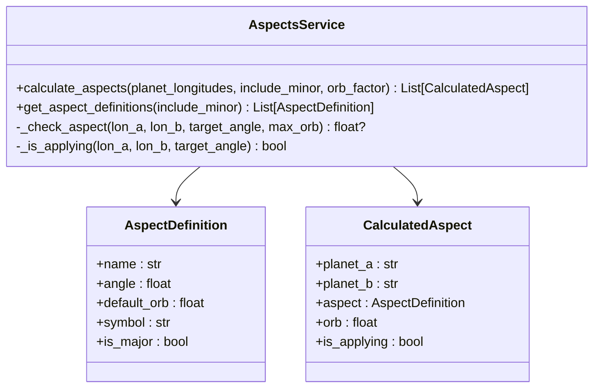
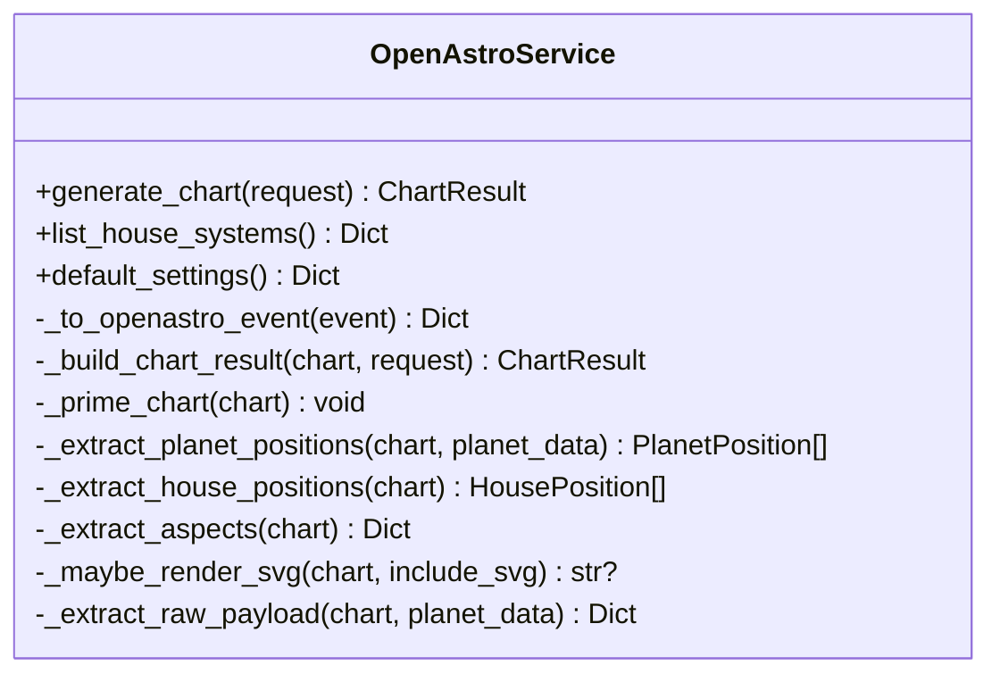
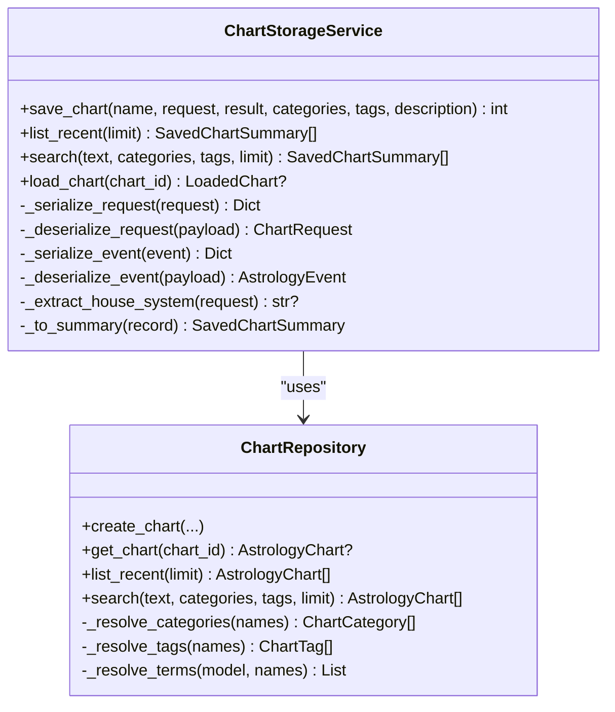
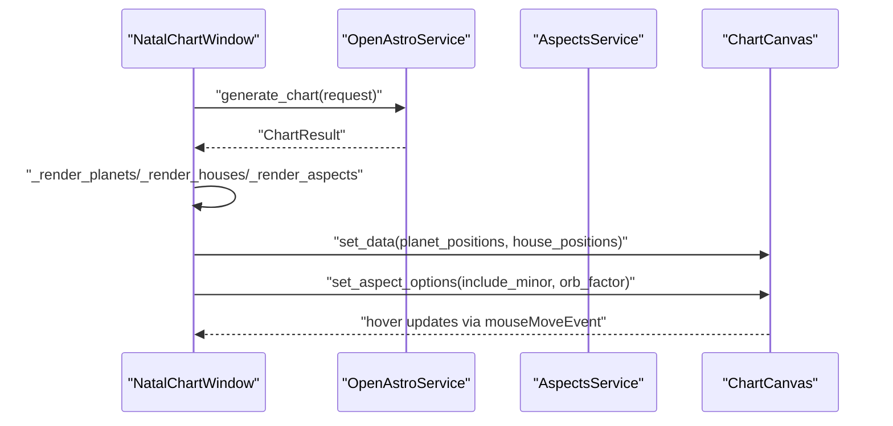
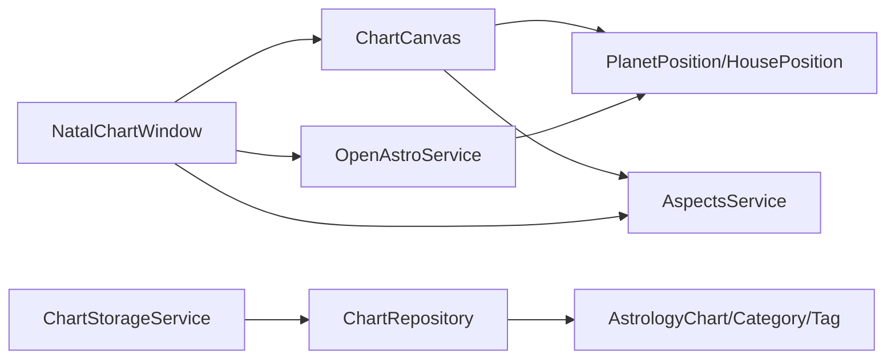

# Astrology Chart Canvas

<cite>
**Referenced Files in This Document**
- [chart_canvas.py](file://src/pillars/astrology/ui/chart_canvas.py)
- [chart_models.py](file://src/pillars/astrology/models/chart_models.py)
- [aspects_service.py](file://src/pillars/astrology/services/aspects_service.py)
- [natal_chart_window.py](file://src/pillars/astrology/ui/natal_chart_window.py)
</cite>

## Update Summary
**Changes Made**
- Updated documentation to reflect the new 'Celestia' dark theme with radial gradients
- Added details about interactive hover effects and dynamic aspect lines
- Incorporated support for minor aspects visualization
- Updated architectural diagrams to reflect new rendering pipeline
- Enhanced section on aspect visualization with new color scheme and display options

## Table of Contents
1. [Introduction](#introduction)
2. [Project Structure](#project-structure)
3. [Core Components](#core-components)
4. [Architecture Overview](#architecture-overview)
5. [Detailed Component Analysis](#detailed-component-analysis)
6. [Dependency Analysis](#dependency-analysis)
7. [Performance Considerations](#performance-considerations)
8. [Troubleshooting Guide](#troubleshooting-guide)
9. [Conclusion](#conclusion)

## Introduction
This document explains the Astrology Chart Canvas, a custom in-app renderer for natal and transit charts with the new 'Celestia' dark theme. It focuses on how the canvas receives data from the astrology pipeline, how it renders the zodiac ring, houses, planets, and aspects with enhanced visual effects, and how it integrates with the rest of the Astrology pillar (OpenAstro2 integration, persistence, and UI).

The canvas is implemented as a PyQt6 widget that draws celestial positions using vector graphics with radial gradients, featuring interactive hover feedback, dynamic aspect lines, and support for minor aspects visualization.

## Project Structure
The Astrology Chart Canvas lives in the Astrology pillar's UI layer and is used by the Natal Chart window. It consumes normalized chart data from the astrology models and is driven by the OpenAstro2 service.

**Diagram sources**
- [natal_chart_window.py](file://src/pillars/astrology/ui/natal_chart_window.py#L232-L246)
- [chart_canvas.py](file://src/pillars/astrology/ui/chart_canvas.py#L1-L120)
- [openastro_service.py](file://src/pillars.astrology/services/openastro_service.py#L64-L94)
- [chart_storage_service.py](file://src/pillars.astrology/services/chart_storage_service.py#L48-L82)
- [chart_models.py](file://src/pillars.astrology/models/chart_models.py#L85-L112)
- [chart_record.py](file://src/pillars.astrology/models/chart_record.py#L37-L60)
- [chart_repository.py](file://src/pillars.astrology/repositories/chart_repository.py#L21-L60)
- [aspects_service.py](file://src/pillars.astrology/services/aspects_service.py#L50-L123)

**Section sources**
- [README.md](file://README.md#L13-L24)
- [natal_chart_window.py](file://src/pillars/astrology/ui/natal_chart_window.py#L232-L246)

## Core Components
- ChartCanvas: A PyQt6 QWidget that renders the chart with 'Celestia' dark theme. It accepts lists of PlanetPosition and HousePosition and draws:
  - Radial gradient background with dark color scheme
  - Zodiac ring with sign markers and elegant typography
  - House cusps and labels with interactive highlighting
  - Planetary orbs with nature-based colors, glow effects, and glyph labels
  - Dynamic aspect lines from the hovered planet to others with neon colors
  - Interactive hover tooltips and cursor changes
  - Support for minor aspects visualization with distinct muted colors
- Chart models: PlanetPosition and HousePosition define the data contract for rendering.
- AspectsService: Provides comprehensive aspect calculation including minor aspects.
- OpenAstroService: Produces ChartResult with normalized positions and optional SVG.
- ChartStorageService and ChartRepository: Persist and load chart requests/results with categories/tags.

**Section sources**
- [chart_canvas.py](file://src/pillars/astrology/ui/chart_canvas.py#L1-L120)
- [chart_models.py](file://src/pillars/astrology/models/chart_models.py#L85-L112)
- [openastro_service.py](file://src/pillars.astrology/services/openastro_service.py#L64-L94)
- [chart_storage_service.py](file://src/pillars.astrology/services/chart_storage_service.py#L48-L82)
- [chart_repository.py](file://src/pillars.astrology/repositories/chart_repository.py#L21-L60)
- [aspects_service.py](file://src/pillars.astrology/services/aspects_service.py#L50-L123)

## Architecture Overview
The Natal Chart window orchestrates user input, builds a ChartRequest, calls OpenAstroService to compute a ChartResult, and then updates both the tabular report and the ChartCanvas. The canvas now supports aspect display options for minor aspects and orb factors.

**Diagram sources**
- [natal_chart_window.py](file://src/pillars/astrology/ui/natal_chart_window.py#L432-L461)
- [natal_chart_window.py](file://src/pillars/astrology/ui/natal_chart_window.py#L512-L519)
- [openastro_service.py](file://src/pillars.astrology/services/openastro_service.py#L64-L94)
- [chart_canvas.py](file://src/pillars/astrology/ui/chart_canvas.py#L100-L135)
- [chart_canvas.py](file://src/pillars/astrology/ui/chart_canvas.py#L145-L188)
- [aspects_service.py](file://src/pillars.astrology/services/aspects_service.py#L50-L123)

## Detailed Component Analysis

### ChartCanvas: Rendering Pipeline
ChartCanvas is a stateful widget that:
- Receives normalized positions via set_data
- Filters and prioritizes planetary bodies
- Computes hitboxes for hover detection
- Renders in layers: radial gradient background, houses, zodiac ring, planets, center decoration
- Draws dynamic aspect lines from the hovered planet to others with configurable options
- Formats tooltips with zodiacal degree strings
- Supports minor aspects visualization and adjustable orb factors

Key behaviors:
- Data filtering: Only major bodies are shown; "True Node" supersedes "Mean Node"
- Angle mapping: Aligns House I to the left (9 o'clock) relative to the first house cusp
- Aspect detection: Compares angular separation against fixed orbs and draws colored lines with neon colors for major aspects and muted colors for minor aspects
- Hover feedback: Updates tooltip, cursor, and highlights glow and label size for the hovered body
- Aspect options: Configurable display of minor aspects and orb factor scaling

**Diagram sources**
- [chart_canvas.py](file://src/pillars/astrology/ui/chart_canvas.py#L145-L188)
- [chart_canvas.py](file://src/pillars/astrology/ui/chart_canvas.py#L171-L183)
- [chart_canvas.py](file://src/pillars/astrology/ui/chart_canvas.py#L358-L414)

**Section sources**
- [chart_canvas.py](file://src/pillars/astrology/ui/chart_canvas.py#L72-L99)
- [chart_canvas.py](file://src/pillars/astrology/ui/chart_canvas.py#L100-L135)
- [chart_canvas.py](file://src/pillars/astrology/ui/chart_canvas.py#L145-L188)
- [chart_canvas.py](file://src/pillars/astrology/ui/chart_canvas.py#L195-L245)
- [chart_canvas.py](file://src/pillars/astrology/ui/chart_canvas.py#L246-L306)
- [chart_canvas.py](file://src/pillars/astrology/ui/chart_canvas.py#L307-L357)
- [chart_canvas.py](file://src/pillars/astrology/ui/chart_canvas.py#L358-L414)
- [chart_canvas.py](file://src/pillars/astrology/ui/chart_canvas.py#L415-L450)

### Data Models: PlanetPosition and HousePosition
These models carry the minimal data needed for rendering:
- PlanetPosition: name, degree, optional sign_index
- HousePosition: number, degree

They are populated by OpenAstroService and consumed by ChartCanvas and UI tables.

**Section sources**
- [chart_models.py](file://src/pillars/astrology/models/chart_models.py#L85-L112)

### AspectsService: Comprehensive Aspect Calculation
AspectsService provides comprehensive calculation of planetary aspects including both major and minor aspects. It supports configurable orb factors and returns detailed aspect information.

**Diagram sources**
- [aspects_service.py](file://src/pillars/astrology/services/aspects_service.py#L50-L123)

**Section sources**
- [aspects_service.py](file://src/pillars/astrology/services/aspects_service.py#L50-L123)

### OpenAstroService: Chart Computation
OpenAstroService wraps OpenAstro2, converting AstrologyEvent to OpenAstro events, computing charts, extracting positions, houses, aspects, and optionally SVG. It validates house systems and exposes default settings.

**Diagram sources**
- [openastro_service.py](file://src/pillars.astrology/services/openastro_service.py#L64-L94)
- [openastro_service.py](file://src/pillars.astrology/services/openastro_service.py#L124-L139)
- [openastro_service.py](file://src/pillars.astrology/services/openastro_service.py#L164-L201)
- [openastro_service.py](file://src/pillars.astrology/services/openastro_service.py#L203-L213)
- [openastro_service.py](file://src/pillars.astrology/services/openastro_service.py#L214-L236)
- [openastro_service.py](file://src/pillars.astrology/services/openastro_service.py#L237-L254)

**Section sources**
- [openastro_service.py](file://src/pillars.astrology/services/openastro_service.py#L31-L63)
- [openastro_service.py](file://src/pillars.astrology/services/openastro_service.py#L64-L94)

### Persistence: ChartStorageService and ChartRepository
ChartStorageService serializes/deserializes ChartRequest and ChartResult for persistence. ChartRepository handles creation, listing recent charts, and text/category/tag search.

**Diagram sources**
- [chart_storage_service.py](file://src/pillars/astrology/services/chart_storage_service.py#L48-L116)
- [chart_repository.py](file://src/pillars/astrology/repositories/chart_repository.py#L21-L107)

**Section sources**
- [chart_storage_service.py](file://src/pillars/astrology/services/chart_storage_service.py#L19-L47)
- [chart_repository.py](file://src/pillars/astrology/repositories/chart_repository.py#L12-L20)

### UI Integration: NatalChartWindow
NatalChartWindow wires the OpenAstroService, renders tabular results, and feeds ChartCanvas with normalized positions. It also manages persistence and default locations, and now synchronizes aspect display options with the canvas.

**Diagram sources**
- [natal_chart_window.py](file://src/pillars/astrology/ui/natal_chart_window.py#L432-L461)
- [natal_chart_window.py](file://src/pillars/astrology/ui/natal_chart_window.py#L512-L519)
- [chart_canvas.py](file://src/pillars/astrology/ui/chart_canvas.py#L100-L135)
- [aspects_service.py](file://src/pillars.astrology/services/aspects_service.py#L50-L123)

**Section sources**
- [natal_chart_window.py](file://src/pillars/astrology/ui/natal_chart_window.py#L232-L246)
- [natal_chart_window.py](file://src/pillars/astrology/ui/natal_chart_window.py#L432-L461)
- [natal_chart_window.py](file://src/pillars/astrology/ui/natal_chart_window.py#L512-L519)

## Dependency Analysis
- ChartCanvas depends on:
  - PyQt6 for rendering and input handling
  - Chart models for data
  - Conversion utilities for zodiacal formatting
  - AspectsService for aspect calculation logic
- NatalChartWindow depends on:
  - OpenAstroService for computation
  - ChartCanvas for visualization
  - ChartStorageService for persistence
  - AspectsService for comprehensive aspect calculations
- OpenAstroService depends on:
  - OpenAstro2 library (import guarded)
  - Astrology models for data conversion
- ChartStorageService depends on:
  - SQLAlchemy ORM models and repository for persistence

**Diagram sources**
- [chart_canvas.py](file://src/pillars/astrology/ui/chart_canvas.py#L1-L120)
- [chart_models.py](file://src/pillars/astrology/models/chart_models.py#L85-L112)
- [natal_chart_window.py](file://src/pillars/astrology/ui/natal_chart_window.py#L232-L246)
- [openastro_service.py](file://src/pillars.astrology/services/openastro_service.py#L64-L94)
- [chart_storage_service.py](file://src/pillars.astrology/services/chart_storage_service.py#L48-L82)
- [chart_repository.py](file://src/pillars/astrology/repositories/chart_repository.py#L21-L60)
- [chart_record.py](file://src/pillars/astrology/models/chart_record.py#L37-L60)
- [aspects_service.py](file://src/pillars.astrology/services/aspects_service.py#L50-L123)

**Section sources**
- [chart_canvas.py](file://src/pillars/astrology/ui/chart_canvas.py#L1-L120)
- [natal_chart_window.py](file://src/pillars/astrology/ui/natal_chart_window.py#L232-L246)
- [openastro_service.py](file://src/pillars.astrology/services/openastro_service.py#L64-L94)
- [chart_storage_service.py](file://src/pillars/astrology/services/chart_storage_service.py#L48-L82)
- [chart_repository.py](file://src/pillars/astrology/repositories/chart_repository.py#L21-L60)
- [aspects_service.py](file://src/pillars.astrology/services/aspects_service.py#L50-L123)

## Performance Considerations
- Rendering cost scales with the number of planets and houses; the canvas uses simple hitbox rectangles and avoids expensive operations in the paint loop.
- Aspect line drawing recalculates positions for hovered planet; this is acceptable for small datasets but could be optimized by caching positions if performance becomes a concern.
- Antialiasing is enabled for smooth visuals; keep the widget size reasonable to avoid excessive GPU/CPU work.
- Consider batching updates and deferring expensive operations off the UI thread if integrating with larger datasets.
- The radial gradient background provides visual depth without significant performance impact.

[No sources needed since this section provides general guidance]

## Troubleshooting Guide
Common issues and resolutions:
- OpenAstro2 not installed: The service raises a specific error when the dependency is missing. The UI disables the Generate button and shows a warning.
- No chart data: Ensure set_data is called with non-empty lists; otherwise, the canvas clears and no hover feedback occurs.
- Hover not responding: Verify mouse tracking is enabled and that hitboxes are being built in paintEvent.
- Incorrect house alignment: Confirm the first house cusp is passed; the canvas rotates so House I aligns to the left.
- Aspect lines not appearing: Hover a planet and ensure the difference angles fall within the defined orbs. Check that include_minor_aspects is set correctly.
- Minor aspects not displaying: Verify that set_aspect_options has been called with include_minor=True.

**Section sources**
- [openastro_service.py](file://src/pillars.astrology/services/openastro_service.py#L23-L30)
- [natal_chart_window.py](file://src/pillars/astrology/ui/natal_chart_window.py#L432-L461)
- [chart_canvas.py](file://src/pillars/astrology/ui/chart_canvas.py#L100-L135)
- [chart_canvas.py](file://src/pillars/astrology/ui/chart_canvas.py#L145-L188)
- [chart_canvas.py](file://src/pillars/astrology/ui/chart_canvas.py#L358-L414)
- [aspects_service.py](file://src/pillars.astrology/services/aspects_service.py#L50-L123)

## Conclusion
The Astrology Chart Canvas provides a fast, interactive, and visually rich rendering of natal and transit charts with the new 'Celestia' dark theme. It integrates tightly with the OpenAstroService for computation, AspectsService for comprehensive aspect calculations, and the persistence layer for saving/loading chart definitions. Its layered design keeps rendering logic isolated and testable, while the UI remains responsive and user-friendly. The addition of minor aspects support, dynamic aspect lines, and interactive hover effects enhances the user experience and analytical capabilities.

[No sources needed since this section summarizes without analyzing specific files]