# Astrology Pillar

<cite>
**Referenced Files in This Document**   
- [chart_record.py](file://src/pillars/astrology/models/chart_record.py)
- [chart_models.py](file://src/pillars/astrology/models/chart_models.py)
- [chart_repository.py](file://src/pillars/astrology/repositories/chart_repository.py)
- [chart_storage_service.py](file://src/pillars/astrology/services/chart_storage_service.py)
- [openastro_service.py](file://src/pillars/astrology/services/openastro_service.py)
- [location_lookup.py](file://src/pillars/astrology/services/location_lookup.py)
- [astrology_hub.py](file://src/pillars/astrology/ui/astrology_hub.py)
- [natal_chart_window.py](file://src/pillars/astrology/ui/natal_chart_window.py)
- [current_transit_window.py](file://src/pillars/astrology/ui/current_transit_window.py)
- [planetary_positions_window.py](file://src/pillars/astrology/ui/planetary_positions_window.py)
- [preferences.py](file://src/pillars/astrology/utils/preferences.py)
- [conversions.py](file://src/pillars/astrology/utils/conversions.py)
</cite>

## Table of Contents
1. [Introduction](#introduction)
2. [Core Data Models](#core-data-models)
3. [Chart Persistence Layer](#chart-persistence-layer)
4. [Chart Storage Service](#chart-storage-service)
5. [OpenAstro2 Integration](#openastro2-integration)
6. [Location Lookup Service](#location-lookup-service)
7. [User Interface Components](#user-interface-components)
8. [Configuration and Preferences](#configuration-and-preferences)
9. [Integration with TQ Pillar](#integration-with-tq-pillar)
10. [Troubleshooting Ephemeris Data](#troubleshooting-ephemeris-data)

## Introduction

The Astrology Pillar provides comprehensive astrological analysis capabilities through integration with OpenAstro2 and pyswisseph for astronomical calculations. This system enables the generation of natal charts, transit dashboards, and planetary position ephemerides with precise astronomical data. The architecture follows a clean separation of concerns with distinct layers for data modeling, persistence, service orchestration, and user interface components.

The pillar supports the creation, storage, and retrieval of astrological charts with rich metadata including categories, tags, and location information. It features a modern UI with multiple specialized windows for different astrological analyses, including natal chart generation, current transit viewing, and planetary position tracking over time. The system handles timezone calculations and location lookups through integration with external geocoding services.

**Section sources**
- [astrology_hub.py](file://src/pillars/astrology/ui/astrology_hub.py)

## Core Data Models

The Astrology Pillar utilizes a domain-driven design approach with clear separation between persistence models and domain models. The data models are organized into two main categories: persistence models for database storage and domain models for application logic.

### Persistence Models

The `AstrologyChart` model in `chart_record.py` represents the persistent storage of astrological charts with comprehensive metadata:

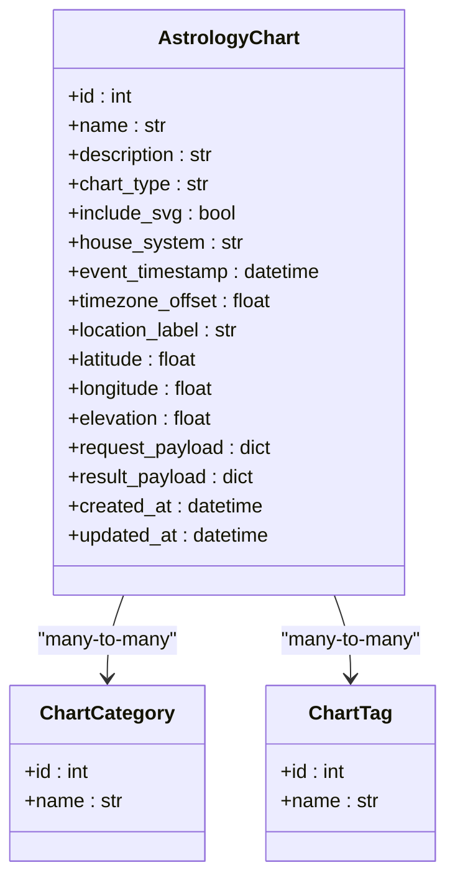

**Diagram sources**
- [chart_record.py](file://src/pillars/astrology/models/chart_record.py)

### Domain Models

The domain models in `chart_models.py` provide a clean interface for astrological concepts with data validation and serialization capabilities:

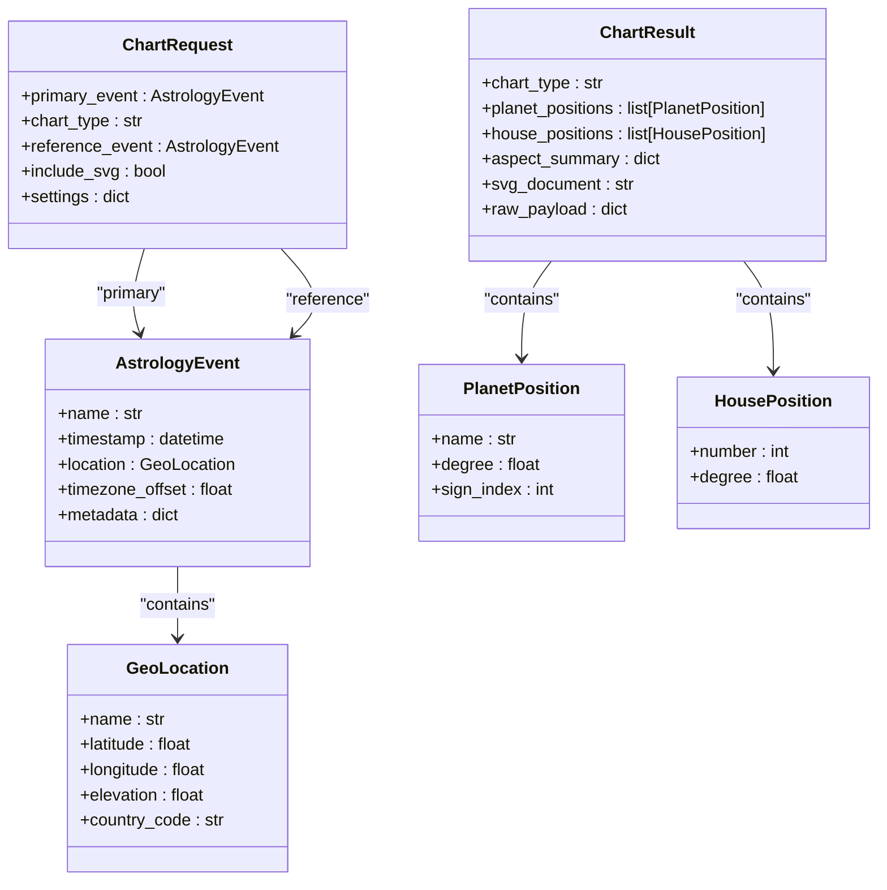

**Diagram sources**
- [chart_models.py](file://src/pillars/astrology/models/chart_models.py)

## Chart Persistence Layer

The persistence layer consists of the `ChartRepository` class that provides high-level CRUD operations for astrology charts. This repository abstracts the underlying SQLAlchemy operations and provides a clean interface for chart management.

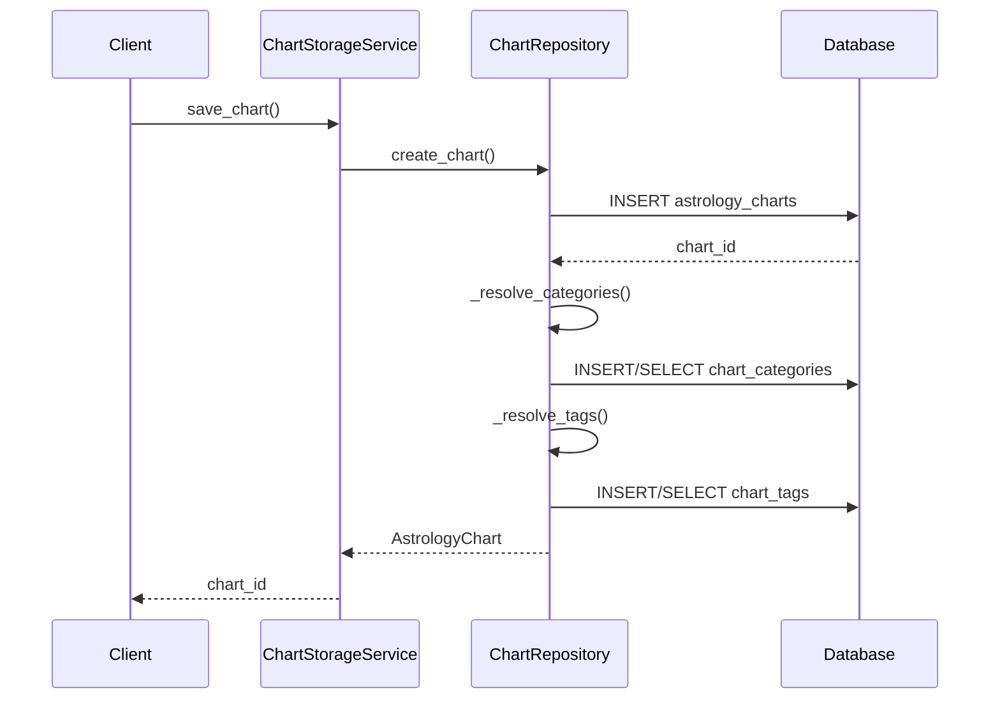

**Diagram sources**
- [chart_repository.py](file://src/pillars/astrology/repositories/chart_repository.py)

The repository implements several key methods:

- `create_chart()`: Creates a new chart record with associated categories and tags
- `get_chart()`: Retrieves a specific chart by ID
- `list_recent()`: Returns the most recently created charts
- `search()`: Performs text and metadata-based search across charts
- `_resolve_categories()` and `_resolve_tags()`: Handle the creation and lookup of category and tag records

The implementation uses SQLAlchemy's ORM with proper transaction management and includes helper methods for term resolution that ensure consistent categorization and tagging.

**Section sources**
- [chart_repository.py](file://src/pillars/astrology/repositories/chart_repository.py)

## Chart Storage Service

The `ChartStorageService` provides a high-level facade for chart persistence operations, abstracting the details of the repository layer and providing a clean API for the UI components.

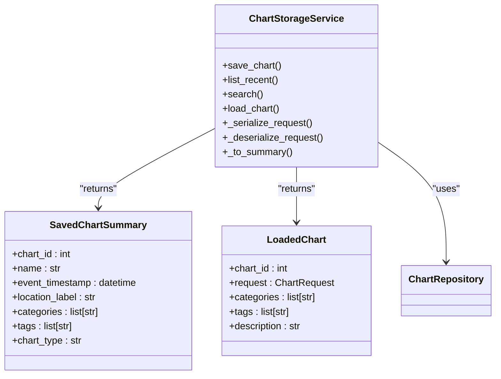

**Diagram sources**
- [chart_storage_service.py](file://src/pillars/astrology/services/chart_storage_service.py)

Key features of the storage service include:

- **Request/Result Serialization**: Converts between domain models and JSON-serializable dictionaries for persistence
- **Session Management**: Uses a session factory pattern for proper database connection handling
- **Data Transformation**: Maps between persistence models and simplified summary objects for UI display
- **Error Handling**: Wraps database operations with appropriate exception handling

The service provides methods for saving charts with full request and result data, listing recent charts, searching across chart metadata, and loading complete chart definitions for editing or analysis.

**Section sources**
- [chart_storage_service.py](file://src/pillars/astrology/services/chart_storage_service.py)

## OpenAstro2 Integration

The Astrology Pillar integrates with OpenAstro2 through the `OpenAstroService` class, which provides a clean wrapper around the OpenAstro2 library for generating astrological charts.

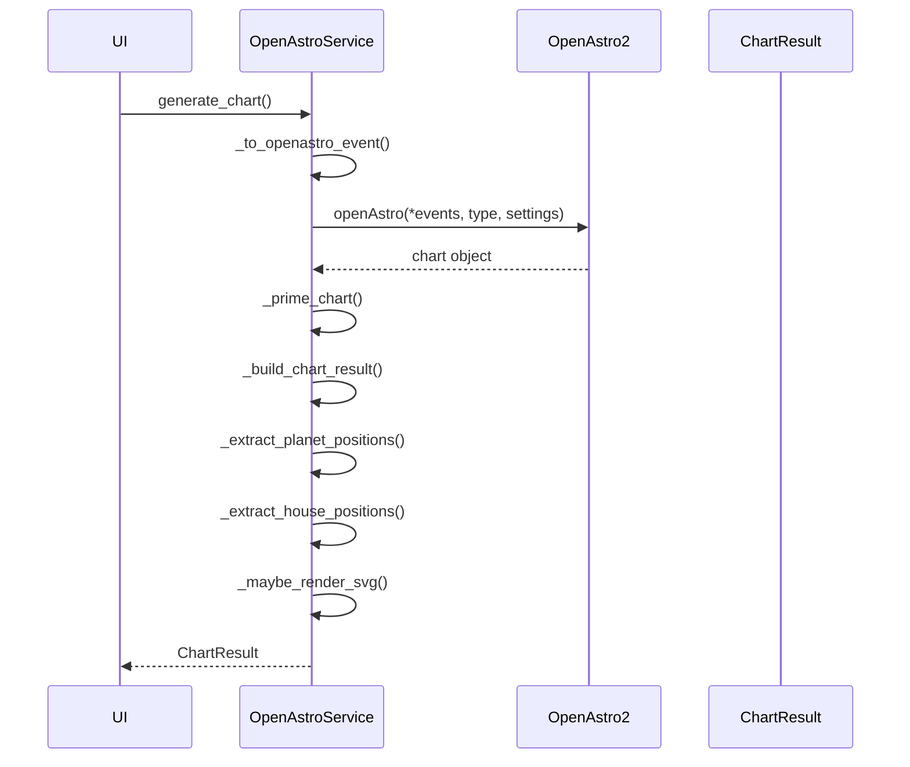

**Diagram sources**
- [openastro_service.py](file://src/pillars/astrology/services/openastro_service.py)

The integration includes several key components:

- **Error Handling**: Wraps potential import and runtime errors with custom exceptions like `OpenAstroNotAvailableError` and `ChartComputationError`
- **House System Support**: Maintains a mapping of house system codes to human-readable labels
- **Default Settings**: Provides sane default configuration for chart generation
- **Result Extraction**: Extracts planetary positions, house cusps, aspects, and SVG output from the OpenAstro2 result

The service handles the conversion between the application's domain models and the OpenAstro2 API requirements, including proper timezone handling and location formatting.

**Section sources**
- [openastro_service.py](file://src/pillars/astrology/services/openastro_service.py)

## Location Lookup Service

The `LocationLookupService` provides geocoding capabilities through integration with the Open-Meteo geocoding API, enabling users to search for locations by name and retrieve precise coordinates.

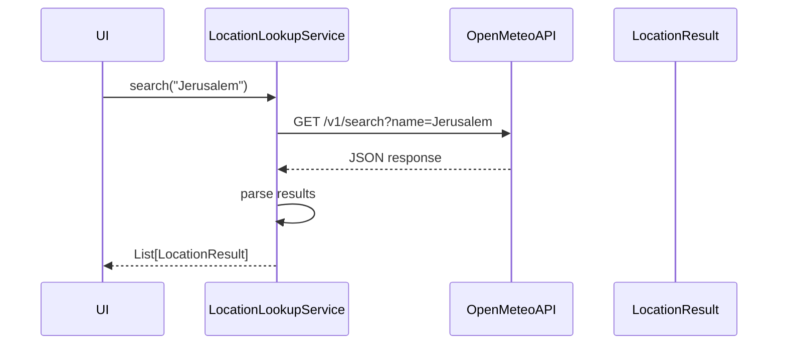

**Diagram sources**
- [location_lookup.py](file://src/pillars/astrology/services/location_lookup.py)

Key features of the location lookup service include:

- **API Integration**: Uses the Open-Meteo geocoding API endpoint
- **Result Parsing**: Converts API responses into `LocationResult` objects with standardized fields
- **Error Handling**: Manages network errors and empty result sets
- **Timezone Support**: Includes timezone ID in results for automatic timezone offset calculation

The service returns a list of `LocationResult` objects containing the location name, coordinates, elevation, administrative divisions, country, and timezone information, enabling accurate astrological calculations.

**Section sources**
- [location_lookup.py](file://src/pillars/astrology/services/location_lookup.py)

## User Interface Components

The Astrology Pillar provides a comprehensive set of UI components for different astrological analyses, all built using PyQt6.

### Astrology Hub

The `AstrologyHub` serves as the main entry point for the astrology tools, providing a centralized interface to launch various specialized windows.

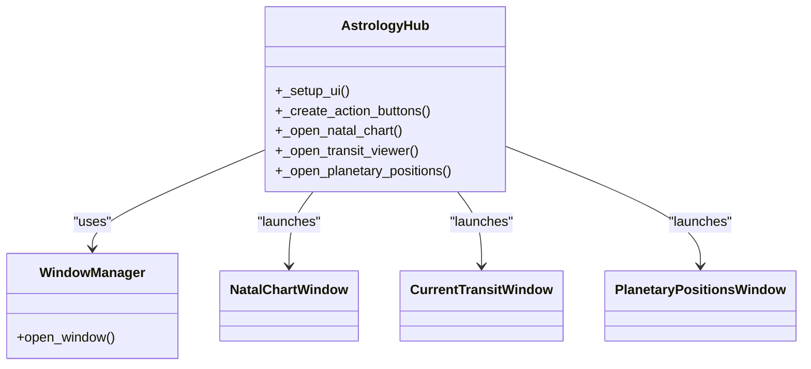

**Diagram sources**
- [astrology_hub.py](file://src/pillars/astrology/ui/astrology_hub.py)

### Natal Chart Window

The `NatalChartWindow` provides a comprehensive interface for creating and viewing natal charts:

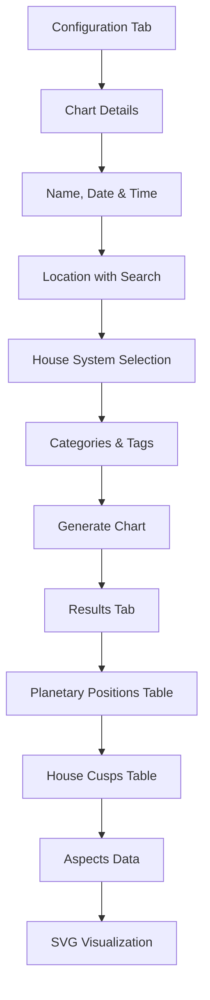

**Diagram sources**
- [natal_chart_window.py](file://src/pillars/astrology/ui/natal_chart_window.py)

The window supports:
- Location search with the Open-Meteo API
- Default location saving and loading
- Chart generation with OpenAstro2
- SVG visualization in external browsers
- Chart persistence with categories and tags
- Loading previously saved charts

### Current Transit Window

The `CurrentTransitWindow` displays the current planetary positions for a specified location:

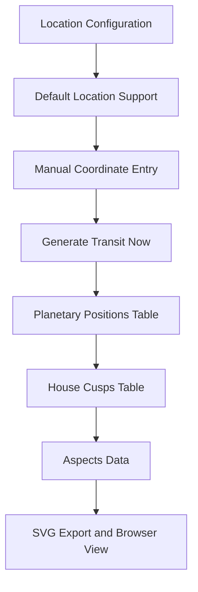

**Diagram sources**
- [current_transit_window.py](file://src/pillars/astrology/ui/current_transit_window.py)

### Planetary Positions Window

The `PlanetaryPositionsWindow` generates ephemeris-style tables of planetary positions over time:

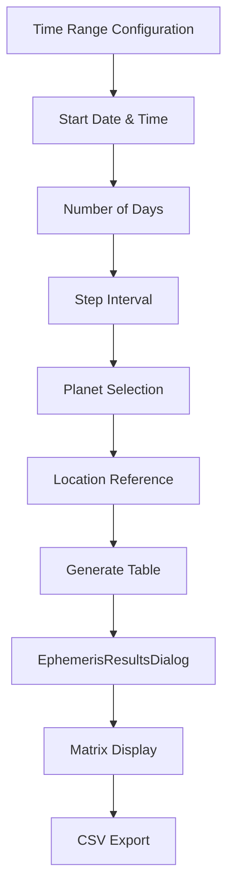

**Diagram sources**
- [planetary_positions_window.py](file://src/pillars/astrology/ui/planetary_positions_window.py)

This window allows users to:
- Configure time ranges and step intervals
- Select specific planets to include
- Use default or custom locations
- Generate ephemeris matrices
- Export results to CSV format

**Section sources**
- [astrology_hub.py](file://src/pillars/astrology/ui/astrology_hub.py)
- [natal_chart_window.py](file://src/pillars/astrology/ui/natal_chart_window.py)
- [current_transit_window.py](file://src/pillars/astrology/ui/current_transit_window.py)
- [planetary_positions_window.py](file://src/pillars/astrology/ui/planetary_positions_window.py)

## Configuration and Preferences

The Astrology Pillar includes a preferences system for storing user configuration, particularly the default location settings.

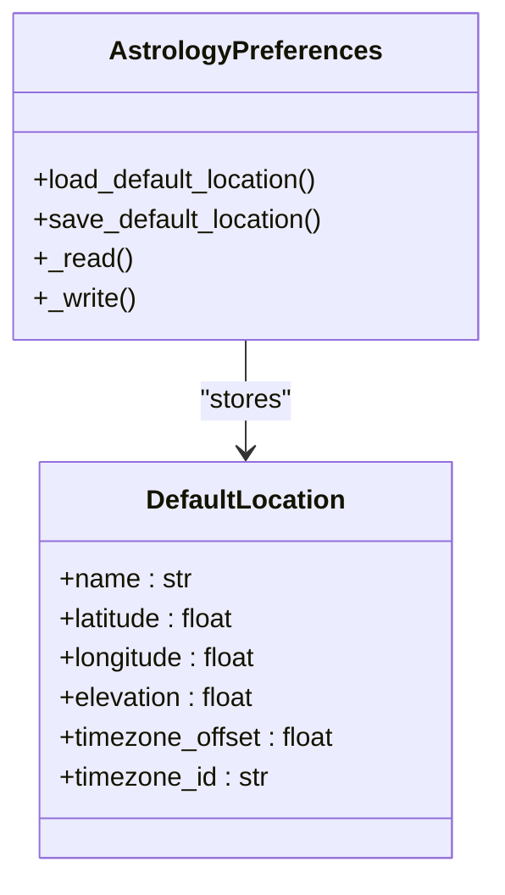

**Diagram sources**
- [preferences.py](file://src/pillars/astrology/utils/preferences.py)

The preferences are stored in a JSON file in the application's data directory and include:

- **Default Location**: The user's primary location for transit calculations
- **Coordinates**: Latitude, longitude, and elevation
- **Timezone Information**: Offset and timezone ID for accurate time calculations
- **Persistence**: Automatic saving and loading of preferences

The system also includes utility functions for converting between decimal degrees and zodiacal notation:

```python
def to_zodiacal_string(degree: float) -> str:
    """
    Convert absolute degree (0-360) to zodiacal degree notation (Deg Sign Min).
    Example: 12.5 -> 12° Aries 30'
    Example: 32.1 -> 2° Taurus 06'
    """
```

**Section sources**
- [preferences.py](file://src/pillars/astrology/utils/preferences.py)
- [conversions.py](file://src/pillars/astrology/utils/conversions.py)

## Integration with TQ Pillar

The Astrology Pillar is designed to integrate with the TQ (Theosophical Quotient) pillar for symbolic interpretations of astrological data. While the specific integration points are not detailed in the provided code, the architecture supports this integration through:

- **Shared Data Models**: The use of standardized data structures that can be consumed by other pillars
- **Event-Based Architecture**: The `AstrologyEvent` model can serve as input for symbolic interpretation services
- **Extensible Service Layer**: The service classes can be extended or decorated to include TQ interpretations
- **UI Component Integration**: The hub pattern allows for seamless addition of TQ-related tools

The integration would likely involve passing planetary positions, aspects, and other astrological data to TQ services for symbolic analysis and interpretation, with results potentially displayed alongside the standard astrological charts.

## Troubleshooting Ephemeris Data

When encountering issues with ephemeris data, consider the following common problems and solutions:

### Missing OpenAstro2 Dependency
**Symptom**: `OpenAstroNotAvailableError` when trying to generate charts
**Solution**: Ensure OpenAstro2 is installed via pip:
```bash
pip install openastro2
```

### Inaccurate Planetary Positions
**Symptom**: Planetary positions don't match expected values
**Solution**: 
- Verify the ephemeris files are properly installed
- Check that pyswisseph is correctly configured
- Ensure the correct house system is selected
- Validate the timezone and location data

### Location Lookup Failures
**Symptom**: Unable to find cities or coordinates
**Solution**:
- Check internet connectivity
- Verify the Open-Meteo API endpoint is accessible
- Ensure location names are spelled correctly
- Try alternative search terms

### SVG Rendering Issues
**Symptom**: SVG charts don't display or render incorrectly
**Solution**:
- Ensure the SVG rendering library is installed
- Check browser compatibility
- Verify the SVG data is properly generated
- Test with different browsers

### Performance Issues with Large Ephemerides
**Symptom**: Slow generation of ephemeris tables
**Solution**:
- Reduce the time range or step interval
- Limit the number of planets included
- Use caching for frequently accessed data
- Process data in batches

The system includes comprehensive error handling and logging to assist with troubleshooting, with detailed error messages provided to users when operations fail.

**Section sources**
- [openastro_service.py](file://src/pillars/astrology/services/openastro_service.py)
- [natal_chart_window.py](file://src/pillars/astrology/ui/natal_chart_window.py)
- [current_transit_window.py](file://src/pillars/astrology/ui/current_transit_window.py)
- [planetary_positions_window.py](file://src/pillars/astrology/ui/planetary_positions_window.py)