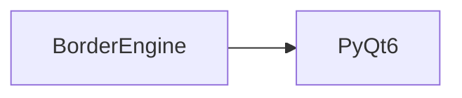

# BorderEngine API Reference

<!-- Last Verified: 2026-01-16 -->

<cite>
**Referenced Files in This Document**
- [src/pillars/correspondences/services/border_engine.py](file://src/pillars/correspondences/services/border_engine.py)
- [PyQt6.QtCore](file://PyQt6.QtCore)
</cite>

## Table of Contents
1. [Introduction](#introduction)
2. [Class Overview](#class-overview)
3. [Core Methods](#core-methods)
4. [Usage Examples](#usage-examples)
5. [Error Handling](#error-handling)
6. [Dependencies](#dependencies)
7. [Performance Considerations](#performance-considerations)

## Introduction

The Architect of Boundaries.
Calculates which cells need which borders based on selection topology.
Decouples the 'Math of Neighbors' from the 'UI of the Window'.

**Architectural Role**: [Documentation needed: Define role (Service/Model/View/Repository)]
- **Layer**: [Documentation needed: Which architectural layer]
- **Responsibilities**: - Determines the new border configuration for a set of selected indexes
- Updates the style (color, width) of existing borders without adding new ones
- **Dependencies**: PyQt6.QtCore
- **Consumers**: Unknown

## Class Overview

```python
class BorderEngine:
    """The Architect of Boundaries.
Calculates which cells need which borders based on selection topology.
Decouples the 'Math of Neighbors' from the 'UI of the Window'."""
```

[Documentation needed: Add class diagram showing relationships]

## Core Methods

### calculate_borders

```python
def calculate_borders(model, indexes, border_type, settings, border_role):
```

**Purpose**: Determines the new border configuration for a set of selected indexes.

**Parameters:**
- `model` (None): The Architect of Boundaries.
Calculates which cells need which borders based on selection topology.
Decouples the 'Math of Neighbors' from the 'UI of the Window'.
- `indexes` (None): The Architect of Boundaries.
Calculates which cells need which borders based on selection topology.
Decouples the 'Math of Neighbors' from the 'UI of the Window'.
- `border_type` (None): The Architect of Boundaries.
Calculates which cells need which borders based on selection topology.
Decouples the 'Math of Neighbors' from the 'UI of the Window'.
- `settings` (None): The Architect of Boundaries.
Calculates which cells need which borders based on selection topology.
Decouples the 'Math of Neighbors' from the 'UI of the Window'.
- `border_role` (None): The Architect of Boundaries.
Calculates which cells need which borders based on selection topology.
Decouples the 'Math of Neighbors' from the 'UI of the Window'.

**Example:**
```python
# ```python
updates = BorderEngine.calculate_borders(
            self.model, indexes, border_type, self._border_settings, BorderRole  # type: ignore[reportUnknownArgumentType, reportUnknownMemberType]
        )
```
```

### update_existing_borders

```python
def update_existing_borders(model, indexes, settings, border_role):
```

**Purpose**: Updates the STYLE (color, width) of existing borders without adding new ones.

**Parameters:**
- `model` (None): The Architect of Boundaries.
Calculates which cells need which borders based on selection topology.
Decouples the 'Math of Neighbors' from the 'UI of the Window'.
- `indexes` (None): The Architect of Boundaries.
Calculates which cells need which borders based on selection topology.
Decouples the 'Math of Neighbors' from the 'UI of the Window'.
- `settings` (None): The Architect of Boundaries.
Calculates which cells need which borders based on selection topology.
Decouples the 'Math of Neighbors' from the 'UI of the Window'.
- `border_role` (None): The Architect of Boundaries.
Calculates which cells need which borders based on selection topology.
Decouples the 'Math of Neighbors' from the 'UI of the Window'.

**Example:**
```python
# ```python
updates = BorderEngine.calculate_borders(
            self.model, indexes, border_type, self._border_settings, BorderRole  # type: ignore[reportUnknownArgumentType, reportUnknownMemberType]
        )
```
```

## Usage Examples

```python
updates = BorderEngine.calculate_borders(
            self.model, indexes, border_type, self._border_settings, BorderRole  # type: ignore[reportUnknownArgumentType, reportUnknownMemberType]
        )
```

## Error Handling

[Documentation needed: Document error types and handling strategies]

## Dependencies



## Performance Considerations

[Documentation needed: Add complexity analysis and optimization notes]

---

**See Also:**
- [../REFERENCE.md](../REFERENCE.md) - Pillar reference
- [Documentation needed: Add related documentation links]

**Revision History:**
- 2026-01-16: Initial auto-generated documentation
