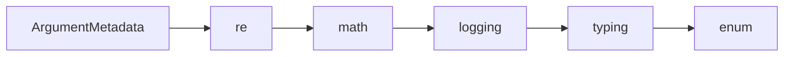

# ArgumentMetadata API Reference

<!-- Last Verified: 2026-01-16 -->

<cite>
**Referenced Files in This Document**
- [src/pillars/correspondences/services/formula_engine.py](file://src/pillars/correspondences/services/formula_engine.py)
- [re](file://re)
- [math](file://math)
- [logging](file://logging)
- [typing](file://typing)
- [enum](file://enum)
</cite>

## Table of Contents
1. [Introduction](#introduction)
2. [Class Overview](#class-overview)
3. [Core Methods](#core-methods)
4. [Usage Examples](#usage-examples)
5. [Error Handling](#error-handling)
6. [Dependencies](#dependencies)
7. [Performance Considerations](#performance-considerations)

## Introduction

Argument Metadata class definition.

**Architectural Role**: [Documentation needed: Define role (Service/Model/View/Repository)]
- **Layer**: [Documentation needed: Which architectural layer]
- **Responsibilities**: - Initialize the formula engine with a data context
- Evaluate a formula string with performance guards
- **Dependencies**: re, math, logging
- **Consumers**: Unknown

## Class Overview

```python
class ArgumentMetadata(NamedTuple):
    """Argument Metadata class definition."""
```

[Documentation needed: Add class diagram showing relationships]

## Core Methods

## Usage Examples

```python
"""
    def __init__(self, metadata: FormulaMetadata, engine: FormulaEngine = None, parent=None):  # type: ignore[reportArgumentType, reportMissingParameterType, reportUnknownParameterType]
        """
          init   logic.
```

## Error Handling

[Documentation needed: Document error types and handling strategies]

## Dependencies



## Performance Considerations

[Documentation needed: Add complexity analysis and optimization notes]

---

**See Also:**
- [../REFERENCE.md](../REFERENCE.md) - Pillar reference
- [Documentation needed: Add related documentation links]

**Revision History:**
- 2026-01-16: Initial auto-generated documentation
