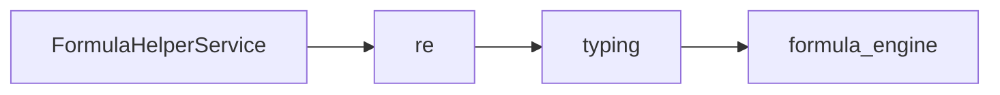

# FormulaHelperService API Reference

<!-- Last Verified: 2026-01-16 -->

<cite>
**Referenced Files in This Document**
- [src/pillars/correspondences/services/formula_helper.py](file://src/pillars/correspondences/services/formula_helper.py)
- [re](file://re)
- [typing](file://typing)
- [formula_engine](file://formula_engine)
</cite>

## Table of Contents
1. [Introduction](#introduction)
2. [Class Overview](#class-overview)
3. [Core Methods](#core-methods)
4. [Usage Examples](#usage-examples)
5. [Error Handling](#error-handling)
6. [Dependencies](#dependencies)
7. [Performance Considerations](#performance-considerations)

## Introduction

The Wizard's Apprentice.
Provides services for discovering and constructing formulas.

**Architectural Role**: [Documentation needed: Define role (Service/Model/View/Repository)]
- **Layer**: [Documentation needed: Which architectural layer]
- **Responsibilities**: - Core functionality for the component
- **Dependencies**: re, typing, formula_engine
- **Consumers**: Unknown

## Class Overview

```python
class FormulaHelperService:
    """The Wizard's Apprentice.
Provides services for discovering and constructing formulas."""
```

[Documentation needed: Add class diagram showing relationships]

## Core Methods

### get_all_definitions

```python
def get_all_definitions() -> List[FormulaMetadata]:
```

**Purpose**: Returns all registered formulas.

**Returns**: `List[FormulaMetadata]` - Handles FormulaHelper operations

**Example:**
```python
# ```python
self._setup_ui()
        self._populate_list(FormulaHelperService.get_all_definitions())

    def _setup_ui(self):
```
```

### get_categories

```python
def get_categories() -> List[str]:
```

**Purpose**: Returns unique list of categories (e.

**Returns**: `List[str]` - Handles FormulaHelper operations

**Example:**
```python
# ```python
self._setup_ui()
        self._populate_list(FormulaHelperService.get_all_definitions())

    def _setup_ui(self):
```
```

### search

```python
def search(query: str) -> List[FormulaMetadata]:
```

**Purpose**: Search for formulas by name or description.

**Parameters:**
- `query` (str): Handles FormulaHelper operations

**Returns**: `List[FormulaMetadata]` - Handles FormulaHelper operations

**Example:**
```python
# ```python
self._setup_ui()
        self._populate_list(FormulaHelperService.get_all_definitions())

    def _setup_ui(self):
```
```

### validate_syntax

```python
def validate_syntax(formula: str) -> bool:
```

**Purpose**: Basic syntax check.

**Parameters:**
- `formula` (str): Handles FormulaHelper operations

**Returns**: `bool` - Handles FormulaHelper operations

**Example:**
```python
# ```python
self._setup_ui()
        self._populate_list(FormulaHelperService.get_all_definitions())

    def _setup_ui(self):
```
```

## Usage Examples

```python
self._setup_ui()
        self._populate_list(FormulaHelperService.get_all_definitions())

    def _setup_ui(self):
```

## Error Handling

[Documentation needed: Document error types and handling strategies]

## Dependencies



## Performance Considerations

[Documentation needed: Add complexity analysis and optimization notes]

---

**See Also:**
- [../REFERENCE.md](../REFERENCE.md) - Pillar reference
- [Documentation needed: Add related documentation links]

**Revision History:**
- 2026-01-16: Initial auto-generated documentation
