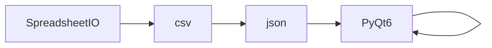

# SpreadsheetIO API Reference

<!-- Last Verified: 2026-01-16 -->

<cite>
**Referenced Files in This Document**
- [src/pillars/correspondences/services/spreadsheet_io.py](file://src/pillars/correspondences/services/spreadsheet_io.py)
- [csv](file://csv)
- [json](file://json)
- [PyQt6.QtWidgets](file://PyQt6.QtWidgets)
- [PyQt6.QtCore](file://PyQt6.QtCore)
</cite>

## Table of Contents
1. [Introduction](#introduction)
2. [Class Overview](#class-overview)
3. [Core Methods](#core-methods)
4. [Usage Examples](#usage-examples)
5. [Error Handling](#error-handling)
6. [Dependencies](#dependencies)
7. [Performance Considerations](#performance-considerations)

## Introduction

Service for handling Spreadsheet Import/Export operations.
Moved from SpreadsheetWindow to reduce complexity.

**Architectural Role**: [Documentation needed: Define role (Service/Model/View/Repository)]
- **Layer**: [Documentation needed: Which architectural layer]
- **Responsibilities**: - Core functionality for the component
- **Dependencies**: csv, json, PyQt6.QtWidgets
- **Consumers**: Unknown

## Class Overview

```python
class SpreadsheetIO:
    """Service for handling Spreadsheet Import/Export operations.
Moved from SpreadsheetWindow to reduce complexity."""
```

[Documentation needed: Add class diagram showing relationships]

## Core Methods

### export_csv

```python
def export_csv(window, model):
```

**Purpose**: Export grid to CSV.

**Parameters:**
- `window` (None): Handles SpreadsheetIo operations
- `model` (None): Handles SpreadsheetIo operations

**Example:**
```python
# ```python
from pillars.correspondences.services import SpreadsheetIo

# Create instance
instance = SpreadsheetIo()

# Use methods
# instance.some_method()
```
```

### export_json

```python
def export_json(window, model):
```

**Purpose**: Export grid to JSON.

**Parameters:**
- `window` (None): Handles SpreadsheetIo operations
- `model` (None): Handles SpreadsheetIo operations

**Example:**
```python
# ```python
from pillars.correspondences.services import SpreadsheetIo

# Create instance
instance = SpreadsheetIo()

# Use methods
# instance.some_method()
```
```

### export_image

```python
def export_image(window, view):
```

**Purpose**: Export visible grid to PNG.

**Parameters:**
- `window` (None): Handles SpreadsheetIo operations
- `view` (None): Handles SpreadsheetIo operations

**Example:**
```python
# ```python
from pillars.correspondences.services import SpreadsheetIo

# Create instance
instance = SpreadsheetIo()

# Use methods
# instance.some_method()
```
```

### import_csv

```python
def import_csv(window, model):
```

**Purpose**: Import CSV to grid (Resizes grid to fit).

**Parameters:**
- `window` (None): Handles SpreadsheetIo operations
- `model` (None): Handles SpreadsheetIo operations

**Example:**
```python
# ```python
from pillars.correspondences.services import SpreadsheetIo

# Create instance
instance = SpreadsheetIo()

# Use methods
# instance.some_method()
```
```

## Usage Examples

```python
from pillars.correspondences.services import SpreadsheetIo

# Create instance
instance = SpreadsheetIo()

# Use methods
# instance.some_method()
```

## Error Handling

[Documentation needed: Document error types and handling strategies]

## Dependencies



## Performance Considerations

[Documentation needed: Add complexity analysis and optimization notes]

---

**See Also:**
- [../REFERENCE.md](../REFERENCE.md) - Pillar reference
- [Documentation needed: Add related documentation links]

**Revision History:**
- 2026-01-16: Initial auto-generated documentation
