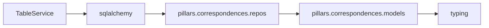

# TableService API Reference

<!-- Last Verified: 2026-01-16 -->

<cite>
**Referenced Files in This Document**
- [src/pillars/correspondences/services/table_service.py](file://src/pillars/correspondences/services/table_service.py)
- [sqlalchemy.orm](file://sqlalchemy.orm)
- [pillars.correspondences.repos.table_repository](file://pillars.correspondences.repos.table_repository)
- [pillars.correspondences.models.correspondence_models](file://pillars.correspondences.models.correspondence_models)
- [typing](file://typing)
</cite>

## Table of Contents
1. [Introduction](#introduction)
2. [Class Overview](#class-overview)
3. [Core Methods](#core-methods)
4. [Usage Examples](#usage-examples)
5. [Error Handling](#error-handling)
6. [Dependencies](#dependencies)
7. [Performance Considerations](#performance-considerations)

## Introduction

The Steward of the Tablets.
 mediates between the Realm of Form (UI) and the Memory (Repository).

**Architectural Role**: [Documentation needed: Define role (Service/Model/View/Repository)]
- **Layer**: [Documentation needed: Which architectural layer]
- **Responsibilities**: - Init   logic
- Create a new correspondence table
- Retrieve all scrolls from the library
- **Dependencies**: sqlalchemy.orm, pillars.correspondences.repos.table_repository, pillars.correspondences.models.correspondence_models
- **Consumers**: Unknown

## Class Overview

```python
class TableService:
    """The Steward of the Tablets.
 mediates between the Realm of Form (UI) and the Memory (Repository)."""
```

[Documentation needed: Add class diagram showing relationships]

## Core Methods

### create_table

```python
def create_table(self, name: str, content: Dict[str, Any]) -> CorrespondenceTable:
```

**Purpose**: Create a new correspondence table.

**Parameters:**
- `self` (None): The Steward of the Tablets.
 mediates between the Realm of Form (UI) and the Memory (Repository).
- `name` (str): The Steward of the Tablets.
 mediates between the Realm of Form (UI) and the Memory (Repository).
- `content` (Dict[str, Any]): The Steward of the Tablets.
 mediates between the Realm of Form (UI) and the Memory (Repository).

**Returns**: `CorrespondenceTable` - The Steward of the Tablets.
 mediates between the Realm of Form (UI) and the Memory (Repository).

**Example:**
```python
# ```python
with get_db_session() as session:
            service = TableService(session)
            tables = service.list_tables()
            for table in tables:
```
```

### list_tables

```python
def list_tables(self) -> List[CorrespondenceTable]:
```

**Purpose**: Retrieve all scrolls from the library.

**Parameters:**
- `self` (None): The Steward of the Tablets.
 mediates between the Realm of Form (UI) and the Memory (Repository).

**Returns**: `List[CorrespondenceTable]` - The Steward of the Tablets.
 mediates between the Realm of Form (UI) and the Memory (Repository).

**Example:**
```python
# ```python
with get_db_session() as session:
            service = TableService(session)
            tables = service.list_tables()
            for table in tables:
```
```

### get_table

```python
def get_table(self, table_id: str) -> Optional[CorrespondenceTable]:
```

**Purpose**: Retrieve a specific scroll.

**Parameters:**
- `self` (None): The Steward of the Tablets.
 mediates between the Realm of Form (UI) and the Memory (Repository).
- `table_id` (str): The Steward of the Tablets.
 mediates between the Realm of Form (UI) and the Memory (Repository).

**Returns**: `Optional[CorrespondenceTable]` - The Steward of the Tablets.
 mediates between the Realm of Form (UI) and the Memory (Repository).

**Example:**
```python
# ```python
with get_db_session() as session:
            service = TableService(session)
            tables = service.list_tables()
            for table in tables:
```
```

### save_content

```python
def save_content(self, table_id: str, content: Dict[str, Any]) -> Optional[CorrespondenceTable]:
```

**Purpose**: Update the content of a scroll.

**Parameters:**
- `self` (None): The Steward of the Tablets.
 mediates between the Realm of Form (UI) and the Memory (Repository).
- `table_id` (str): The Steward of the Tablets.
 mediates between the Realm of Form (UI) and the Memory (Repository).
- `content` (Dict[str, Any]): The Steward of the Tablets.
 mediates between the Realm of Form (UI) and the Memory (Repository).

**Returns**: `Optional[CorrespondenceTable]` - The Steward of the Tablets.
 mediates between the Realm of Form (UI) and the Memory (Repository).

**Example:**
```python
# ```python
with get_db_session() as session:
            service = TableService(session)
            tables = service.list_tables()
            for table in tables:
```
```

### rename_table

```python
def rename_table(self, table_id: str, new_name: str) -> Optional[CorrespondenceTable]:
```

**Purpose**: Rename a scroll.

**Parameters:**
- `self` (None): The Steward of the Tablets.
 mediates between the Realm of Form (UI) and the Memory (Repository).
- `table_id` (str): The Steward of the Tablets.
 mediates between the Realm of Form (UI) and the Memory (Repository).
- `new_name` (str): The Steward of the Tablets.
 mediates between the Realm of Form (UI) and the Memory (Repository).

**Returns**: `Optional[CorrespondenceTable]` - The Steward of the Tablets.
 mediates between the Realm of Form (UI) and the Memory (Repository).

**Example:**
```python
# ```python
with get_db_session() as session:
            service = TableService(session)
            tables = service.list_tables()
            for table in tables:
```
```

### destroy_table

```python
def destroy_table(self, table_id: str):
```

**Purpose**: Destroy a scroll forever.

**Parameters:**
- `self` (None): The Steward of the Tablets.
 mediates between the Realm of Form (UI) and the Memory (Repository).
- `table_id` (str): The Steward of the Tablets.
 mediates between the Realm of Form (UI) and the Memory (Repository).

**Example:**
```python
# ```python
with get_db_session() as session:
            service = TableService(session)
            tables = service.list_tables()
            for table in tables:
```
```

## Usage Examples

```python
with get_db_session() as session:
            service = TableService(session)
            tables = service.list_tables()
            for table in tables:
```

## Error Handling

[Documentation needed: Document error types and handling strategies]

## Dependencies



## Performance Considerations

[Documentation needed: Add complexity analysis and optimization notes]

---

**See Also:**
- [../REFERENCE.md](../REFERENCE.md) - Pillar reference
- [Documentation needed: Add related documentation links]

**Revision History:**
- 2026-01-16: Initial auto-generated documentation
