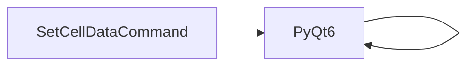

# SetCellDataCommand API Reference

<!-- Last Verified: 2026-01-16 -->

<cite>
**Referenced Files in This Document**
- [src/pillars/correspondences/services/undo_commands.py](file://src/pillars/correspondences/services/undo_commands.py)
- [PyQt6.QtGui](file://PyQt6.QtGui)
- [PyQt6.QtCore](file://PyQt6.QtCore)
</cite>

## Table of Contents
1. [Introduction](#introduction)
2. [Class Overview](#class-overview)
3. [Core Methods](#core-methods)
4. [Usage Examples](#usage-examples)
5. [Error Handling](#error-handling)
6. [Dependencies](#dependencies)
7. [Performance Considerations](#performance-considerations)

## Introduction

Command to change a single cell's value.

**Architectural Role**: [Documentation needed: Define role (Service/Model/View/Repository)]
- **Layer**: [Documentation needed: Which architectural layer]
- **Responsibilities**: - Core functionality for the component
- **Dependencies**: PyQt6.QtGui, PyQt6.QtCore
- **Consumers**: Unknown

## Class Overview

```python
class SetCellDataCommand(QUndoCommand):
    """Command to change a single cell's value."""
```

[Documentation needed: Add class diagram showing relationships]

## Core Methods

### redo

```python
def redo(self):
```

**Purpose**: Redo logic.

**Parameters:**
- `self` (None): Handles UndoCommands operations

**Example:**
```python
# ```python
from pillars.correspondences.services import UndoCommands

# Create instance
instance = UndoCommands()

# Use methods
# instance.some_method()
```
```

### undo

```python
def undo(self):
```

**Purpose**: Undo logic.

**Parameters:**
- `self` (None): Handles UndoCommands operations

**Example:**
```python
# ```python
from pillars.correspondences.services import UndoCommands

# Create instance
instance = UndoCommands()

# Use methods
# instance.some_method()
```
```

## Usage Examples

```python
from pillars.correspondences.services import UndoCommands

# Create instance
instance = UndoCommands()

# Use methods
# instance.some_method()
```

## Error Handling

[Documentation needed: Document error types and handling strategies]

## Dependencies



## Performance Considerations

[Documentation needed: Add complexity analysis and optimization notes]

---

**See Also:**
- [../REFERENCE.md](../REFERENCE.md) - Pillar reference
- [Documentation needed: Add related documentation links]

**Revision History:**
- 2026-01-16: Initial auto-generated documentation
