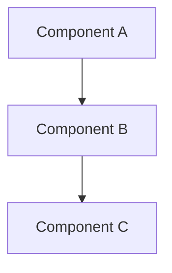

# Model-View Separation

<!-- Last Verified: 2026-01-16 -->

<cite>
**Referenced Files in This Document**
</cite>

## Table of Contents
1. [Pattern Overview](#pattern-overview)
2. [Architectural Diagram](#architectural-diagram)
3. [Key Components](#key-components)
4. [Data Flow](#data-flow)
5. [Implementation Details](#implementation-details)
6. [Trade-offs & Rationale](#trade-offs--rationale)
7. [Evolution & History](#evolution--history)

## Pattern Overview

**Pattern Type**: Mvc

Clear separation between data models and UI components

**Purpose**: Separates business logic into reusable service classes that can be tested independently of the UI.

**Problem Solved**: Without service layer, business logic becomes tangled with UI code, making testing difficult and code reuse impossible.

**Key Benefits**:
- Services (border_engine, conditional_formatting, formula_engine) contain zero UI dependencies
- Same service can be used by multiple windows
- Unit testing without Qt instantiation
- Clear separation of concerns

## Architectural Diagram


```

## Key Components

### Core Classes

## Data Flow

```mermaid
sequenceDiagram
    ```mermaid
sequenceDiagram
    User->>System: Action
    System-->>User: Response
```
```

## Implementation Details

### Pattern Application

**TODO**: Explain how the pattern is implemented:
- How are components instantiated?
- How do components communicate?
- What are the extension points?

### Code Example

```python
# Implementation details in source
```

## Trade-offs & Rationale

### Advantages

[Documentation needed: List specific advantages in this pillar]

### Disadvantages

[Documentation needed: List any downsides or complexity costs]

### Alternative Approaches Considered

[Documentation needed: What other patterns were considered and why rejected?]

## Evolution & History

**TODO**: Add:
- When was this pattern introduced?
- Has it changed over time?
- Are there plans to refactor?

---

**Last Updated**: 2026-01-16
**Status**: Auto-generated skeleton (needs AI enhancement)

**Navigation:**
- [← Architecture Index](./README.md)
- [↑ Correspondences Index](../INDEX.md)
