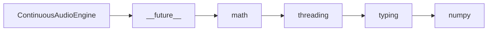

# ContinuousAudioEngine API Reference

<!-- Last Verified: 2026-01-16 -->

<cite>
**Referenced Files in This Document**
- [src/pillars/cymatics/services/cymatics_audio_service.py](file://src/pillars/cymatics/services/cymatics_audio_service.py)
- [__future__](file://__future__)
- [math](file://math)
- [threading](file://threading)
- [typing](file://typing)
- [numpy](file://numpy)
</cite>

## Table of Contents
1. [Introduction](#introduction)
2. [Class Overview](#class-overview)
3. [Core Methods](#core-methods)
4. [Usage Examples](#usage-examples)
5. [Error Handling](#error-handling)
6. [Dependencies](#dependencies)
7. [Performance Considerations](#performance-considerations)

## Introduction

Real-time audio synthesis engine for continuous cymatics tones.

Uses streaming audio callbacks to generate sound continuously,
updating frequency/mix parameters in real-time as the user adjusts
the simulator controls.

**Architectural Role**: [Documentation needed: Define role (Service/Model/View/Repository)]
- **Layer**: [Documentation needed: Which architectural layer]
- **Responsibilities**: - Initialize the audio service
- Check if continuous audio is available
- Start continuous audio synthesis for given parameters
- **Dependencies**: __future__, math, threading
- **Consumers**: Unknown

## Class Overview

```python
class ContinuousAudioEngine:
    """Real-time audio synthesis engine for continuous cymatics tones.

Uses streaming audio callbacks to generate sound continuously,
updating frequency/mix parameters in real-time as the user adjusts
the simulator controls."""
```

[Documentation needed: Add class diagram showing relationships]

## Core Methods

### is_available

```python
def is_available(self) -> bool:
```

**Purpose**: Check if audio system is available.

**Parameters:**
- `self` (None): High-level audio service for cymatics visualization.

**Returns**: `bool` - High-level audio service for cymatics visualization.

**Example:**
```python
# ```python
self._export_service = CymaticsExportService()
        self._audio_service = CymaticsAudioService()

        # Animation timer
```
```

### start

```python
def start(self) -> bool:
```

**Purpose**: Start continuous audio synthesis.

**Parameters:**
- `self` (None): High-level audio service for cymatics visualization.

**Returns**: `bool` - High-level audio service for cymatics visualization.

**Example:**
```python
# ```python
self._export_service = CymaticsExportService()
        self._audio_service = CymaticsAudioService()

        # Animation timer
```
```

### stop

```python
def stop(self) -> None:
```

**Purpose**: Stop continuous audio synthesis.

**Parameters:**
- `self` (None): High-level audio service for cymatics visualization.

**Returns**: `None` - High-level audio service for cymatics visualization.

**Example:**
```python
# ```python
self._export_service = CymaticsExportService()
        self._audio_service = CymaticsAudioService()

        # Animation timer
```
```

### update_params

```python
def update_params(self, frequency: float, secondary_freq: float, mix: float, volume: float) -> None:
```

**Purpose**: Update synthesis parameters in real-time.

**Parameters:**
- `self` (None): High-level audio service for cymatics visualization.
- `frequency` (float): High-level audio service for cymatics visualization.
- `secondary_freq` (float): High-level audio service for cymatics visualization.
- `mix` (float): High-level audio service for cymatics visualization.
- `volume` (float): High-level audio service for cymatics visualization.

**Returns**: `None` - High-level audio service for cymatics visualization.

**Example:**
```python
# ```python
self._export_service = CymaticsExportService()
        self._audio_service = CymaticsAudioService()

        # Animation timer
```
```

### is_running

```python
def is_running(self) -> bool:
```

**Purpose**: Check if audio is currently playing.

**Parameters:**
- `self` (None): High-level audio service for cymatics visualization.

**Returns**: `bool` - High-level audio service for cymatics visualization.

**Example:**
```python
# ```python
self._export_service = CymaticsExportService()
        self._audio_service = CymaticsAudioService()

        # Animation timer
```
```

## Usage Examples

```python
self._export_service = CymaticsExportService()
        self._audio_service = CymaticsAudioService()

        # Animation timer
```

## Error Handling

[Documentation needed: Document error types and handling strategies]

## Dependencies



## Performance Considerations

[Documentation needed: Add complexity analysis and optimization notes]

---

**See Also:**
- [../REFERENCE.md](../REFERENCE.md) - Pillar reference
- [Documentation needed: Add related documentation links]

**Revision History:**
- 2026-01-16: Initial auto-generated documentation
