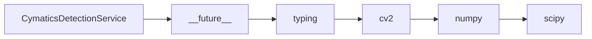

# CymaticsDetectionService API Reference

<!-- Last Verified: 2026-01-16 -->

<cite>
**Referenced Files in This Document**
- [src/pillars/cymatics/services/cymatics_detection_service.py](file://src/pillars/cymatics/services/cymatics_detection_service.py)
- [__future__](file://__future__)
- [typing](file://typing)
- [cv2](file://cv2)
- [numpy](file://numpy)
- [scipy.signal](file://scipy.signal)
</cite>

## Table of Contents
1. [Introduction](#introduction)
2. [Class Overview](#class-overview)
3. [Core Methods](#core-methods)
4. [Usage Examples](#usage-examples)
5. [Error Handling](#error-handling)
6. [Dependencies](#dependencies)
7. [Performance Considerations](#performance-considerations)

## Introduction

Detects cymatics pattern features from a simulation result.

**Architectural Role**: [Documentation needed: Define role (Service/Model/View/Repository)]
- **Layer**: [Documentation needed: Which architectural layer]
- **Responsibilities**: - Extract metrics and maps from a simulation output
- **Dependencies**: __future__, typing, cv2
- **Consumers**: Unknown

## Class Overview

```python
class CymaticsDetectionService:
    """Detects cymatics pattern features from a simulation result."""
```

[Documentation needed: Add class diagram showing relationships]

## Core Methods

### detect

```python
def detect(self, simulation: SimulationResult, nodal_threshold: float) -> DetectionResult:
```

**Purpose**: Extract metrics and maps from a simulation output.

**Parameters:**
- `self` (None): Detects cymatics pattern features from a simulation result.
- `simulation` (SimulationResult): Detects cymatics pattern features from a simulation result.
- `nodal_threshold` (float): Detects cymatics pattern features from a simulation result.

**Returns**: `DetectionResult` - Detects cymatics pattern features from a simulation result.

**Example:**
```python
# ```python
self._detector = CymaticsDetectionService()
        self._last_result: Optional[DetectionResult] = None
        self._last_simulation: Optional[SimulationResult] = None
```
```

## Usage Examples

```python
self._detector = CymaticsDetectionService()
        self._last_result: Optional[DetectionResult] = None
        self._last_simulation: Optional[SimulationResult] = None
```

## Error Handling

[Documentation needed: Document error types and handling strategies]

## Dependencies



## Performance Considerations

[Documentation needed: Add complexity analysis and optimization notes]

---

**See Also:**
- [../REFERENCE.md](../REFERENCE.md) - Pillar reference
- [Documentation needed: Add related documentation links]

**Revision History:**
- 2026-01-16: Initial auto-generated documentation
