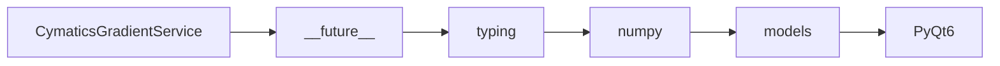

# CymaticsGradientService API Reference

<!-- Last Verified: 2026-01-16 -->

<cite>
**Referenced Files in This Document**
- [src/pillars/cymatics/services/cymatics_gradient_service.py](file://src/pillars/cymatics/services/cymatics_gradient_service.py)
- [__future__](file://__future__)
- [typing](file://typing)
- [numpy](file://numpy)
- [models](file://models)
- [PyQt6.QtGui](file://PyQt6.QtGui)
</cite>

## Table of Contents
1. [Introduction](#introduction)
2. [Class Overview](#class-overview)
3. [Core Methods](#core-methods)
4. [Usage Examples](#usage-examples)
5. [Error Handling](#error-handling)
6. [Dependencies](#dependencies)
7. [Performance Considerations](#performance-considerations)

## Introduction

Provides color mapping for cymatics amplitude visualization.

Supports predefined gradients (grayscale, heat map, ocean, plasma, viridis)
and custom gradient definitions.

**Architectural Role**: [Documentation needed: Define role (Service/Model/View/Repository)]
- **Layer**: [Documentation needed: Which architectural layer]
- **Responsibilities**: - Apply color gradient to normalized amplitude data
- Get a palette of colors for the gradient
- Convert normalized field to qimage with gradient coloring
- **Dependencies**: __future__, typing, numpy
- **Consumers**: Unknown

## Class Overview

```python
class CymaticsGradientService:
    """Provides color mapping for cymatics amplitude visualization.

Supports predefined gradients (grayscale, heat map, ocean, plasma, viridis)
and custom gradient definitions."""
```

[Documentation needed: Add class diagram showing relationships]

## Core Methods

### apply_gradient

```python
def apply_gradient(self, normalized: np.ndarray, gradient_type: ColorGradient, custom_stops: List[GradientStop] | None) -> np.ndarray:
```

**Purpose**: Apply color gradient to normalized amplitude data.

**Parameters:**
- `self` (None): Provides color mapping for cymatics amplitude visualization.
- `normalized` (np.ndarray): Provides color mapping for cymatics amplitude visualization.
- `gradient_type` (ColorGradient): Provides color mapping for cymatics amplitude visualization.
- `custom_stops` (List[GradientStop] | None): Provides color mapping for cymatics amplitude visualization.

**Returns**: `np.ndarray` - Provides color mapping for cymatics amplitude visualization.

**Example:**
```python
# ```python
# Gradient service for colored rendering
        self._gradient_service = CymaticsGradientService()
        self._use_gradient = True
        self._gradient_type = ColorGradient.PLASMA
```
```

### get_gradient_colors

```python
def get_gradient_colors(self, gradient_type: ColorGradient, num_colors: int) -> np.ndarray:
```

**Purpose**: Get a palette of colors for the gradient.

**Parameters:**
- `self` (None): Provides color mapping for cymatics amplitude visualization.
- `gradient_type` (ColorGradient): Provides color mapping for cymatics amplitude visualization.
- `num_colors` (int): Provides color mapping for cymatics amplitude visualization.

**Returns**: `np.ndarray` - Provides color mapping for cymatics amplitude visualization.

**Example:**
```python
# ```python
# Gradient service for colored rendering
        self._gradient_service = CymaticsGradientService()
        self._use_gradient = True
        self._gradient_type = ColorGradient.PLASMA
```
```

### to_qimage

```python
def to_qimage(self, normalized: np.ndarray, gradient_type: ColorGradient, custom_stops: List[GradientStop] | None):
```

**Purpose**: Convert normalized field to QImage with gradient coloring.

**Parameters:**
- `self` (None): Provides color mapping for cymatics amplitude visualization.
- `normalized` (np.ndarray): Provides color mapping for cymatics amplitude visualization.
- `gradient_type` (ColorGradient): Provides color mapping for cymatics amplitude visualization.
- `custom_stops` (List[GradientStop] | None): Provides color mapping for cymatics amplitude visualization.

**Example:**
```python
# ```python
# Gradient service for colored rendering
        self._gradient_service = CymaticsGradientService()
        self._use_gradient = True
        self._gradient_type = ColorGradient.PLASMA
```
```

## Usage Examples

```python
# Gradient service for colored rendering
        self._gradient_service = CymaticsGradientService()
        self._use_gradient = True
        self._gradient_type = ColorGradient.PLASMA
```

## Error Handling

[Documentation needed: Document error types and handling strategies]

## Dependencies



## Performance Considerations

[Documentation needed: Add complexity analysis and optimization notes]

---

**See Also:**
- [../REFERENCE.md](../REFERENCE.md) - Pillar reference
- [Documentation needed: Add related documentation links]

**Revision History:**
- 2026-01-16: Initial auto-generated documentation
