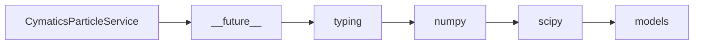

# CymaticsParticleService API Reference

<!-- Last Verified: 2026-01-16 -->

<cite>
**Referenced Files in This Document**
- [src/pillars/cymatics/services/cymatics_particle_service.py](file://src/pillars/cymatics/services/cymatics_particle_service.py)
- [__future__](file://__future__)
- [typing](file://typing)
- [numpy](file://numpy)
- [scipy](file://scipy)
- [models](file://models)
</cite>

## Table of Contents
1. [Introduction](#introduction)
2. [Class Overview](#class-overview)
3. [Core Methods](#core-methods)
4. [Usage Examples](#usage-examples)
5. [Error Handling](#error-handling)
6. [Dependencies](#dependencies)
7. [Performance Considerations](#performance-considerations)

## Introduction

Simulates particles accumulating at nodal lines.

Particles experience force proportional to the negative gradient
of the amplitude field, causing them to drift toward regions of
low amplitude (nodal lines) where they eventually settle.

This mimics the physics of sand particles on a vibrating Chladni
plate, which accumulate at the nodal lines where the plate
displacement is minimal.

**Architectural Role**: [Documentation needed: Define role (Service/Model/View/Repository)]
- **Layer**: [Documentation needed: Which architectural layer]
- **Responsibilities**: - Initialize particle service
- Initialize particles within the plate boundary
- Update particle positions based on field gradient, with boundary clipping
- **Dependencies**: __future__, typing, numpy
- **Consumers**: Unknown

## Class Overview

```python
class CymaticsParticleService:
    """Simulates particles accumulating at nodal lines.

Particles experience force proportional to the negative gradient
of the amplitude field, causing them to drift toward regions of
low amplitude (nodal lines) where they eventually settle.

This mimics the physics of sand particles on a vibrating Chladni
plate, which accumulate at the nodal lines where the plate
displacement is minimal."""
```

[Documentation needed: Add class diagram showing relationships]

## Core Methods

### initialize_particles

```python
def initialize_particles(self, count: int, grid_size: int, distribution: str, boundary_mask: Optional[np.ndarray]) -> ParticleState:
```

**Purpose**: Initialize particles within the plate boundary.

**Parameters:**
- `self` (None): Simulates particles accumulating at nodal lines.
- `count` (int): Simulates particles accumulating at nodal lines.
- `grid_size` (int): Simulates particles accumulating at nodal lines.
- `distribution` (str): Simulates particles accumulating at nodal lines.
- `boundary_mask` (Optional[np.ndarray]): Simulates particles accumulating at nodal lines.

**Returns**: `ParticleState` - Simulates particles accumulating at nodal lines.

**Example:**
```python
# ```python
self._gradient_service = CymaticsGradientService()
        self._particle_service = CymaticsParticleService()
        self._preset_service = CymaticsPresetService()
        self._export_service = CymaticsExportService()
```
```

### update_particles

```python
def update_particles(self, state: ParticleState, field: np.ndarray, dt: float, speed: float, settle_threshold: float, damping: float, noise: float, boundary_mask: Optional[np.ndarray]) -> ParticleState:
```

**Purpose**: Update particle positions based on field gradient, with boundary clipping.

**Parameters:**
- `self` (None): Simulates particles accumulating at nodal lines.
- `state` (ParticleState): Simulates particles accumulating at nodal lines.
- `field` (np.ndarray): Simulates particles accumulating at nodal lines.
- `dt` (float): Simulates particles accumulating at nodal lines.
- `speed` (float): Simulates particles accumulating at nodal lines.
- `settle_threshold` (float): Simulates particles accumulating at nodal lines.
- `damping` (float): Simulates particles accumulating at nodal lines.
- `noise` (float): Simulates particles accumulating at nodal lines.
- `boundary_mask` (Optional[np.ndarray]): Simulates particles accumulating at nodal lines.

**Returns**: `ParticleState` - Simulates particles accumulating at nodal lines.

**Example:**
```python
# ```python
self._gradient_service = CymaticsGradientService()
        self._particle_service = CymaticsParticleService()
        self._preset_service = CymaticsPresetService()
        self._export_service = CymaticsExportService()
```
```

### reset_settled

```python
def reset_settled(self, state: ParticleState) -> ParticleState:
```

**Purpose**: Reset settled status for all particles.

**Parameters:**
- `self` (None): Simulates particles accumulating at nodal lines.
- `state` (ParticleState): Simulates particles accumulating at nodal lines.

**Returns**: `ParticleState` - Simulates particles accumulating at nodal lines.

**Example:**
```python
# ```python
self._gradient_service = CymaticsGradientService()
        self._particle_service = CymaticsParticleService()
        self._preset_service = CymaticsPresetService()
        self._export_service = CymaticsExportService()
```
```

### get_statistics

```python
def get_statistics(self, state: ParticleState) -> dict:
```

**Purpose**: Get particle simulation statistics.

**Parameters:**
- `self` (None): Simulates particles accumulating at nodal lines.
- `state` (ParticleState): Simulates particles accumulating at nodal lines.

**Returns**: `dict` - Simulates particles accumulating at nodal lines.

**Example:**
```python
# ```python
self._gradient_service = CymaticsGradientService()
        self._particle_service = CymaticsParticleService()
        self._preset_service = CymaticsPresetService()
        self._export_service = CymaticsExportService()
```
```

## Usage Examples

```python
self._gradient_service = CymaticsGradientService()
        self._particle_service = CymaticsParticleService()
        self._preset_service = CymaticsPresetService()
        self._export_service = CymaticsExportService()
```

## Error Handling

[Documentation needed: Document error types and handling strategies]

## Dependencies



## Performance Considerations

[Documentation needed: Add complexity analysis and optimization notes]

---

**See Also:**
- [../REFERENCE.md](../REFERENCE.md) - Pillar reference
- [Documentation needed: Add related documentation links]

**Revision History:**
- 2026-01-16: Initial auto-generated documentation
