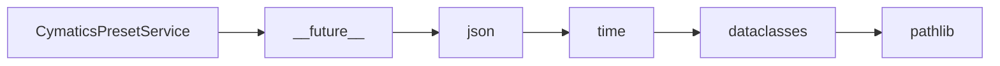

# CymaticsPresetService API Reference

<!-- Last Verified: 2026-01-16 -->

<cite>
**Referenced Files in This Document**
- [src/pillars/cymatics/services/cymatics_preset_service.py](file://src/pillars/cymatics/services/cymatics_preset_service.py)
- [__future__](file://__future__)
- [json](file://json)
- [time](file://time)
- [dataclasses](file://dataclasses)
- [pathlib](file://pathlib)
</cite>

## Table of Contents
1. [Introduction](#introduction)
2. [Class Overview](#class-overview)
3. [Core Methods](#core-methods)
4. [Usage Examples](#usage-examples)
5. [Error Handling](#error-handling)
6. [Dependencies](#dependencies)
7. [Performance Considerations](#performance-considerations)

## Introduction

Manages saving and loading of cymatics parameter presets.

Presets are stored as JSON files in ~/.config/isopgem/cymatics_presets/
with versioning for future migration support.

**Architectural Role**: [Documentation needed: Define role (Service/Model/View/Repository)]
- **Layer**: [Documentation needed: Which architectural layer]
- **Responsibilities**: - Initialize preset service
- Save preset to json file
- Load preset from json file
- **Dependencies**: __future__, json, time
- **Consumers**: Unknown

## Class Overview

```python
class CymaticsPresetService:
    """Manages saving and loading of cymatics parameter presets.

Presets are stored as JSON files in ~/.config/isopgem/cymatics_presets/
with versioning for future migration support."""
```

[Documentation needed: Add class diagram showing relationships]

## Core Methods

### save_preset

```python
def save_preset(self, preset: CymaticsPreset) -> Path:
```

**Purpose**: Save preset to JSON file.

**Parameters:**
- `self` (None): Manages saving and loading of cymatics parameter presets.
- `preset` (CymaticsPreset): Manages saving and loading of cymatics parameter presets.

**Returns**: `Path` - Manages saving and loading of cymatics parameter presets.

**Example:**
```python
# ```python
self._particle_service = CymaticsParticleService()
        self._preset_service = CymaticsPresetService()
        self._export_service = CymaticsExportService()
        self._audio_service = CymaticsAudioService()
```
```

### load_preset

```python
def load_preset(self, name: str) -> Optional[CymaticsPreset]:
```

**Purpose**: Load preset from JSON file.

**Parameters:**
- `self` (None): Manages saving and loading of cymatics parameter presets.
- `name` (str): Manages saving and loading of cymatics parameter presets.

**Returns**: `Optional[CymaticsPreset]` - Manages saving and loading of cymatics parameter presets.

**Example:**
```python
# ```python
self._particle_service = CymaticsParticleService()
        self._preset_service = CymaticsPresetService()
        self._export_service = CymaticsExportService()
        self._audio_service = CymaticsAudioService()
```
```

### list_presets

```python
def list_presets(self) -> List[str]:
```

**Purpose**: List all available preset names.

**Parameters:**
- `self` (None): Manages saving and loading of cymatics parameter presets.

**Returns**: `List[str]` - Manages saving and loading of cymatics parameter presets.

**Example:**
```python
# ```python
self._particle_service = CymaticsParticleService()
        self._preset_service = CymaticsPresetService()
        self._export_service = CymaticsExportService()
        self._audio_service = CymaticsAudioService()
```
```

### delete_preset

```python
def delete_preset(self, name: str) -> bool:
```

**Purpose**: Delete a preset file.

**Parameters:**
- `self` (None): Manages saving and loading of cymatics parameter presets.
- `name` (str): Manages saving and loading of cymatics parameter presets.

**Returns**: `bool` - Manages saving and loading of cymatics parameter presets.

**Example:**
```python
# ```python
self._particle_service = CymaticsParticleService()
        self._preset_service = CymaticsPresetService()
        self._export_service = CymaticsExportService()
        self._audio_service = CymaticsAudioService()
```
```

### get_preset_info

```python
def get_preset_info(self, name: str) -> Optional[dict]:
```

**Purpose**: Get preset metadata without fully loading it.

**Parameters:**
- `self` (None): Manages saving and loading of cymatics parameter presets.
- `name` (str): Manages saving and loading of cymatics parameter presets.

**Returns**: `Optional[dict]` - Manages saving and loading of cymatics parameter presets.

**Example:**
```python
# ```python
self._particle_service = CymaticsParticleService()
        self._preset_service = CymaticsPresetService()
        self._export_service = CymaticsExportService()
        self._audio_service = CymaticsAudioService()
```
```

## Usage Examples

```python
self._particle_service = CymaticsParticleService()
        self._preset_service = CymaticsPresetService()
        self._export_service = CymaticsExportService()
        self._audio_service = CymaticsAudioService()
```

## Error Handling

[Documentation needed: Document error types and handling strategies]

## Dependencies



## Performance Considerations

[Documentation needed: Add complexity analysis and optimization notes]

---

**See Also:**
- [../REFERENCE.md](../REFERENCE.md) - Pillar reference
- [Documentation needed: Add related documentation links]

**Revision History:**
- 2026-01-16: Initial auto-generated documentation
