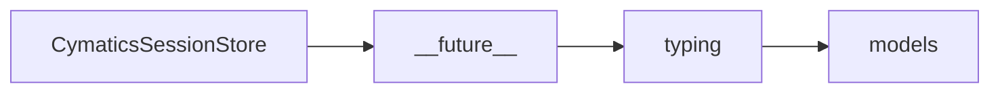

# CymaticsSessionStore API Reference

<!-- Last Verified: 2026-01-16 -->

<cite>
**Referenced Files in This Document**
- [src/pillars/cymatics/services/cymatics_session_store.py](file://src/pillars/cymatics/services/cymatics_session_store.py)
- [__future__](file://__future__)
- [typing](file://typing)
- [models](file://models)
</cite>

## Table of Contents
1. [Introduction](#introduction)
2. [Class Overview](#class-overview)
3. [Core Methods](#core-methods)
4. [Usage Examples](#usage-examples)
5. [Error Handling](#error-handling)
6. [Dependencies](#dependencies)
7. [Performance Considerations](#performance-considerations)

## Introduction

Singleton-style store for the most recent simulation result.

**Architectural Role**: [Documentation needed: Define role (Service/Model/View/Repository)]
- **Layer**: [Documentation needed: Which architectural layer]
- **Responsibilities**: - Set_last_simulation method
- Get_last_simulation method
- **Dependencies**: __future__, typing, models
- **Consumers**: Unknown

## Class Overview

```python
class CymaticsSessionStore:
    """Singleton-style store for the most recent simulation result."""
```

[Documentation needed: Add class diagram showing relationships]

## Core Methods

### set_last_simulation

```python
def set_last_simulation(cls, result: SimulationResult) -> None:
```

**Purpose**: Singleton-style store for the most recent simulation result.

**Parameters:**
- `cls` (None): Singleton-style store for the most recent simulation result.
- `result` (SimulationResult): Singleton-style store for the most recent simulation result.

**Returns**: `None` - Singleton-style store for the most recent simulation result.

**Example:**
```python
# ```python
def _analyze(self) -> None:
        simulation = CymaticsSessionStore.get_last_simulation()
        if simulation is None:
            self._status_label.setText("No simulation data found. Run the simulator first.")
```
```

### get_last_simulation

```python
def get_last_simulation(cls) -> Optional[SimulationResult]:
```

**Purpose**: Singleton-style store for the most recent simulation result.

**Parameters:**
- `cls` (None): Singleton-style store for the most recent simulation result.

**Returns**: `Optional[SimulationResult]` - Singleton-style store for the most recent simulation result.

**Example:**
```python
# ```python
def _analyze(self) -> None:
        simulation = CymaticsSessionStore.get_last_simulation()
        if simulation is None:
            self._status_label.setText("No simulation data found. Run the simulator first.")
```
```

## Usage Examples

```python
def _analyze(self) -> None:
        simulation = CymaticsSessionStore.get_last_simulation()
        if simulation is None:
            self._status_label.setText("No simulation data found. Run the simulator first.")
```

## Error Handling

[Documentation needed: Document error types and handling strategies]

## Dependencies



## Performance Considerations

[Documentation needed: Add complexity analysis and optimization notes]

---

**See Also:**
- [../REFERENCE.md](../REFERENCE.md) - Pillar reference
- [Documentation needed: Add related documentation links]

**Revision History:**
- 2026-01-16: Initial auto-generated documentation
