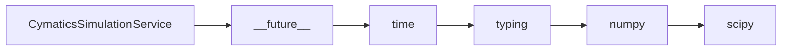

# CymaticsSimulationService API Reference

<!-- Last Verified: 2026-01-16 -->

<cite>
**Referenced Files in This Document**
- [src/pillars/cymatics/services/cymatics_simulation_service.py](file://src/pillars/cymatics/services/cymatics_simulation_service.py)
- [__future__](file://__future__)
- [time](file://time)
- [typing](file://typing)
- [numpy](file://numpy)
- [scipy.special](file://scipy.special)
</cite>

## Table of Contents
1. [Introduction](#introduction)
2. [Class Overview](#class-overview)
3. [Core Methods](#core-methods)
4. [Usage Examples](#usage-examples)
5. [Error Handling](#error-handling)
6. [Dependencies](#dependencies)
7. [Performance Considerations](#performance-considerations)

## Introduction

Generates standing-wave patterns for 2D plates.

Supports rectangular, circular, hexagonal, and custom polygon
plate geometries with Bessel function modes for circular plates.

**Architectural Role**: [Documentation needed: Define role (Service/Model/View/Repository)]
- **Layer**: [Documentation needed: Which architectural layer]
- **Responsibilities**: - Map frequency (hz) to (m, n) mode pair with material correction
- Run a cymatics simulation for the given parameters
- **Dependencies**: __future__, time, typing
- **Consumers**: Unknown

## Class Overview

```python
class CymaticsSimulationService:
    """Generates standing-wave patterns for 2D plates.

Supports rectangular, circular, hexagonal, and custom polygon
plate geometries with Bessel function modes for circular plates."""
```

[Documentation needed: Add class diagram showing relationships]

## Core Methods

### hz_to_modes

```python
def hz_to_modes(self, frequency_hz: float, params: 'SimulationParams') -> Tuple[int, int]:
```

**Purpose**: Map frequency (Hz) to (m, n) mode pair with material correction.

**Parameters:**
- `self` (None): Generates standing-wave patterns for 2D plates.
- `frequency_hz` (float): Generates standing-wave patterns for 2D plates.
- `params` ('SimulationParams'): Generates standing-wave patterns for 2D plates.

**Returns**: `Tuple[int, int]` - Generates standing-wave patterns for 2D plates.

**Example:**
```python
# ```python
# Services
        self._simulator = CymaticsSimulationService()
        self._gradient_service = CymaticsGradientService()
        self._particle_service = CymaticsParticleService()
```
```

### simulate

```python
def simulate(self, params: SimulationParams, phase: float) -> SimulationResult:
```

**Purpose**: Run a cymatics simulation for the given parameters.

**Parameters:**
- `self` (None): Generates standing-wave patterns for 2D plates.
- `params` (SimulationParams): Generates standing-wave patterns for 2D plates.
- `phase` (float): Generates standing-wave patterns for 2D plates.

**Returns**: `SimulationResult` - Generates standing-wave patterns for 2D plates.

**Example:**
```python
# ```python
# Services
        self._simulator = CymaticsSimulationService()
        self._gradient_service = CymaticsGradientService()
        self._particle_service = CymaticsParticleService()
```
```

## Usage Examples

```python
# Services
        self._simulator = CymaticsSimulationService()
        self._gradient_service = CymaticsGradientService()
        self._particle_service = CymaticsParticleService()
```

## Error Handling

[Documentation needed: Document error types and handling strategies]

## Dependencies



## Performance Considerations

[Documentation needed: Add complexity analysis and optimization notes]

---

**See Also:**
- [../REFERENCE.md](../REFERENCE.md) - Pillar reference
- [Documentation needed: Add related documentation links]

**Revision History:**
- 2026-01-16: Initial auto-generated documentation
