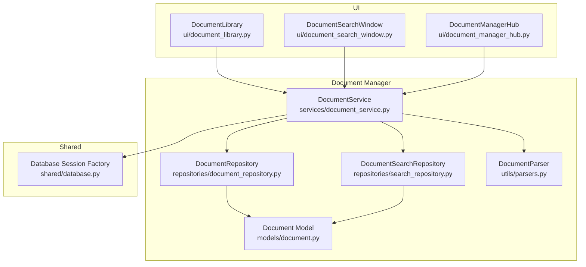
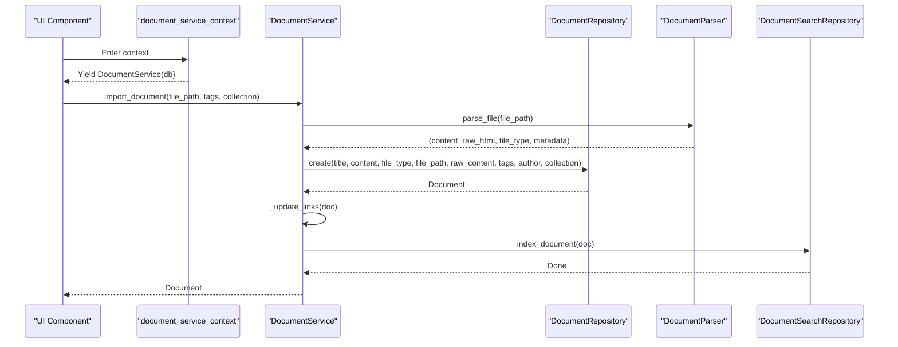
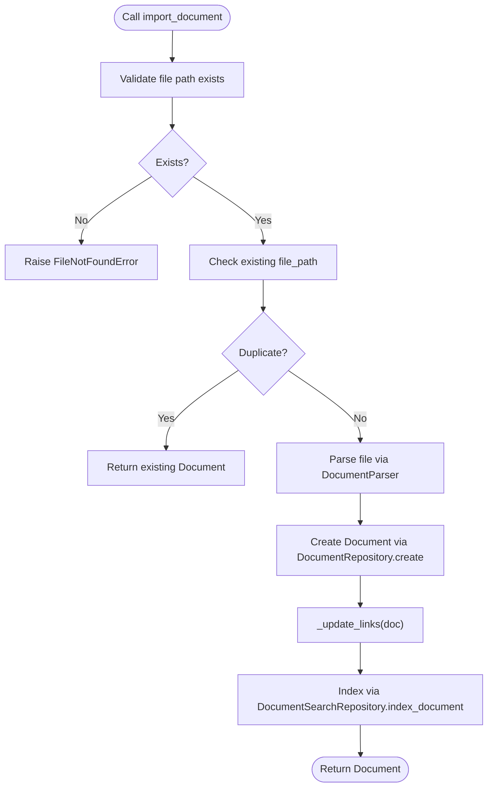
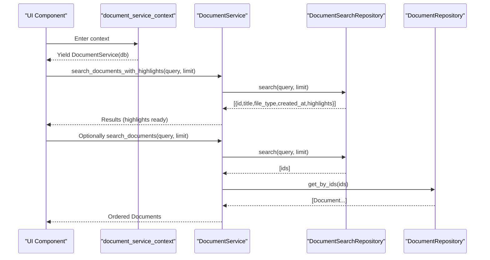
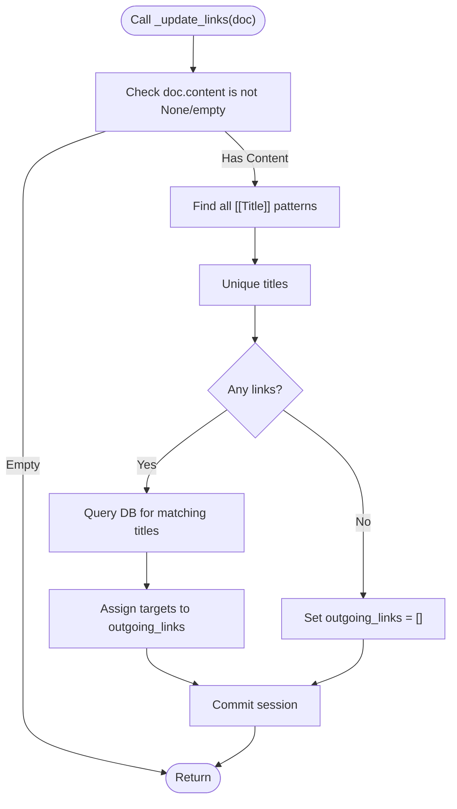
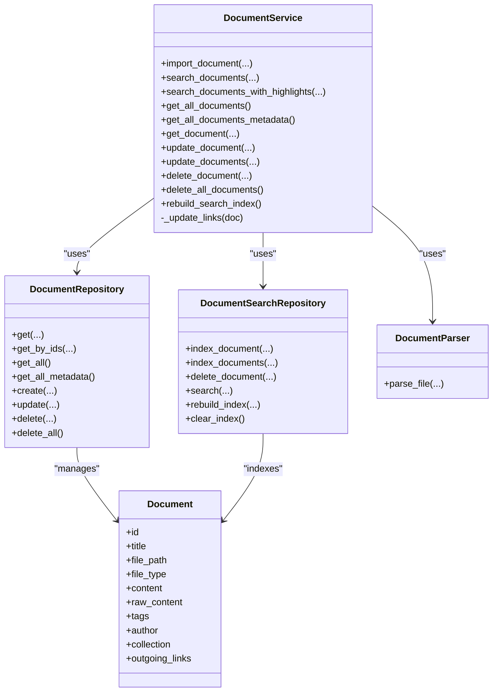

# Document Service API

<cite>
**Referenced Files in This Document**
- [document_service.py](file://src/pillars/document_manager/services/document_service.py)
- [parsers.py](file://src/pillars/document_manager/utils/parsers.py)
- [document_repository.py](file://src/pillars/document_manager/repositories/document_repository.py)
- [search_repository.py](file://src/pillars/document_manager/repositories/search_repository.py)
- [document.py](file://src/pillars/document_manager/models/document.py)
- [database.py](file://src/shared/database.py)
- [document_library.py](file://src/pillars/document_manager/ui/document_library.py)
- [document_search_window.py](file://src/pillars/document_manager/ui/document_search_window.py)
- [document_manager_hub.py](file://src/pillars/document_manager/ui/document_manager_hub.py)
- [test_document_service.py](file://test/test_document_service.py)
</cite>

## Table of Contents
1. [Introduction](#introduction)
2. [Project Structure](#project-structure)
3. [Core Components](#core-components)
4. [Architecture Overview](#architecture-overview)
5. [Detailed Component Analysis](#detailed-component-analysis)
6. [Dependency Analysis](#dependency-analysis)
7. [Performance Considerations](#performance-considerations)
8. [Troubleshooting Guide](#troubleshooting-guide)
9. [Conclusion](#conclusion)
10. [Appendices](#appendices)

## Introduction
This document describes the DocumentService API in the Document Manager pillar. It covers all public methods for importing documents (DOCX, PDF, RTF), full-text search with Whoosh integration, bulk retrieval, updates (single and batch), deletions, and index maintenance. It also explains transaction management via the document_service_context context manager, the link parsing logic for [[WikiLinks]], and the integration between database operations and search indexing. Practical examples are included for importing a PDF document, performing a search with result highlighting, updating document tags in bulk, and handling document lifecycle operations. Error conditions and concurrency considerations are addressed.

## Project Structure
The Document Manager pillar organizes functionality into services, repositories, models, utilities, and UI components. The service layer orchestrates database and search operations while the UI invokes the service through a managed session context.

**Diagram sources**
- [document_service.py](file://src/pillars/document_manager/services/document_service.py#L1-L257)
- [document_repository.py](file://src/pillars/document_manager/repositories/document_repository.py#L1-L86)
- [search_repository.py](file://src/pillars/document_manager/repositories/search_repository.py#L1-L201)
- [document.py](file://src/pillars/document_manager/models/document.py#L1-L47)
- [parsers.py](file://src/pillars/document_manager/utils/parsers.py#L1-L275)
- [database.py](file://src/shared/database.py#L1-L53)
- [document_library.py](file://src/pillars/document_manager/ui/document_library.py#L1-L599)
- [document_search_window.py](file://src/pillars/document_manager/ui/document_search_window.py#L1-L125)
- [document_manager_hub.py](file://src/pillars/document_manager/ui/document_manager_hub.py#L1-L205)

**Section sources**
- [document_service.py](file://src/pillars/document_manager/services/document_service.py#L1-L257)
- [document_repository.py](file://src/pillars/document_manager/repositories/document_repository.py#L1-L86)
- [search_repository.py](file://src/pillars/document_manager/repositories/search_repository.py#L1-L201)
- [document.py](file://src/pillars/document_manager/models/document.py#L1-L47)
- [parsers.py](file://src/pillars/document_manager/utils/parsers.py#L1-L275)
- [database.py](file://src/shared/database.py#L1-L53)
- [document_library.py](file://src/pillars/document_manager/ui/document_library.py#L1-L599)
- [document_search_window.py](file://src/pillars/document_manager/ui/document_search_window.py#L1-L125)
- [document_manager_hub.py](file://src/pillars/document_manager/ui/document_manager_hub.py#L1-L205)

## Core Components
- DocumentService: Orchestrates import, search, retrieval, updates, deletes, and index maintenance. Manages transactions via a managed DB session.
- DocumentRepository: Handles CRUD operations against the Document model.
- DocumentSearchRepository: Manages Whoosh index creation, updates, deletion, and search with highlighting.
- DocumentParser: Extracts text and HTML from supported file formats and returns metadata.
- Document model: Defines the database schema and relationships, including outgoing_links for Wiki-like references.

Key responsibilities:
- Import: Validates file existence, prevents duplicates, parses content, creates records, updates links, indexes content.
- Search: Delegates to Whoosh for full-text search and returns highlightable results.
- Bulk operations: Efficiently retrieves metadata and updates multiple documents.
- Lifecycle: Create, update, delete, and rebuild index.
- Link parsing: Detects [[WikiLinks]] and maintains outgoing_links.

**Section sources**
- [document_service.py](file://src/pillars/document_manager/services/document_service.py#L1-L257)
- [document_repository.py](file://src/pillars/document_manager/repositories/document_repository.py#L1-L86)
- [search_repository.py](file://src/pillars/document_manager/repositories/search_repository.py#L1-L201)
- [parsers.py](file://src/pillars/document_manager/utils/parsers.py#L1-L275)
- [document.py](file://src/pillars/document_manager/models/document.py#L1-L47)

## Architecture Overview
The service layer coordinates between repositories and utilities, while the UI interacts with the service through a managed session context. The search repository encapsulates Whoosh index operations.

**Diagram sources**
- [document_service.py](file://src/pillars/document_manager/services/document_service.py#L50-L96)
- [parsers.py](file://src/pillars/document_manager/utils/parsers.py#L63-L100)
- [document_repository.py](file://src/pillars/document_manager/repositories/document_repository.py#L47-L62)
- [search_repository.py](file://src/pillars/document_manager/repositories/search_repository.py#L67-L91)
- [document_library.py](file://src/pillars/document_manager/ui/document_library.py#L377-L403)

## Detailed Component Analysis

### DocumentService API Reference
Public methods:
- import_document(file_path, tags=None, collection=None) -> Document
- search_documents(query, limit=None) -> List[Document]
- search_documents_with_highlights(query, limit=None) -> List[Dict]
- get_all_documents() -> List[Document]
- get_all_documents_metadata() -> List[Document]
- get_document(doc_id: int) -> Optional[Document]
- update_document(doc_id: int, **kwargs) -> Optional[Document]
- update_documents(doc_ids: list[int], **kwargs) -> List[Document]
- delete_document(doc_id: int) -> bool
- delete_all_documents() -> int
- rebuild_search_index() -> None

Transaction management:
- document_service_context() -> ContextManager[DocumentService]: Yields a DocumentService bound to a managed DB session.

Link parsing:
- _update_links(doc: Document) -> None: Parses content for [[WikiLinks]] and updates outgoing_links.

Integration:
- Database operations via DocumentRepository.
- Search indexing via DocumentSearchRepository.
- File parsing via DocumentParser.

Examples:
- Import a PDF document: See “Import a PDF” example.
- Perform a search with result highlighting: See “Search with Highlights” example.
- Update document tags in bulk: See “Bulk Tag Update” example.
- Handle document lifecycle operations: See “Lifecycle Operations” example.

Error conditions:
- File not found during import raises FileNotFoundError.
- Encrypted PDFs or unsupported formats raise ValueError or ImportError depending on libraries.
- Concurrency considerations: Updates are performed per-document or per-batch; batch updates commit each change individually. For high-concurrency scenarios, consider batching within a single transaction boundary.

**Section sources**
- [document_service.py](file://src/pillars/document_manager/services/document_service.py#L50-L236)
- [document_service.py](file://src/pillars/document_manager/services/document_service.py#L250-L257)
- [document_repository.py](file://src/pillars/document_manager/repositories/document_repository.py#L14-L86)
- [search_repository.py](file://src/pillars/document_manager/repositories/search_repository.py#L133-L164)
- [parsers.py](file://src/pillars/document_manager/utils/parsers.py#L153-L241)
- [document_library.py](file://src/pillars/document_manager/ui/document_library.py#L377-L403)
- [document_search_window.py](file://src/pillars/document_manager/ui/document_search_window.py#L78-L116)
- [test_document_service.py](file://test/test_document_service.py#L114-L164)

### Import Workflow (DOCX, PDF, RTF)

Supported formats and metadata:
- TXT: Plain text extraction.
- HTML/HTM: Raw HTML with text extracted.
- DOCX: Uses python-docx for text and metadata; optionally uses mammoth for HTML.
- PDF: Prefers pdf2docx+mammoth pipeline for layout; falls back to PyMuPDF or pypdf; extracts metadata.
- RTF: Uses striprtf.

**Diagram sources**
- [document_service.py](file://src/pillars/document_manager/services/document_service.py#L50-L96)
- [parsers.py](file://src/pillars/document_manager/utils/parsers.py#L63-L275)
- [document_repository.py](file://src/pillars/document_manager/repositories/document_repository.py#L47-L62)
- [search_repository.py](file://src/pillars/document_manager/repositories/search_repository.py#L67-L91)

**Section sources**
- [document_service.py](file://src/pillars/document_manager/services/document_service.py#L50-L96)
- [parsers.py](file://src/pillars/document_manager/utils/parsers.py#L63-L275)
- [document_repository.py](file://src/pillars/document_manager/repositories/document_repository.py#L47-L62)
- [search_repository.py](file://src/pillars/document_manager/repositories/search_repository.py#L67-L91)

### Search Workflow with Highlights

Highlights:
- Whoosh returns fragments with highlights for matched terms.
- The service can also return raw search results with highlights for UI rendering.

**Diagram sources**
- [document_service.py](file://src/pillars/document_manager/services/document_service.py#L98-L134)
- [search_repository.py](file://src/pillars/document_manager/repositories/search_repository.py#L133-L164)
- [document_search_window.py](file://src/pillars/document_manager/ui/document_search_window.py#L78-L116)

**Section sources**
- [document_service.py](file://src/pillars/document_manager/services/document_service.py#L98-L134)
- [search_repository.py](file://src/pillars/document_manager/repositories/search_repository.py#L133-L164)
- [document_search_window.py](file://src/pillars/document_manager/ui/document_search_window.py#L78-L116)

### Bulk Retrieval and Updates
- get_all_documents_metadata(): Returns lightweight metadata by deferring heavy fields.
- update_documents(doc_ids, **kwargs): Iterates and updates each document; if content changed, re-parses links; indexes updated documents.

Concurrency considerations:
- Each update commits individually. For high-throughput scenarios, consider wrapping in a single transaction boundary at the caller level.

**Section sources**
- [document_service.py](file://src/pillars/document_manager/services/document_service.py#L138-L199)
- [document_repository.py](file://src/pillars/document_manager/repositories/document_repository.py#L23-L38)
- [document_repository.py](file://src/pillars/document_manager/repositories/document_repository.py#L64-L71)

### Lifecycle Operations
- delete_document(doc_id): Removes document and cleans up search index.
- delete_all_documents(): Clears database and rebuilds index.
- rebuild_search_index(): Reindexes all documents from the database.

**Section sources**
- [document_service.py](file://src/pillars/document_manager/services/document_service.py#L201-L236)
- [search_repository.py](file://src/pillars/document_manager/repositories/search_repository.py#L165-L196)

### Transaction Management via document_service_context
- Provides a managed DB session and yields a DocumentService instance.
- Ensures session cleanup and consistent transaction boundaries for all operations.

Usage patterns:
- UI components wrap service calls inside document_service_context.
- Tests demonstrate isolated databases and stubbing of the search repository.

**Section sources**
- [document_service.py](file://src/pillars/document_manager/services/document_service.py#L250-L257)
- [database.py](file://src/shared/database.py#L39-L53)
- [document_library.py](file://src/pillars/document_manager/ui/document_library.py#L108-L127)
- [test_document_service.py](file://test/test_document_service.py#L46-L106)

### Link Parsing Logic for [[WikiLinks]]
- Scans content for [[Title]] patterns.
- Resolves targets by querying documents whose titles match the link.
- Updates outgoing_links on the document.
- Commits changes immediately after link resolution.

**Diagram sources**
- [document_service.py](file://src/pillars/document_manager/services/document_service.py#L24-L49)
- [document.py](file://src/pillars/document_manager/models/document.py#L16-L43)

**Section sources**
- [document_service.py](file://src/pillars/document_manager/services/document_service.py#L24-L49)
- [document.py](file://src/pillars/document_manager/models/document.py#L16-L43)

### Integration Between Database and Search Indexing
- After import/update, the service indexes the document.
- On delete, the service removes the document from the index.
- Rebuild triggers a full reindex from the database.

**Section sources**
- [document_service.py](file://src/pillars/document_manager/services/document_service.py#L92-L96)
- [document_service.py](file://src/pillars/document_manager/services/document_service.py#L160-L166)
- [document_service.py](file://src/pillars/document_manager/services/document_service.py#L204-L206)
- [document_service.py](file://src/pillars/document_manager/services/document_service.py#L229-L235)
- [search_repository.py](file://src/pillars/document_manager/repositories/search_repository.py#L67-L116)
- [search_repository.py](file://src/pillars/document_manager/repositories/search_repository.py#L118-L132)
- [search_repository.py](file://src/pillars/document_manager/repositories/search_repository.py#L165-L196)

## Dependency Analysis

**Diagram sources**
- [document_service.py](file://src/pillars/document_manager/services/document_service.py#L1-L257)
- [document_repository.py](file://src/pillars/document_manager/repositories/document_repository.py#L1-L86)
- [search_repository.py](file://src/pillars/document_manager/repositories/search_repository.py#L1-L201)
- [parsers.py](file://src/pillars/document_manager/utils/parsers.py#L1-L275)
- [document.py](file://src/pillars/document_manager/models/document.py#L1-L47)

**Section sources**
- [document_service.py](file://src/pillars/document_manager/services/document_service.py#L1-L257)
- [document_repository.py](file://src/pillars/document_manager/repositories/document_repository.py#L1-L86)
- [search_repository.py](file://src/pillars/document_manager/repositories/search_repository.py#L1-L201)
- [parsers.py](file://src/pillars/document_manager/utils/parsers.py#L1-L275)
- [document.py](file://src/pillars/document_manager/models/document.py#L1-L47)

## Performance Considerations
- Bulk metadata retrieval: Use get_all_documents_metadata() to avoid loading heavy content fields.
- Batch updates: update_documents iterates and updates each document; consider grouping operations if needed.
- Search: search_documents_with_highlights returns pre-highlighted results; search_documents fetches full objects and reorders by relevance.
- Indexing: index_document and index_documents use a writer with commit; rebuild_index recreates the index.

[No sources needed since this section provides general guidance]

## Troubleshooting Guide
Common issues and resolutions:
- File not found during import: Ensure the file path exists before calling import_document.
- Unsupported file type: Supported extensions include txt, html, docx, pdf, rtf.
- PDF import failures:
  - Encrypted PDFs: Requires decryption; otherwise raises an error.
  - Missing dependencies: pdf2docx, mammoth, pypdf, or fitz must be installed.
- Search returns no results: Verify the index exists and is not corrupted; use rebuild_search_index().
- Link parsing not updating: Ensure content contains [[Title]] patterns; verify that target documents exist with matching titles.

Concurrency considerations:
- update_document and update_documents commit per operation; for high concurrency, wrap multiple operations in a single transaction boundary at the caller level.

**Section sources**
- [document_service.py](file://src/pillars/document_manager/services/document_service.py#L56-L64)
- [parsers.py](file://src/pillars/document_manager/utils/parsers.py#L153-L241)
- [search_repository.py](file://src/pillars/document_manager/repositories/search_repository.py#L165-L196)
- [document_service.py](file://src/pillars/document_manager/services/document_service.py#L152-L199)

## Conclusion
The DocumentService provides a cohesive API for document lifecycle management, robust import from multiple formats, efficient full-text search with highlighting, and reliable link parsing. Its integration with repositories and Whoosh ensures consistent database and index synchronization. The managed session context simplifies transaction handling, while the UI components demonstrate practical usage patterns for import, search, and batch operations.

[No sources needed since this section summarizes without analyzing specific files]

## Appendices

### API Examples

- Import a PDF document
  - Steps:
    - Open the Document Library UI.
    - Click Import Document and select a PDF file.
    - Choose tags and collection in the Import Options dialog.
    - The service parses the PDF, creates a Document, updates links, and indexes it.
  - References:
    - [document_library.py](file://src/pillars/document_manager/ui/document_library.py#L377-L403)
    - [document_service.py](file://src/pillars/document_manager/services/document_service.py#L50-L96)
    - [parsers.py](file://src/pillars/document_manager/utils/parsers.py#L153-L241)

- Perform a search with result highlighting
  - Steps:
    - Open the Document Search Window.
    - Enter a query and click Search.
    - The service returns results with highlights; the UI renders highlighted snippets.
  - References:
    - [document_search_window.py](file://src/pillars/document_manager/ui/document_search_window.py#L78-L116)
    - [document_service.py](file://src/pillars/document_manager/services/document_service.py#L131-L134)
    - [search_repository.py](file://src/pillars/document_manager/repositories/search_repository.py#L133-L164)

- Update document tags in bulk
  - Steps:
    - Select documents in the Document Library.
    - From the context menu, choose Add Tags...
    - Enter comma-separated tags; the service merges tags and persists them.
  - References:
    - [document_library.py](file://src/pillars/document_manager/ui/document_library.py#L260-L295)
    - [document_service.py](file://src/pillars/document_manager/services/document_service.py#L174-L199)

- Handle document lifecycle operations
  - Steps:
    - Import documents, search, update tags/collections, delete selected documents, or purge all.
    - The service updates the database and synchronizes the search index accordingly.
  - References:
    - [document_library.py](file://src/pillars/document_manager/ui/document_library.py#L517-L599)
    - [document_service.py](file://src/pillars/document_manager/services/document_service.py#L201-L236)
    - [search_repository.py](file://src/pillars/document_manager/repositories/search_repository.py#L165-L196)