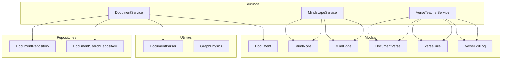
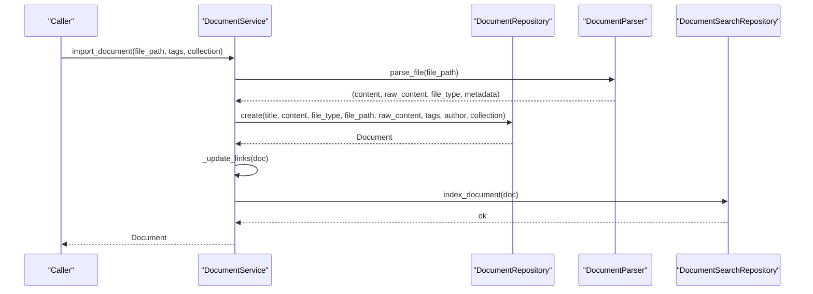
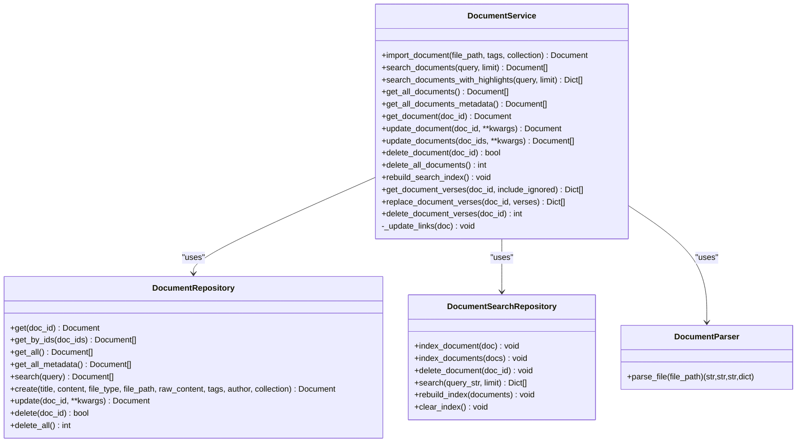
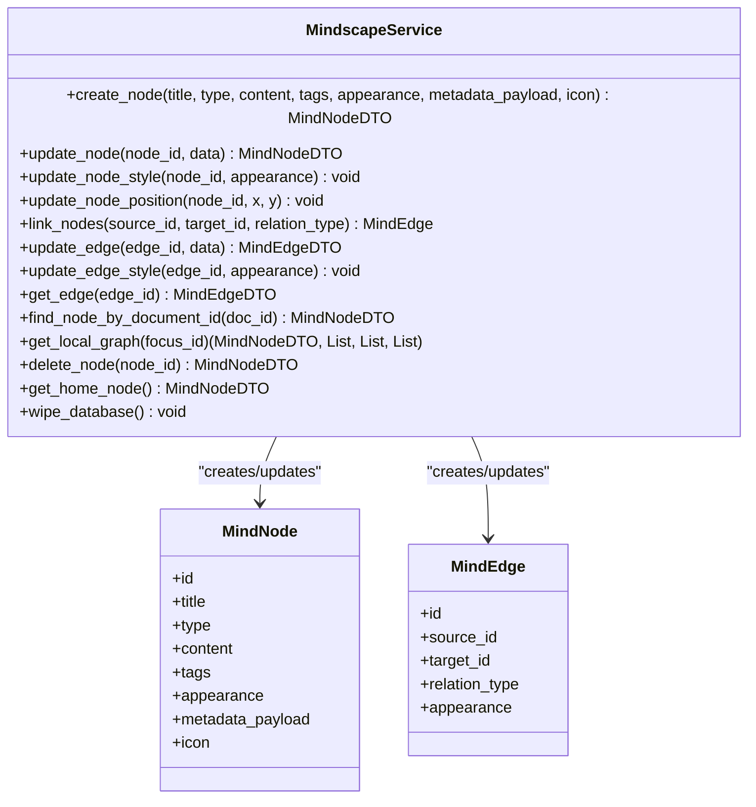
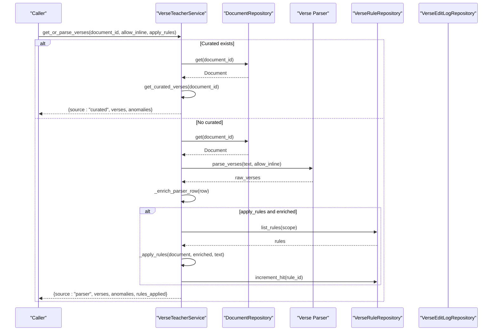
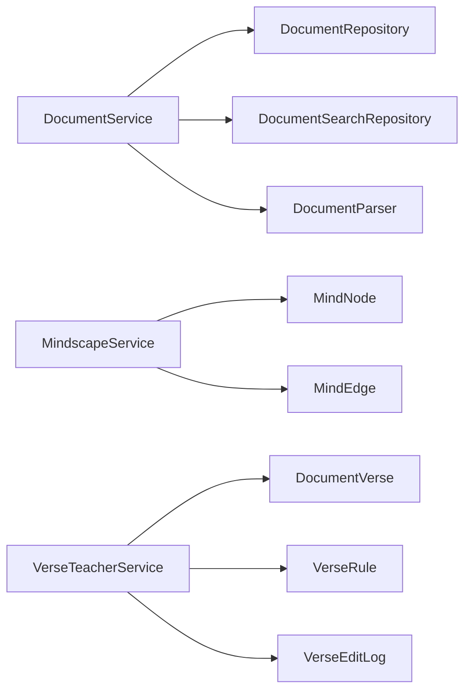

# Document Manager API

<cite>
**Referenced Files in This Document**
- [document_service.py](file://src/pillars/document_manager/services/document_service.py)
- [mindscape_service.py](file://src/pillars/document_manager/services/mindscape_service.py)
- [verse_teacher_service.py](file://src/pillars/document_manager/services/verse_teacher_service.py)
- [parsers.py](file://src/pillars/document_manager/utils/parsers.py)
- [document_repository.py](file://src/pillars/document_manager/repositories/document_repository.py)
- [search_repository.py](file://src/pillars/document_manager/repositories/search_repository.py)
- [document.py](file://src/pillars/document_manager/models/document.py)
- [mindscape.py](file://src/pillars/document_manager/models/mindscape.py)
- [document_verse.py](file://src/pillars/document_manager/models/document_verse.py)
- [graph_physics.py](file://src/pillars/document_manager/ui/graph_physics.py)
- [database.py](file://src/shared/database.py)
- [test_document_service.py](file://test/test_document_service.py)
- [verify_mindscape_service.py](file://tests/verify_mindscape_service.py)
</cite>

## Table of Contents
1. [Introduction](#introduction)
2. [Project Structure](#project-structure)
3. [Core Components](#core-components)
4. [Architecture Overview](#architecture-overview)
5. [Detailed Component Analysis](#detailed-component-analysis)
6. [Dependency Analysis](#dependency-analysis)
7. [Performance Considerations](#performance-considerations)
8. [Troubleshooting Guide](#troubleshooting-guide)
9. [Conclusion](#conclusion)
10. [Appendices](#appendices)

## Introduction
This document provides API documentation for the Document Manager pillar’s service layer. It covers:
- DocumentService for document lifecycle management, ingestion from DOCX, PDF, RTF, and metadata extraction
- MindscapeService for graph-based knowledge representation, node/edge manipulation, and traversal
- VerseTeacherService for biblical verse analysis and teaching mode functionality
- Transaction boundaries, indexing behavior with Whoosh, and event publishing mechanisms
- Examples for full-text search queries, relationship graph construction, and annotation workflows
- Concurrency control and performance considerations for large document collections

## Project Structure
The Document Manager is organized by layers:
- Services: orchestrate business logic and coordinate repositories and utilities
- Repositories: encapsulate persistence operations for models
- Models: define database schemas and relationships
- Utilities: parsing and UI physics
- Tests: demonstrate usage patterns and verify behavior

**Diagram sources**
- [document_service.py](file://src/pillars/document_manager/services/document_service.py#L1-L257)
- [mindscape_service.py](file://src/pillars/document_manager/services/mindscape_service.py#L1-L310)
- [verse_teacher_service.py](file://src/pillars/document_manager/services/verse_teacher_service.py#L1-L352)
- [document_repository.py](file://src/pillars/document_manager/repositories/document_repository.py#L1-L86)
- [search_repository.py](file://src/pillars/document_manager/repositories/search_repository.py#L1-L201)
- [parsers.py](file://src/pillars/document_manager/utils/parsers.py#L1-L275)
- [document.py](file://src/pillars/document_manager/models/document.py#L1-L47)
- [mindscape.py](file://src/pillars/document_manager/models/mindscape.py#L1-L52)
- [document_verse.py](file://src/pillars/document_manager/models/document_verse.py#L1-L104)
- [graph_physics.py](file://src/pillars/document_manager/ui/graph_physics.py#L1-L162)

**Section sources**
- [document_service.py](file://src/pillars/document_manager/services/document_service.py#L1-L257)
- [mindscape_service.py](file://src/pillars/document_manager/services/mindscape_service.py#L1-L310)
- [verse_teacher_service.py](file://src/pillars/document_manager/services/verse_teacher_service.py#L1-L352)
- [document_repository.py](file://src/pillars/document_manager/repositories/document_repository.py#L1-L86)
- [search_repository.py](file://src/pillars/document_manager/repositories/search_repository.py#L1-L201)
- [parsers.py](file://src/pillars/document_manager/utils/parsers.py#L1-L275)
- [document.py](file://src/pillars/document_manager/models/document.py#L1-L47)
- [mindscape.py](file://src/pillars/document_manager/models/mindscape.py#L1-L52)
- [document_verse.py](file://src/pillars/document_manager/models/document_verse.py#L1-L104)
- [graph_physics.py](file://src/pillars/document_manager/ui/graph_physics.py#L1-L162)

## Core Components
- DocumentService: orchestrates document creation, updates, deletions, wiki-link resolution, Whoosh indexing, and search
- MindscapeService: manages graph nodes and edges, traversal, and style updates
- VerseTeacherService: parses and curates biblical verses, applies rules, logs edits, and detects anomalies

Key responsibilities:
- DocumentService handles ingestion from DOCX, PDF, RTF, HTML, TXT, extracts text and metadata, maintains outgoing links, and keeps the Whoosh index synchronized
- MindscapeService provides CRUD for nodes and edges, graph traversal, and style management
- VerseTeacherService coordinates parsing, rule application, anomaly detection, and audit logging

**Section sources**
- [document_service.py](file://src/pillars/document_manager/services/document_service.py#L1-L257)
- [mindscape_service.py](file://src/pillars/document_manager/services/mindscape_service.py#L1-L310)
- [verse_teacher_service.py](file://src/pillars/document_manager/services/verse_teacher_service.py#L1-L352)

## Architecture Overview
The service layer uses SQLAlchemy sessions managed by a shared context manager. Repositories encapsulate persistence, while Whoosh manages the search index. Parsing utilities support ingestion from multiple formats.

**Diagram sources**
- [document_service.py](file://src/pillars/document_manager/services/document_service.py#L50-L96)
- [parsers.py](file://src/pillars/document_manager/utils/parsers.py#L60-L151)
- [document_repository.py](file://src/pillars/document_manager/repositories/document_repository.py#L47-L62)
- [search_repository.py](file://src/pillars/document_manager/repositories/search_repository.py#L67-L91)

**Section sources**
- [document_service.py](file://src/pillars/document_manager/services/document_service.py#L50-L96)
- [parsers.py](file://src/pillars/document_manager/utils/parsers.py#L60-L151)
- [document_repository.py](file://src/pillars/document_manager/repositories/document_repository.py#L47-L62)
- [search_repository.py](file://src/pillars/document_manager/repositories/search_repository.py#L67-L91)

## Detailed Component Analysis

### DocumentService API
Responsibilities:
- Import documents from supported formats (TXT, HTML, DOCX, PDF, RTF)
- Extract text and metadata, resolve wiki-links, and maintain outgoing links
- Update documents and re-index
- Delete documents and clear index entries
- Search documents with Whoosh and return highlights
- Rebuild search index from database
- Verse helpers for curated biblical verse management

Public methods:
- import_document(file_path, tags=None, collection=None) -> Document
- search_documents(query, limit=None) -> List[Document]
- search_documents_with_highlights(query, limit=None) -> List[Dict]
- get_all_documents() -> List[Document]
- get_all_documents_metadata() -> List[Document]
- get_document(doc_id) -> Document
- update_document(doc_id, **kwargs) -> Document
- update_documents(doc_ids, **kwargs) -> List[Document]
- delete_document(doc_id) -> bool
- delete_all_documents() -> int
- rebuild_search_index() -> None
- get_document_verses(doc_id, include_ignored=True) -> List[Dict]
- replace_document_verses(doc_id, verses) -> List[Dict]
- delete_document_verses(doc_id) -> int

Indexing behavior:
- Whoosh schema includes id, title, content, file_type, tags, author, collection, created_at, updated_at
- Uses a stemming analyzer for improved matching
- Supports single and bulk indexing, deletion, rebuild, and clear

Concurrency and transactions:
- Uses a shared session context manager to ensure proper commit/rollback and closure
- Operations are performed within a single transactional scope

Examples:
- Full-text search query: pass a string to search_documents or search_documents_with_highlights
- Relationship graph construction: create nodes and edges via MindscapeService, then traverse with get_local_graph
- Annotation workflows: use VerseTeacherService to generate parser runs, apply rules, and save curated verses

**Section sources**
- [document_service.py](file://src/pillars/document_manager/services/document_service.py#L1-L257)
- [search_repository.py](file://src/pillars/document_manager/repositories/search_repository.py#L1-L201)
- [parsers.py](file://src/pillars/document_manager/utils/parsers.py#L60-L275)
- [document_repository.py](file://src/pillars/document_manager/repositories/document_repository.py#L1-L86)
- [document.py](file://src/pillars/document_manager/models/document.py#L1-L47)
- [test_document_service.py](file://test/test_document_service.py#L1-L209)

#### DocumentService Class Diagram

**Diagram sources**
- [document_service.py](file://src/pillars/document_manager/services/document_service.py#L1-L257)
- [document_repository.py](file://src/pillars/document_manager/repositories/document_repository.py#L1-L86)
- [search_repository.py](file://src/pillars/document_manager/repositories/search_repository.py#L1-L201)
- [parsers.py](file://src/pillars/document_manager/utils/parsers.py#L60-L151)

### MindscapeService API
Responsibilities:
- Manage graph nodes and edges for knowledge representation
- Traverse local graph around a focus node (parents, children, jumps)
- Update node and edge styles and positions
- Find nodes linked to documents via metadata payload
- Wipe database (nuclear option)

Public methods:
- create_node(title, type="concept", content=None, tags=None, appearance=None, metadata_payload=None, icon=None) -> MindNodeDTO
- update_node(node_id, data) -> MindNodeDTO
- update_node_style(node_id, appearance) -> void
- update_node_position(node_id, x, y) -> void
- link_nodes(source_id, target_id, relation_type="parent") -> MindEdge
- update_edge(edge_id, data) -> MindEdgeDTO
- update_edge_style(edge_id, appearance) -> void
- get_edge(edge_id) -> MindEdgeDTO
- find_node_by_document_id(doc_id) -> Optional[MindNodeDTO]
- get_local_graph(focus_id) -> (MindNodeDTO, List, List, List)
- delete_node(node_id) -> Optional[MindNodeDTO]
- get_home_node() -> Optional[MindNodeDTO]
- wipe_database() -> void

Traversal algorithm:
- Parents: edges where relation_type is parent and target equals focus
- Children: edges where relation_type is parent and source equals focus
- Jumps: edges where relation_type is jump and either source or target equals focus

Style and layout:
- Appearance is stored as JSON; node positions are updated via appearance payload
- UI-side physics engine implements a force-directed layout algorithm

**Section sources**
- [mindscape_service.py](file://src/pillars/document_manager/services/mindscape_service.py#L1-L310)
- [mindscape.py](file://src/pillars/document_manager/models/mindscape.py#L1-L52)
- [graph_physics.py](file://src/pillars/document_manager/ui/graph_physics.py#L1-L162)
- [verify_mindscape_service.py](file://tests/verify_mindscape_service.py#L1-L47)

#### MindscapeService Class Diagram

**Diagram sources**
- [mindscape_service.py](file://src/pillars/document_manager/services/mindscape_service.py#L1-L310)
- [mindscape.py](file://src/pillars/document_manager/models/mindscape.py#L1-L52)

### VerseTeacherService API
Responsibilities:
- Coordinate parsing of biblical verses from document content
- Apply curated rules to refine and normalize verse segments
- Detect anomalies (duplicates, missing numbers, overlaps)
- Log edits and rule application events
- Provide curated verse lists and recent edit history

Public methods:
- get_curated_verses(document_id, include_ignored=True) -> List[Dict]
- get_or_parse_verses(document_id, allow_inline=True, apply_rules=True) -> Dict
- generate_parser_run(document_id, allow_inline=True, apply_rules=True) -> Dict
- save_curated_verses(document_id, verses, actor="system", notes=None) -> List[Dict]
- record_rule(scope_type, scope_value, action, description="", pattern_before=None, pattern_after=None, parameters=None, priority=0, enabled=True) -> Dict
- list_rules_for_document(document_id) -> List[Dict]
- list_recent_edits(document_id, limit=50)

Processing logic:
- Extract plain text from Document content
- Parse verse markers using a dedicated parser
- Enrich rows with confidence and metadata
- Apply applicable rules scoped to document, collection, or global
- Detect anomalies and return structured reports

**Section sources**
- [verse_teacher_service.py](file://src/pillars/document_manager/services/verse_teacher_service.py#L1-L352)
- [document_verse.py](file://src/pillars/document_manager/models/document_verse.py#L1-L104)

#### VerseTeacherService Sequence Diagram

**Diagram sources**
- [verse_teacher_service.py](file://src/pillars/document_manager/services/verse_teacher_service.py#L33-L110)
- [document_repository.py](file://src/pillars/document_manager/repositories/document_repository.py#L1-L86)

### Transaction Boundaries and Event Publishing
Transaction boundaries:
- Services use a shared session context manager to ensure atomic operations and proper cleanup
- DocumentService and MindscapeService each provide a context manager to yield a service instance bound to a session
- Database session management is centralized in a shared module

Event publishing:
- VerseTeacherService logs actions (replace-verses, create-rule) to an edit log repository
- These logs capture document_id, action, payload, and notes for auditability

Concurrency control:
- Single-session-per-operation ensures ACID semantics
- For concurrent editing scenarios, callers should serialize operations or implement application-level locking
- Batch operations (update_documents) process sequentially to avoid contention

**Section sources**
- [document_service.py](file://src/pillars/document_manager/services/document_service.py#L250-L257)
- [mindscape_service.py](file://src/pillars/document_manager/services/mindscape_service.py#L305-L310)
- [verse_teacher_service.py](file://src/pillars/document_manager/services/verse_teacher_service.py#L80-L95)
- [database.py](file://src/shared/database.py#L1-L53)

## Dependency Analysis
- DocumentService depends on DocumentRepository, DocumentSearchRepository, and DocumentParser
- MindscapeService depends on MindNode and MindEdge models
- VerseTeacherService depends on Document, DocumentVerse, VerseRule, and VerseEditLog models, plus repositories for persistence and logging

**Diagram sources**
- [document_service.py](file://src/pillars/document_manager/services/document_service.py#L1-L257)
- [mindscape_service.py](file://src/pillars/document_manager/services/mindscape_service.py#L1-L310)
- [verse_teacher_service.py](file://src/pillars/document_manager/services/verse_teacher_service.py#L1-L352)

**Section sources**
- [document_service.py](file://src/pillars/document_manager/services/document_service.py#L1-L257)
- [mindscape_service.py](file://src/pillars/document_manager/services/mindscape_service.py#L1-L310)
- [verse_teacher_service.py](file://src/pillars/document_manager/services/verse_teacher_service.py#L1-L352)

## Performance Considerations
- Whoosh indexing:
  - Use bulk indexing for batch updates (update_documents) to minimize commits
  - Rebuild index periodically for large collections to recover from fragmentation
- Deferred content loading:
  - Use get_all_documents_metadata to avoid loading heavy content fields when listing documents
- Parsing overhead:
  - DOCX/PDF parsing can be expensive; cache parsed content and reuse where appropriate
- Graph layout:
  - Adjust physics constants (repulsion, damping, max speed) to balance stability and responsiveness
- Concurrency:
  - Serialize write operations to avoid session conflicts
  - Consider read replicas or separate read/write connections for high-throughput reads

[No sources needed since this section provides general guidance]

## Troubleshooting Guide
Common issues and resolutions:
- Unsupported file type during import:
  - Ensure the file extension is supported (TXT, HTML, DOCX, PDF, RTF)
  - Install optional dependencies for DOCX/PDF/RTF parsing if missing
- PDF parsing failures:
  - Encrypted PDFs require decryption; otherwise, parsing may fail
  - Use fallback libraries (PyMuPDF or pypdf) depending on availability
- Whoosh schema mismatch:
  - Rebuild index when schema changes occur
- Wiki-link resolution:
  - Links are resolved against existing titles; ensure target documents exist
- Concurrent edits:
  - Wrap operations in the provided context managers to ensure proper transaction boundaries

**Section sources**
- [parsers.py](file://src/pillars/document_manager/utils/parsers.py#L1-L275)
- [search_repository.py](file://src/pillars/document_manager/repositories/search_repository.py#L50-L66)
- [document_service.py](file://src/pillars/document_manager/services/document_service.py#L24-L49)

## Conclusion
The Document Manager service layer provides robust APIs for document lifecycle management, graph-based knowledge modeling, and biblical verse analysis. It integrates Whoosh for efficient full-text search, supports multiple ingestion formats, and offers transactional guarantees through a shared session context. The included examples and diagrams illustrate practical workflows for search, graph construction, and annotation.

[No sources needed since this section summarizes without analyzing specific files]

## Appendices

### API Reference Tables

- DocumentService
  - import_document(file_path, tags=None, collection=None) -> Document
  - search_documents(query, limit=None) -> List[Document]
  - search_documents_with_highlights(query, limit=None) -> List[Dict]
  - get_all_documents() -> List[Document]
  - get_all_documents_metadata() -> List[Document]
  - get_document(doc_id) -> Document
  - update_document(doc_id, **kwargs) -> Document
  - update_documents(doc_ids, **kwargs) -> List[Document]
  - delete_document(doc_id) -> bool
  - delete_all_documents() -> int
  - rebuild_search_index() -> None
  - get_document_verses(doc_id, include_ignored=True) -> List[Dict]
  - replace_document_verses(doc_id, verses) -> List[Dict]
  - delete_document_verses(doc_id) -> int

- MindscapeService
  - create_node(title, type="concept", content=None, tags=None, appearance=None, metadata_payload=None, icon=None) -> MindNodeDTO
  - update_node(node_id, data) -> MindNodeDTO
  - update_node_style(node_id, appearance) -> void
  - update_node_position(node_id, x, y) -> void
  - link_nodes(source_id, target_id, relation_type="parent") -> MindEdge
  - update_edge(edge_id, data) -> MindEdgeDTO
  - update_edge_style(edge_id, appearance) -> void
  - get_edge(edge_id) -> MindEdgeDTO
  - find_node_by_document_id(doc_id) -> Optional[MindNodeDTO]
  - get_local_graph(focus_id) -> (MindNodeDTO, List, List, List)
  - delete_node(node_id) -> Optional[MindNodeDTO]
  - get_home_node() -> Optional[MindNodeDTO]
  - wipe_database() -> void

- VerseTeacherService
  - get_curated_verses(document_id, include_ignored=True) -> List[Dict]
  - get_or_parse_verses(document_id, allow_inline=True, apply_rules=True) -> Dict
  - generate_parser_run(document_id, allow_inline=True, apply_rules=True) -> Dict
  - save_curated_verses(document_id, verses, actor="system", notes=None) -> List[Dict]
  - record_rule(scope_type, scope_value, action, description="", pattern_before=None, pattern_after=None, parameters=None, priority=0, enabled=True) -> Dict
  - list_rules_for_document(document_id) -> List[Dict]
  - list_recent_edits(document_id, limit=50)

### Example Workflows

- Full-text search queries
  - Use search_documents or search_documents_with_highlights to query titles, content, tags, and authors
  - Limit results with the limit parameter for performance

- Relationship graph construction
  - Create nodes with create_node
  - Link nodes with link_nodes using relation types (parent/jump)
  - Traverse with get_local_graph to retrieve parents, children, and jumps

- Annotation workflows
  - Generate parser run with generate_parser_run
  - Apply rules with record_rule and list_rules_for_document
  - Save curated verses with save_curated_verses

**Section sources**
- [test_document_service.py](file://test/test_document_service.py#L132-L209)
- [verify_mindscape_service.py](file://tests/verify_mindscape_service.py#L1-L47)
- [verse_teacher_service.py](file://src/pillars/document_manager/services/verse_teacher_service.py#L33-L110)