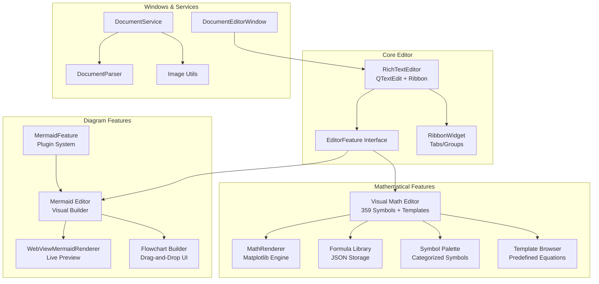
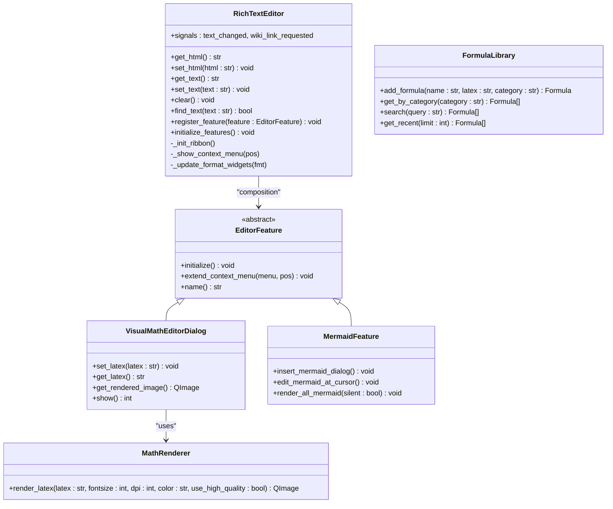
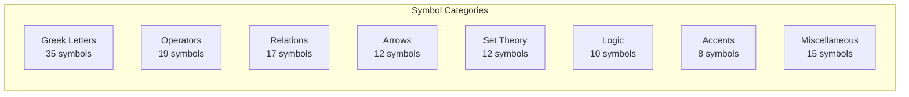
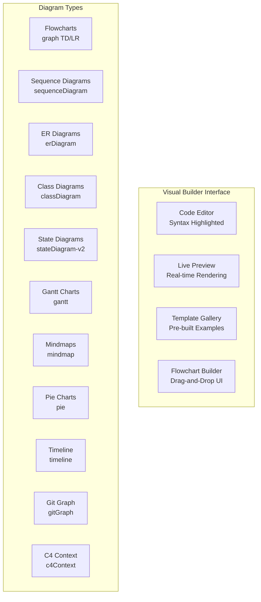
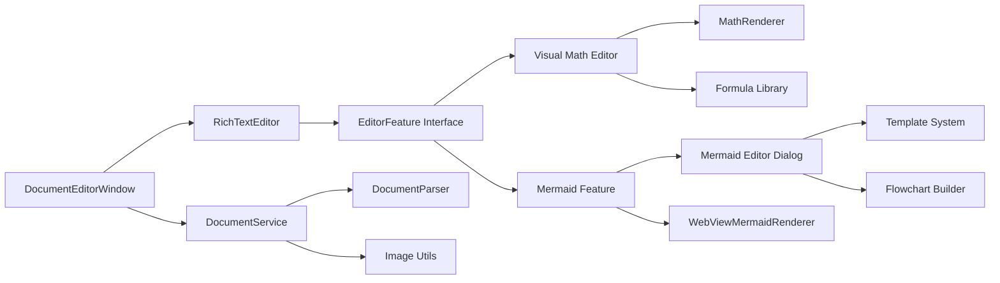

# Document Manager Rich Text Editor Enhancements

<cite>
**Referenced Files in This Document**
- [rich_text_editor.md](file://docs/reference/architecture/rich_text_editor.md)
- [rich_text_editor.py](file://src/shared/ui/rich_text_editor/editor.py)
- [feature_interface.py](file://src/shared/ui/rich_text_editor/feature_interface.py)
- [mermaid_feature.py](file://src/pillars/document_manager/ui/features/mermaid_feature.py)
- [visual_math_editor_dialog.py](file://src/pillars/document_manager/ui/features/visual_math_editor_dialog.py)
- [latex_symbols.py](file://src/pillars/document_manager/ui/features/latex_symbols.py)
- [latex_templates.py](file://src/pillars/document_manager/ui/features/latex_templates.py)
- [math_renderer.py](file://src/pillars/document_manager/ui/features/math_renderer.py)
- [mermaid_editor_dialog.py](file://src/pillars/document_manager/ui/features/mermaid_editor_dialog.py)
- [formula_library.py](file://src/pillars/document_manager/ui/features/formula_library.py)
- [list_features.py](file://src/pillars/document_manager/ui/features/list_features.py)
- [table_features.py](file://src/pillars/document_manager/ui/features/table_features.py)
- [image_features.py](file://src/pillars/document_manager/ui/features/image_features.py)
- [search_features.py](file://src/pillars/document_manager/ui/features/search_features.py)
- [ribbon_widget.py](file://src/pillars/document_manager/ui/widgets/ribbon_widget.py)
- [document_editor_window.py](file://src/pillars/document_manager/ui/windows/document_editor_window.py)
- [parsers.py](file://src/pillars/document_manager/utils/parsers.py)
- [image_utils.py](file://src/pillars/document_manager/utils/image_utils.py)
- [document.py](file://src/pillars/document_manager/models/document.py)
- [document_service.py](file://src/pillars/document_manager/services/document_service.py)
- [image_repository.py](file://src/pillars/document_manager/repositories/image_repository.py)
</cite>

## Update Summary
**Changes Made**
- Added comprehensive mathematical editor with visual LaTeX support featuring 359 symbols and templates
- Integrated Mermaid diagram generation with visual builder and intelligent editing capabilities
- Enhanced the RichTextEditor with advanced mathematical rendering and visual builders
- Updated core components to support new mathematical and diagram features
- Added new feature architecture for extensible editor plugins

## Table of Contents
1. [Introduction](#introduction)
2. [Project Structure](#project-structure)
3. [Core Components](#core-components)
4. [Architecture Overview](#architecture-overview)
5. [Detailed Component Analysis](#detailed-component-analysis)
6. [New Mathematical Editor Features](#new-mathematical-editor-features)
7. [Mermaid Diagram Capabilities](#mermaid-diagram-capabilities)
8. [Advanced Rendering System](#advanced-rendering-system)
9. [Dependency Analysis](#dependency-analysis)
10. [Performance Considerations](#performance-considerations)
11. [Troubleshooting Guide](#troubleshooting-guide)
12. [Conclusion](#conclusion)
13. [Appendices](#appendices)

## Introduction
This document describes the enhanced Document Manager's Rich Text Editor (RTE) subsystem with advanced mathematical and diagram capabilities. The RTE is a comprehensive PyQt-based widget that extends QTextEdit with modern "Ribbon" interface and sophisticated productivity features including mathematical formula editing, Mermaid diagram creation, advanced rendering systems, and deep integration with the Document Manager's persistence layer.

The enhanced editor now supports visual mathematical formula creation with comprehensive LaTeX support, Mermaid diagram generation with intelligent visual builders, and advanced rendering capabilities that transform complex mathematical expressions and diagrams into high-quality images for seamless document integration.

## Project Structure
The enhanced RTE architecture consists of:
- Core RichTextEditor with Ribbon UI and feature plugin system
- Mathematical editor with visual LaTeX interface and symbol palette
- Mermaid diagram editor with visual builder and template system
- Advanced rendering engines for mathematical formulas and diagrams
- Extensible feature architecture supporting EditorFeature plugins
- Integration with document service and persistence models

**Diagram sources**
- [rich_text_editor.py](file://src/shared/ui/rich_text_editor/editor.py)
- [feature_interface.py](file://src/shared/ui/rich_text_editor/feature_interface.py)
- [visual_math_editor_dialog.py](file://src/pillars/document_manager/ui/features/visual_math_editor_dialog.py)
- [mermaid_feature.py](file://src/pillars/document_manager/ui/features/mermaid_feature.py)
- [mermaid_editor_dialog.py](file://src/pillars/document_manager/ui/features/mermaid_editor_dialog.py)
- [math_renderer.py](file://src/pillars/document_manager/ui/features/math_renderer.py)
- [document_editor_window.py](file://src/pillars/document_manager/ui/windows/document_editor_window.py)

**Section sources**
- [rich_text_editor.py](file://src/shared/ui/rich_text_editor/editor.py)
- [feature_interface.py](file://src/shared/ui/rich_text_editor/feature_interface.py)
- [document_editor_window.py](file://src/pillars/document_manager/ui/windows/document_editor_window.py)

## Core Components
- **RichTextEditor**: Central widget with extensible feature plugin system, Ribbon interface, and advanced formatting capabilities
- **EditorFeature Interface**: Abstract base class enabling modular feature development and injection
- **Visual Math Editor**: Comprehensive LaTeX editing interface with 359 symbols, template browser, and formula library
- **Mermaid Feature**: Plugin-based diagram management with visual builder and intelligent editing
- **MathRenderer**: High-quality LaTeX rendering using Matplotlib with customizable styling and resolution
- **Mermaid Editor Dialog**: Advanced diagram creation with live preview, syntax highlighting, and template system
- **Formula Library**: Persistent storage for mathematical formulas with categorization and search capabilities
- **Symbol Palette**: Organized collection of mathematical symbols across 8 categories (Greek letters, operators, relations, arrows, etc.)
- **Template Browser**: Pre-defined equation templates organized by mathematical domain (Calculus, Algebra, Geometry, Statistics, Physics)

**Section sources**
- [rich_text_editor.py](file://src/shared/ui/rich_text_editor/editor.py)
- [feature_interface.py](file://src/shared/ui/rich_text_editor/feature_interface.py)
- [visual_math_editor_dialog.py](file://src/pillars/document_manager/ui/features/visual_math_editor_dialog.py)
- [mermaid_feature.py](file://src/pillars/document_manager/ui/features/mermaid_feature.py)
- [math_renderer.py](file://src/pillars/document_manager/ui/features/math_renderer.py)

## Architecture Overview
The enhanced RTE follows a modular architecture with extensible feature plugins. The EditorFeature interface enables clean separation of concerns while maintaining tight integration with the core editor. Mathematical and diagram features are implemented as plugins that extend the editor's capabilities without modifying core functionality.

**Diagram sources**
- [rich_text_editor.py](file://src/shared/ui/rich_text_editor/editor.py)
- [feature_interface.py](file://src/shared/ui/rich_text_editor/feature_interface.py)
- [visual_math_editor_dialog.py](file://src/pillars/document_manager/ui/features/visual_math_editor_dialog.py)
- [mermaid_feature.py](file://src/pillars/document_manager/ui/features/mermaid_feature.py)
- [math_renderer.py](file://src/pillars/document_manager/ui/features/math_renderer.py)

**Section sources**
- [rich_text_editor.md](file://docs/reference/architecture/rich_text_editor.md)

## Detailed Component Analysis

### RichTextEditor: Enhanced Architecture and Plugin System
The RichTextEditor now features an extensible plugin architecture through the EditorFeature interface. This allows mathematical and diagram features to be cleanly integrated while maintaining separation of concerns.

- **Plugin Registration**: Features are registered through `register_feature()` method and initialized via `initialize_features()`
- **Ribbon Integration**: Plugins can extend the Ribbon interface with custom actions and toolbars
- **Context Menu Extension**: Features can add custom actions to the editor's context menu
- **Signal Coordination**: Maintains communication between features and the core editor

**Section sources**
- [rich_text_editor.py](file://src/shared/ui/rich_text_editor/editor.py)
- [feature_interface.py](file://src/shared/ui/rich_text_editor/feature_interface.py)

### ListFeature, TableFeature, ImageFeature, and SearchReplaceFeature
These core features remain unchanged and continue to provide essential document editing capabilities:

- **ListFeature**: Bullet/number lists, indentation/outdenting, and list style switching
- **TableFeature**: Table creation, row/column operations, cell properties, borders, and table-wide properties
- **ImageFeature**: Image insertion with pre-edit dialog and post-insertion properties
- **SearchReplaceFeature**: Non-modal find/replace dialog with comprehensive search options

**Section sources**
- [list_features.py](file://src/pillars/document_manager/ui/features/list_features.py)
- [table_features.py](file://src/pillars/document_manager/ui/features/table_features.py)
- [image_features.py](file://src/pillars/document_manager/ui/features/image_features.py)
- [search_features.py](file://src/pillars/document_manager/ui/features/search_features.py)

### RibbonWidget: Enhanced Themed Interface
The RibbonWidget provides a modern, shadowed tabbed interface with styled buttons and comboboxes, now supporting plugin-specific ribbon tabs and actions.

**Section sources**
- [ribbon_widget.py](file://src/pillars/document_manager/ui/widgets/ribbon_widget.py)

### DocumentEditorWindow: Integration with Enhanced Features
The DocumentEditorWindow coordinates the enhanced editor features while maintaining integration with the DocumentService for persistence and image handling.

**Section sources**
- [document_editor_window.py](file://src/pillars/document_manager/ui/windows/document_editor_window.py)

## New Mathematical Editor Features

### Visual Math Editor Dialog: Comprehensive LaTeX Interface
The Visual Math Editor provides a sophisticated LaTeX editing environment with three-panel layout supporting mathematical formula creation and editing.

#### Architecture and Layout
- **Three-Pane Design**: Left (Symbol Palette + Templates), Center (Code Editor), Right (Live Preview + Rendering Options)
- **Symbol Palette**: Organized categories with 359 mathematical symbols (Greek letters, operators, relations, arrows, set theory, logic, accents, miscellaneous)
- **Template Browser**: Pre-defined equations organized by mathematical domain
- **Formula Library**: Persistent storage for frequently used formulas with categorization and search

#### Symbol Categories and Organization
The symbol palette organizes mathematical symbols into 8 distinct categories:

**Diagram sources**
- [latex_symbols.py](file://src/pillars/document_manager/ui/features/latex_symbols.py)

#### Template System and Mathematical Domains
The template browser provides pre-defined equations across 5 mathematical domains:

- **Calculus**: Limits, derivatives, integrals, partial derivatives, Taylor series, chain rule, integration by parts
- **Algebra**: Quadratic formula, binomial theorem, exponential identity, logarithm laws, polynomial
- **Geometry**: Pythagorean theorem, circle equation, distance formula, area/volume calculations
- **Statistics**: Normal distribution, mean calculation, probability distributions
- **Physics**: Fundamental physics equations and constants

**Section sources**
- [visual_math_editor_dialog.py](file://src/pillars/document_manager/ui/features/visual_math_editor_dialog.py)
- [latex_symbols.py](file://src/pillars/document_manager/ui/features/latex_symbols.py)
- [latex_templates.py](file://src/pillars/document_manager/ui/features/latex_templates.py)
- [formula_library.py](file://src/pillars/document_manager/ui/features/formula_library.py)

### MathRenderer: High-Quality LaTeX Rendering
The MathRenderer provides professional-grade LaTeX formula rendering using Matplotlib with customizable quality settings.

#### Rendering Capabilities
- **High-Resolution Output**: Configurable DPI settings for crisp, publication-ready formulas
- **Customizable Styling**: Color, font size, and quality enhancement options
- **Anti-Aliased Text**: Smooth text rendering with optimal font settings
- **Transparent Backgrounds**: PNG output with transparent backgrounds for seamless document integration

#### Quality Enhancements
The renderer implements several quality improvements:
- Anti-aliased text rendering for smooth edges
- Optimized matplotlib rcParams for professional appearance
- Computer Modern font set for authentic LaTeX typography
- Proper figure sizing and bounding box calculations

**Section sources**
- [math_renderer.py](file://src/pillars/document_manager/ui/features/math_renderer.py)

## Mermaid Diagram Capabilities

### Mermaid Feature: Advanced Diagram Management
The Mermaid Feature provides comprehensive diagram creation and management capabilities through an intelligent plugin system.

#### Core Functionality
- **Diagram Insertion**: Visual editor dialog for creating new diagrams with live preview
- **Inline Editing**: Support for editing existing diagrams by clicking on rendered images
- **Bulk Rendering**: Automatic detection and rendering of Mermaid code blocks in documents
- **Image Resource Management**: Efficient storage and retrieval of rendered diagram images

#### Mermaid Editor Dialog: Visual Builder System
The Mermaid Editor Dialog offers a sophisticated visual building experience with:

**Diagram sources**
- [mermaid_editor_dialog.py](file://src/pillars/document_manager/ui/features/mermaid_editor_dialog.py)

#### Template System and Diagram Gallery
The editor includes comprehensive template support covering 12 diagram types with professional examples:

- **Flowcharts**: Directional flowcharts (Top-Down, Left-Right)
- **Sequence Diagrams**: Actor interactions and messaging
- **ER Diagrams**: Entity-relationship modeling
- **Class Diagrams**: Object-oriented design
- **State Diagrams**: State machine representations
- **Gantt Charts**: Project timeline visualization
- **Mindmaps**: Brainstorming and idea organization
- **Pie Charts**: Data distribution visualization
- **Timeline**: Historical event sequences
- **Git Graph**: Version control workflows
- **C4 Context**: Software architecture diagrams

#### Advanced Features
- **Theme Support**: Multiple Mermaid themes (Default, Dark, Forest, Neutral, Base)
- **Code Snippets**: Quick insertion of common diagram patterns
- **Syntax Validation**: Real-time linting and error detection
- **Interactive Editing**: Click-to-edit functionality for existing diagrams
- **Export Capabilities**: Seamless integration with document export workflows

**Section sources**
- [mermaid_feature.py](file://src/pillars/document_manager/ui/features/mermaid_feature.py)
- [mermaid_editor_dialog.py](file://src/pillars/document_manager/ui/features/mermaid_editor_dialog.py)

## Advanced Rendering System

### Image Handling and Storage Enhancement
The enhanced rendering system maintains the existing image handling capabilities while adding support for mathematical formulas and diagrams:

- **Unified Resource Management**: All rendered content (images, mathematical formulas, diagrams) stored as document resources
- **Efficient Storage**: Images stored separately from document content for optimal performance
- **Resource URL Scheme**: Consistent URL scheme (`docimg://`) for all embedded content types
- **Quality Optimization**: High-resolution rendering with appropriate DPI settings for different content types

### Integration with Document Service
The rendering system integrates seamlessly with the DocumentService for persistent storage and retrieval:

- **Automatic Rendering**: Mathematical formulas and diagrams rendered on insertion
- **Resource Tracking**: All embedded content tracked and managed through the document resource system
- **Cross-Platform Compatibility**: Consistent rendering across different platforms and resolutions

**Section sources**
- [image_utils.py](file://src/pillars/document_manager/utils/image_utils.py)
- [document_service.py](file://src/pillars/document_manager/services/document_service.py)

## Dependency Analysis
The enhanced architecture introduces new dependencies while maintaining backward compatibility:

- **Internal Dependencies**:
  - RichTextEditor depends on EditorFeature interface and plugin system
  - Mathematical features depend on MathRenderer and FormulaLibrary
  - Diagram features depend on MermaidRenderer and template systems
  - All features integrate with RibbonWidget for UI presentation

- **External Dependencies**:
  - Matplotlib for high-quality LaTeX rendering
  - QtAwesome for icon support in visual interfaces
  - Web-based rendering for Mermaid diagrams
  - JSON-based storage for formula library persistence

**Diagram sources**
- [rich_text_editor.py](file://src/shared/ui/rich_text_editor/editor.py)
- [feature_interface.py](file://src/shared/ui/rich_text_editor/feature_interface.py)
- [visual_math_editor_dialog.py](file://src/pillars/document_manager/ui/features/visual_math_editor_dialog.py)
- [mermaid_feature.py](file://src/pillars/document_manager/ui/features/mermaid_feature.py)
- [math_renderer.py](file://src/pillars/document_manager/ui/features/math_renderer.py)
- [mermaid_editor_dialog.py](file://src/pillars/document_manager/ui/features/mermaid_editor_dialog.py)

**Section sources**
- [document_service.py](file://src/pillars/document_manager/services/document_service.py)
- [parsers.py](file://src/pillars/document_manager/utils/parsers.py)
- [image_utils.py](file://src/pillars/document_manager/utils/image_utils.py)

## Performance Considerations
The enhanced editor maintains excellent performance through several optimizations:

- **Lazy Loading**: Mathematical formulas and diagrams rendered on-demand
- **Background Processing**: Heavy rendering operations performed in background threads
- **Resource Caching**: Frequently used symbols and templates cached in memory
- **Efficient Storage**: Images stored separately to minimize document size
- **Quality vs Performance Balance**: Configurable rendering quality settings
- **Memory Management**: Proper cleanup of temporary rendering resources

## Troubleshooting Guide
Enhanced troubleshooting for new mathematical and diagram features:

- **Mathematical Rendering Issues**: Verify Matplotlib installation and check rendering logs for LaTeX syntax errors
- **Formula Library Problems**: Ensure JSON file permissions and check for corrupted formula entries
- **Mermaid Diagram Errors**: Validate Mermaid syntax and check internet connectivity for web-based rendering
- **Symbol Palette Issues**: Verify symbol category loading and check for missing icon resources
- **Template Browser Problems**: Ensure template data integrity and check for malformed template definitions
- **Performance Issues**: Adjust rendering quality settings and check for excessive concurrent rendering operations

**Section sources**
- [visual_math_editor_dialog.py](file://src/pillars/document_manager/ui/features/visual_math_editor_dialog.py)
- [mermaid_editor_dialog.py](file://src/pillars/document_manager/ui/features/mermaid_editor_dialog.py)
- [math_renderer.py](file://src/pillars/document_manager/ui/features/math_renderer.py)

## Conclusion
The enhanced Document Manager's Rich Text Editor represents a significant advancement in technical document authoring capabilities. The integration of comprehensive mathematical formula editing with 359 symbols, advanced Mermaid diagram creation with visual builders, and sophisticated rendering systems creates a powerful platform for scientific and technical documentation.

The modular architecture ensures extensibility while maintaining stability, allowing for future enhancements and feature additions. The combination of visual editors, intelligent templates, and high-quality rendering produces professional-grade documents suitable for academic, scientific, and technical publishing requirements.

## Appendices

### Enhanced API Surface Summary
- **RichTextEditor**: Extended with plugin registration and feature management
- **EditorFeature Interface**: Abstract base for extensible feature development
- **VisualMathEditorDialog**: Three-panel LaTeX editor with symbol palette and template browser
- **MermaidFeature**: Plugin-based diagram management with visual builder integration
- **MathRenderer**: High-quality LaTeX rendering with customizable styling
- **FormulaLibrary**: Persistent formula storage with categorization and search
- **MermaidEditorDialog**: Advanced diagram creation with live preview and template system

**Section sources**
- [rich_text_editor.py](file://src/shared/ui/rich_text_editor/editor.py)
- [feature_interface.py](file://src/shared/ui/rich_text_editor/feature_interface.py)
- [visual_math_editor_dialog.py](file://src/pillars/document_manager/ui/features/visual_math_editor_dialog.py)
- [mermaid_feature.py](file://src/pillars/document_manager/ui/features/mermaid_feature.py)
- [math_renderer.py](file://src/pillars/document_manager/ui/features/math_renderer.py)
- [formula_library.py](file://src/pillars/document_manager/ui/features/formula_library.py)
- [mermaid_editor_dialog.py](file://src/pillars/document_manager/ui/features/mermaid_editor_dialog.py)