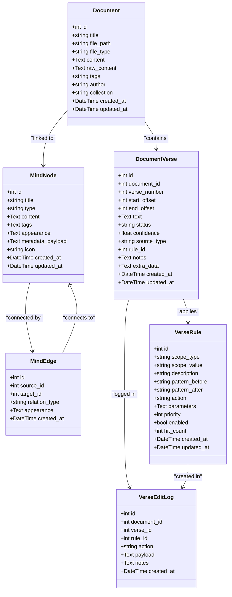
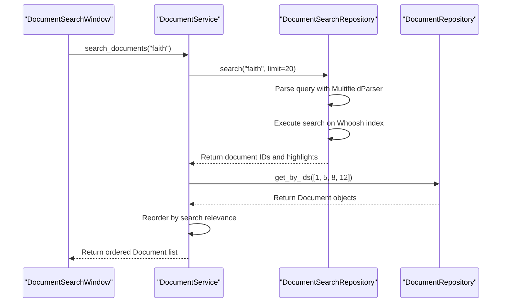
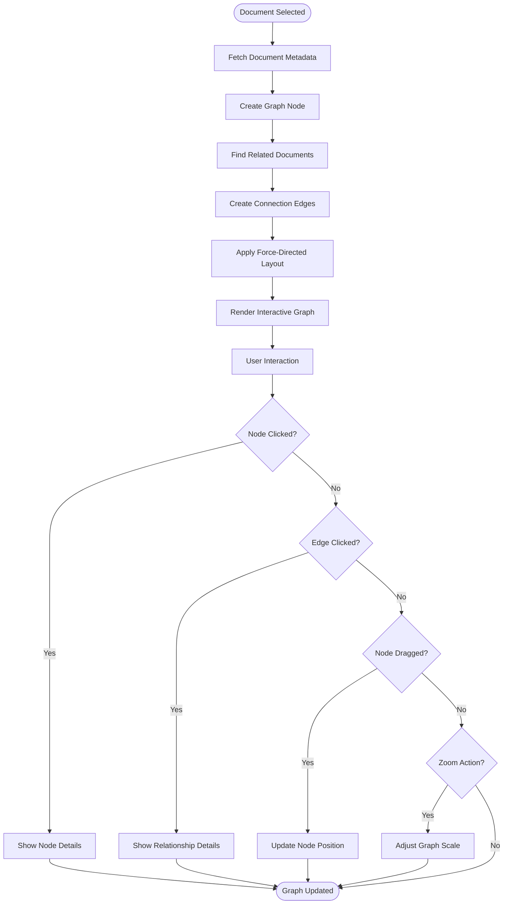

# Document Manager Pillar

<cite>
**Referenced Files in This Document**   
- [document.py](file://src/pillars/document_manager/models/document.py)
- [document_verse.py](file://src/pillars/document_manager/models/document_verse.py)
- [mindscape.py](file://src/pillars/document_manager/models/mindscape.py)
- [document_repository.py](file://src/pillars/document_manager/repositories/document_repository.py)
- [search_repository.py](file://src/pillars/document_manager/repositories/search_repository.py)
- [document_verse_repository.py](file://src/pillars/document_manager/repositories/document_verse_repository.py)
- [document_service.py](file://src/pillars/document_manager/services/document_service.py)
- [verse_teacher_service.py](file://src/pillars/document_manager/services/verse_teacher_service.py)
- [document_manager_hub.py](file://src/pillars/document_manager/ui/document_manager_hub.py)
- [document_editor_window.py](file://src/pillars/document_manager/ui/document_editor_window.py)
- [graph_view.py](file://src/pillars/document_manager/ui/graph_view.py)
- [rich_text_editor.py](file://src/pillars/document_manager/ui/rich_text_editor.py)
- [parsers.py](file://src/pillars/document_manager/utils/parsers.py)
</cite>

## Table of Contents
1. [Introduction](#introduction)
2. [Document Lifecycle and Ingestion](#document-lifecycle-and-ingestion)
3. [Data Models and Storage](#data-models-and-storage)
4. [Document Service and CRUD Operations](#document-service-and-crud-operations)
5. [Search Functionality with Whoosh](#search-functionality-with-whoosh)
6. [UI Components Overview](#ui-components-overview)
7. [Rich Text Editing and Annotation System](#rich-text-editing-and-annotation-system)
8. [Metadata Visualization with GraphView](#metadata-visualization-with-graphview)
9. [Integration with Gematria Pillar](#integration-with-gematria-pillar)
10. [Troubleshooting Common Issues](#troubleshooting-common-issues)

## Introduction
The Document Manager Pillar is a comprehensive system for managing, organizing, and analyzing textual documents within the application. It provides a complete document lifecycle management solution from ingestion through parsing, storage, search, and visualization. The system supports multiple document formats including DOCX, PDF, and RTF, and provides advanced features for text analysis, metadata management, and relationship visualization. At its core, the Document Manager Pillar enables users to import documents, extract meaningful content, search across collections, and visualize metadata relationships through an intuitive user interface.

**Section sources**
- [document.py](file://src/pillars/document_manager/models/document.py#L1-L47)
- [document_manager_hub.py](file://src/pillars/document_manager/ui/document_manager_hub.py#L1-L10)

## Document Lifecycle and Ingestion
The document lifecycle begins with ingestion through the DocumentService's import_document method. When a user imports a document, the system first checks if the file already exists in the database to prevent duplicates. The DocumentParser utility then processes the file based on its type (DOCX, PDF, RTF, etc.), extracting both the plain text content for search and indexing purposes and the raw formatted content for rich text editing. During import, the system extracts metadata such as title, author, and creation date from the document properties when available. The extracted content is stored in the Document model with the plain text in the content field and the formatted content in the raw_content field. The system also identifies and processes Wiki-style links (denoted by [[double brackets]]) to establish relationships between documents, creating a knowledge network within the application.

**Section sources**
- [document_service.py](file://src/pillars/document_manager/services/document_service.py#L50-L96)
- [parsers.py](file://src/pillars/document_manager/utils/parsers.py#L1-L50)
- [document.py](file://src/pillars/document_manager/models/document.py#L20-L33)

## Data Models and Storage
The Document Manager Pillar utilizes SQLAlchemy for data persistence with several key models that define the document structure and relationships. The Document model serves as the primary entity, storing document metadata such as title, file type, tags, author, and collection. It also maintains the extracted text content and raw formatted content. The DocumentVerse model represents curated verse segments within documents, enabling precise text analysis and annotation. Each DocumentVerse includes start and end offsets, verse numbers, and confidence scores. The Mindscape model implements a graph-based knowledge representation with MindNode and MindEdge entities that allow users to create conceptual maps linking documents, concepts, and other entities. The system also includes audit logging through the VerseEditLog model to track changes and teaching actions on verse data.

**Diagram sources**
- [document.py](file://src/pillars/document_manager/models/document.py#L16-L47)
- [document_verse.py](file://src/pillars/document_manager/models/document_verse.py#L21-L104)
- [mindscape.py](file://src/pillars/document_manager/models/mindscape.py#L15-L52)
- [verse_rule_repository.py](file://src/pillars/document_manager/repositories/verse_rule_repository.py#L11-L62)
- [verse_edit_log_repository.py](file://src/pillars/document_manager/repositories/verse_edit_log_repository.py#L11-L45)

## Document Service and CRUD Operations
The DocumentService provides a comprehensive API for managing documents through CRUD operations. The service acts as an intermediary between the UI components and the underlying repositories, handling business logic and coordinating operations across multiple data stores. When creating a new document, the service ensures proper indexing in both the database and search engine. The update_document method handles partial updates while automatically synchronizing changes across systems, including updating document links when content changes and re-indexing for search. The service also provides batch operations through methods like update_documents for efficient processing of multiple documents. For verse management, the service integrates with the VerseTeacherService to provide curated verse extraction and annotation capabilities. The service layer ensures transactional integrity and proper error handling throughout all operations.

**Section sources**
- [document_service.py](file://src/pillars/document_manager/services/document_service.py#L18-L257)
- [document_repository.py](file://src/pillars/document_manager/repositories/document_repository.py#L10-L86)

## Search Functionality with Whoosh
The Document Manager Pillar implements full-text search functionality through integration with the Whoosh search engine. The DocumentSearchRepository manages a dedicated search index that provides fast and flexible querying capabilities beyond what's possible with basic SQL LIKE operations. The search index includes fields for document title, content, file type, tags, author, and collection, with appropriate weighting applied to prioritize title matches. The system uses a StemmingAnalyzer to enable fuzzy matching, allowing searches for "running" to match "run" or "ran". Search results include highlighted snippets showing where the query terms appear in the document content. The DocumentService coordinates search operations, first querying the Whoosh index for relevant documents and then retrieving the full document objects from the database to maintain consistency. The system also provides methods to rebuild or clear the search index when needed, ensuring data integrity across both storage systems.

**Diagram sources**
- [search_repository.py](file://src/pillars/document_manager/repositories/search_repository.py#L15-L201)
- [document_service.py](file://src/pillars/document_manager/services/document_service.py#L98-L134)
- [document_search_window.py](file://src/pillars/document_manager/ui/document_search_window.py#L1-L20)

## UI Components Overview
The Document Manager Pillar provides a suite of UI components that offer an intuitive interface for document management and analysis. The DocumentManagerHub serves as the central navigation point, providing access to all document-related functionality. The DocumentEditorWindow offers a rich text editing environment with support for formatted text, images, and document-specific features. The GraphView component visualizes metadata relationships as an interactive graph, allowing users to explore connections between documents and concepts. The DocumentLibrary displays collections of documents with filtering and sorting capabilities. These components work together to provide a cohesive user experience, with consistent theming and interaction patterns throughout the interface. The UI is designed to be both powerful for advanced users and accessible for those new to the system.

**Section sources**
- [document_manager_hub.py](file://src/pillars/document_manager/ui/document_manager_hub.py#L1-L100)
- [document_editor_window.py](file://src/pillars/document_manager/ui/document_editor_window.py#L1-L50)
- [graph_view.py](file://src/pillars/document_manager/ui/graph_view.py#L1-L30)
- [document_library.py](file://src/pillars/document_manager/ui/document_library.py#L1-L25)

## Rich Text Editing and Annotation System
The rich text editing capabilities are implemented through the RichTextEditor component, which provides a WYSIWYG interface for creating and modifying document content. The editor supports standard formatting options including bold, italic, underline, and various heading levels. It also handles document-specific features such as verse annotations and metadata tagging. When users annotate text, the system creates DocumentVerse entries with precise character offsets, allowing for accurate reference to specific passages. The annotation system integrates with the VerseTeacherService to provide intelligent verse detection and suggestion capabilities. Users can add notes, confidence ratings, and custom metadata to annotated passages. The editor preserves the original formatting while extracting plain text for search indexing, ensuring that documents remain visually appealing while remaining fully searchable.

**Section sources**
- [rich_text_editor.py](file://src/pillars/document_manager/ui/rich_text_editor.py#L1-L100)
- [document_editor_window.py](file://src/pillars/document_manager/ui/document_editor_window.py#L50-L150)
- [document_verse.py](file://src/pillars/document_manager/models/document_verse.py#L21-L104)

## Metadata Visualization with GraphView
The GraphView component provides a powerful visualization of metadata relationships within the document collection. It implements a force-directed graph layout that dynamically positions nodes based on their connections, making relationship patterns immediately apparent. The graph displays different node types with distinct visual styles, allowing users to quickly distinguish between documents, concepts, and other entity types. Users can interact with the graph by clicking nodes to explore their connections, dragging nodes to reposition them, and using zoom controls to navigate large networks. The visualization integrates with the Mindscape service to show both hierarchical parent-child relationships and associative "jump" links between related concepts. When a user selects a document in the graph, the system can automatically highlight relevant passages or show associated annotations, creating a seamless transition between structural and content exploration.

**Diagram sources**
- [graph_view.py](file://src/pillars/document_manager/ui/graph_view.py#L1-L200)
- [mindscape_service.py](file://src/pillars/document_manager/services/mindscape_service.py#L61-L310)
- [mindscape.py](file://src/pillars/document_manager/models/mindscape.py#L15-L52)

## Integration with Gematria Pillar
The Document Manager Pillar integrates closely with the Gematria pillar to enable advanced text analysis capabilities. When users analyze a document for gematria values, the system extracts the relevant text passages through the DocumentService and passes them to the GematriaCalculator for processing. The integration allows users to select specific verses or passages annotated in the document and perform various gematria calculations on them. The results are then linked back to the original document, creating a bidirectional connection between the textual content and its numerical analysis. This integration is facilitated through shared data models and service interfaces that allow seamless data exchange between the pillars. The system also supports batch processing of multiple verses, enabling comprehensive analysis of entire documents or collections.

**Section sources**
- [document_service.py](file://src/pillars/document_manager/services/document_service.py#L240-L248)
- [verse_teacher_service.py](file://src/pillars/document_manager/services/verse_teacher_service.py#L20-L352)
- [gematria_calculator_window.py](file://src/pillars/gematria/ui/gematria_calculator_window.py#L1-L30)

## Troubleshooting Common Issues
Common issues with document parsing typically relate to format compatibility or text extraction quality. For DOCX and RTF files, ensure the documents use standard formatting without excessive custom styles that might interfere with parsing. PDF documents with scanned images rather than selectable text will not parse correctly; use OCR-preprocessed versions when available. Search indexing issues can often be resolved by rebuilding the search index through the DocumentService's rebuild_search_index method. If verse detection is not working properly, check that the document text is properly formatted with clear verse markers and consider creating custom VerseRules to handle specific patterns. Performance issues with large document collections can be mitigated by ensuring proper database indexing and periodically optimizing the search index. For graph visualization problems, verify that node and edge data is properly formatted and that the visualization component has sufficient resources to render complex networks.

**Section sources**
- [document_service.py](file://src/pillars/document_manager/services/document_service.py#L226-L236)
- [parsers.py](file://src/pillars/document_manager/utils/parsers.py#L1-L100)
- [verse_teacher_service.py](file://src/pillars/document_manager/services/verse_teacher_service.py#L148-L352)
- [graph_view.py](file://src/pillars/document_manager/ui/graph_view.py#L1-L50)