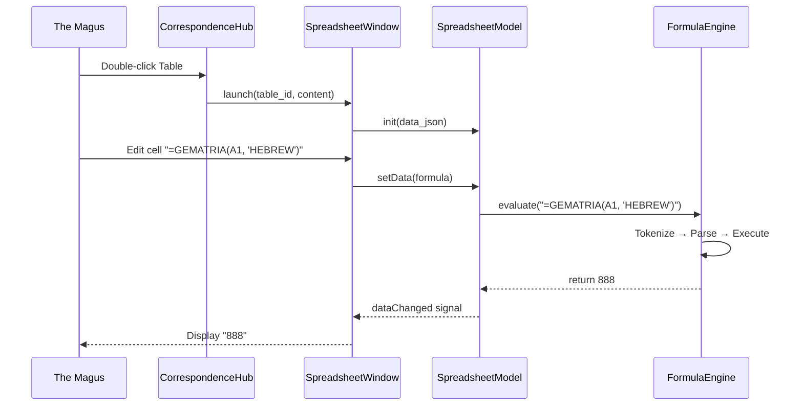

# The Emerald Tablet

**"As it is Above, so it is Below. The Grid reflects the Universe."**

## Architectural Role
The **Emerald Tablet** is the **Grid of Equivalences**. It is a full-featured spreadsheet engine purpose-built for esoteric analysis. Unlike generic spreadsheets, it natively integrates with the Temple's Gematria calculators via formulas (e.g., `=GEMATRIA(A1, "HEBREW")`). It serves as the primary workspace for cross-referencing correspondences and building tables of mystical significance.

## The Core Logic (Services)

### **formula_engine.py** (`src/pillars/correspondences/services/formula_engine.py`)
*   **Architectural Role**: Sovereign Service (The Interpreter)
*   **The Purpose**: A complete expression parser and evaluator. Formulas beginning with `=` are parsed into tokens, built into an AST, and evaluated.
*   **Key Logic**:
    *   **Tokenizer**: Lexical analysis using regex patterns (`NUMBER`, `STRING`, `ID`, `OP`, etc.).
    *   **Parser**: Recursive descent parser implementing operator precedence (comparison → concatenation → additive → multiplicative → power → atom).
    *   **FormulaRegistry**: Decorator-based registration of callable functions with metadata (description, syntax, category, arguments).
    *   **Gematria Integration**: Links to all ciphers via `_CIPHER_REGISTRY` (Hebrew, Greek, TQ variants).
*   **Dependencies**: `CalculationService`, all Gematria calculators.

### **undo_commands.py** (`src/pillars/correspondences/services/undo_commands.py`)
*   **Architectural Role**: Service (The Memory)
*   **The Purpose**: Implements the Command Pattern for full Undo/Redo support using Qt's `QUndoCommand` framework.
*   **Key Logic**:
    *   `SetCellDataCommand`: Captures cell edits (value and style changes).
    *   `InsertRowsCommand` / `RemoveRowsCommand`: Row manipulation with data preservation.
    *   `InsertColumnsCommand` / `RemoveColumnsCommand`: Column manipulation with header updates.
    *   `SortRangeCommand`: Captures entire block state before/after sort.

    ### **conditional_formatting.py** (`src/pillars/correspondences/services/conditional_formatting.py`)
*   **Architectural Role**: Service (The Highlighter)
*   **The Purpose**: Evaluates rules against cell values to apply dynamic styling.
*   **Key Logic**:
    *   `ConditionalRule`: Dataclass defining rule type (`GT`, `LT`, `EQ`, `CONTAINS`), threshold, and format style.
    *   `ConditionalManager.get_style`: Iterates rules in order, returns first matching format.

    ### **ingestion_service.py** (`src/pillars/correspondences/services/ingestion_service.py`)
*   **Architectural Role**: Service (The Importer)
*   **The Purpose**: Parses external files (CSV, Excel) into the internal JSON structure used by `SpreadsheetModel`.

    ### **formula_helper.py** (`src/pillars/correspondences/services/formula_helper.py`)
*   **Architectural Role**: Handmaiden Utility
*   **The Purpose**: Exposes `FormulaRegistry` metadata for the Formula Wizard UI.

    ### **border_engine.py** (`src/pillars/correspondences/services/border_engine.py`)
*   **Architectural Role**: Handmaiden Utility
*   **The Purpose**: Handles border style calculations for cells (style, width, color per side).

    ### **table_service.py** (`src/pillars/correspondences/services/table_service.py`)
*   **Architectural Role**: Service (The Steward)
*   **The Purpose**: Mediates between the UI and the Repository for CRUD operations.
*   **Key Logic**:
    *   `create_table`: Instantiates new tables with proper defaults.
    *   `save_content`: Persists JSON content to the database via `TableRepository`.

## The Presentation Layer (UI)

### **correspondence_hub.py** (`src/pillars/correspondences/ui/correspondence_hub.py`)
*   **Architectural Role**: View (The Gateway)
*   **The Purpose**: The sovereign entry point for the Emerald Tablet. Displays a list of saved Tables and provides actions to create, import, rename, or delete them.
*   **Key Logic**:
    *   `_new_table`: Creates an empty grid of configurable size.
    *   `_import_table`: Background worker (`_ImportWorker`) to parse files without freezing UI.
    *   `receive_import`: Public API for other Pillars to send data (e.g., Astrology → Emerald Tablet).
*   **Signal Flow**: Launches `SpreadsheetWindow` via `WindowManager.open_window`.

### **spreadsheet_window.py** (`src/pillars/correspondences/ui/spreadsheet_window.py`)
*   **Architectural Role**: View (The Altar)
*   **The Purpose**: The main editing window hosting the Grid and the Toolbar.
*   **Key Logic**:
    *   **Formula Bar**: `QLineEdit` at top for formula input with Reference Mode detection.
    *   **Reference Mode**: When typing `=`, arrow keys navigate the grid and insert cell references.
    *   **Toolbar**: Font family, size, Bold/Italic/Underline, alignment, colors, borders, Undo/Redo.
    *   `_launch_formula_wizard`: Summons the two-stage wizard for assisted formula insertion.
*   **Signal Flow**:
    *   **Listens to**: `selectionChanged`, `dataChanged`.
    *   **Emits**: Saves to `TableRepository` on close.

    ### **spreadsheet_view.py** (`src/pillars/correspondences/ui/spreadsheet_view.py`)
*   **Architectural Role**: View (The Canvas)
*   **The Purpose**: The `QTableView` subclass that displays the grid, plus the `SpreadsheetModel` that adapts JSON data.
*   **Key Logic**:
    *   **SpreadsheetModel**: Implements `QAbstractTableModel`. Stores data as list of lists. Handles formula evaluation with cycle detection via `evaluate_cell`.
    *   **RichTextDelegate**: Custom item delegate for HTML rendering, border painting, and inline editing.
    *   **Context Menu**: Right-click for Insert/Delete rows/columns, Sort Range.

    ### **formula_wizard.py** (`src/pillars/correspondences/ui/formula_wizard.py`)
*   **Architectural Role**: View (The Oracle)
*   **The Purpose**: A two-stage dialog for guided formula insertion.
*   **Key Logic**:
    *   **Stage 1 (`FormulaWizardDialog`)**: Browse/search/filter functions by category. Displays description.
    *   **Stage 2 (`FormulaArgumentDialog`)**: Dynamic form generated from `FormulaMetadata.arguments`. Live preview of result.
    *   **CipherSelectorWidget**: Nested dropdown (Language → Method) for Gematria cipher selection.

## Data Structures (Models)

### **correspondence_models.py** (`src/pillars/correspondences/models/correspondence_models.py`)
*   **Architectural Role**: Domain Model
*   **The Purpose**: SQLAlchemy entity for persisting Tables.
*   **Key Logic**: Stores `name`, `content` (JSON blob with columns, rows, and cell data).

## Infrastructure (Repositories)

### **table_repository.py** (`src/pillars/correspondences/repos/table_repository.py`)
*   **Architectural Role**: Persistence Layer
*   **The Purpose**: CRUD operations for Table entities.
*   **Key Logic**:
    *   `get_all`: Lists all saved tables for the Hub.
    *   `save`: Creates or updates a table's JSON content.

## Data Flow Diagram

