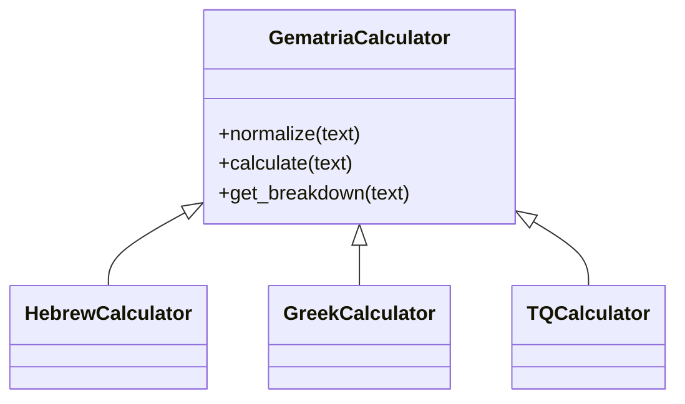
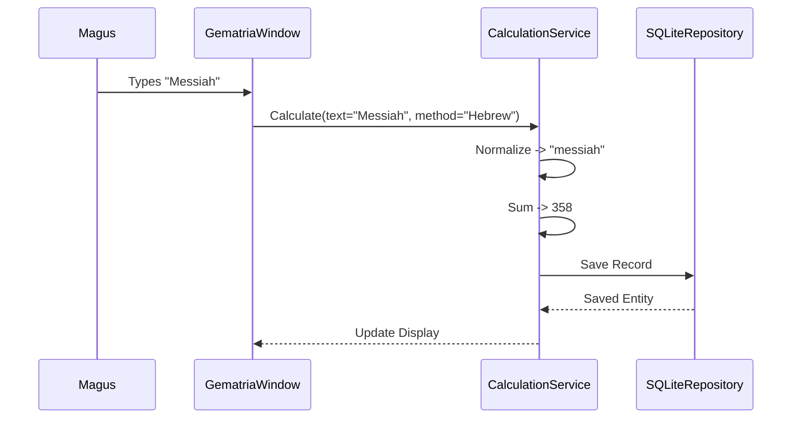

# The Grimoire of Gematria

<!-- Last Verified: 2026-01-01 -->

> *"Every number is an infinite truth."*

The **Gematria Pillar** is the engine of alphanumeric analysis. It transforms the Word into the Number, revealing the hidden connections between names and ideas.

---

## I. The Theory of Tongues (Architecture)

The Pillar is built upon the **Strategy Pattern**. We do not hardcode ciphers; we define **Strategies**.

- **The Abstract Base**: `GematriaCalculator` defines the contract. It knows how to walk a string and sum its parts.
- **The Concrete Strategies**: Each cipher (Hebrew Standard, Greek Isopsephy, TQ) is a class that implements a specific mapping.

### Supported Ciphers

| Tradition | Methods |
|-----------|---------|
| **Hebrew** | Standard, Sofit, Ordinal, Atbash, Albam, Kolel, Mispar Katan (Small Value) |
| **Greek** | Isopsephy, Ordinal, Reduced |
| **English** | TQ (Trigrammaton), NAEQ, AQ |

---

## II. The Anatomy of the Vessel (Data Model)

The atomic unit of Gematria is the **Calculation**. It is preserved in the `gematria_calculations` table.

### The Schema (`CalculationEntity`)

| Field | Type | Description |
|-------|------|-------------|
| `id` | UUID | Primary Key |
| `text` | String | The original input string ("Metatron") |
| `value` | Integer | The calculated sum (314) |
| `method` | String | The cipher used ("Hebrew Standard") |
| `tags` | JSON | Arrays of strings ["angel", "kether"] |
| `breakdown` | JSON | Character-by-character analysis |
| `is_favorite` | Bool | Starred for quick access |

### The Data Flow

---

## III. The Rites (API Reference)

### 1. The Calculation Service
**Location**: `src/pillars/gematria/services/calculation_service.py`

The High Priest of the pillar. Orchestrates all logic.

- `save_calculation(text, ...)`: Persists a new finding.
- `search_calculations(query, ...)`: Finds records by text or value.
- `get_by_value(value)`: Finds all words that equal a specific number.

### 2. The Verse Teacher
**Location**: `src/pillars/document_manager/services/verse_teacher_service.py`

The Bridge between Gematria and Documents. It parses holy texts into numbered verses for line-by-line analysis.

- `parse_verses(text)`: Heuristically detects verse numbers (1:1, 1., etc).
- `save_curated_verses(doc_id, verses)`: Saves a human-verified mapping.

---

## IV. The Holy Books

The Pillar natively supports the parsing of:
- **Liber AL vel Legis** (The Book of the Law)
- **The Bible** (KJV)
- **The Quran**
- **The Sepher Yetzirah**

When a document is ingested, the **Verse Parser** attempts to structure it. The Magus can then use the **Holy Book Teacher** UI to correct any parsing errors.

> *"For the letters are the stones of the Temple, and the numbers are its geometry."*
