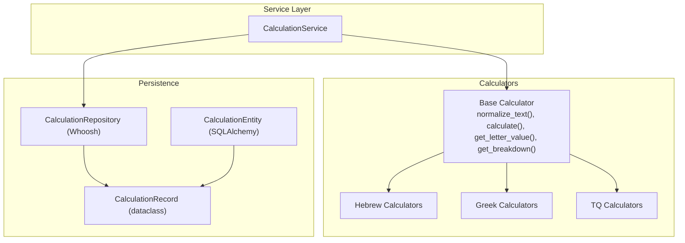
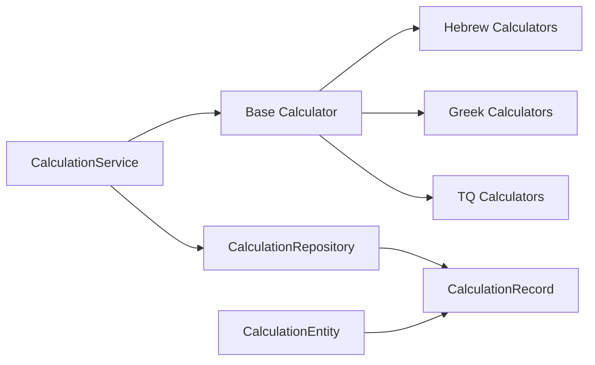

# Base Calculator Interface

<cite>
**Referenced Files in This Document**
- [base_calculator.py](file://src/pillars/gematria/services/base_calculator.py)
- [calculation_service.py](file://src/pillars/gematria/services/calculation_service.py)
- [calculation_entity.py](file://src/pillars/gematria/models/calculation_entity.py)
- [calculation_record.py](file://src/pillars/gematria/models/calculation_record.py)
- [calculation_repository.py](file://src/pillars/gematria/repositories/calculation_repository.py)
- [hebrew_calculator.py](file://src/pillars/gematria/services/hebrew_calculator.py)
- [greek_calculator.py](file://src/pillars/gematria/services/greek_calculator.py)
- [tq_calculator.py](file://src/pillars/gematria/services/tq_calculator.py)
</cite>

## Table of Contents
1. [Introduction](#introduction)
2. [Project Structure](#project-structure)
3. [Core Components](#core-components)
4. [Architecture Overview](#architecture-overview)
5. [Detailed Component Analysis](#detailed-component-analysis)
6. [Dependency Analysis](#dependency-analysis)
7. [Performance Considerations](#performance-considerations)
8. [Troubleshooting Guide](#troubleshooting-guide)
9. [Conclusion](#conclusion)

## Introduction
This document describes the Base Calculator interface that defines the contract for all gematria calculation engines in the system. It explains the abstract base class, its methods, normalization behavior, validation rules, and how concrete calculators extend the base to implement language-specific logic. It also covers integration points with the CalculationService and persistence layer, and how the strategy pattern enables pluggable cipher implementations while maintaining consistent behavior across systems.

## Project Structure
The gematria subsystem is organized around a strategy-based calculator abstraction with multiple concrete implementations for Hebrew, Greek, and English (TQ). A service layer coordinates saving and searching calculations, backed by a repository that persists records.

**Diagram sources**
- [base_calculator.py](file://src/pillars/gematria/services/base_calculator.py#L1-L107)
- [calculation_service.py](file://src/pillars/gematria/services/calculation_service.py#L1-L273)
- [calculation_repository.py](file://src/pillars/gematria/repositories/calculation_repository.py#L1-L329)
- [calculation_entity.py](file://src/pillars/gematria/models/calculation_entity.py#L1-L92)
- [calculation_record.py](file://src/pillars/gematria/models/calculation_record.py#L1-L89)
- [hebrew_calculator.py](file://src/pillars/gematria/services/hebrew_calculator.py#L1-L800)
- [greek_calculator.py](file://src/pillars/gematria/services/greek_calculator.py#L1-L888)
- [tq_calculator.py](file://src/pillars/gematria/services/tq_calculator.py#L1-L381)

**Section sources**
- [base_calculator.py](file://src/pillars/gematria/services/base_calculator.py#L1-L107)
- [calculation_service.py](file://src/pillars/gematria/services/calculation_service.py#L1-L273)
- [calculation_repository.py](file://src/pillars/gematria/repositories/calculation_repository.py#L1-L329)
- [calculation_entity.py](file://src/pillars/gematria/models/calculation_entity.py#L1-L92)
- [calculation_record.py](file://src/pillars/gematria/models/calculation_record.py#L1-L89)
- [hebrew_calculator.py](file://src/pillars/gematria/services/hebrew_calculator.py#L1-L800)
- [greek_calculator.py](file://src/pillars/gematria/services/greek_calculator.py#L1-L888)
- [tq_calculator.py](file://src/pillars/gematria/services/tq_calculator.py#L1-L381)

## Core Components
- Base Calculator (abstract): Defines the contract for all calculators, including normalization, calculation, and breakdown methods. Concrete calculators implement a mapping of characters to values and override the abstract name property.
- CalculationService: Orchestrates saving, updating, searching, and retrieving calculations. It uses the calculator’s normalize_text and calculate methods to produce normalized text and values, and persists structured breakdown data.
- Persistence: CalculationRecord encapsulates persisted fields; CalculationEntity maps to SQLAlchemy; CalculationRepository persists and searches using Whoosh.

Key responsibilities:
- Base Calculator: Character-to-value mapping, normalization, and calculation semantics.
- CalculationService: Aggregates calculator behavior into a cohesive API for persistence and search.
- Repository: Indexes and retrieves records efficiently.

**Section sources**
- [base_calculator.py](file://src/pillars/gematria/services/base_calculator.py#L1-L107)
- [calculation_service.py](file://src/pillars/gematria/services/calculation_service.py#L1-L273)
- [calculation_record.py](file://src/pillars/gematria/models/calculation_record.py#L1-L89)
- [calculation_entity.py](file://src/pillars/gematria/models/calculation_entity.py#L1-L92)
- [calculation_repository.py](file://src/pillars/gematria/repositories/calculation_repository.py#L1-L329)

## Architecture Overview
The system follows a strategy pattern: a single abstract base defines the interface, while concrete calculators implement language-specific mappings and transformations. The service layer composes calculator instances to perform calculations and persist results consistently.

```mermaid
classDiagram
class GematriaCalculator {
+normalize_text(text) str
+calculate(text) int
+get_letter_value(char) int
+get_breakdown(text) list
<<abstract>>
}
class HebrewGematriaCalculator
class HebrewSofitCalculator
class HebrewLetterValueCalculator
class HebrewOrdinalCalculator
class HebrewSmallValueCalculator
class HebrewAtBashCalculator
class HebrewKolelCalculator
class HebrewSquareCalculator
class HebrewCubeCalculator
class HebrewTriangularCalculator
class GreekGematriaCalculator
class GreekLetterValueCalculator
class GreekOrdinalCalculator
class GreekSmallValueCalculator
class GreekKolelCalculator
class GreekSquareCalculator
class GreekCubeCalculator
class GreekTriangularCalculator
class GreekDigitalCalculator
class GreekOrdinalSquareCalculator
class GreekFullValueCalculator
class GreekReverseSubstitutionCalculator
class GreekPairMatchingCalculator
class TQGematriaCalculator
class TQReducedCalculator
class TQSquareCalculator
class TQTriangularCalculator
class TQPositionCalculator
class CalculationService {
+save_calculation(text, value, calculator, breakdown, ...)
+search_calculations(...)
+get_all_calculations(...)
+toggle_favorite(...)
}
class CalculationRepository {
+save(record)
+get_by_id(id)
+search(query, filters...)
+get_all(limit)
+get_by_value(value)
+get_favorites(limit)
}
class CalculationRecord
class CalculationEntity
GematriaCalculator <|-- HebrewGematriaCalculator
GematriaCalculator <|-- HebrewSofitCalculator
GematriaCalculator <|-- HebrewLetterValueCalculator
GematriaCalculator <|-- HebrewOrdinalCalculator
GematriaCalculator <|-- HebrewSmallValueCalculator
GematriaCalculator <|-- HebrewAtBashCalculator
GematriaCalculator <|-- HebrewKolelCalculator
GematriaCalculator <|-- HebrewSquareCalculator
GematriaCalculator <|-- HebrewCubeCalculator
GematriaCalculator <|-- HebrewTriangularCalculator
GematriaCalculator <|-- GreekGematriaCalculator
GematriaCalculator <|-- GreekLetterValueCalculator
GematriaCalculator <|-- GreekOrdinalCalculator
GematriaCalculator <|-- GreekSmallValueCalculator
GematriaCalculator <|-- GreekKolelCalculator
GematriaCalculator <|-- GreekSquareCalculator
GematriaCalculator <|-- GreekCubeCalculator
GematriaCalculator <|-- GreekTriangularCalculator
GematriaCalculator <|-- GreekDigitalCalculator
GematriaCalculator <|-- GreekOrdinalSquareCalculator
GematriaCalculator <|-- GreekFullValueCalculator
GematriaCalculator <|-- GreekReverseSubstitutionCalculator
GematriaCalculator <|-- GreekPairMatchingCalculator
GematriaCalculator <|-- TQGematriaCalculator
GematriaCalculator <|-- TQReducedCalculator
GematriaCalculator <|-- TQSquareCalculator
GematriaCalculator <|-- TQTriangularCalculator
GematriaCalculator <|-- TQPositionCalculator
CalculationService --> GematriaCalculator : "uses"
CalculationService --> CalculationRepository : "persists"
CalculationRepository --> CalculationRecord : "stores"
CalculationEntity --> CalculationRecord : "maps to/from"
```

**Diagram sources**
- [base_calculator.py](file://src/pillars/gematria/services/base_calculator.py#L1-L107)
- [hebrew_calculator.py](file://src/pillars/gematria/services/hebrew_calculator.py#L1-L800)
- [greek_calculator.py](file://src/pillars/gematria/services/greek_calculator.py#L1-L888)
- [tq_calculator.py](file://src/pillars/gematria/services/tq_calculator.py#L1-L381)
- [calculation_service.py](file://src/pillars/gematria/services/calculation_service.py#L1-L273)
- [calculation_repository.py](file://src/pillars/gematria/repositories/calculation_repository.py#L1-L329)
- [calculation_record.py](file://src/pillars/gematria/models/calculation_record.py#L1-L89)
- [calculation_entity.py](file://src/pillars/gematria/models/calculation_entity.py#L1-L92)

## Detailed Component Analysis

### Base Calculator Contract
The base calculator defines the core interface and shared behavior:
- normalize_text(text): Removes diacritical marks and accents using Unicode normalization, returning composed text suitable for consistent calculation.
- calculate(text): Computes the total value by summing letter values after normalization. Unknown characters contribute zero.
- get_letter_value(char): Returns the value for a single character or zero if not found.
- get_breakdown(text): Returns an ordered list of (char, value) tuples for characters present in the mapping after normalization.

Concrete calculators implement:
- name: Human-readable system name.
- _initialize_mapping(): Returns a dictionary mapping characters to integer values for that system.

Validation and normalization rules:
- Unknown characters are ignored in totals and breakdowns.
- Diacritics are stripped during normalization to ensure consistent comparisons across languages.
- Mapping keys must be Unicode characters; the calculators rely on exact character identity.

Integration points:
- CalculationService passes the calculator instance to save_calculation, enabling polymorphic behavior across Hebrew, Greek, and TQ variants.

Method signatures and expected return values:
- normalize_text(text: str) -> str
- calculate(text: str) -> int
- get_letter_value(char: str) -> int
- get_breakdown(text: str) -> list of tuples (char, value)

Example references:
- Base class definition and methods: [base_calculator.py](file://src/pillars/gematria/services/base_calculator.py#L1-L107)
- Hebrew calculator example: [hebrew_calculator.py](file://src/pillars/gematria/services/hebrew_calculator.py#L1-L120)
- Greek calculator example: [greek_calculator.py](file://src/pillars/gematria/services/greek_calculator.py#L1-L120)
- TQ calculator example: [tq_calculator.py](file://src/pillars/gematria/services/tq_calculator.py#L1-L120)

**Section sources**
- [base_calculator.py](file://src/pillars/gematria/services/base_calculator.py#L1-L107)
- [hebrew_calculator.py](file://src/pillars/gematria/services/hebrew_calculator.py#L1-L120)
- [greek_calculator.py](file://src/pillars/gematria/services/greek_calculator.py#L1-L120)
- [tq_calculator.py](file://src/pillars/gematria/services/tq_calculator.py#L1-L120)

### Concrete Calculator Strategies
Concrete calculators extend the base to implement language-specific logic:
- Hebrew: Standard, Sofit (final forms), Letter Value, Ordinal, Small Value, AtBash, Kolel, Square, Cube, Triangular, and others.
- Greek: Standard Isopsephy, Letter Value, Ordinal, Small Value, Kolel, Square, Cube, Triangular, Digital, Ordinal Square, Reverse Substitution, Pair Matching, and others.
- TQ: English gematria with non-sequential letter values, Reduced, Square, Triangular, and Position calculators.

Each calculator:
- Implements name and _initialize_mapping to define its mapping.
- May override calculate to apply additional transformations (e.g., Kolel adds letter count; Reduced applies repeated digit sum).

Examples:
- Hebrew standard mapping: [hebrew_calculator.py](file://src/pillars/gematria/services/hebrew_calculator.py#L47-L94)
- Greek standard mapping: [greek_calculator.py](file://src/pillars/gematria/services/greek_calculator.py#L51-L98)
- TQ mapping: [tq_calculator.py](file://src/pillars/gematria/services/tq_calculator.py#L54-L101)

**Section sources**
- [hebrew_calculator.py](file://src/pillars/gematria/services/hebrew_calculator.py#L1-L800)
- [greek_calculator.py](file://src/pillars/gematria/services/greek_calculator.py#L1-L888)
- [tq_calculator.py](file://src/pillars/gematria/services/tq_calculator.py#L1-L381)

### Integration with CalculationService
CalculationService coordinates saving and searching calculations:
- save_calculation(text, value, calculator, breakdown, ...): Persists a record with normalized_text produced by calculator.normalize_text(text), sets language and method from calculator.name, and stores breakdown as a JSON array of objects.
- get_breakdown_from_record(record): Parses stored breakdown JSON into a list of (char, value) tuples, tolerating malformed data gracefully.

Sequence of operations for saving:
1. calculator.normalize_text(text) produces normalized_text.
2. calculator.calculate(text) computes value.
3. get_breakdown_from_record(record) reconstructs breakdown for display/search.

References:
- Saving and metadata: [calculation_service.py](file://src/pillars/gematria/services/calculation_service.py#L23-L79)
- Breakdown parsing: [calculation_service.py](file://src/pillars/gematria/services/calculation_service.py#L241-L273)

**Section sources**
- [calculation_service.py](file://src/pillars/gematria/services/calculation_service.py#L1-L273)

### Persistence Model and Repository
- CalculationRecord: Dataclass containing all persisted fields, including text, value, language, method, notes, source, tags, breakdown, character_count, normalized_text, ratings, favorites, categories, and related IDs.
- CalculationEntity: SQLAlchemy ORM mapping to the gematria_calculations table.
- CalculationRepository: Whoosh-backed repository providing indexing and search capabilities across fields like text, normalized_text, language, value, tags, favorites, and categories.

References:
- Record model: [calculation_record.py](file://src/pillars/gematria/models/calculation_record.py#L1-L89)
- Entity mapping: [calculation_entity.py](file://src/pillars/gematria/models/calculation_entity.py#L1-L92)
- Repository implementation: [calculation_repository.py](file://src/pillars/gematria/repositories/calculation_repository.py#L1-L329)

**Section sources**
- [calculation_record.py](file://src/pillars/gematria/models/calculation_record.py#L1-L89)
- [calculation_entity.py](file://src/pillars/gematria/models/calculation_entity.py#L1-L92)
- [calculation_repository.py](file://src/pillars/gematria/repositories/calculation_repository.py#L1-L329)

## Dependency Analysis
The strategy pattern cleanly decouples calculation logic from persistence and search:
- Base Calculator is the abstraction; concrete calculators depend on it.
- CalculationService depends on the base calculator interface, enabling polymorphism.
- Repository persists and searches records without knowledge of specific calculator logic.
- Models provide a stable contract for persistence.

**Diagram sources**
- [base_calculator.py](file://src/pillars/gematria/services/base_calculator.py#L1-L107)
- [calculation_service.py](file://src/pillars/gematria/services/calculation_service.py#L1-L273)
- [calculation_repository.py](file://src/pillars/gematria/repositories/calculation_repository.py#L1-L329)
- [calculation_entity.py](file://src/pillars/gematria/models/calculation_entity.py#L1-L92)
- [calculation_record.py](file://src/pillars/gematria/models/calculation_record.py#L1-L89)
- [hebrew_calculator.py](file://src/pillars/gematria/services/hebrew_calculator.py#L1-L800)
- [greek_calculator.py](file://src/pillars/gematria/services/greek_calculator.py#L1-L888)
- [tq_calculator.py](file://src/pillars/gematria/services/tq_calculator.py#L1-L381)

**Section sources**
- [base_calculator.py](file://src/pillars/gematria/services/base_calculator.py#L1-L107)
- [calculation_service.py](file://src/pillars/gematria/services/calculation_service.py#L1-L273)
- [calculation_repository.py](file://src/pillars/gematria/repositories/calculation_repository.py#L1-L329)
- [calculation_entity.py](file://src/pillars/gematria/models/calculation_entity.py#L1-L92)
- [calculation_record.py](file://src/pillars/gematria/models/calculation_record.py#L1-L89)
- [hebrew_calculator.py](file://src/pillars/gematria/services/hebrew_calculator.py#L1-L800)
- [greek_calculator.py](file://src/pillars/gematria/services/greek_calculator.py#L1-L888)
- [tq_calculator.py](file://src/pillars/gematria/services/tq_calculator.py#L1-L381)

## Performance Considerations
- Normalization cost: The base calculator’s normalize_text performs Unicode normalization and filtering; this is executed once per calculation and breakdown operation. For bulk operations, consider caching normalized forms if needed.
- Mapping lookup: Character-to-value lookups are O(1) average-case hash map operations; ensure mappings are constructed once per calculator instance.
- Repository search: Whoosh provides efficient full-text and filtered searches; use appropriate filters (language, value, tags, favorites) to minimize result sets.
- Breakdown storage: Storing breakdown as JSON enables flexible parsing but increases storage overhead. Consider compression or compact binary formats if storage becomes a bottleneck.

[No sources needed since this section provides general guidance]

## Troubleshooting Guide
Common issues and resolutions:
- Unexpected zeros in totals: Unknown characters contribute zero; verify input text and mapping coverage.
- Diacritics affecting results: Ensure normalize_text is used consistently; diacritics are removed during normalization.
- Parsing breakdown failures: CalculationService.get_breakdown_from_record tolerates malformed JSON and returns an empty list; inspect stored breakdown format and ensure it matches expected structure.
- Repository errors: Whoosh writer exceptions are surfaced; confirm index directory permissions and disk availability.

References:
- Normalization behavior: [base_calculator.py](file://src/pillars/gematria/services/base_calculator.py#L30-L57)
- Breakdown parsing: [calculation_service.py](file://src/pillars/gematria/services/calculation_service.py#L241-L273)
- Repository writer handling: [calculation_repository.py](file://src/pillars/gematria/repositories/calculation_repository.py#L67-L117)

**Section sources**
- [base_calculator.py](file://src/pillars/gematria/services/base_calculator.py#L30-L57)
- [calculation_service.py](file://src/pillars/gematria/services/calculation_service.py#L241-L273)
- [calculation_repository.py](file://src/pillars/gematria/repositories/calculation_repository.py#L67-L117)

## Conclusion
The Base Calculator interface establishes a consistent, extensible contract for gematria calculation engines. By leveraging the strategy pattern, the system supports multiple languages and calculation methods while keeping normalization, validation, and persistence concerns centralized in the service and repository layers. Concrete calculators implement language-specific mappings and optional transformations, enabling flexible and maintainable extensions.