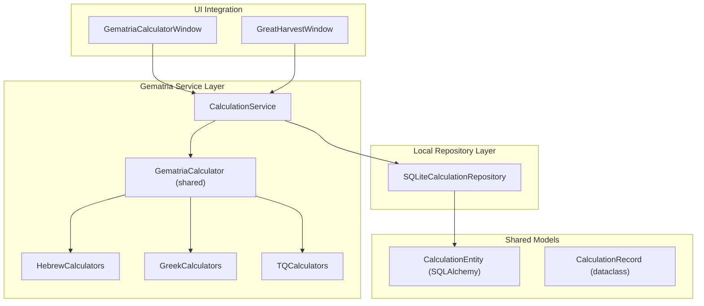
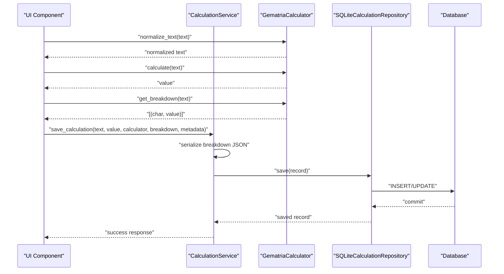
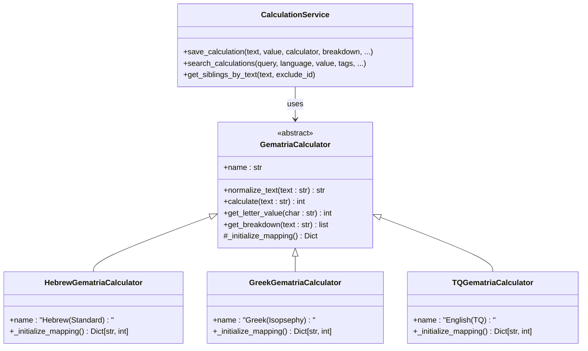

# Calculation Service

<cite>
**Referenced Files in This Document**
- [calculation_service.py](file://src/pillars/gematria/services/calculation_service.py)
- [base_calculator.py](file://src/shared/services/gematria/base_calculator.py)
- [hebrew_calculator.py](file://src/shared/services/gematria/hebrew_calculator.py)
- [greek_calculator.py](file://src/shared/services/gematria/greek_calculator.py)
- [tq_calculator.py](file://src/shared/services/gematria/tq_calculator.py)
- [sqlite_calculation_repository.py](file://src/pillars/gematria/repositories/sqlite_calculation_repository.py)
- [calculation_entity.py](file://src/pillars/gematria/models/calculation_entity.py)
- [calculation_record.py](file://src/pillars/gematria/models/calculation_record.py)
- [gematria_calculator_window.py](file://src/pillars/gematria/ui/gematria_calculator_window.py)
- [batch_calculator_window.py](file://src/pillars/gematria/ui/batch_calculator_window.py)
- [test_calculation_service.py](file://tests/unit/gematria/test_calculation_service.py)
</cite>

## Update Summary
**Changes Made**
- Updated CalculationService API documentation with comprehensive method signatures and parameter details
- Added new get_siblings_by_text method documentation with exclusion functionality
- Enhanced search_calculations method documentation with new search_mode parameter
- Updated architecture diagrams to reflect current implementation with shared calculator services
- Added detailed strategy pattern explanation for calculator selection
- Expanded UI integration examples with concrete implementation details
- Updated dependency analysis with current file structure

## Table of Contents
1. [Introduction](#introduction)
2. [Project Structure](#project-structure)
3. [Core Components](#core-components)
4. [Architecture Overview](#architecture-overview)
5. [Detailed Component Analysis](#detailed-component-analysis)
6. [Strategy Pattern Implementation](#strategy-pattern-implementation)
7. [Dependency Analysis](#dependency-analysis)
8. [Performance Considerations](#performance-considerations)
9. [Troubleshooting Guide](#troubleshooting-guide)
10. [Conclusion](#conclusion)
11. [Appendices](#appendices)

## Introduction
This document provides comprehensive API documentation for the CalculationService class, the central orchestrator of the Gematria pillar. The CalculationService coordinates calculation requests across multiple gematria systems (Hebrew, Greek, English/TQ) using a strategy pattern approach. It handles persistence through SQLite repositories, manages thread-safe batch processing, and integrates seamlessly with UI components for both interactive and automated analysis workflows.

## Project Structure
The Gematria pillar implements a layered architecture with shared calculator services, local repositories, and UI integration components. The CalculationService operates at the service layer, delegating to shared calculator implementations and local persistence mechanisms.



**Diagram sources**
- [calculation_service.py](file://src/pillars/gematria/services/calculation_service.py#L11-L22)
- [base_calculator.py](file://src/shared/services/gematria/base_calculator.py#L14-L37)
- [sqlite_calculation_repository.py](file://src/pillars/gematria/repositories/sqlite_calculation_repository.py#L16-L27)
- [calculation_entity.py](file://src/pillars/gematria/models/calculation_entity.py#L1-L7)
- [calculation_record.py](file://src/pillars/gematria/models/calculation_record.py#L1-L7)
- [gematria_calculator_window.py](file://src/pillars/gematria/ui/gematria_calculator_window.py#L26-L59)
- [batch_calculator_window.py](file://src/pillars/gematria/ui/batch_calculator_window.py#L128-L151)

**Section sources**
- [calculation_service.py](file://src/pillars/gematria/services/calculation_service.py#L1-L292)
- [sqlite_calculation_repository.py](file://src/pillars/gematria/repositories/sqlite_calculation_repository.py#L1-L222)
- [calculation_entity.py](file://src/pillars/gematria/models/calculation_entity.py#L1-L7)
- [calculation_record.py](file://src/pillars/gematria/models/calculation_record.py#L1-L7)
- [gematria_calculator_window.py](file://src/pillars/gematria/ui/gematria_calculator_window.py#L1-L778)
- [batch_calculator_window.py](file://src/pillars/gematria/ui/batch_calculator_window.py#L1-L693)

## Core Components

### CalculationService
The CalculationService orchestrates gematria calculations with comprehensive CRUD operations, search functionality, and metadata management. Key responsibilities include:
- **Persistence Management**: Handles creation, updates, deletion, and retrieval of calculation records
- **Search Operations**: Supports multiple search modes (General, Exact, Regex, Wildcard) with filtering capabilities
- **Metadata Handling**: Manages notes, sources, tags, categories, ratings, and favorite status
- **Breakdown Processing**: Serializes and deserializes calculation breakdowns with robust error handling
- **Sibling Detection**: Identifies calculations sharing identical text content

### Shared Calculator Strategy
The service leverages a strategy pattern through shared calculator implementations:
- **GematriaCalculator Interface**: Abstract base defining the contract for all calculation systems
- **System-Specific Implementations**: Hebrew, Greek, and English/TQ calculators with specialized algorithms
- **Normalization Engine**: Unicode-based text normalization removing diacritical marks
- **Breakdown Generation**: Ordered character-by-character value analysis

### Local Repository Layer
SQLite-based persistence providing:
- **Transaction Management**: Context-managed sessions with automatic rollback on errors
- **Query Optimization**: SQLAlchemy ORM with efficient filtering and pagination
- **Search Capabilities**: Multi-field text search with configurable modes
- **Data Integrity**: UUID-based identifiers and timestamp management

**Section sources**
- [calculation_service.py](file://src/pillars/gematria/services/calculation_service.py#L11-L292)
- [base_calculator.py](file://src/shared/services/gematria/base_calculator.py#L14-L115)
- [sqlite_calculation_repository.py](file://src/pillars/gematria/repositories/sqlite_calculation_repository.py#L16-L222)

## Architecture Overview
The CalculationService implements a clean architecture pattern with clear separation of concerns across layers.



**Diagram sources**
- [gematria_calculator_window.py](file://src/pillars/gematria/ui/gematria_calculator_window.py#L292-L500)
- [calculation_service.py](file://src/pillars/gematria/services/calculation_service.py#L23-L79)
- [base_calculator.py](file://src/shared/services/gematria/base_calculator.py#L39-L115)
- [sqlite_calculation_repository.py](file://src/pillars/gematria/repositories/sqlite_calculation_repository.py#L44-L61)

## Detailed Component Analysis

### CalculationService API

#### Core CRUD Operations
The service provides comprehensive data management through well-defined methods:

**save_calculation Method**
- **Purpose**: Creates new calculation records with validation and normalization
- **Parameters**: text, value, calculator, breakdown, plus metadata fields
- **Processing**: Serializes breakdown tuples to JSON, normalizes input text, constructs CalculationRecord
- **Return**: Saved CalculationRecord with generated identifiers and timestamps

**update_calculation Method**
- **Purpose**: Partial updates to existing calculation metadata
- **Parameters**: record_id with optional field updates (notes, source, tags, category, rating, favorite)
- **Processing**: Fetches record, updates only provided fields, maintains modification timestamps
- **Return**: Updated record or None if not found

**delete_calculation Method**
- **Purpose**: Removes calculation records from persistent storage
- **Parameters**: record_id identifier
- **Return**: Boolean indicating success/failure

**get_calculation Method**
- **Purpose**: Retrieves specific calculation by unique identifier
- **Parameters**: record_id
- **Return**: CalculationRecord or None

#### Advanced Query Operations

**search_calculations Method**
- **Purpose**: Comprehensive search with multiple filter criteria
- **Enhanced Parameters**: search_mode (General, Exact, Regex, Wildcard) for flexible querying
- **Filtering**: Supports text queries, language filtering, exact value matching, tag-based filtering, favorites-only results
- **Pagination**: Configurable limit and page parameters with summary-only mode for performance
- **Return**: List of matching CalculationRecord objects

**get_siblings_by_text Method**
- **Purpose**: Identifies calculations sharing identical text content
- **Enhanced Functionality**: Optional exclude_id parameter to exclude current record
- **Use Case**: Finding alternative calculation methods for the same text
- **Return**: List of sibling CalculationRecord objects

**Advanced Metadata Operations**
- **get_all_calculations**: Retrieves all records with configurable limits
- **get_calculations_by_value**: Finds calculations matching specific gematria values
- **get_favorite_calculations**: Returns all favorited calculations
- **toggle_favorite**: Switches favorite status with automatic timestamp updates

#### Breakdown Processing
Robust handling of calculation breakdowns with backward compatibility:
- **Serialization**: Converts [(char, value)] tuples to JSON arrays with {"char": c, "value": v} format
- **Deserialization**: Parses JSON back to tuples with support for mixed formats
- **Error Handling**: Graceful degradation to empty breakdowns on parsing failures
- **Validation**: Type conversion and null safety for all breakdown operations

**Section sources**
- [calculation_service.py](file://src/pillars/gematria/services/calculation_service.py#L23-L292)
- [test_calculation_service.py](file://tests/unit/gematria/test_calculation_service.py#L1-L200)

### Shared Calculator Strategy

#### GematriaCalculator Interface
The abstract base defines the contract for all calculation systems:
- **Abstract Methods**: _initialize_mapping (system-specific letter-value mapping), name property
- **Shared Methods**: normalize_text (Unicode normalization), calculate (total value computation), get_letter_value, get_breakdown
- **Characteristics**: Immutable letter mappings, case-sensitive handling, ordered breakdown preservation

#### System-Specific Implementations

**Hebrew Calculators**
- **Standard Hebrew**: Traditional Aleph-Tav values (1-400)
- **Sofit Forms**: Final letter variations (500-900)
- **Specialized Methods**: Ordinal, Square, Cube, Triangular, AtBash, Kolel variants

**Greek Calculators**
- **Isopsephy**: Standard alphabetic values (1-900)
- **Letter Values**: Spelled-out letter name calculations
- **Advanced Methods**: Ordinal, Square, Cube, Digital, Reverse Substitution, Pair Matching

**English/TQ Calculators**
- **TQ System**: Non-linear alphabet arrangement (0-25) based on sacred geometry
- **Reduced Values**: Digital root calculations
- **Advanced Variants**: Square, Cube, Triangular calculations

#### Normalization Engine
Unicode-based text processing removes diacritical marks:
- **NFD Normalization**: Separates base characters from combining marks
- **Category Filtering**: Removes Nonspacing_Mark (Mn) categories
- **NFC Restoration**: Returns composed character form
- **Cross-System Compatibility**: Ensures consistent calculations across languages

**Section sources**
- [base_calculator.py](file://src/shared/services/gematria/base_calculator.py#L14-L115)
- [hebrew_calculator.py](file://src/shared/services/gematria/hebrew_calculator.py#L16-L200)
- [greek_calculator.py](file://src/shared/services/gematria/greek_calculator.py#L18-L200)
- [tq_calculator.py](file://src/shared/services/gematria/tq_calculator.py#L18-L200)

### Local Repository Implementation

#### SQLiteCalculationRepository
Context-managed transaction handling with comprehensive query capabilities:
- **Session Management**: Automatic commit/rollback with context managers
- **CRUD Operations**: Full create, read, update, delete lifecycle
- **Search Modes**: Multiple pattern matching strategies (Contains, Exact, Regex, Wildcard)
- **Filtering**: Language, value, tags, favorites-only with intersection logic
- **Pagination**: Offset-based pagination with configurable limits

#### Data Model Integration
- **CalculationEntity**: SQLAlchemy ORM mapping to gematria_calculations table
- **CalculationRecord**: Data transfer object for service layer communication
- **JSON Fields**: Tags and breakdown stored as JSON for flexibility
- **Timestamp Management**: Automatic creation/modification timestamps

**Section sources**
- [sqlite_calculation_repository.py](file://src/pillars/gematria/repositories/sqlite_calculation_repository.py#L16-L222)
- [calculation_entity.py](file://src/pillars/gematria/models/calculation_entity.py#L1-L7)
- [calculation_record.py](file://src/pillars/gematria/models/calculation_record.py#L1-L7)

### UI Integration

#### GematriaCalculatorWindow
Interactive calculation interface supporting multiple calculator systems:
- **Calculator Selection**: Dropdown menu with dynamic calculator registration
- **Real-time Processing**: Immediate calculation feedback during text entry
- **Method Comparison**: "All Methods" mode for side-by-side system comparisons
- **Export Capabilities**: Last calculation data storage for external processing
- **Virtual Keyboard**: Language-specific input assistance

#### GreatHarvestWindow (Batch Processing)
Automated calculation processing with thread safety:
- **Batch Process Thread**: QThread-based background processing to prevent UI blocking
- **Progress Tracking**: Real-time progress updates via Qt signals
- **Error Handling**: Graceful handling of individual calculation failures
- **Data Import**: CSV/TSV/Excel/LibreOffice spreadsheet processing
- **Multi-Calculator Support**: Automatic processing with all registered calculators

#### Thread Safety and Performance
- **Signal/Slot Communication**: Safe UI updates from worker threads
- **Cancellation Support**: Stop mechanism for long-running batch operations
- **Memory Management**: Efficient processing of large datasets
- **Progress Reporting**: Real-time feedback for user experience

**Section sources**
- [gematria_calculator_window.py](file://src/pillars/gematria/ui/gematria_calculator_window.py#L26-L778)
- [batch_calculator_window.py](file://src/pillars/gematria/ui/batch_calculator_window.py#L27-L693)

## Strategy Pattern Implementation

The CalculationService employs a strategy pattern to enable pluggable calculation algorithms:



**Diagram sources**
- [base_calculator.py](file://src/shared/services/gematria/base_calculator.py#L14-L115)
- [hebrew_calculator.py](file://src/shared/services/gematria/hebrew_calculator.py#L16-L57)
- [greek_calculator.py](file://src/shared/services/gematria/greek_calculator.py#L18-L61)
- [tq_calculator.py](file://src/shared/services/gematria/tq_calculator.py#L18-L63)
- [calculation_service.py](file://src/pillars/gematria/services/calculation_service.py#L11-L22)

The strategy pattern provides several advantages:
- **Extensibility**: New calculation systems can be added without modifying existing code
- **Consistency**: Uniform interface across all calculation types
- **Testing**: Individual calculators can be tested in isolation
- **Flexibility**: Runtime calculator selection based on user preference or analysis requirements

**Section sources**
- [base_calculator.py](file://src/shared/services/gematria/base_calculator.py#L14-L115)
- [calculation_service.py](file://src/pillars/gematria/services/calculation_service.py#L11-L22)

## Dependency Analysis
The CalculationService maintains loose coupling through dependency injection and shared interfaces:

```mermaid
graph TB
subgraph "External Dependencies"
ABC["abc (Python Standard Library)"]
TY["typing (Python Standard Library)"]
DT["datetime (Python Standard Library)"]
JS["json (Python Standard Library)"]
SQ["SQLAlchemy ORM"]
END
subgraph "Internal Dependencies"
CS["CalculationService"]
SCR["SQLiteCalculationRepository"]
BC["GematriaCalculator (Interface)"]
CE["CalculationEntity"]
CRD["CalculationRecord"]
END
CS --> SCR
CS --> BC
SCR --> SQ
SCR --> CE
CE --> CRD
BC --> HC["Hebrew Calculator"]
BC --> GC["Greek Calculator"]
BC --> TC["TQ Calculator"]
```

**Diagram sources**
- [calculation_service.py](file://src/pillars/gematria/services/calculation_service.py#L1-L10)
- [sqlite_calculation_repository.py](file://src/pillars/gematria/repositories/sqlite_calculation_repository.py#L1-L14)
- [base_calculator.py](file://src/shared/services/gematria/base_calculator.py#L1-L12)

**Section sources**
- [calculation_service.py](file://src/pillars/gematria/services/calculation_service.py#L1-L10)
- [sqlite_calculation_repository.py](file://src/pillars/gematria/repositories/sqlite_calculation_repository.py#L1-L14)
- [base_calculator.py](file://src/shared/services/gematria/base_calculator.py#L1-L12)

## Performance Considerations

### Database Optimization
- **Index Strategy**: UUID-based primary keys with secondary indexes on frequently queried fields (language, value, is_favorite)
- **Query Patterns**: Optimized SQLAlchemy queries with selective field loading for summary operations
- **Connection Pooling**: Context-managed sessions prevent connection leaks and improve resource utilization

### Memory Management
- **Streaming Processing**: Large dataset processing through generator patterns where possible
- **Object Lifecycle**: Proper cleanup of calculation objects and database connections
- **Breakdown Serialization**: Efficient JSON serialization with ASCII optimization for international characters

### UI Responsiveness
- **Asynchronous Processing**: Batch operations run in separate threads to prevent UI blocking
- **Progress Reporting**: Real-time updates via Qt signals for long-running operations
- **Resource Limits**: Configurable processing limits to prevent memory exhaustion

### Search Performance
- **Search Mode Optimization**: Different algorithms for General vs. Exact vs. Regex matching
- **Pagination Strategy**: Offset-based pagination prevents loading entire result sets
- **Summary Mode**: Lightweight record loading for browsing interfaces

## Troubleshooting Guide

### Common Issues and Solutions

**Invalid Input Handling**
- **Empty Text**: Validation occurs at UI level; service expects non-empty strings
- **Unsupported Characters**: Unicode normalization removes diacritical marks automatically
- **Case Sensitivity**: Calculators handle case differences appropriately

**Calculator Registration**
- **Missing Methods**: Ensure all calculators inherit from GematriaCalculator
- **Name Conflicts**: Each calculator must have a unique name property
- **Mapping Errors**: Verify _initialize_mapping returns complete character-value pairs

**Database Connectivity**
- **Connection Failures**: Check SQLite file permissions and disk space
- **Transaction Errors**: Automatic rollback on exceptions; review error logs
- **Migration Issues**: Schema changes handled automatically by SQLAlchemy

**Performance Problems**
- **Slow Searches**: Use summary_only=True for browsing interfaces
- **Large Batch Processing**: Implement proper cancellation and progress reporting
- **Memory Usage**: Monitor object lifecycle and avoid retaining large result sets

**Section sources**
- [calculation_service.py](file://src/pillars/gematria/services/calculation_service.py#L260-L292)
- [sqlite_calculation_repository.py](file://src/pillars/gematria/repositories/sqlite_calculation_repository.py#L29-L39)
- [gematria_calculator_window.py](file://src/pillars/gematria/ui/gematria_calculator_window.py#L341-L392)

## Conclusion
The CalculationService represents a mature, well-architected solution for gematria calculation management. Its implementation demonstrates best practices in software engineering including clean architecture, dependency injection, strategy pattern usage, and comprehensive error handling. The service successfully bridges the gap between complex calculation algorithms and user-friendly interfaces while maintaining excellent performance characteristics for both interactive and batch processing scenarios.

## Appendices

### Practical Integration Examples

**Single Calculation Workflow**
```python
# UI collects text and calculator choice
text = "your_input_text"
calculator = HebrewGematriaCalculator()  # or Greek/Generic

# Calculate values and breakdown
value = calculator.calculate(text)
breakdown = calculator.get_breakdown(text)
normalized = calculator.normalize_text(text)

# Save via service
record = calculation_service.save_calculation(
    text=text,
    value=value,
    calculator=calculator,
    breakdown=breakdown,
    notes="User notes",
    tags=["tag1", "tag2"],
    category="Biblical Analysis"
)
```

**Batch Processing Implementation**
```python
# UI imports spreadsheet data
data = io_service.load_spreadsheet(file_path)

# Start batch processing thread
thread = BatchProcessThread(data, calculators, calculation_service)
thread.progress_updated.connect(update_progress)
thread.processing_finished.connect(handle_completion)
thread.start()
```

**Advanced Search Patterns**
```python
# Find all calculations with specific value
results = calculation_service.get_calculations_by_value(42)

# Search with multiple criteria
results = calculation_service.search_calculations(
    query="divine",
    language="Hebrew",
    value=73,
    tags=["Biblical", "Prophetic"],
    favorites_only=True,
    search_mode="Exact"
)

# Find calculation siblings
siblings = calculation_service.get_siblings_by_text(text, exclude_id=current_id)
```

**Section sources**
- [gematria_calculator_window.py](file://src/pillars/gematria/ui/gematria_calculator_window.py#L443-L500)
- [batch_calculator_window.py](file://src/pillars/gematria/ui/batch_calculator_window.py#L49-L126)
- [calculation_service.py](file://src/pillars/gematria/services/calculation_service.py#L151-L230)