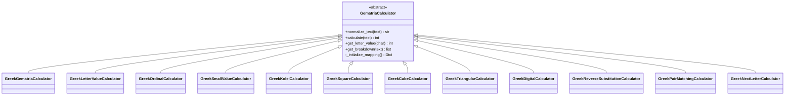
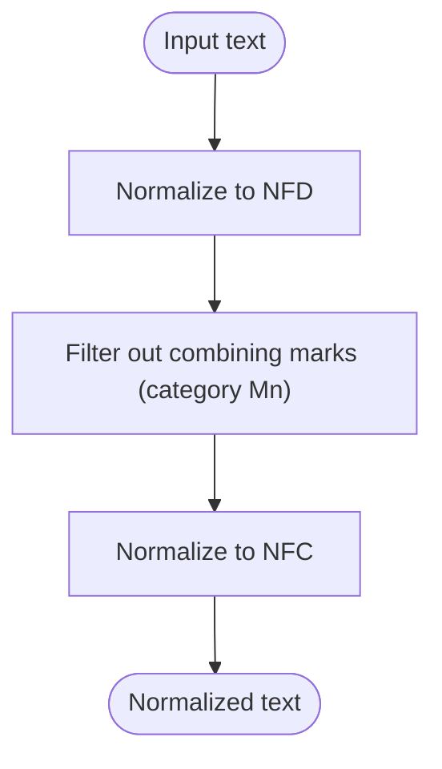
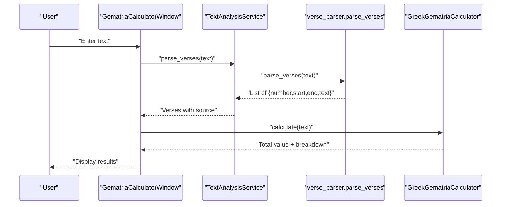
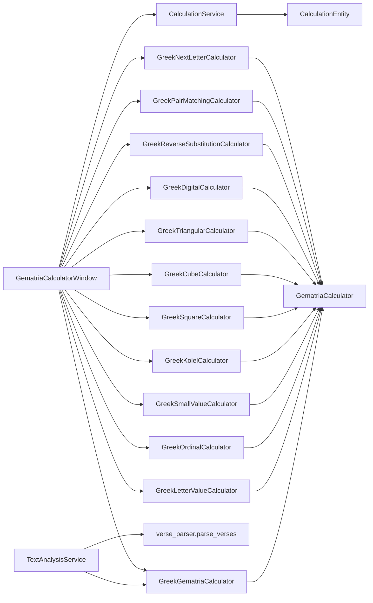

# Greek Calculator

<cite>
**Referenced Files in This Document**
- [greek_calculator.py](file://src/pillars/gematria/services/greek_calculator.py)
- [base_calculator.py](file://src/pillars/gematria/services/base_calculator.py)
- [text_analysis_service.py](file://src/pillars/gematria/services/text_analysis_service.py)
- [verse_parser.py](file://src/pillars/gematria/utils/verse_parser.py)
- [calculation_service.py](file://src/pillars/gematria/services/calculation_service.py)
- [gematria_calculator_window.py](file://src/pillars/gematria/ui/gematria_calculator_window.py)
- [calculation_entity.py](file://src/pillars/gematria/models/calculation_entity.py)
</cite>

## Table of Contents
1. [Introduction](#introduction)
2. [Project Structure](#project-structure)
3. [Core Components](#core-components)
4. [Architecture Overview](#architecture-overview)
5. [Detailed Component Analysis](#detailed-component-analysis)
6. [Dependency Analysis](#dependency-analysis)
7. [Performance Considerations](#performance-considerations)
8. [Troubleshooting Guide](#troubleshooting-guide)
9. [Conclusion](#conclusion)
10. [Appendices](#appendices)

## Introduction
This document describes the Greek Calculator service used to compute numerical values from Greek text using multiple isopsephy-based systems. It covers:
- Greek alphabet mapping to numerical values (including archaic letters)
- Supported calculation methods (Isopsephy Standard, Letter Value, Ordinal, Small Value, Kolel, Square, Cube, Triangular, Digital, Reverse Substitution, Pair Matching, Next Letter)
- Preprocessing steps for diacritical marks and Unicode normalization
- Integration with verse parsing for biblical text analysis
- Practical examples for theological terms such as “Logos” (Λόγος)
- Common issues and best practices for input handling

## Project Structure
The Greek Calculator is implemented as a set of calculator classes that extend a common base calculator. It integrates with higher-level services for text analysis and persistence.

```mermaid
graph TB
subgraph "Greek Calculator Layer"
GC["GreekGematriaCalculator<br/>Standard Isopsephy"]
GLV["GreekLetterValueCalculator<br/>Letter Value"]
GO["GreekOrdinalCalculator<br/>Ordinal"]
GSV["GreekSmallValueCalculator<br/>Small Value"]
GK["GreekKolelCalculator<br/>Kolel"]
GS["GreekSquareCalculator<br/>Square"]
GCu["GreekCubeCalculator<br/>Cube"]
GT["GreekTriangularCalculator<br/>Triangular"]
GD["GreekDigitalCalculator<br/>Digital"]
GR["GreekReverseSubstitutionCalculator<br/>Reverse Substitution"]
GP["GreekPairMatchingCalculator<br/>Pair Matching"]
GN["GreekNextLetterCalculator<br/>Next Letter"]
end
BC["GematriaCalculator<br/>Base (normalize, calculate, breakdown)"]
subgraph "Integration Layer"
TAS["TextAnalysisService<br/>find_value_matches, parse_verses"]
VS["verse_parser.parse_verses<br/>verse segmentation"]
CS["CalculationService<br/>save/update/search"]
CE["CalculationEntity<br/>persistence model"]
UI["GematriaCalculatorWindow<br/>UI + keyboard + save"]
end
GC --> BC
GLV --> BC
GO --> BC
GSV --> BC
GK --> BC
GS --> BC
GCu --> BC
GT --> BC
GD --> BC
GR --> BC
GP --> BC
GN --> BC
TAS --> GC
TAS --> GLV
TAS --> GO
TAS --> GSV
TAS --> GK
TAS --> GS
TAS --> GCu
TAS --> GT
TAS --> GD
TAS --> GR
TAS --> GP
TAS --> GN
TAS --> VS
CS --> CE
UI --> CS
UI --> GC
UI --> GLV
UI --> GO
UI --> GSV
UI --> GK
UI --> GS
UI --> GCu
UI --> GT
UI --> GD
UI --> GR
UI --> GP
UI --> GN
```

**Diagram sources**
- [greek_calculator.py](file://src/pillars/gematria/services/greek_calculator.py#L1-L888)
- [base_calculator.py](file://src/pillars/gematria/services/base_calculator.py#L1-L107)
- [text_analysis_service.py](file://src/pillars/gematria/services/text_analysis_service.py#L1-L185)
- [verse_parser.py](file://src/pillars/gematria/utils/verse_parser.py#L1-L107)
- [calculation_service.py](file://src/pillars/gematria/services/calculation_service.py#L1-L273)
- [gematria_calculator_window.py](file://src/pillars/gematria/ui/gematria_calculator_window.py#L1-L500)
- [calculation_entity.py](file://src/pillars/gematria/models/calculation_entity.py#L1-L92)

**Section sources**
- [greek_calculator.py](file://src/pillars/gematria/services/greek_calculator.py#L1-L888)
- [base_calculator.py](file://src/pillars/gematria/services/base_calculator.py#L1-L107)
- [text_analysis_service.py](file://src/pillars/gematria/services/text_analysis_service.py#L1-L185)
- [verse_parser.py](file://src/pillars/gematria/utils/verse_parser.py#L1-L107)
- [calculation_service.py](file://src/pillars/gematria/services/calculation_service.py#L1-L273)
- [gematria_calculator_window.py](file://src/pillars/gematria/ui/gematria_calculator_window.py#L1-L500)
- [calculation_entity.py](file://src/pillars/gematria/models/calculation_entity.py#L1-L92)

## Core Components
- GreekGematriaCalculator: Implements standard Isopsephy values for the Greek alphabet, including archaic letters Digamma, Koppa, and Sampi.
- GreekLetterValueCalculator: Computes values based on the spelled-out names of letters.
- GreekOrdinalCalculator: Assigns values based on letter position in the extended alphabet (1–27).
- GreekSmallValueCalculator: Reduces values to single digits by removing zeros.
- GreekKolelCalculator: Adds the number of letters to the standard Isopsephy value.
- GreekSquareCalculator: Sums the squares of letter values.
- GreekCubeCalculator: Sums the cubes of letter values.
- GreekTriangularCalculator: Sums triangular numbers derived from letter values.
- GreekDigitalCalculator: Sums digit sums of letter values.
- GreekReverseSubstitutionCalculator: Applies Greek reverse substitution (AtBash-like).
- GreekPairMatchingCalculator: Applies Greek pair-matching substitution.
- GreekNextLetterCalculator: Shifts each letter to the next letter’s value (wrapping).
- GematriaCalculator (base): Provides normalization and shared calculation logic.
- TextAnalysisService: Offers scanning and statistical helpers for text.
- CalculationService: Persists and retrieves calculation records.
- VerseParser: Parses plain text into numbered verses.
- UI: GematriaCalculatorWindow provides interactive calculation and saving.

**Section sources**
- [greek_calculator.py](file://src/pillars/gematria/services/greek_calculator.py#L1-L888)
- [base_calculator.py](file://src/pillars/gematria/services/base_calculator.py#L1-L107)
- [text_analysis_service.py](file://src/pillars/gematria/services/text_analysis_service.py#L1-L185)
- [verse_parser.py](file://src/pillars/gematria/utils/verse_parser.py#L1-L107)
- [calculation_service.py](file://src/pillars/gematria/services/calculation_service.py#L1-L273)
- [gematria_calculator_window.py](file://src/pillars/gematria/ui/gematria_calculator_window.py#L1-L500)

## Architecture Overview
The Greek Calculator is built around a shared base class that handles Unicode normalization and basic calculation. Each Greek calculator subclass defines its own letter-to-value mapping and, where applicable, overrides the calculate method to implement specialized logic (e.g., squaring, digit sums, reverse substitution).

**Diagram sources**
- [greek_calculator.py](file://src/pillars/gematria/services/greek_calculator.py#L1-L888)
- [base_calculator.py](file://src/pillars/gematria/services/base_calculator.py#L1-L107)

## Detailed Component Analysis

### Greek Alphabet Mapping and Archaic Letters
- Standard Isopsephy values cover Alpha through Theta (1–9), Iota through Koppa (10–90), and Rho through Sampi (100–900).
- Archaic letters included:
  - Digamma (Ϝ, ϝ) = 6
  - Koppa (Ϙ, ϙ) = 90
  - Sampi (ϡ) = 900
- Final sigma (ς) is treated as a separate letter with the same value as sigma (σ).

These mappings are defined in the GreekGematriaCalculator initialization and are reused by calculators that rely on standard values (e.g., Square, Cube, Triangular, Digital, Kolel).

**Section sources**
- [greek_calculator.py](file://src/pillars/gematria/services/greek_calculator.py#L51-L97)

### Supported Calculation Methods
- Isopsephy Standard: Sum of letter values using the standard mapping.
- Letter Value: Each letter is replaced by the value of its full spelling.
- Ordinal: Position-based values in the extended alphabet (1–27).
- Small Value: Reduce tens/hundreds to single digits by removing zeros.
- Kolel: Standard Isopsephy plus the number of letters.
- Square: Sum of squares of letter values.
- Cube: Sum of cubes of letter values.
- Triangular: Sum of triangular numbers T(n) = n(n+1)/2 for each letter value.
- Digital: Sum of digit sums of each letter value.
- Reverse Substitution (AtBash): Reverse substitution across the alphabet.
- Pair Matching: Substitute each letter with its paired counterpart.
- Next Letter: Replace each letter with the next letter’s value (wrapping).

Each method is implemented as a dedicated calculator class inheriting from the base class.

**Section sources**
- [greek_calculator.py](file://src/pillars/gematria/services/greek_calculator.py#L100-L888)

### Preprocessing: Diacritical Marks and Unicode Normalization
- The base calculator performs Unicode normalization:
  - NFD decomposition separates base characters from combining marks.
  - Combining marks (e.g., Greek tonos, dialytika) are filtered out.
  - The result is recomposed with NFC.
- This ensures diacritics and accents do not affect letter value lookups.

**Diagram sources**
- [base_calculator.py](file://src/pillars/gematria/services/base_calculator.py#L30-L57)

**Section sources**
- [base_calculator.py](file://src/pillars/gematria/services/base_calculator.py#L30-L57)

### Integration with Verse Parser for Biblical Text Analysis
- TextAnalysisService provides:
  - find_value_matches: Scans text for phrases matching a target value using a chosen calculator, optionally adding numeric face values.
  - calculate_text: Convenience wrapper to compute a value with optional numeric face values.
  - calculate_stats: Computes word count, character count, total value, and average word value.
  - parse_verses: Segments text into numbered verses, using either a document manager’s metadata or a local parser fallback.
- The local parser identifies verse markers using a flexible pattern and applies heuristics to distinguish line-start markers from inline markers.

**Diagram sources**
- [text_analysis_service.py](file://src/pillars/gematria/services/text_analysis_service.py#L155-L185)
- [verse_parser.py](file://src/pillars/gematria/utils/verse_parser.py#L1-L107)
- [greek_calculator.py](file://src/pillars/gematria/services/greek_calculator.py#L1-L100)

**Section sources**
- [text_analysis_service.py](file://src/pillars/gematria/services/text_analysis_service.py#L1-L185)
- [verse_parser.py](file://src/pillars/gematria/utils/verse_parser.py#L1-L107)

### Examples: Encoding Theological Terms
- “Logos” (Λόγος):
  - Standard Isopsephy: Λ(30) + ό(70) + γ(3) + ο(70) + ς(200) = 373
  - Ordinal: Λ(12) + ό(16) + γ(3) + ο(16) + ς(20) = 67
  - Square: Θ(81) + ε(25) + ό(4900) + ς(40000) ≈ 45,006 (for Θεός example)
  - Triangular: Sum of T(letter_value) across letters
  - Digital: Sum of digit sums of each letter value
  - Reverse Substitution: AtBash-like transformation across the alphabet
  - Pair Matching: Letter paired with its complement
  - Next Letter: Each letter replaced by the next letter’s value

These examples illustrate how different methods yield distinct numerical results for the same text.

**Section sources**
- [greek_calculator.py](file://src/pillars/gematria/services/greek_calculator.py#L35-L44)
- [greek_calculator.py](file://src/pillars/gematria/services/greek_calculator.py#L180-L212)
- [greek_calculator.py](file://src/pillars/gematria/services/greek_calculator.py#L374-L406)
- [greek_calculator.py](file://src/pillars/gematria/services/greek_calculator.py#L438-L469)
- [greek_calculator.py](file://src/pillars/gematria/services/greek_calculator.py#L471-L539)
- [greek_calculator.py](file://src/pillars/gematria/services/greek_calculator.py#L541-L608)
- [greek_calculator.py](file://src/pillars/gematria/services/greek_calculator.py#L662-L751)
- [greek_calculator.py](file://src/pillars/gematria/services/greek_calculator.py#L753-L813)
- [greek_calculator.py](file://src/pillars/gematria/services/greek_calculator.py#L815-L888)

## Dependency Analysis
- Greek calculators depend on the base GematriaCalculator for normalization and shared calculation logic.
- TextAnalysisService depends on a calculator instance to evaluate text segments and optionally on the verse parser for segmentation.
- CalculationService persists results using CalculationEntity, which stores normalized text, breakdown JSON, and metadata.
- UI composes multiple calculators and exposes a menu to select methods, including “All Methods” for a language.

**Diagram sources**
- [greek_calculator.py](file://src/pillars/gematria/services/greek_calculator.py#L1-L888)
- [base_calculator.py](file://src/pillars/gematria/services/base_calculator.py#L1-L107)
- [text_analysis_service.py](file://src/pillars/gematria/services/text_analysis_service.py#L1-L185)
- [verse_parser.py](file://src/pillars/gematria/utils/verse_parser.py#L1-L107)
- [calculation_service.py](file://src/pillars/gematria/services/calculation_service.py#L1-L273)
- [calculation_entity.py](file://src/pillars/gematria/models/calculation_entity.py#L1-L92)
- [gematria_calculator_window.py](file://src/pillars/gematria/ui/gematria_calculator_window.py#L1-L500)

**Section sources**
- [greek_calculator.py](file://src/pillars/gematria/services/greek_calculator.py#L1-L888)
- [base_calculator.py](file://src/pillars/gematria/services/base_calculator.py#L1-L107)
- [text_analysis_service.py](file://src/pillars/gematria/services/text_analysis_service.py#L1-L185)
- [verse_parser.py](file://src/pillars/gematria/utils/verse_parser.py#L1-L107)
- [calculation_service.py](file://src/pillars/gematria/services/calculation_service.py#L1-L273)
- [calculation_entity.py](file://src/pillars/gematria/models/calculation_entity.py#L1-L92)
- [gematria_calculator_window.py](file://src/pillars/gematria/ui/gematria_calculator_window.py#L1-L500)

## Performance Considerations
- Normalization cost: NFD/NFC normalization and filtering combining marks is linear in the length of the input. This is efficient for typical text sizes.
- Calculation loops: Each calculator iterates over normalized characters and performs constant-time lookups in its mapping dictionary.
- Memory: Breakdown lists preserve order and duplicates, which is useful for detailed analysis but increases memory usage for long texts.
- Multi-method UI mode: Computing all methods for a language scales linearly with the number of calculators and the length of the input text.

[No sources needed since this section provides general guidance]

## Troubleshooting Guide
Common issues and resolutions:
- Polytonic vs. monotonic input:
  - The base calculator removes diacritical marks via Unicode normalization. If your input uses polytonic accents, they will be stripped automatically. If you need to preserve or convert accents differently, adjust input accordingly before passing to the calculator.
- Case sensitivity:
  - Mappings include both uppercase and lowercase forms for each letter. Ensure your input matches the expected casing to achieve correct lookups.
- Archiac letters:
  - Digamma (Ϝ, ϝ), Koppa (Ϙ, ϙ), and Sampi (ϡ) are supported. Verify correct Unicode glyphs are used.
- Verse segmentation:
  - If parse_verses does not detect expected markers, confirm that markers appear at line starts or are followed by uppercase letters. Inline markers require adjacent numbers or uppercase continuation to be accepted.
- Saving calculations:
  - Ensure a single calculator is selected (not “All Methods”) to save a single value. “All Methods” mode disables saving in the UI.

**Section sources**
- [base_calculator.py](file://src/pillars/gematria/services/base_calculator.py#L30-L57)
- [verse_parser.py](file://src/pillars/gematria/utils/verse_parser.py#L1-L107)
- [gematria_calculator_window.py](file://src/pillars/gematria/ui/gematria_calculator_window.py#L393-L442)

## Conclusion
The Greek Calculator provides a comprehensive toolkit for Greek textual analysis using multiple isopsephy-based methods. Its design emphasizes clean separation of concerns: a shared base for normalization and calculation, specialized calculators for diverse methodologies, and integrated services for text analysis and persistence. The system supports both academic and devotional use cases, including theological term analysis and biblical text segmentation.

[No sources needed since this section summarizes without analyzing specific files]

## Appendices

### API Surface Summary
- GreekGematriaCalculator
  - name: property
  - calculate(text): int
  - get_breakdown(text): list of (char, value)
- GreekLetterValueCalculator
  - name: property
  - calculate(text): int
- GreekOrdinalCalculator
  - name: property
  - calculate(text): int
- GreekSmallValueCalculator
  - name: property
  - calculate(text): int
- GreekKolelCalculator
  - name: property
  - calculate(text): int
- GreekSquareCalculator
  - name: property
  - calculate(text): int
- GreekCubeCalculator
  - name: property
  - calculate(text): int
- GreekTriangularCalculator
  - name: property
  - calculate(text): int
- GreekDigitalCalculator
  - name: property
  - calculate(text): int
- GreekReverseSubstitutionCalculator
  - name: property
  - calculate(text): int
- GreekPairMatchingCalculator
  - name: property
  - calculate(text): int
- GreekNextLetterCalculator
  - name: property
  - calculate(text): int

**Section sources**
- [greek_calculator.py](file://src/pillars/gematria/services/greek_calculator.py#L1-L888)

### Persistence Model
- CalculationEntity fields include text, normalized_text, value, language, method, notes, source, tags, breakdown, character_count, normalized_hash, user_rating, is_favorite, category, related_ids, and timestamps.

**Section sources**
- [calculation_entity.py](file://src/pillars/gematria/models/calculation_entity.py#L1-L92)