# Hebrew Calculator

<cite>
**Referenced Files in This Document**
- [base_calculator.py](file://src/pillars/gematria/services/base_calculator.py)
- [hebrew_calculator.py](file://src/pillars/gematria/services/hebrew_calculator.py)
- [hebrew.py](file://src/calculators/hebrew.py)
- [test_calculation_service.py](file://test/pillars/gematria/test_calculation_service.py)
</cite>

## Table of Contents
1. [Introduction](#introduction)
2. [Project Structure](#project-structure)
3. [Core Components](#core-components)
4. [Architecture Overview](#architecture-overview)
5. [Detailed Component Analysis](#detailed-component-analysis)
6. [Dependency Analysis](#dependency-analysis)
7. [Performance Considerations](#performance-considerations)
8. [Troubleshooting Guide](#troubleshooting-guide)
9. [Conclusion](#conclusion)
10. [Appendices](#appendices)

## Introduction
This document provides comprehensive API documentation for the Hebrew Calculator subsystem. It explains the Hebrew gematria mapping based on the standard Aleph–Tav values, final form letter handling, and the suite of reduction and cipher methods implemented. It also covers Unicode normalization for niqqud and cantillation marks, return value formats, and examples for encoding representative Hebrew terms such as Shalom. Edge cases like mixed-language text and invalid Hebrew characters are addressed, along with performance notes on Unicode processing and caching strategies.

## Project Structure
The Hebrew Calculator is implemented as a set of specialized calculators extending a common base class. The primary implementation resides under the gematria pillar services, with a legacy module in the calculators package.

**Diagram sources**
- [base_calculator.py](file://src/pillars/gematria/services/base_calculator.py#L1-L107)
- [hebrew_calculator.py](file://src/pillars/gematria/services/hebrew_calculator.py#L1-L1098)

**Section sources**
- [base_calculator.py](file://src/pillars/gematria/services/base_calculator.py#L1-L107)
- [hebrew_calculator.py](file://src/pillars/gematria/services/hebrew_calculator.py#L1-L1098)
- [hebrew.py](file://src/calculators/hebrew.py#L1-L61)

## Core Components
- Base calculator: Provides shared normalization, calculation loop, and breakdown utilities.
- Hebrew calculators: Implement specific gematria systems and reductions.

Key responsibilities:
- Mapping: Each calculator defines a dictionary mapping Hebrew characters to numeric values.
- Normalization: Removes diacritical marks (nikud, cantillation) and normalizes Unicode.
- Calculation: Sums values across normalized characters.
- Reductions: Additional mathematical transformations (squaring, cubing, triangular numbers, integral reduction, etc.).
- Ciphers: Substitution-based methods (AtBash, Albam) and composite methods (Kolel, Full Value).

Return value formats:
- Integer totals for standard and transformed calculations.
- Breakdown lists of (character, value) tuples for detailed analysis.

**Section sources**
- [base_calculator.py](file://src/pillars/gematria/services/base_calculator.py#L30-L107)
- [hebrew_calculator.py](file://src/pillars/gematria/services/hebrew_calculator.py#L1-L1098)

## Architecture Overview
The Hebrew Calculator architecture follows a layered design:
- Base class encapsulates normalization and iteration logic.
- Concrete calculators override mapping initialization and, where applicable, calculation logic.
- Utilities support numeric operations and text analysis.

```mermaid
classDiagram
class GematriaCalculator {
+normalize_text(text) str
+calculate(text) int
+get_letter_value(char) int
+get_breakdown(text) list
<<abstract>>
}
class HebrewGematriaCalculator
class HebrewSofitCalculator
class HebrewLetterValueCalculator
class HebrewOrdinalCalculator
class HebrewSmallValueCalculator
class HebrewAtBashCalculator
class HebrewKolelCalculator
class HebrewSquareCalculator
class HebrewCubeCalculator
class HebrewTriangularCalculator
class HebrewIntegralReducedCalculator
class HebrewOrdinalSquareCalculator
class HebrewFullValueCalculator
class HebrewAlbamCalculator
GematriaCalculator <|-- HebrewGematriaCalculator
GematriaCalculator <|-- HebrewSofitCalculator
GematriaCalculator <|-- HebrewLetterValueCalculator
GematriaCalculator <|-- HebrewOrdinalCalculator
GematriaCalculator <|-- HebrewSmallValueCalculator
GematriaCalculator <|-- HebrewAtBashCalculator
GematriaCalculator <|-- HebrewKolelCalculator
GematriaCalculator <|-- HebrewSquareCalculator
GematriaCalculator <|-- HebrewCubeCalculator
GematriaCalculator <|-- HebrewTriangularCalculator
GematriaCalculator <|-- HebrewIntegralReducedCalculator
GematriaCalculator <|-- HebrewOrdinalSquareCalculator
GematriaCalculator <|-- HebrewFullValueCalculator
GematriaCalculator <|-- HebrewAlbamCalculator
```

**Diagram sources**
- [base_calculator.py](file://src/pillars/gematria/services/base_calculator.py#L1-L107)
- [hebrew_calculator.py](file://src/pillars/gematria/services/hebrew_calculator.py#L1-L1098)

## Detailed Component Analysis

### Standard Hebrew Gematria (Mispar Hechrachi)
- Purpose: Assigns Aleph–Tav values (1–400) without final forms.
- Mapping: Aleph=1, Bet=2, ..., Yod=10; Kaf=20, Mem=40, Nun=50, Samekh=60, Pe=80, Tzadi=90; Qof=100, Resh=200, Shin=300, Tav=400.
- Final forms: Regular and final forms share identical values.
- Typical applications: Biblical exegesis, Kabbalah, comparative equivalencies.

Return value format: Integer sum of letter values.

**Section sources**
- [hebrew_calculator.py](file://src/pillars/gematria/services/hebrew_calculator.py#L1-L93)
- [hebrew.py](file://src/calculators/hebrew.py#L1-L61)

### Sofit (Mispar Sofit)
- Purpose: Extends values beyond 400 by assigning special values to final letters: final Kaf=500, final Mem=600, final Nun=700, final Pe=800, final Tzadi=900.
- Mapping: Uses standard values for non-final letters; applies special values for final forms.
- Applications: Advanced Kabbalistic calculations, revealing deeper numerical relationships.

Return value format: Integer sum using sofit values.

**Section sources**
- [hebrew_calculator.py](file://src/pillars/gematria/services/hebrew_calculator.py#L96-L183)

### Letter Value (Mispar Gadol Sofit)
- Purpose: Calculates each letter’s value as the sum of the values of its full spelling (with final forms).
- Mapping: Precomputed values for each letter’s spelled-out name.
- Applications: Deep Kabbalistic analysis, understanding the spiritual essence of letters.

Return value format: Integer sum of spelled-out letter values.

**Section sources**
- [hebrew_calculator.py](file://src/pillars/gematria/services/hebrew_calculator.py#L186-L266)

### Ordinal (Mispar Siduri)
- Purpose: Assigns each letter its position in the alphabet (1–22).
- Mapping: Aleph=1, Bet=2, ..., Tav=22; final forms mirror regular positions.
- Applications: Simplified calculations, structural analysis.

Return value format: Integer sum of ordinal positions.

**Section sources**
- [hebrew_calculator.py](file://src/pillars/gematria/services/hebrew_calculator.py#L268-L350)

### Small Value (Mispar Katan)
- Purpose: Reduces values to single digits by removing zeros (10→1, 20→2, ..., 400→4).
- Mapping: Applies digit-reduction rules across units, tens, and hundreds.
- Applications: Practical Kabbalah, core numerical essence.

Return value format: Integer sum of reduced digits.

**Section sources**
- [hebrew_calculator.py](file://src/pillars/gematria/services/hebrew_calculator.py#L352-L440)

### AtBash (אתב״ש)
- Purpose: Substitutes letters by reversing the alphabet (Aleph↔Tav, Bet↔Shin, etc.).
- Mapping: Derived from standard values mapped to reversed positions.
- Applications: Hidden meanings in biblical text, cryptographic insights.

Return value format: Integer sum of AtBash-transformed values.

**Section sources**
- [hebrew_calculator.py](file://src/pillars/gematria/services/hebrew_calculator.py#L442-L533)

### Kolel (Mispar Kolel)
- Purpose: Adds the number of letters to the standard gematria value.
- Formula: Standard value + letter count.
- Applications: Emphasizing word structure and collective meaning.

Return value format: Integer sum plus letter count.

**Section sources**
- [hebrew_calculator.py](file://src/pillars/gematria/services/hebrew_calculator.py#L535-L594)

### Square (Mispar Bone’eh)
- Purpose: Sums the squares of each letter’s value.
- Formula: Σ(letter_value²).
- Applications: Amplifying numerical significance.

Return value format: Integer sum of squared values.

**Section sources**
- [hebrew_calculator.py](file://src/pillars/gematria/services/hebrew_calculator.py#L596-L658)

### Cube (Mispar Meshulash)
- Purpose: Sums the cubes of each letter’s value.
- Formula: Σ(letter_value³).
- Applications: Three-dimensional spiritual realities.

Return value format: Integer sum of cubed values.

**Section sources**
- [hebrew_calculator.py](file://src/pillars/gematria/services/hebrew_calculator.py#L660-L725)

### Triangular (Mispar Kidmi)
- Purpose: Sums triangular numbers T(n)=n(n+1)/2 for each letter’s value.
- Formula: Σ(T(letter_value)).
- Applications: Cumulative spiritual significance.

Return value format: Integer sum of triangular numbers.

**Section sources**
- [hebrew_calculator.py](file://src/pillars/gematria/services/hebrew_calculator.py#L727-L795)

### Integral Reduced (Mispar Mispari)
- Purpose: Sums the digits of each letter’s value (including zeros).
- Formula: Σ(digit_sum(letter_value)).
- Applications: Digital root patterns, modern numerology.

Return value format: Integer sum of digit sums.

**Section sources**
- [hebrew_calculator.py](file://src/pillars/gematria/services/hebrew_calculator.py#L797-L865)

### Ordinal Square
- Purpose: Squares each letter’s ordinal position and sums.
- Formula: Σ(position²).
- Applications: Structural analysis emphasizing positional significance.

Return value format: Integer sum of squared positions.

**Section sources**
- [hebrew_calculator.py](file://src/pillars/gematria/services/hebrew_calculator.py#L867-L931)

### Full Value (Mispar Gadol)
- Purpose: Uses the full spelling of each letter without final forms.
- Mapping: Precomputed values for each letter’s spelled-out name (without final letters).
- Applications: Classical mystical text analysis.

Return value format: Integer sum of full spelling values.

**Section sources**
- [hebrew_calculator.py](file://src/pillars/gematria/services/hebrew_calculator.py#L933-L1008)

### Albam (אלבם)
- Purpose: Pairs first half of the alphabet with the second half (Aleph↔Lamed, Bet↔Mem, etc.).
- Mapping: Derived from standard values by pairing positions.
- Applications: Dual aspects of letters, complementary relationships.

Return value format: Integer sum of Albam-transformed values.

**Section sources**
- [hebrew_calculator.py](file://src/pillars/gematria/services/hebrew_calculator.py#L1010-L1098)

## Architecture Overview

**Diagram sources**
- [base_calculator.py](file://src/pillars/gematria/services/base_calculator.py#L30-L76)
- [hebrew_calculator.py](file://src/pillars/gematria/services/hebrew_calculator.py#L1-L93)

## Detailed Component Analysis

### Unicode Normalization and Diacritic Handling
- Behavior: Removes Hebrew nikud and cantillation marks, and other combining marks, while preserving composed characters.
- Implementation: NFD decomposition, filtering category Mn (nonspacing marks), then NFC recomposition.
- Impact: Ensures consistent letter-value mapping regardless of vowel points or cantillation accents.

**Diagram sources**
- [base_calculator.py](file://src/pillars/gematria/services/base_calculator.py#L30-L57)

**Section sources**
- [base_calculator.py](file://src/pillars/gematria/services/base_calculator.py#L30-L57)

### Encoding Examples

- Shalom (שלום)
  - Standard: Sum of ש(300) + ל(30) + ו(6) + ם(40) = 376.
  - Sofit: Final Mem is treated as 600; value becomes 300 + 30 + 6 + 600 = 936.
  - Small Value: Reduce each value to single digits (3+3+6+4) = 16; further reduce 1+6 = 7.
  - Square: 300² + 30² + 6² + 40² = 90000 + 900 + 36 + 1600 = 92536.
  - Cube: 300³ + 30³ + 6³ + 40³ = 27000000 + 27000 + 216 + 64000 = 27091216.
  - Triangular: T(300)+T(30)+T(6)+T(40) = 45150 + 465 + 21 + 820 = 46456.
  - Integral Reduced: Digit sums of values (3+0+0)+(3+0)+(6)+(4+0) = 3+3+6+4 = 16.
  - Kolel: 376 + 4 letters = 380.
  - Letter Value: Value of spelled-out names (e.g., ש=1010, ל=74, ו=12, ם=640) sums to 1736.
  - Full Value: Values without final forms (e.g., ש=360, ל=74, ו=12, ם=80) sums to 526.
  - Ordinal: Positions 19, 12, 6, 13 sum to 52.
  - Ordinal Square: 19² + 12² + 6² + 13² = 361 + 144 + 36 + 169 = 710.
  - AtBash: Aleph↔Tav, Bet↔Shin, Gimel↔Resh, Dalet↔Qof, etc.; compute accordingly.
  - Albam: Pair first half with second half; compute accordingly.

Notes:
- Final forms are handled consistently across calculators where applicable.
- Mixed-language text is supported by normalization; non-Hebrew characters are ignored in value summation.
- Invalid Hebrew characters are silently skipped; return value is the sum of recognized letters.

**Section sources**
- [hebrew_calculator.py](file://src/pillars/gematria/services/hebrew_calculator.py#L1-L1098)
- [base_calculator.py](file://src/pillars/gematria/services/base_calculator.py#L58-L76)

### API Reference

- calculate(text: str) -> int
  - Computes the gematria value according to the specific calculator’s mapping and normalization.
  - Normalizes text prior to calculation.
  - Returns integer total.

- normalize_text(text: str) -> str
  - Removes diacritical marks and returns composed Unicode.
  - Used internally by calculate and externally for inspection.

- get_letter_value(char: str) -> int
  - Returns the value of a single recognized character or 0 if not found.

- get_breakdown(text: str) -> list[tuple[str, int]]
  - Returns ordered list of (character, value) for recognized letters in normalized text.

- name: str
  - Human-readable name of the calculator (e.g., "Hebrew (Standard)", "Hebrew (Sofit)", etc.).

Return value formats:
- Integer for totals.
- List of tuples for breakdowns.

**Section sources**
- [base_calculator.py](file://src/pillars/gematria/services/base_calculator.py#L30-L107)
- [hebrew_calculator.py](file://src/pillars/gematria/services/hebrew_calculator.py#L1-L1098)

## Dependency Analysis

**Diagram sources**
- [base_calculator.py](file://src/pillars/gematria/services/base_calculator.py#L1-L107)
- [hebrew_calculator.py](file://src/pillars/gematria/services/hebrew_calculator.py#L1-L1098)

**Section sources**
- [base_calculator.py](file://src/pillars/gematria/services/base_calculator.py#L1-L107)
- [hebrew_calculator.py](file://src/pillars/gematria/services/hebrew_calculator.py#L1-L1098)

## Performance Considerations
- Unicode normalization:
  - NFD/NFC normalization and filtering of combining marks are linear in the length of the input string.
  - For repeated calculations, consider caching normalized text if the same input is processed multiple times.
- Lookup performance:
  - Character-to-value mapping is a dictionary lookup; typical O(1) average-case performance.
  - For very long texts, consider pre-normalizing and iterating once.
- Caching strategies:
  - Cache frequently accessed letter values or normalized strings if the same words are computed repeatedly.
  - For batch operations, reuse a single calculator instance to benefit from its internal mapping cache.
- Memory:
  - Breakdown lists preserve order and duplicates; avoid storing large breakdowns unless needed.

[No sources needed since this section provides general guidance]

## Troubleshooting Guide
- Mixed-language text:
  - Non-Hebrew characters are ignored in value summation; only recognized Hebrew letters contribute to totals.
- Invalid Hebrew characters:
  - Characters not present in the mapping are ignored; ensure input uses canonical Hebrew characters.
- Nikud and cantillation:
  - These are removed by normalization; if you need to preserve them, avoid normalization or post-process the normalized text.
- Unexpected zero totals:
  - Verify that the input contains recognized Hebrew characters and that normalization is not inadvertently removing intended characters.
- Breakdown discrepancies:
  - Confirm whether final forms are expected; some calculators treat final forms differently than others.

**Section sources**
- [base_calculator.py](file://src/pillars/gematria/services/base_calculator.py#L30-L76)
- [hebrew_calculator.py](file://src/pillars/gematria/services/hebrew_calculator.py#L1-L1098)

## Conclusion
The Hebrew Calculator subsystem offers a comprehensive toolkit for Hebrew gematria, covering standard values, final forms, advanced reductions, and substitution ciphers. Its design centers on a robust base class that handles normalization and iteration, enabling specialized calculators to focus on mapping and transformation logic. Unicode normalization ensures consistent results by removing diacritical marks, while return value formats remain uniform across methods. Representative examples demonstrate how the same text can yield diverse numerical insights depending on the chosen method.

[No sources needed since this section summarizes without analyzing specific files]

## Appendices

### API Usage Notes
- Use calculate(text) for totals.
- Use get_breakdown(text) for detailed per-character values.
- Use get_letter_value(char) for single-character lookups.

**Section sources**
- [base_calculator.py](file://src/pillars/gematria/services/base_calculator.py#L30-L107)