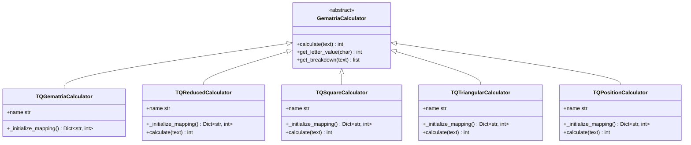

# Gematria API

<cite>
**Referenced Files in This Document**   
- [calculation_service.py](file://src/pillars/gematria/services/calculation_service.py)
- [base_calculator.py](file://src/pillars/gematria/services/base_calculator.py)
- [hebrew_calculator.py](file://src/pillars/gematria/services/hebrew_calculator.py)
- [greek_calculator.py](file://src/pillars/gematria/services/greek_calculator.py)
- [tq_calculator.py](file://src/pillars/gematria/services/tq_calculator.py)
- [text_analysis_service.py](file://src/pillars/gematria/services/text_analysis_service.py)
- [smart_filter_service.py](file://src/pillars/gematria/services/smart_filter_service.py)
- [calculation_record.py](file://src/pillars/gematria/models/calculation_record.py)
- [calculation_repository.py](file://src/pillars/gematria/repositories/calculation_repository.py)
- [numeric_utils.py](file://src/pillars/gematria/utils/numeric_utils.py)
- [verse_parser.py](file://src/pillars/gematria/utils/verse_parser.py)
</cite>

## Table of Contents
1. [Introduction](#introduction)
2. [Calculation Service](#calculation-service)
3. [Calculator Interface](#calculator-interface)
4. [Hebrew Calculators](#hebrew-calculators)
5. [Greek Calculators](#greek-calculators)
6. [TQ Calculators](#tq-calculators)
7. [Text Analysis Service](#text-analysis-service)
8. [Smart Filter Service](#smart-filter-service)
9. [Data Models](#data-models)
10. [Repository Layer](#repository-layer)
11. [Input Validation](#input-validation)
12. [Error Handling](#error-handling)
13. [Thread Safety](#thread-safety)
14. [Performance Considerations](#performance-considerations)
15. [Code Examples](#code-examples)

## Introduction
The Gematria API provides a comprehensive service layer for numerical analysis across Hebrew, Greek, and English language systems. The core orchestrator is the CalculationService, which manages the execution of calculations through various calculator implementations. The system supports multiple gematria methods for each language, including standard values, reduced forms, mathematical transformations, and substitution ciphers. The API includes services for text analysis, pattern detection, and intelligent filtering of results using NLP techniques. All calculations are persisted through a repository layer with search capabilities, and the system integrates with document models for verse-based analysis.

## Calculation Service
The CalculationService is the central orchestrator for gematria calculations, managing the lifecycle of calculation records. It serves as an abstraction layer between the application logic and the persistence mechanism, providing CRUD operations and search functionality for calculation records.


**Diagram sources**
- [calculation_service.py](file://src/pillars/gematria/services/calculation_service.py#L11-L273)
- [calculation_repository.py](file://src/pillars/gematria/repositories/calculation_repository.py#L16-L329)

**Section sources**
- [calculation_service.py](file://src/pillars/gematria/services/calculation_service.py#L11-L273)

## Calculator Interface
The GematriaCalculator abstract base class defines the interface for all gematria calculation systems. It provides a consistent API for calculating values, retrieving letter values, and obtaining breakdowns of calculations. The base class handles text normalization by removing diacritical marks and accents, ensuring consistent processing across different languages.


**Diagram sources**
- [base_calculator.py](file://src/pillars/gematria/services/base_calculator.py#L7-L107)
- [hebrew_calculator.py](file://src/pillars/gematria/services/hebrew_calculator.py#L6-L800)
- [greek_calculator.py](file://src/pillars/gematria/services/greek_calculator.py#L6-L888)
- [tq_calculator.py](file://src/pillars/gematria/services/tq_calculator.py#L6-L381)

**Section sources**
- [base_calculator.py](file://src/pillars/gematria/services/base_calculator.py#L7-L107)

## Hebrew Calculators
The Hebrew calculator implementations provide various methods for calculating gematria values according to different Kabbalistic traditions. Each calculator follows the same interface but applies different encoding schemes and reduction methods to produce distinct numerical results.


**Diagram sources**
- [hebrew_calculator.py](file://src/pillars/gematria/services/hebrew_calculator.py#L6-L800)

**Section sources**
- [hebrew_calculator.py](file://src/pillars/gematria/services/hebrew_calculator.py#L6-L800)

## Greek Calculators
The Greek calculator implementations provide various methods for calculating isopsephy values according to different Hellenistic traditions. Each calculator follows the same interface but applies different encoding schemes and reduction methods to produce distinct numerical results.

```mermaid
classDiagram
class GematriaCalculator {
<<abstract>>
+calculate(text) int
+get_letter_value(char) int
+get_breakdown(text) list
}
class GreekGematriaCalculator {
+name str
+_initialize_mapping() Dict~str, int~
}
class GreekLetterValueCalculator {
+name str
+_initialize_mapping() Dict~str, int~
}
class GreekOrdinalCalculator {
+name str
+_initialize_mapping() Dict~str, int~
}
class GreekSmallValueCalculator {
+name str
+_initialize_mapping() Dict~str, int~
}
class GreekKolelCalculator {
+name str
+_initialize_mapping() Dict~str, int~
+calculate(text) int
}
class GreekSquareCalculator {
+name str
+_initialize_mapping() Dict~str, int~
+calculate(text) int
}
class GreekCubeCalculator {
+name str
+_initialize_mapping() Dict~str, int~
+calculate(text) int
}
class GreekTriangularCalculator {
+name str
+_initialize_mapping() Dict~str, int~
+calculate(text) int
}
class GreekDigitalCalculator {
+name str
+_initialize_mapping() Dict~str, int~
+calculate(text) int
}
class GreekOrdinalSquareCalculator {
+name str
+_initialize_mapping() Dict~str, int~
+calculate(text) int
}
class GreekFullValueCalculator {
+name str
+_initialize_mapping() Dict~str, int~
}
class GreekReverseSubstitutionCalculator {
+name str
+_initialize_mapping() Dict~str, int~
}
class GreekPairMatchingCalculator {
+name str
+_initialize_mapping() Dict~str, int~
}
GematriaCalculator <|-- GreekGematriaCalculator
GematriaCalculator <|-- GreekLetterValueCalculator
GematriaCalculator <|-- GreekOrdinalCalculator
GematriaCalculator <|-- GreekSmallValueCalculator
GematriaCalculator <|-- GreekKolelCalculator
GematriaCalculator <|-- GreekSquareCalculator
GematriaCalculator <|-- GreekCubeCalculator
GematriaCalculator <|-- GreekTriangularCalculator
GematriaCalculator <|-- GreekDigitalCalculator
GematriaCalculator <|-- GreekOrdinalSquareCalculator
GematriaCalculator <|-- GreekFullValueCalculator
GematriaCalculator <|-- GreekReverseSubstitutionCalculator
GematriaCalculator <|-- GreekPairMatchingCalculator
```



**Diagram sources**
- [greek_calculator.py](file://src/pillars/gematria/services/greek_calculator.py#L6-L888)

**Section sources**
- [greek_calculator.py](file://src/pillars/gematria/services/greek_calculator.py#L6-L888)

## TQ Calculators
The TQ (Trigrammaton Qabbalah) calculator implementations provide various methods for calculating gematria values for English text according to the TQ system. Each calculator follows the same interface but applies different encoding schemes and reduction methods to produce distinct numerical results.



**Diagram sources**
- [tq_calculator.py](file://src/pillars/gematria/services/tq_calculator.py#L6-L381)

**Section sources**
- [tq_calculator.py](file://src/pillars/gematria/services/tq_calculator.py#L6-L381)

## Text Analysis Service
The TextAnalysisService provides functionality for parsing text into verses and finding value matches within text. It integrates with document models and supports pattern detection through fast scanning algorithms.


**Diagram sources**
- [text_analysis_service.py](file://src/pillars/gematria/services/text_analysis_service.py#L5-L185)
- [verse_parser.py](file://src/pillars/gematria/utils/verse_parser.py#L6-L107)
- [numeric_utils.py](file://src/pillars/gematria/utils/numeric_utils.py#L6-L22)

**Section sources**
- [text_analysis_service.py](file://src/pillars/gematria/services/text_analysis_service.py#L5-L185)

## Smart Filter Service
The SmartFilterService uses NLP techniques to filter out linguistically invalid phrases from calculation results. It employs spaCy for part-of-speech tagging and dependency parsing to ensure that only meaningful phrases are returned.


**Diagram sources**
- [smart_filter_service.py](file://src/pillars/gematria/services/smart_filter_service.py#L5-L102)

**Section sources**
- [smart_filter_service.py](file://src/pillars/gematria/services/smart_filter_service.py#L5-L102)

## Data Models
The data models define the structure of calculation records and their persistence entities. The CalculationRecord class represents the domain model, while CalculationEntity represents the database persistence layer.


**Diagram sources**
- [calculation_record.py](file://src/pillars/gematria/models/calculation_record.py#L8-L89)
- [calculation_entity.py](file://src/pillars/gematria/models/calculation_entity.py#L18-L92)

**Section sources**
- [calculation_record.py](file://src/pillars/gematria/models/calculation_record.py#L8-L89)
- [calculation_entity.py](file://src/pillars/gematria/models/calculation_entity.py#L18-L92)

## Repository Layer
The repository layer provides persistence and search capabilities for calculation records using Whoosh as the search engine. The CalculationRepository class handles all database operations and search functionality.


**Diagram sources**
- [calculation_repository.py](file://src/pillars/gematria/repositories/calculation_repository.py#L16-L329)

**Section sources**
- [calculation_repository.py](file://src/pillars/gematria/repositories/calculation_repository.py#L16-L329)

## Input Validation
The system performs input validation at multiple levels to ensure data integrity. Text normalization is performed by removing diacritical marks and accents using Unicode normalization. The system validates that input text contains valid characters for the selected language system.

For Hebrew text, the system validates that characters are within the Hebrew Unicode block (U+05D0-U+05EA) and handles final forms (sofit letters) appropriately. For Greek text, the system validates characters within the Greek and Coptic Unicode block (U+0370-U+03FF) and handles archaic letters used for numerology. For English text using the TQ system, the system validates that characters are within the basic Latin alphabet.

The system also validates that numeric inputs are within acceptable ranges and that user-provided metadata (notes, tags, categories) meet length and format requirements. When processing text with embedded numbers, the system extracts and sums numeric face values using regular expressions.

## Error Handling
The system implements comprehensive error handling to ensure robust operation. All repository operations are wrapped in try-catch blocks to handle database exceptions, with appropriate cleanup of resources (e.g., canceling index writers). When parsing JSON data from calculation records, the system uses defensive programming to handle malformed data gracefully, returning empty breakdowns rather than raising exceptions.

The calculation methods include error handling for invalid characters by returning a value of 0 for any character not found in the letter-value mapping. This allows the system to process text containing mixed languages or special characters without failing. The text analysis service includes try-except blocks around calculator operations to skip invalid words during tokenization.

The SmartFilterService includes error handling for spaCy model loading, logging errors and re-raising exceptions to ensure the application can respond appropriately to missing NLP models. The verse parsing functionality includes comprehensive error handling for edge cases in text formatting and numbering schemes.

## Thread Safety
The Gematria API is designed with thread safety in mind. The CalculationService and repository classes are stateless or have state that is not modified after initialization, making them safe for concurrent access. The SmartFilterService implements a singleton pattern with lazy loading of the spaCy model, ensuring that only one instance exists and preventing race conditions during model loading.

The repository layer uses Whoosh's built-in support for concurrent access, with index writers properly managed through context managers or explicit commit/cancel operations. The calculation classes are immutable after initialization, with letter-value mappings stored as instance variables that are not modified during operation.

For applications requiring high concurrency, the system can be deployed with multiple instances behind a load balancer, as all state is persisted to the Whoosh index on disk. The API does not maintain in-memory caches that could become inconsistent across threads or processes.

## Performance Considerations
The system is optimized for performance in several key areas. The text analysis service uses a fast scan algorithm with pre-calculated token values and sliding window optimization to efficiently find value matches in large texts. The algorithm breaks early when the running sum exceeds the target value, assuming positive gematria values.

The repository layer uses Whoosh for full-text search with indexing on key fields (value, language, is_favorite) to enable fast queries. Search results can be returned in summary form to reduce memory usage and network transfer time. The system implements caching at the application level through the persistence layer, with frequently accessed calculations stored in the Whoosh index.

For large text analysis, the system processes text in chunks and uses batch processing for NLP operations. The verse parsing algorithm is optimized to make a single pass through the text to identify verse markers, building a map of numbers to candidates for efficient lookup.

Caching strategies include storing calculation results in the repository with normalized text hashes to detect duplicates. The system can be configured to cache frequently used calculator instances to avoid repeated initialization of letter-value mappings.

## Code Examples
The following code examples demonstrate common usage patterns for the Gematria API:

**Batch Calculations**
```python
# Create calculation service
service = CalculationService()

# Create calculators for different systems
hebrew_calc = HebrewGematriaCalculator()
greek_calc = GreekGematriaCalculator()
tq_calc = TQGematriaCalculator()

# Perform batch calculations
texts = ["שלום", "Λόγος", "TRUTH"]
calculators = [hebrew_calc, greek_calc, tq_calc]

results = []
for text, calculator in zip(texts, calculators):
    value = calculator.calculate(text)
    breakdown = calculator.get_breakdown(text)
    record = service.save_calculation(
        text=text,
        value=value,
        calculator=calculator,
        breakdown=breakdown,
        tags=["batch", calculator.name]
    )
    results.append(record)
```

**Method Chaining**
```python
# Chain multiple analysis operations
text = "The quick brown fox jumps over the lazy dog"
calculator = TQGematriaCalculator()

# Calculate base value
base_value = calculator.calculate(text)

# Get breakdown
breakdown = calculator.get_breakdown(text)

# Calculate with face values
total_value = base_value + sum_numeric_face_values(text)

# Save with metadata
record = service.save_calculation(
    text=text,
    value=total_value,
    calculator=calculator,
    breakdown=breakdown,
    notes="Example of method chaining",
    tags=["example", "chaining"],
    is_favorite=True
)
```

**Integration with Document Metadata**
```python
# Parse document into verses
text_analysis = TextAnalysisService()
metadata = text_analysis.parse_verses(document_text, document_id="doc_123")

# Analyze each verse
results = []
for verse in metadata['verses']:
    text = verse['text']
    calculator = HebrewOrdinalCalculator()
    value = calculator.calculate(text)
    
    if value == target_value:
        record = service.save_calculation(
            text=text,
            value=value,
            calculator=calculator,
            breakdown=calculator.get_breakdown(text),
            source=f"{metadata['source']}:{verse['number']}",
            tags=["verse", "target_value"]
        )
        results.append(record)
```

**Smart Filtering of Results**
```python
# Find value matches
matches = text_analysis.find_value_matches(
    text=document_text,
    target_value=777,
    calculator=HebrewGematriaCalculator()
)

# Filter using NLP
filter_service = SmartFilterService()
valid_matches = filter_service.filter_phrases(matches)

# Process valid matches
for match_text, start, end, doc_title, tab_index in valid_matches:
    record = service.save_calculation(
        text=match_text,
        value=777,
        calculator=HebrewGematriaCalculator(),
        breakdown=[],
        source=f"{doc_title}:{start}-{end}",
        tags=["filtered", "significant"]
    )
```

**Section sources**
- [calculation_service.py](file://src/pillars/gematria/services/calculation_service.py#L23-L239)
- [hebrew_calculator.py](file://src/pillars/gematria/services/hebrew_calculator.py#L6-L800)
- [greek_calculator.py](file://src/pillars/gematria/services/greek_calculator.py#L6-L888)
- [tq_calculator.py](file://src/pillars/gematria/services/tq_calculator.py#L6-L381)
- [text_analysis_service.py](file://src/pillars/gematria/services/text_analysis_service.py#L8-L113)
- [smart_filter_service.py](file://src/pillars/gematria/services/smart_filter_service.py#L29-L51)
- [numeric_utils.py](file://src/pillars/gematria/utils/numeric_utils.py#L6-L22)
- [verse_parser.py](file://src/pillars/gematria/utils/verse_parser.py#L6-L107)