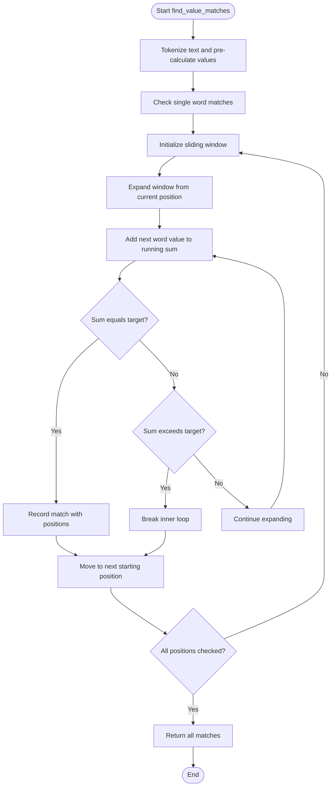
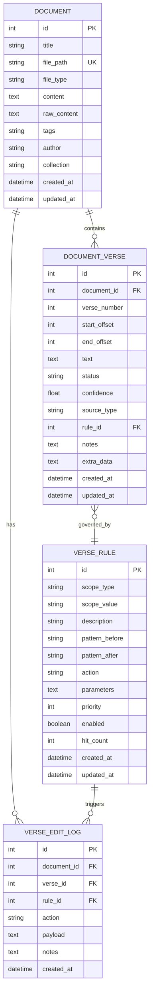
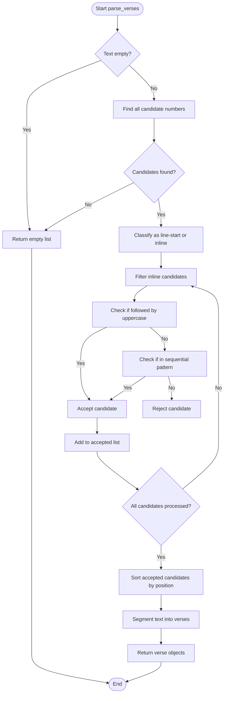
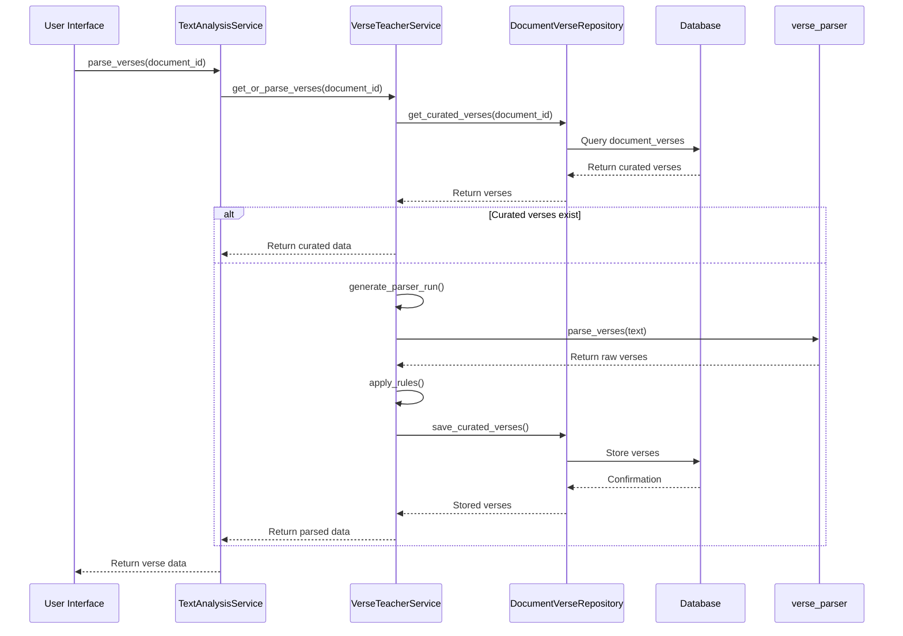

# Text Analysis Service

<cite>
**Referenced Files in This Document**   
- [text_analysis_service.py](file://src/pillars/gematria/services/text_analysis_service.py)
- [verse_parser.py](file://src/pillars/gematria/utils/verse_parser.py)
- [document.py](file://src/pillars/document_manager/models/document.py)
- [document_verse.py](file://src/pillars/document_manager/models/document_verse.py)
- [verse_teacher_service.py](file://src/pillars/document_manager/services/verse_teacher_service.py)
- [base_calculator.py](file://src/pillars/gematria/services/base_calculator.py)
- [numeric_utils.py](file://src/pillars/gematria/utils/numeric_utils.py)
</cite>

## Table of Contents
1. [Introduction](#introduction)
2. [Core Components](#core-components)
3. [Text Analysis Service Methods](#text-analysis-service-methods)
4. [Document and Verse Models](#document-and-verse-models)
5. [Verse Parsing Logic](#verse-parsing-logic)
6. [Pattern Detection](#pattern-detection)
7. [Integration with Document Management](#integration-with-document-management)
8. [Performance Considerations](#performance-considerations)
9. [Usage Examples](#usage-examples)
10. [Conclusion](#conclusion)

## Introduction
The TextAnalysisService is a core component of the sacred text analysis system, designed to parse and analyze structured religious and canonical texts. This service provides advanced text processing capabilities for identifying patterns, calculating gematria values, and extracting meaningful insights from sacred texts such as the Bible and other canonical works. The service integrates with document management models to provide metadata enrichment and supports various linguistic analysis techniques including equidistant letter sequences, chiastic structures, and numerical clusters. The system is optimized for large corpus analysis with efficient memory management and caching strategies.

## Core Components
The TextAnalysisService comprises several interconnected components that work together to provide comprehensive text analysis capabilities. The service relies on the Document and DocumentVerse models for structured text representation and metadata storage. It utilizes the verse_parser.py module for intelligent verse segmentation and employs various gematria calculators for numerical analysis of text. The service is designed to handle both simple and complex analysis tasks, from basic verse parsing to sophisticated pattern detection in large textual corpora.

**Section sources**
- [text_analysis_service.py](file://src/pillars/gematria/services/text_analysis_service.py#L1-L185)
- [document.py](file://src/pillars/document_manager/models/document.py#L1-L47)
- [document_verse.py](file://src/pillars/document_manager/models/document_verse.py#L1-L104)

## Text Analysis Service Methods
The TextAnalysisService provides several key methods for text analysis, each designed to handle specific aspects of sacred text processing. The service offers functionality for finding value matches, calculating text statistics, and parsing verses with metadata enrichment.

### find_value_matches Method
The `find_value_matches` method identifies text segments that match a target gematria value using a fast scanning algorithm. This method takes text input, a target value, a calculator strategy, and optional parameters for including numeric face values and limiting the maximum number of words in a phrase. The algorithm first tokenizes the text and pre-calculates gematria values for each word, then uses an integer sliding window approach to efficiently find matching phrases of various lengths. The method returns a list of tuples containing the matching text, start position, and end position.

**Diagram sources **
- [text_analysis_service.py](file://src/pillars/gematria/services/text_analysis_service.py#L29-L113)

### calculate_text Method
The `calculate_text` method computes the gematria value of a given text using a specified calculator strategy. This helper method normalizes the input text and applies the calculator's value mapping to determine the total gematria value. It supports an optional parameter to include numeric face values from the text, which are extracted and summed separately from the letter-based gematria calculation.

### calculate_stats Method
The `calculate_stats` method generates comprehensive statistics for a text passage, including word count, character count, total gematria value, and average word value. This method provides a quick overview of the text's quantitative characteristics, which can be useful for comparative analysis between different passages or documents.

### parse_verses Method
The `parse_verses` method processes text into structured verse objects, leveraging metadata when available. This method first attempts to retrieve curated verse data from the VerseTeacherService using the document ID. If curated data is not available, it falls back to parsing the text using the verse_parser module. The method returns a dictionary containing the parsed verses, source information, anomalies, and applied rules.

**Section sources**
- [text_analysis_service.py](file://src/pillars/gematria/services/text_analysis_service.py#L8-L185)

## Document and Verse Models
The document analysis system relies on two primary data models: Document and DocumentVerse. These models provide the structural foundation for storing and managing sacred texts and their parsed components.

### Document Model
The Document model represents a complete text document within the system. It includes fields for the document's title, file path, file type, content, and metadata such as tags, author, and collection. The model also tracks creation and update timestamps and supports relationships with linked documents through a Zettelkasten-style linking system. Documents can store both extracted text content for search purposes and raw content for preservation of formatting in various formats (HTML, RTF, etc.).

**Diagram sources **
- [document.py](file://src/pillars/document_manager/models/document.py#L1-L47)
- [document_verse.py](file://src/pillars/document_manager/models/document_verse.py#L1-L104)

### DocumentVerse Model
The DocumentVerse model represents a single verse segment within a document. Each verse is associated with a document through a foreign key relationship and contains information about its verse number, text content, and positional offsets within the document. The model includes metadata fields for tracking the verse's status (auto-detected or curated), confidence level, source type, and any associated rules that influenced its parsing. Additional fields support audit logging and rule-based adjustments to verse boundaries and numbering.

**Section sources**
- [document_verse.py](file://src/pillars/document_manager/models/document_verse.py#L21-L104)

## Verse Parsing Logic
The verse parsing system employs sophisticated linguistic rules and regular expressions to accurately identify and segment verses within sacred texts. The parsing logic is implemented in the verse_parser.py module and follows a multi-stage process to ensure reliable verse detection.

### Regular Expression Pattern
The core of the verse parsing logic is a regular expression pattern that identifies potential verse markers in the text. The pattern `r"(\d+)\s*(?:[\.:\)\-]?\s*)"` matches Arabic numerals followed by optional punctuation and whitespace. This pattern is designed to be permissive, capturing various common verse numbering formats including those with periods, colons, parentheses, or hyphens.

### Parsing Algorithm
The parsing algorithm follows a systematic approach to verse identification:

1. **Candidate Detection**: The algorithm first finds all potential verse markers using the regular expression pattern.
2. **Candidate Classification**: Each candidate is classified as either a line-start marker (appearing at the beginning of a line or document) or an inline marker (appearing within a line of text).
3. **Heuristic Filtering**: Inline candidates are filtered using heuristics to reduce false positives:
   - Candidates followed by an uppercase letter (indicating the start of a sentence) are accepted
   - Candidates that participate in sequential numbering patterns (e.g., 1, 2, 3) are accepted
4. **Verse Segmentation**: Accepted candidates are sorted by position and used to segment the text into verse objects with proper start and end boundaries.

**Diagram sources **
- [verse_parser.py](file://src/pillars/gematria/utils/verse_parser.py#L6-L107)

**Section sources**
- [verse_parser.py](file://src/pillars/gematria/utils/verse_parser.py#L6-L107)

## Pattern Detection
The text analysis system supports detection of various linguistic and numerical patterns in sacred texts. While the core TextAnalysisService focuses on gematria calculations and verse parsing, the broader system architecture enables detection of complex patterns through integration with specialized calculators and analysis modules.

### Equidistant Letter Sequences
The system can identify equidistant letter sequences (ELS) through its gematria calculator framework. By analyzing letter positions and values at regular intervals, the system can detect hidden patterns and codes within the text. This functionality is particularly relevant for analyzing Hebrew and Greek texts where such patterns have traditional significance.

### Chiastic Structures
Chiastic structures, characterized by mirrored or symmetrical patterns in text organization, can be detected through the system's verse analysis capabilities. By examining the thematic and structural relationships between verses, the system can identify chiastic patterns that may not be immediately apparent through manual reading.

### Numerical Clusters
The system excels at identifying numerical clusters and significant gematria values within texts. The `find_value_matches` method specifically targets this capability, allowing users to search for phrases that sum to specific numerical values of interest. This is particularly useful for exploring connections between different passages that share the same gematria value.

**Section sources**
- [text_analysis_service.py](file://src/pillars/gematria/services/text_analysis_service.py#L8-L113)
- [base_calculator.py](file://src/pillars/gematria/services/base_calculator.py#L7-L107)

## Integration with Document Management
The TextAnalysisService is tightly integrated with the document management system, enabling seamless analysis of stored texts with metadata enrichment and persistent storage of analysis results.

### Verse Teacher Service
The VerseTeacherService acts as an intermediary between the TextAnalysisService and the document storage system. This service coordinates parser output with curated overrides and heuristic rules to produce reliable verse segmentation. When the `parse_verses` method is called with a document ID, it first attempts to retrieve curated verse data from the VerseTeacherService before falling back to automated parsing.

### Rule-Based Processing
The system supports rule-based processing of verses through the VerseRule model. Rules can be defined at different scopes (global, collection, or document-specific) and specify actions such as promoting, suppressing, or renumbering verses based on contextual patterns. These rules are applied during the parsing process to refine the automated results and incorporate expert knowledge.

### Metadata Enrichment
The integration enables comprehensive metadata enrichment of parsed verses. Each verse object includes confidence scores, source information, and audit trails of editing actions. This metadata supports quality assessment and allows users to understand the provenance of verse boundaries and numbering.

**Diagram sources **
- [text_analysis_service.py](file://src/pillars/gematria/services/text_analysis_service.py#L155-L185)
- [verse_teacher_service.py](file://src/pillars/document_manager/services/verse_teacher_service.py#L37-L77)
- [document_verse.py](file://src/pillars/document_manager/models/document_verse.py#L21-L104)

**Section sources**
- [verse_teacher_service.py](file://src/pillars/document_manager/services/verse_teacher_service.py#L20-L352)

## Performance Considerations
The text analysis system is designed with performance optimization in mind, particularly for handling large corpora of sacred texts. Several strategies are employed to ensure efficient processing and memory management.

### Algorithmic Efficiency
The `find_value_matches` method uses an optimized sliding window algorithm that minimizes redundant calculations. By pre-calculating word values and using a running sum approach, the algorithm achieves O(N²) complexity in the worst case but often performs much better due to early termination when the running sum exceeds the target value (assuming positive gematria values).

### Memory Management
The system employs several memory management strategies:
- Token data is stored as tuples of (value, start, end) rather than keeping references to the original text
- The sliding window algorithm processes text incrementally without loading the entire corpus into memory
- Result caching is implemented for frequently accessed documents and analysis results

### Caching Strategy
The integration with the VerseTeacherService provides an effective caching mechanism for verse parsing results. Once a document has been parsed and curated, the results are stored in the database and retrieved on subsequent access, avoiding the need to re-parse the text. This significantly improves performance for frequently analyzed documents.

**Section sources**
- [text_analysis_service.py](file://src/pillars/gematria/services/text_analysis_service.py#L29-L113)
- [verse_teacher_service.py](file://src/pillars/document_manager/services/verse_teacher_service.py#L54-L77)

## Usage Examples
The TextAnalysisService can be used to analyze various sacred texts, providing insights into their numerical and structural properties.

### Bible Verse Analysis
When analyzing Bible verses, the service can identify gematria patterns across different passages. For example, searching for phrases with a gematria value of 666 (often associated with the "Number of the Beast" in Revelation) across the entire Bible text can reveal potentially significant connections between seemingly unrelated passages.

### Comparative Text Analysis
The service enables comparative analysis between different translations of the same text. By calculating gematria values for corresponding verses in different languages (Hebrew, Greek, English), researchers can explore how numerical patterns are preserved or transformed across translations.

### Pattern Discovery
Using the pattern detection capabilities, researchers can discover equidistant letter sequences in Hebrew texts or chiastic structures in prophetic writings. The system's ability to handle large corpora makes it possible to identify patterns that span multiple books or chapters.

**Section sources**
- [text_analysis_service.py](file://src/pillars/gematria/services/text_analysis_service.py#L8-L185)
- [verse_parser.py](file://src/pillars/gematria/utils/verse_parser.py#L6-L107)

## Conclusion
The TextAnalysisService provides a comprehensive framework for parsing and analyzing structured sacred texts. By combining sophisticated verse parsing logic with powerful pattern detection capabilities, the service enables deep exploration of numerical and structural patterns in religious and canonical works. The integration with document management models ensures that analysis results are properly stored and enriched with metadata, while performance optimizations make it feasible to analyze large textual corpora. This system represents a powerful tool for scholars and researchers studying sacred texts from a numerical and structural perspective.