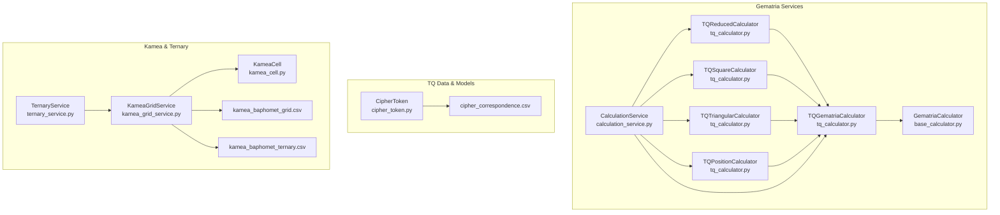
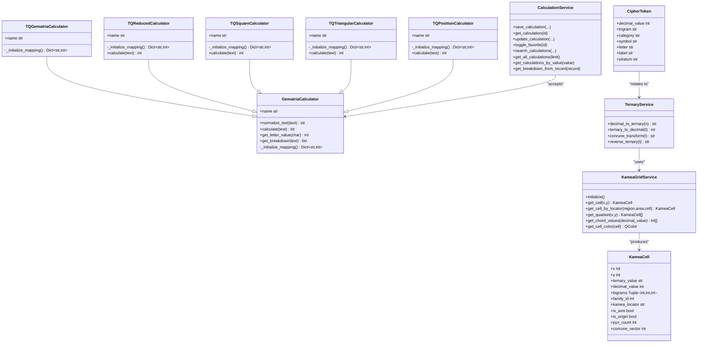
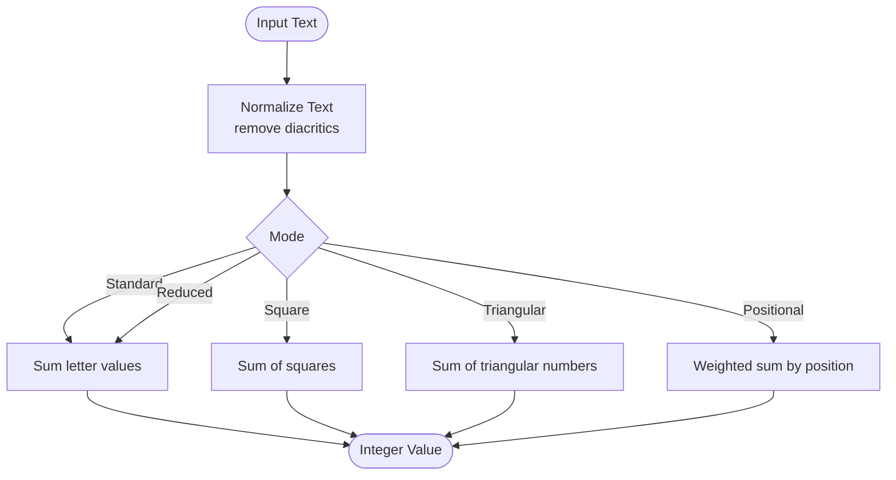
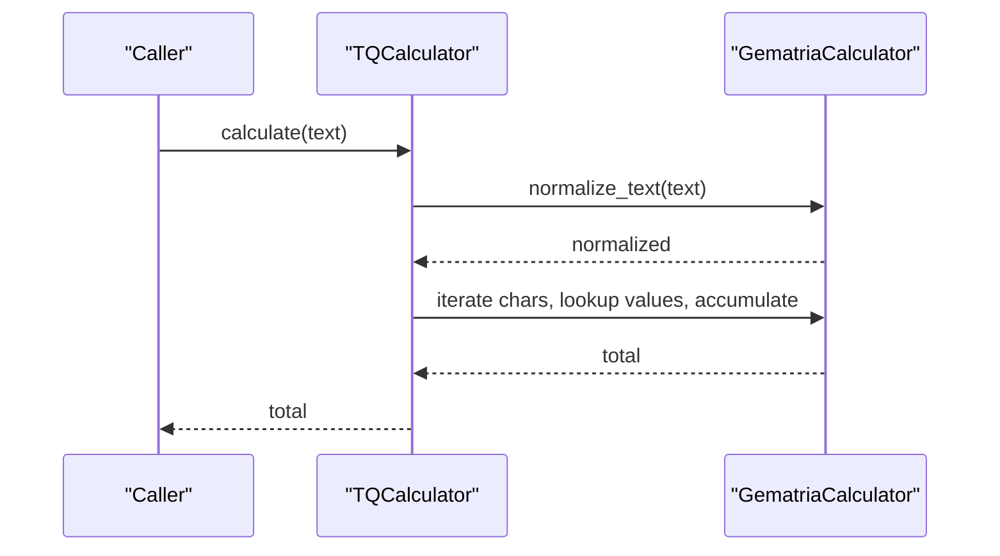
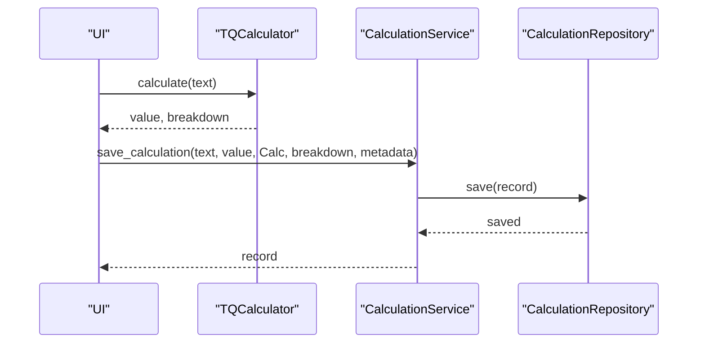
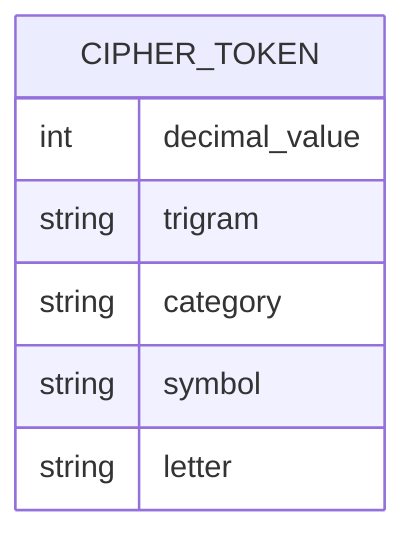
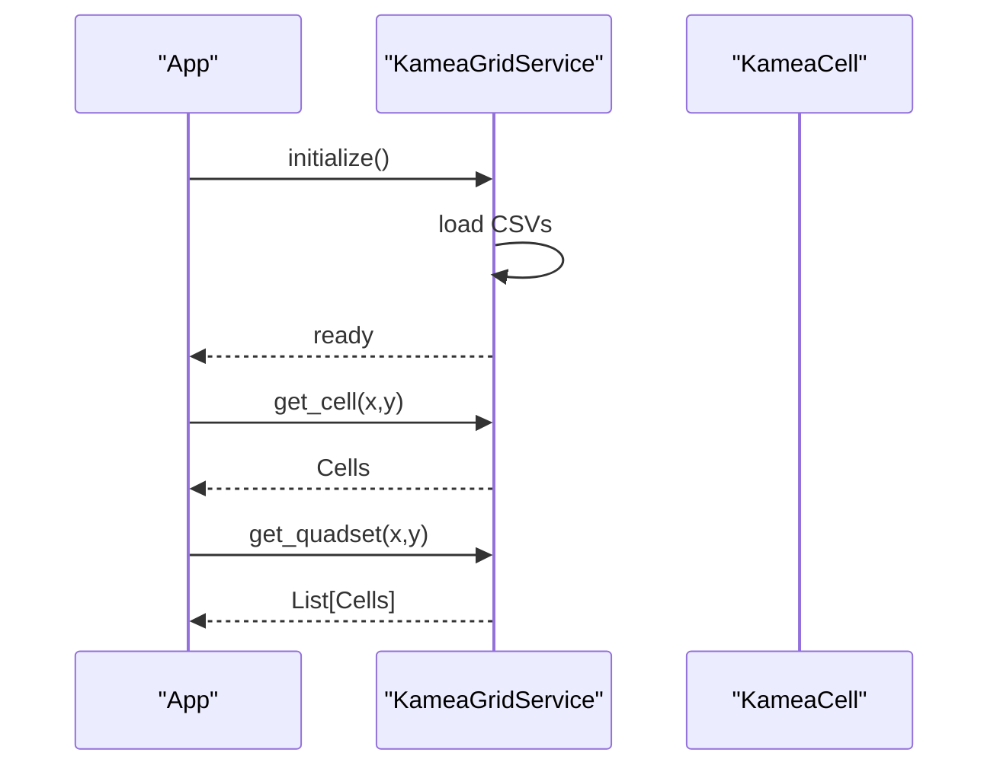
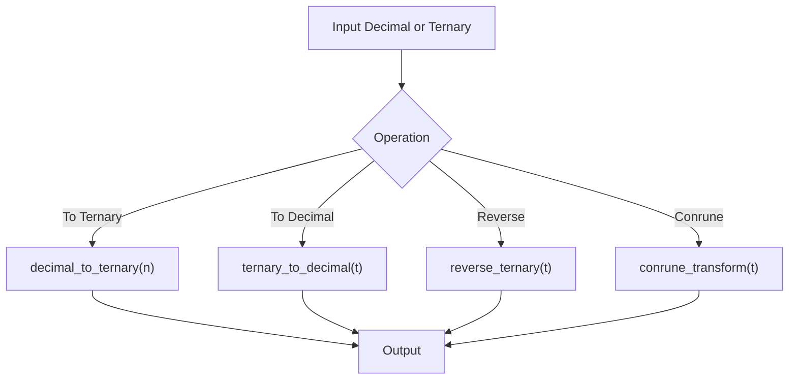
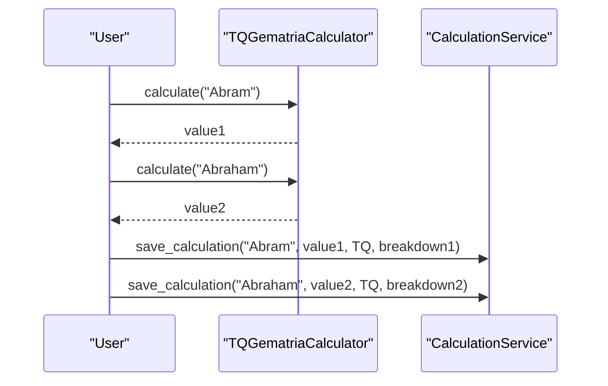
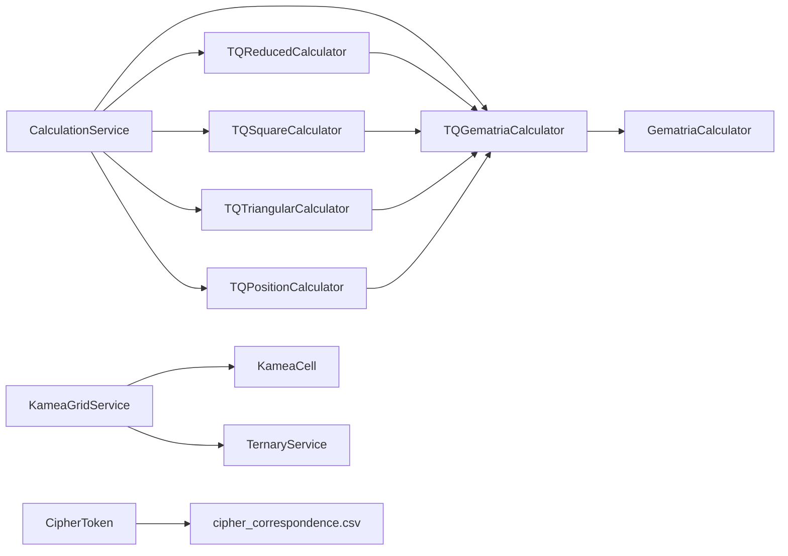

# Trigrammaton QBLH Calculator

<cite>
**Referenced Files in This Document**
- [tq_calculator.py](file://src/pillars/gematria/services/tq_calculator.py)
- [base_calculator.py](file://src/pillars/gematria/services/base_calculator.py)
- [calculation_service.py](file://src/pillars/gematria/services/calculation_service.py)
- [cipher_correspondence.csv](file://src/pillars/tq/data/cipher_correspondence.csv)
- [cipher_token.py](file://src/pillars/tq/models/cipher_token.py)
- [kamea_grid_service.py](file://src/pillars/tq/services/kamea_grid_service.py)
- [ternary_service.py](file://src/pillars/tq/services/ternary_service.py)
- [kamea_cell.py](file://src/pillars/tq/models/kamea_cell.py)
- [kamea_baphomet_grid.csv](file://src/pillars/tq/data/kamea_baphomet_grid.csv)
- [kamea_baphomet_ternary.csv](file://src/pillars/tq/data/kamea_baphomet_ternary.csv)
</cite>

## Table of Contents
1. [Introduction](#introduction)
2. [Project Structure](#project-structure)
3. [Core Components](#core-components)
4. [Architecture Overview](#architecture-overview)
5. [Detailed Component Analysis](#detailed-component-analysis)
6. [Dependency Analysis](#dependency-analysis)
7. [Performance Considerations](#performance-considerations)
8. [Troubleshooting Guide](#troubleshooting-guide)
9. [Conclusion](#conclusion)
10. [Appendices](#appendices)

## Introduction
This document describes the Trigrammaton Qabalah (TQ) calculator implementation used to compute English gematria values according to the TQ cipher system. The TQ system assigns unique values to English letters arranged in a non-sequential order rooted in sacred geometry and Qabalistic principles. The calculator provides multiple calculation modes:
- Standard TQ value (sum of letter values)
- Reduced TQ value (digital root)
- Square TQ value (sum of squared letter values)
- Triangular TQ value (sum of triangular numbers of letter values)
- Positional TQ value (sum of letter values multiplied by position)

It also integrates with the Kamea grid service and ternary service to enable advanced pattern analysis and esoteric interpretation.

## Project Structure
The TQ calculator resides within the gematria pillar and is composed of:
- A base calculator abstraction
- TQ-specific calculators for each mode
- A calculation service for persistence and metadata
- Data models for cipher tokens and Kamea grid cells
- Services for Kamea grid and ternary conversions
- CSV data for cipher correspondences and Kamea grids

**Diagram sources**
- [tq_calculator.py](file://src/pillars/gematria/services/tq_calculator.py#L1-L381)
- [base_calculator.py](file://src/pillars/gematria/services/base_calculator.py#L1-L107)
- [calculation_service.py](file://src/pillars/gematria/services/calculation_service.py#L1-L273)
- [cipher_token.py](file://src/pillars/tq/models/cipher_token.py#L1-L35)
- [cipher_correspondence.csv](file://src/pillars/tq/data/cipher_correspondence.csv#L1-L29)
- [kamea_grid_service.py](file://src/pillars/tq/services/kamea_grid_service.py#L1-L220)
- [kamea_cell.py](file://src/pillars/tq/models/kamea_cell.py#L1-L59)
- [ternary_service.py](file://src/pillars/tq/services/ternary_service.py#L1-L114)
- [kamea_baphomet_grid.csv](file://src/pillars/tq/data/kamea_baphomet_grid.csv#L1-L29)
- [kamea_baphomet_ternary.csv](file://src/pillars/tq/data/kamea_baphomet_ternary.csv#L1-L29)

**Section sources**
- [tq_calculator.py](file://src/pillars/gematria/services/tq_calculator.py#L1-L381)
- [base_calculator.py](file://src/pillars/gematria/services/base_calculator.py#L1-L107)
- [calculation_service.py](file://src/pillars/gematria/services/calculation_service.py#L1-L273)
- [cipher_token.py](file://src/pillars/tq/models/cipher_token.py#L1-L35)
- [cipher_correspondence.csv](file://src/pillars/tq/data/cipher_correspondence.csv#L1-L29)
- [kamea_grid_service.py](file://src/pillars/tq/services/kamea_grid_service.py#L1-L220)
- [kamea_cell.py](file://src/pillars/tq/models/kamea_cell.py#L1-L59)
- [ternary_service.py](file://src/pillars/tq/services/ternary_service.py#L1-L114)
- [kamea_baphomet_grid.csv](file://src/pillars/tq/data/kamea_baphomet_grid.csv#L1-L29)
- [kamea_baphomet_ternary.csv](file://src/pillars/tq/data/kamea_baphomet_ternary.csv#L1-L29)

## Core Components
- TQGematriaCalculator: Implements the standard TQ cipher mapping and summation logic.
- TQReducedCalculator: Computes digital root by repeatedly summing digits until a single digit remains.
- TQSquareCalculator: Sums the squares of letter values for amplified energetic signature.
- TQTriangularCalculator: Sums triangular numbers of letter values for progressive accumulation.
- TQPositionCalculator: Multiplies each letter’s value by its position in the word for positional weighting.
- GematriaCalculator (base): Provides normalization, letter lookup, and shared calculation loop.
- CalculationService: Persists calculations with metadata, breakdowns, and favorites.
- CipherToken and cipher_correspondence.csv: Represent the 777-base (0–26) cipher tokens with trigrammatic categories and symbols.
- KameaGridService and KameaCell: Load and interpret the 27×27 Kamea grid and ternary bigrams.
- TernaryService: Converts between decimal and ternary, applies transformations (reverse, conrune), and validates inputs.

**Section sources**
- [tq_calculator.py](file://src/pillars/gematria/services/tq_calculator.py#L1-L381)
- [base_calculator.py](file://src/pillars/gematria/services/base_calculator.py#L1-L107)
- [calculation_service.py](file://src/pillars/gematria/services/calculation_service.py#L1-L273)
- [cipher_token.py](file://src/pillars/tq/models/cipher_token.py#L1-L35)
- [cipher_correspondence.csv](file://src/pillars/tq/data/cipher_correspondence.csv#L1-L29)
- [kamea_grid_service.py](file://src/pillars/tq/services/kamea_grid_service.py#L1-L220)
- [kamea_cell.py](file://src/pillars/tq/models/kamea_cell.py#L1-L59)
- [ternary_service.py](file://src/pillars/tq/services/ternary_service.py#L1-L114)

## Architecture Overview
The TQ calculator follows a layered architecture:
- Data layer: CSV-backed cipher tokens and Kamea grid data.
- Model layer: CipherToken and KameaCell encapsulate data and computed properties.
- Service layer: TQ calculators inherit from GematriaCalculator; CalculationService persists results; KameaGridService and TernaryService provide advanced analysis.
- Integration: CalculationService accepts any GematriaCalculator subclass, enabling seamless switching between TQ modes.

**Diagram sources**
- [tq_calculator.py](file://src/pillars/gematria/services/tq_calculator.py#L1-L381)
- [base_calculator.py](file://src/pillars/gematria/services/base_calculator.py#L1-L107)
- [calculation_service.py](file://src/pillars/gematria/services/calculation_service.py#L1-L273)
- [cipher_token.py](file://src/pillars/tq/models/cipher_token.py#L1-L35)
- [kamea_grid_service.py](file://src/pillars/tq/services/kamea_grid_service.py#L1-L220)
- [kamea_cell.py](file://src/pillars/tq/models/kamea_cell.py#L1-L59)
- [ternary_service.py](file://src/pillars/tq/services/ternary_service.py#L1-L114)

## Detailed Component Analysis

### TQ Calculator Modes
- Standard TQ: Sum of letter values mapped by the TQ cipher table.
- Reduced TQ: Digital root by repeated sum-of-digits reduction.
- Square TQ: Sum of squared letter values.
- Triangular TQ: Sum of triangular numbers T(n) = n(n+1)/2 for each letter’s value.
- Positional TQ: Sum of (letter_value × position_in_word).

**Diagram sources**
- [tq_calculator.py](file://src/pillars/gematria/services/tq_calculator.py#L1-L381)
- [base_calculator.py](file://src/pillars/gematria/services/base_calculator.py#L1-L107)

**Section sources**
- [tq_calculator.py](file://src/pillars/gematria/services/tq_calculator.py#L1-L381)
- [base_calculator.py](file://src/pillars/gematria/services/base_calculator.py#L1-L107)

### Base Calculator Abstraction
- Provides normalization via Unicode decomposition and recomposition.
- Shared loop iterates over normalized characters, looks up values, and accumulates totals.
- Exposes get_letter_value and get_breakdown for diagnostics.

**Diagram sources**
- [base_calculator.py](file://src/pillars/gematria/services/base_calculator.py#L1-L107)
- [tq_calculator.py](file://src/pillars/gematria/services/tq_calculator.py#L1-L381)

**Section sources**
- [base_calculator.py](file://src/pillars/gematria/services/base_calculator.py#L1-L107)

### Persistence and Metadata
- CalculationService saves records with normalized text, value, calculator name, and JSON-encoded breakdown.
- Supports updates, favorites toggling, and search by criteria.

**Diagram sources**
- [calculation_service.py](file://src/pillars/gematria/services/calculation_service.py#L1-L273)
- [tq_calculator.py](file://src/pillars/gematria/services/tq_calculator.py#L1-L381)

**Section sources**
- [calculation_service.py](file://src/pillars/gematria/services/calculation_service.py#L1-L273)

### Cipher Token and 777-Based System
- CipherToken represents a 0–26 base element with trigram, category, symbol, and letter.
- cipher_correspondence.csv maps decimal values to trigrams, categories, symbols, and letters.
- The “Alpha-Omega” concept is reflected in the 0–26 range and trigrammatic structure.

**Diagram sources**
- [cipher_token.py](file://src/pillars/tq/models/cipher_token.py#L1-L35)
- [cipher_correspondence.csv](file://src/pillars/tq/data/cipher_correspondence.csv#L1-L29)

**Section sources**
- [cipher_token.py](file://src/pillars/tq/models/cipher_token.py#L1-L35)
- [cipher_correspondence.csv](file://src/pillars/tq/data/cipher_correspondence.csv#L1-L29)

### Kamea Grid Integration
- KameaGridService loads decimal and ternary CSVs, constructs KameaCell objects, and exposes:
  - get_cell(x, y)
  - get_cell_by_locator(region, area, cell)
  - get_quadset(x, y) (variant-dependent)
  - get_chord_values(decimal_value)
  - get_cell_color(cell)
- KameaCell stores coordinates, decimal and ternary values, bigrams, and computed properties.

**Diagram sources**
- [kamea_grid_service.py](file://src/pillars/tq/services/kamea_grid_service.py#L1-L220)
- [kamea_cell.py](file://src/pillars/tq/models/kamea_cell.py#L1-L59)
- [kamea_baphomet_grid.csv](file://src/pillars/tq/data/kamea_baphomet_grid.csv#L1-L29)
- [kamea_baphomet_ternary.csv](file://src/pillars/tq/data/kamea_baphomet_ternary.csv#L1-L29)

**Section sources**
- [kamea_grid_service.py](file://src/pillars/tq/services/kamea_grid_service.py#L1-L220)
- [kamea_cell.py](file://src/pillars/tq/models/kamea_cell.py#L1-L59)
- [kamea_baphomet_grid.csv](file://src/pillars/tq/data/kamea_baphomet_grid.csv#L1-L29)
- [kamea_baphomet_ternary.csv](file://src/pillars/tq/data/kamea_baphomet_ternary.csv#L1-L29)

### Ternary Service
- Converts between decimal and ternary, validates ternary strings, and supports:
  - Reverse ternary
  - Conrune transformation (0→0, 1→2, 2→1)
- Used by KameaGridService to parse and interpret ternary bigrams.

**Diagram sources**
- [ternary_service.py](file://src/pillars/tq/services/ternary_service.py#L1-L114)

**Section sources**
- [ternary_service.py](file://src/pillars/tq/services/ternary_service.py#L1-L114)

### Encoding Examples: Abram and Abraham
- The calculators normalize input and sum letter values according to the TQ cipher table.
- Differences in spelling (e.g., single vs. double ‘b’) lead to distinct values due to differing letter mappings.
- Use CalculationService to persist and compare results across modes.

**Diagram sources**
- [tq_calculator.py](file://src/pillars/gematria/services/tq_calculator.py#L1-L381)
- [calculation_service.py](file://src/pillars/gematria/services/calculation_service.py#L1-L273)

**Section sources**
- [tq_calculator.py](file://src/pillars/gematria/services/tq_calculator.py#L1-L381)
- [calculation_service.py](file://src/pillars/gematria/services/calculation_service.py#L1-L273)

## Dependency Analysis
- Coupling: TQ calculators depend on the base calculator abstraction and share the same letter-value mapping.
- Cohesion: Each calculator encapsulates a single computation strategy.
- External dependencies: CSV data for cipher tokens and Kamea grids; ternary conversion utilities.
- Integration points: CalculationService accepts any GematriaCalculator subclass; KameaGridService consumes CSVs and exposes grid operations.

**Diagram sources**
- [tq_calculator.py](file://src/pillars/gematria/services/tq_calculator.py#L1-L381)
- [base_calculator.py](file://src/pillars/gematria/services/base_calculator.py#L1-L107)
- [calculation_service.py](file://src/pillars/gematria/services/calculation_service.py#L1-L273)
- [cipher_token.py](file://src/pillars/tq/models/cipher_token.py#L1-L35)
- [cipher_correspondence.csv](file://src/pillars/tq/data/cipher_correspondence.csv#L1-L29)
- [kamea_grid_service.py](file://src/pillars/tq/services/kamea_grid_service.py#L1-L220)
- [kamea_cell.py](file://src/pillars/tq/models/kamea_cell.py#L1-L59)
- [ternary_service.py](file://src/pillars/tq/services/ternary_service.py#L1-L114)

**Section sources**
- [tq_calculator.py](file://src/pillars/gematria/services/tq_calculator.py#L1-L381)
- [base_calculator.py](file://src/pillars/gematria/services/base_calculator.py#L1-L107)
- [calculation_service.py](file://src/pillars/gematria/services/calculation_service.py#L1-L273)
- [cipher_token.py](file://src/pillars/tq/models/cipher_token.py#L1-L35)
- [cipher_correspondence.csv](file://src/pillars/tq/data/cipher_correspondence.csv#L1-L29)
- [kamea_grid_service.py](file://src/pillars/tq/services/kamea_grid_service.py#L1-L220)
- [kamea_cell.py](file://src/pillars/tq/models/kamea_cell.py#L1-L59)
- [ternary_service.py](file://src/pillars/tq/services/ternary_service.py#L1-L114)

## Performance Considerations
- Time complexity: O(n) per calculation, where n is the number of characters after normalization.
- Memory: Linear in the length of normalized text for breakdowns; constant overhead for calculators.
- Normalization cost: Minimal overhead via Unicode normalization; performed once per calculation.
- CSV parsing: Grid initialization occurs once and caches results; subsequent lookups are O(1) for cell access.

[No sources needed since this section provides general guidance]

## Troubleshooting Guide
- Unsupported characters: Characters not present in the TQ mapping contribute zero to the sum. Use get_breakdown to inspect which characters were ignored.
- Diacritics and accents: The base calculator removes combining marks; ensure input is compatible with NFC normalization.
- CSV loading errors: KameaGridService logs initialization failures and raises exceptions if grid data is invalid or missing.
- Invalid ternary input: TernaryService validates ternary strings and raises errors for invalid characters.

**Section sources**
- [base_calculator.py](file://src/pillars/gematria/services/base_calculator.py#L1-L107)
- [kamea_grid_service.py](file://src/pillars/tq/services/kamea_grid_service.py#L1-L220)
- [ternary_service.py](file://src/pillars/tq/services/ternary_service.py#L1-L114)

## Conclusion
The TQ calculator provides a flexible, extensible framework for English gematria using the Trigrammaton Qabalah cipher. Its design cleanly separates concerns between calculation modes, persistence, and advanced esoteric analysis via the Kamea grid and ternary service. The 777-based cipher token model and 27×27 grid enable sophisticated pattern exploration, while the base calculator abstraction ensures consistent behavior across modes.

[No sources needed since this section summarizes without analyzing specific files]

## Appendices

### API Reference: TQ Calculators
- TQGematriaCalculator
  - Methods: calculate(text), get_letter_value(char), get_breakdown(text)
  - Properties: name
- TQReducedCalculator
  - Methods: calculate(text)
  - Properties: name
- TQSquareCalculator
  - Methods: calculate(text)
  - Properties: name
- TQTriangularCalculator
  - Methods: calculate(text)
  - Properties: name
- TQPositionCalculator
  - Methods: calculate(text)
  - Properties: name

**Section sources**
- [tq_calculator.py](file://src/pillars/gematria/services/tq_calculator.py#L1-L381)

### Integration Notes: Kamea Grid and Ternary
- KameaGridService variant selection: Defaults to Maut; Baphomet variant uses dedicated CSVs.
- Bigrams: Derived from 6-digit ternary values; supports quadsets and chord values.
- TernaryService: Validates and transforms ternary strings; preserves sign for negative numbers.

**Section sources**
- [kamea_grid_service.py](file://src/pillars/tq/services/kamea_grid_service.py#L1-L220)
- [ternary_service.py](file://src/pillars/tq/services/ternary_service.py#L1-L114)
- [kamea_baphomet_grid.csv](file://src/pillars/tq/data/kamea_baphomet_grid.csv#L1-L29)
- [kamea_baphomet_ternary.csv](file://src/pillars/tq/data/kamea_baphomet_ternary.csv#L1-L29)